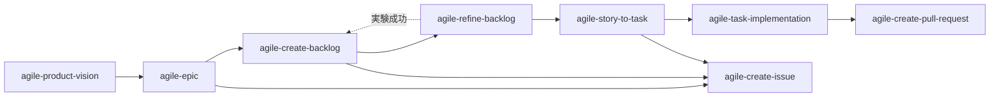

# skills

Claude Code 用のアジャイル開発スキル集。`gh skill install`（GitHub 公式、2026-04 リリース）で個別にインストールして使う。

```bash
gh skill install mrtry-lab/skills <skill-name> --agent claude-code --scope user
```

---

## 同梱スキル一覧

| skill | 役割 |
|---|---|
| [agile-product-vision](skills/agile-product-vision/) | `docs/VISION.md` を対話で作成・更新（Why / Who / What / How / When-Risk の 5 層構造） |
| [agile-epic](skills/agile-epic/) | Opportunity Canvas で Epic Issue を作成（Issue Type: `Epic`） |
| [agile-create-backlog](skills/agile-create-backlog/) | Epic を Story Mapping で分解、Cynefin 分類で `nature:implementable` / `nature:experimental` に仕分け |
| [agile-refine-backlog](skills/agile-refine-backlog/) | Story の要件を実装可能なレベルまで詳細化（シーケンス図・受入基準） |
| [agile-story-to-task](skills/agile-story-to-task/) | リファインメント済み Story を実装可能な Task Sub-issue に分解 |
| [agile-task-implementation](skills/agile-task-implementation/) | Task Issue → Plan mode 計画 → TDD 実装（XP ペアプロ体制） |
| [agile-create-issue](skills/agile-create-issue/) | Issue Type に応じたテンプレート適用・Mermaid 検証・ステータス設定・親子リンクを共通化 |
| [agile-create-pull-request](skills/agile-create-pull-request/) | 実装済み変更から Draft PR を作成 |

---

## スキル依存関係図



実線 = 通常フロー、破線 = `nature:experimental` の検証成功時。`agile-create-issue` は agile-* から呼ばれる共通スキル、`agile-create-pull-request` は `agile-task-implementation` の最終ステップから呼ばれる。

---

## テンプレートの仕組み

各 skill が Issue / PR を作成するとき、本文テンプレートを以下の 3 段階で解決する:

1. **リポジトリ設定を最優先** — `.github/ISSUE_TEMPLATE/<type>.md`（Issue）または `.github/pull_request_template.md`（PR）が存在すれば、それを使う
2. **同梱デフォルトをフォールバック** — リポジトリ側に無ければ、skill 同梱の `templates/<type>.md` を使う
3. **登録の確認** — フォールバックを使った場合、Issue / PR 作成後に「これをリポジトリに登録しますか？」と確認。Yes ならリポジトリの `.github/` 配下に書き出してコミット案内

これにより、テンプレ未整備のリポジトリでも壁なく動作開始でき、必要に応じてテンプレを根付かせていける。

---

## 前提条件

### GitHub 環境

- **Issue Type の登録**: `Epic` / `Story` / `Task` の 3 つを Organization に登録済みであること
  - 設定箇所: Organization Settings → Planning → Issue types
  - 未登録の skill は実行時にエラーで案内される
- **GitHub Projects (v2)**: ステータス管理用の Project が存在すること（Status フィールドに `In Planning` / `In Plan Refinement` / `In Plan Review` / `Ready` / `In Coding Progress` / `In Code Review` / `Done` の 7 オプションを推奨）

### ローカル環境

- `gh` CLI（`gh skill install` のため、最新版）
- Claude Code
- Node.js（`scripts/validate-mermaid.mjs` を使う場合）

---

## インストール手順

### 1. skill のインストール

必要な skill を個別にインストール（user スコープなら全プロジェクトで共有、project スコープなら現在のリポジトリだけ）。

```bash
# 例: 全 skill を user スコープでインストール
for skill in agile-product-vision agile-epic agile-create-backlog \
             agile-refine-backlog agile-story-to-task agile-task-implementation \
             agile-create-issue agile-create-pull-request; do
  gh skill install mrtry-lab/skills $skill --agent claude-code --scope user
done
```

### 2. shared references の配置（プレースホルダ置換）

`shared/references/github-projects.md.template` をプロジェクトの `.claude/skills/references/github-projects.md` に配置し、プレースホルダを実値に置換する。

```bash
# 1. テンプレートをコピー
mkdir -p .claude/skills/references
curl -fsSL https://raw.githubusercontent.com/mrtry-lab/skills/main/shared/references/github-projects.md.template \
  -o .claude/skills/references/github-projects.md

# 2. プロジェクト固有値を取得
gh project field-list <YOUR_PROJECT_NUMBER> --owner <YOUR_GITHUB_ORG> --format json
# → 出力から Project ID, Status Field ID, 各 Status Option ID を控える

# 3. プレースホルダを置換（macOS の例）
sed -i '' \
  -e 's|<YOUR_PROJECT_NAME>|My Project|g' \
  -e 's|<YOUR_GITHUB_ORG>|your-org|g' \
  -e 's|<YOUR_PROJECT_NUMBER>|1|g' \
  -e 's|<YOUR_PROJECT_ID>|PVT_xxxxxxxx|g' \
  -e 's|<YOUR_STATUS_FIELD_ID>|PVTSSF_xxxxxxxx|g' \
  -e 's|<STATUS_OPTION_ID_IN_PLANNING>|xxxxxxxx|g' \
  -e 's|<STATUS_OPTION_ID_IN_PLAN_REFINEMENT>|xxxxxxxx|g' \
  -e 's|<STATUS_OPTION_ID_IN_PLAN_REVIEW>|xxxxxxxx|g' \
  -e 's|<STATUS_OPTION_ID_READY>|xxxxxxxx|g' \
  -e 's|<STATUS_OPTION_ID_IN_CODING_PROGRESS>|xxxxxxxx|g' \
  -e 's|<STATUS_OPTION_ID_IN_CODE_REVIEW>|xxxxxxxx|g' \
  -e 's|<STATUS_OPTION_ID_DONE>|xxxxxxxx|g' \
  .claude/skills/references/github-projects.md
```

Linux（GNU sed）では `-i ''` ではなく `-i` を使う。

> ⚠️ プレースホルダ置換が完了するまで、ステータス更新を行うスキルを呼ばないこと。`<YOUR_GITHUB_ORG>` のような未置換文字列をコマンドに渡してしまう。

### 3. validate-mermaid スクリプトの配置（Mermaid 検証を使う場合）

`agile-epic` / `agile-refine-backlog` は Mermaid 図のバリデーションに `validate-mermaid.mjs` を使う。

```bash
mkdir -p .claude/scripts
curl -fsSL https://raw.githubusercontent.com/mrtry-lab/skills/main/scripts/validate-mermaid.mjs \
  -o .claude/scripts/validate-mermaid.mjs

# 依存パッケージをインストール（プロジェクトの package.json に追加）
# scripts/package.json.snippet の devDependencies をマージしてから:
npm install --save-dev jsdom@^29 dompurify@2 mermaid@^11
```

スクリプトが見つからない場合、skill は警告を出して検証をスキップして続行する（ブロックはしない）。

---

## トラブルシューティング

| 症状 | 原因 / 対処 |
|---|---|
| skill が「`.claude/skills/references/github-projects.md` not found」と言う | インストール手順 2 を実施。プレースホルダ置換も忘れずに |
| ステータス更新コマンドが `<YOUR_GITHUB_ORG>` で失敗 | プレースホルダが未置換。手順 2 を再実行 |
| Mermaid バリデーションが失敗 | `validate-mermaid.mjs` の依存（jsdom / mermaid / dompurify）をインストールしたか確認 |
| 「Issue Type 'Epic'（または Story / Task）が選択肢に出ない」 | Organization Settings → Planning → Issue types で登録 |
| 同梱テンプレートを使った後の登録確認が毎回出る | 仕様。No を選んだ場合、次回フォールバック使用時にも確認する。Yes でリポジトリに登録すれば、以降は自動でリポジトリ側のテンプレが使われる |

---

## Contributing

### テンプレ重複の同期ルール

各 skill 配下の `templates/` には Issue / PR テンプレが同梱されている。**`agile-epic/templates/epic.md` と `create-issue/templates/epic.md`** はじめ、複数 skill に同名テンプレが重複して存在する（`gh skill install` が skill 単位で動くため、各 skill が自己完結する設計を優先）。

テンプレを更新する際は、以下の対応関係に注意して**両方を同期する**こと:

| Issue Type | 同梱先（複数） |
|---|---|
| Epic | `skills/agile-epic/templates/epic.md`, `skills/agile-create-issue/templates/epic.md` |
| Story | `skills/agile-create-backlog/templates/story.md`, `skills/agile-create-issue/templates/story.md` |
| Task | `skills/agile-story-to-task/templates/task.md`, `skills/agile-create-issue/templates/task.md` |
| PR | `skills/agile-create-pull-request/templates/pull_request_template.md` |

将来的に CI で diff チェックを入れる予定。

### Issue / PR の歓迎事項

- skill 動作のバグ報告
- 他 AI エージェント（GitHub Copilot、Cursor 等）対応への提案
- テンプレートの汎用性向上案

---

## License

[MIT](LICENSE)
