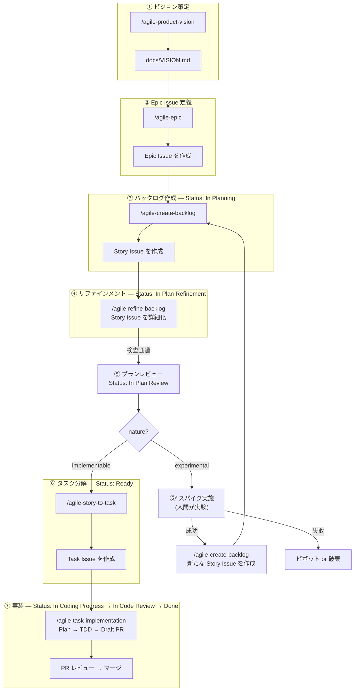

# Agile 開発ワークフローガイド

`agile-*` スキル群を使ったプロダクト開発ワークフロー。アジャイル / XP の知見を取り入れつつ、小規模・副業チームでも運用できる軽量な構成にしている。

## 前提条件

### GitHub 環境
- **Issue Type の登録**: `Epic` / `Story` / `Task` の 3 つを Organization に登録済みであること
  - 設定箇所: Organization Settings → Planning → Issue types
  - 未登録の場合は skill 実行時にエラーで案内される
- **GitHub Projects (v2)**: ステータス管理用の Project が存在し、Status フィールドに `In Planning` / `In Plan Refinement` / `In Plan Review` / `Ready` / `In Coding Progress` / `In Code Review` / `Done` の 7 オプションを設定

### ローカル環境
- `gh` CLI（最新版）
- Claude Code
- Node.js（Mermaid バリデーションを使う場合）

## セットアップ

> 💡 初回セットアップは `/agile-project-setup` スキルを使うと、GitHub Project 作成・Status オプション登録・ビュー作成案内・shared references 生成までを対話で一気通貫で完了できる。下記の手動手順は内部で何が起きているかを把握したい場合の参考。

### 1. skill のインストール

```bash
for skill in agile-product-vision agile-epic agile-create-backlog \
             agile-refine-backlog agile-story-to-task agile-task-implementation \
             agile-create-issue agile-create-pull-request; do
  gh skill install mrtry-lab/skills $skill --agent claude-code --scope user
done
```

### 2. shared references の配置（プレースホルダ置換）

`shared/references/github-projects.md.template` をプロジェクトの `.claude/skills/references/github-projects.md` に配置し、プレースホルダを実値に置換する。

```bash
mkdir -p .claude/skills/references
curl -fsSL https://raw.githubusercontent.com/mrtry-lab/skills/main/shared/references/github-projects.md.template \
  -o .claude/skills/references/github-projects.md

# プロジェクト固有値を取得
gh project field-list <YOUR_PROJECT_NUMBER> --owner <YOUR_GITHUB_ORG> --format json

# プレースホルダ置換（macOS の例）
sed -i '' \
  -e 's|<YOUR_PROJECT_NAME>|My Project|g' \
  -e 's|<YOUR_GITHUB_ORG>|your-org|g' \
  -e 's|<YOUR_PROJECT_NUMBER>|1|g' \
  -e 's|<YOUR_PROJECT_ID>|PVT_xxxxxxxx|g' \
  -e 's|<YOUR_STATUS_FIELD_ID>|PVTSSF_xxxxxxxx|g' \
  -e 's|<STATUS_OPTION_ID_IN_PLANNING>|xxxxxxxx|g' \
  -e 's|<STATUS_OPTION_ID_IN_PLAN_REFINEMENT>|xxxxxxxx|g' \
  -e 's|<STATUS_OPTION_ID_IN_PLAN_REVIEW>|xxxxxxxx|g' \
  -e 's|<STATUS_OPTION_ID_READY>|xxxxxxxx|g' \
  -e 's|<STATUS_OPTION_ID_IN_CODING_PROGRESS>|xxxxxxxx|g' \
  -e 's|<STATUS_OPTION_ID_IN_CODE_REVIEW>|xxxxxxxx|g' \
  -e 's|<STATUS_OPTION_ID_DONE>|xxxxxxxx|g' \
  .claude/skills/references/github-projects.md
```

Linux（GNU sed）は `-i ''` ではなく `-i` を使う。

> ⚠️ プレースホルダ置換が完了するまで、ステータス更新を行うスキルを呼ばないこと（未置換文字列のままコマンド実行されてしまう）。

### 3. validate-mermaid スクリプトの配置（Mermaid 検証を使う場合）

`agile-epic` / `agile-refine-backlog` は Mermaid 図のバリデーションに `validate-mermaid.mjs` を使う。`gh skill install` では取得されないので別途配置する。

```bash
mkdir -p .claude/scripts
curl -fsSL https://raw.githubusercontent.com/mrtry-lab/skills/main/scripts/validate-mermaid.mjs \
  -o .claude/scripts/validate-mermaid.mjs
npm install --save-dev jsdom@^29 dompurify@2 mermaid@^11
```

スクリプトが見つからない場合、skill は警告を出して検証スキップして続行する（ブロックはしない）。

## テンプレート解決ロジック（agile-* 系の 3 段階）

agile-* スキルは Issue / PR を作成する際、本文テンプレを次の順で解決する:

1. **リポジトリ設定を最優先** — `.github/ISSUE_TEMPLATE/<type>.md`（Issue）または `.github/pull_request_template.md`（PR）があればそれを使う
2. **同梱デフォルトをフォールバック** — リポジトリ側に無ければ skill 同梱の `templates/<type>.md` を使う
3. **登録の確認** — フォールバックを使った場合、Issue / PR 作成後に「これをリポジトリに登録しますか？」と確認

テンプレ未整備のリポジトリでも壁なく動作開始でき、必要に応じてテンプレを根付かせていける。


## 全体像



## 開発スタイル

- アジャイル / XP の知見を活用するが、スクラムのフレームワークには縛られない
- 定例で「次にどの Story Issue をやるか」を決める程度の軽い計画
- 実装は CodingAgent が主体。Task Issue 単位で実装し、PR 単位で成果物が出る
- Issue 階層は **Epic Issue → Story Issue → Task Issue の 3 層**。リファインメント済み Story Issue を `/agile-story-to-task` で Task Issue に分解し、CodingAgent に渡す

## 6 つのスキル

### 1. `/agile-product-vision` — ビジョン策定

チームの前提認知を揃えるための `docs/VISION.md` を対話的に作成・更新する。

**5 層構造**:
1. **Why**: ミッション、エレベーターピッチ、ビジョンステートメント
2. **Who**: ターゲットユーザー / ペルソナ、ステークホルダーマップ
3. **What**: ユーザーの課題と現在の解決策、Not-to-do リスト、成功指標
4. **How**: ソリューション概要、トレードオフスライダー
5. **When/Risk**: タイムライン見通し、リスクリスト、リソース見積もり

**更新頻度**: 四半期〜半年単位。状況変化で前提が崩れたら見直す。

### 2. `/agile-epic` — Epic Issue 定義

Opportunity Canvas を用いて Epic Issue を作成・更新する。

**2 つのモード**:
- **0→1**: VISION.md から Epic Issue 候補を導出
- **1→N**: 新しいトリガー（ユーザーの声、データ等）から Epic Issue を追加

**Opportunity Canvas の構造**:
- 左側 = **Problem Space（事実）**: ユーザーの課題、ターゲットユーザー、現在の解決策、ビジネス上の課題
- 右側 = **Solution Space（仮説）**: ユーザーの価値ストーリー、成功指標、導入戦略、ビジネスインパクト、予算感

**4 リスクチェック**: 価値 / ユーザビリティ / 実現可能性 / 事業継続性

**注意**: 小規模チームでアクティブな Epic Issue は 2-3 個が限界。

### 3. `/agile-create-backlog` — バックログ作成

Epic Issue を Story Mapping で分解し、Cynefin ドメイン分類で仕分けて Story Issue を作成する。

**6 ステップ**:
1. Epic Issue 読み込み
2. ストーリーマップ作成（横 = 活動の流れ、縦 = 詳細度）
3. 探索（サブタスク・例外・代替パスを発散的に洗い出す）
4. **Cynefin ドメイン分類**（このステップがパイプライン全体の分岐点）
5. リリーススライス（Opening Game → Mid Game → End Game）
6. Story Issue 登録

**Cynefin ドメイン分類**:

| 判断基準 | 分類 | ラベル |
|---------|------|--------|
| 受入基準を今すぐ書ける / 調べればわかる | implementable | `nature:implementable` |
| やってみないとわからない | experimental | `nature:experimental` |

- experimental のタイトルは「〇〇について実験する」形式にする
- 全部 implementable は危険信号。未検証の前提の上に実装を積み上げている可能性がある

### 4. `/agile-refine-backlog` — リファインメント

Story Issue の要件を、CodingAgent が Issue 本文だけ読んで実装を開始できるレベルまで具体化する。シーケンス図でアクター間の相互作用と正常系 / 異常系パターンを洗い出し、画面仕様・API 仕様・受入基準を確定させる。implementable も experimental も **同じフロー** でリファインメントし、分岐するのはリファインメント完了後の行き先だけ。

**原則**: 1 Story Issue = 1 つのユーザー価値。複数の価値が混在していたら分割する。

**リファインメントの流れ（共通）**:
1. ビジョン整合レビュー（サブエージェント）
2. シーケンス図作成（アクター・システム間の相互作用 + alt/opt で正常系 / 異常系パターンを統合表現）
3. 画面仕様・API 仕様・イベントロギング
4. 受入基準生成
5. 網羅性検査（サブエージェント）
6. リファインメント完了（GitHub Projects の Status フィールドを次の状態に更新）

**リファインメント完了後の分岐**:
- `nature:implementable` → `/agile-story-to-task` で Task Issue 分解 → CodingAgent へ
- `nature:experimental` → 人間がスパイクを実施 → 成功なら `/agile-create-backlog` で新 Story Issue 作成 / 失敗ならピボットまたは破棄

### 5. `/agile-story-to-task` — タスク分解

リファインメント済みの Story Issue を、CodingAgent が着手可能な Task Issue に分解する。

- 1 Task Issue = 1 PR 単位で分割
- 各 Task Issue に振る舞い仕様・テスト設計・受入確認を含め、親 Story Issue を読まなくても実装できるレベルにする
- テストピラミッド（ユニット中心・E2E 最小限）に基づくテスト設計

### 6. `/agile-task-implementation` — 実装

Task Issue を XP ペアプログラミング体制で実装し、Draft PR を作成する。

- **役割分担**: ユーザー = ナビゲーター（戦略判断）、Claude = ドライバー（コード記述）
- **フロー**: Task Issue 読み込み → Plan mode で計画 → ナビゲーター承認 → TDD 実装 → 検証 → Draft PR
- 計画承認後はドライバーが一気通貫で実装。行き詰まったときだけナビゲーターに相談

> 注: Issue / PR の作成自体は内部的に `/agile-create-issue` / `/agile-create-pull-request` に委譲される。これらは個別に呼ぶ必要はないが、`gh skill install` 時には個別インストールが必要。

## Definition of Outcome Done

「実装が完了した（Output Done）」と「価値が出た（Outcome Done）」は別物として扱う。受入基準を満たすコードが書けたかどうかと、ユーザーの行動が変わったかどうかは別の問いで、後者を逸さないために agile-* は両方を明示的に記録する。

### 階層と粒度

| レベル | 既存の指標 | Outcome Done で追加する観点 |
|---|---|---|
| Vision | 成功指標（行動ベース） | 「指標が動いた → なぜそうなった」を説明する**因果仮説**と**観測手段** |
| Epic | 成功指標 / ビジネスインパクト | 上記に加えて**観測期間**と**動かなかった場合の学び** |
| Story | 受入基準（Output Done） | **Outcome Done テーブル**: 観測指標 / 期待する変化 / 観測タイミング / 観測手段 |

Story 単位の Outcome Done は、親 Epic の Outcome 仮説テーブルから「このストーリーが寄与する範囲」を引き継いで具体化する。

### 受入基準と Outcome Done の分離

| | 受入基準（Output Done） | Outcome Done |
|---|---|---|
| 判定方法 | 自動テスト・手動確認 | ロギング・分析・観測 |
| 判定タイミング | PR マージ時 | リリース後（即時 / 数日 / 数週） |
| 失敗時の扱い | 実装やり直し | 学びとして記録、Story 改修・廃止・仮説修正 |

混ぜて書くと CodingAgent が「指標が動くかどうか」をテスト条件と誤解しやすい。SKILL.md とテンプレートで意図的にセクションを分けている。

### 観測しない安全弁

すべてのストーリーに Outcome 仮説を強制するとリファインメントが過剰に重くなる。観測コストが投資に見合わないストーリーは:

```
> 観測しない（理由: 探索的な実装で学習対象が定まっていない / 内部的な改修でユーザー体験変化なし / etc）
```

の一行で残してよい。仮説検証しないなら学習も期待しないというトレードオフを明示しているだけで、罪ではない。

### Outcome が動かなかったときの運用

仮説の反証は失敗ではなく**学び**として扱う。次のいずれかを選ぶ:

- **仮説修正**: 因果モデルを書き直して別の Story を作る
- **Story 廃止**: 価値仮説が崩れたなら撤退（コードを残すか削るかは別判断）
- **Story 改修**: 別アプローチで同じ Outcome を狙う

ここで重要なのは「動かなかった」ことを観測できる作りに最初からしておくこと。これが Step 5e と Step 5c（ロギング）の整合性を網羅性検査で確認する理由。

### Outcome Done と既存 Issue

既存の Story / Epic / VISION は遡及書き換えしない。新規作成からのみ Outcome 仮説を必須化する方針で、既存資産の改修コストを払わずに段階的に置き換える。

---

## Issue 分類体系

| カテゴリ | 分類方法 |
|---------|--------|
| 階層 | Issue Type: `Epic Issue`, `Story Issue`, `Task Issue`（Organization 設定で管理） |
| 性質 | ラベル: `nature:implementable`, `nature:experimental` |
| 状態 | GitHub Projects の Status フィールド（下記参照） |

### GitHub Projects のビュー

チケットの状態は GitHub Projects (v2) で管理する。プロジェクトに Status フィールドを作成し、後述の 7 つのオプションを設定する。

運用しやすくするため、用途別にビューを 2 つ用意することを推奨する:

- **仕様策定中のチケット** — `In Planning` / `In Plan Refinement` / `In Plan Review` でフィルタ。PdO が仕様を固めるフェーズ
- **コーディング待ちのチケット** — `Ready` / `In Coding Progress` / `In Code Review` でフィルタ。CodingAgent が実装するフェーズ

プロジェクト固有値（Owner、Project ID、Status Field ID、Status Option ID）は `shared/references/github-projects.md.template` を参考に `~/.claude/skills/references/github-projects.md`（または利用先プロジェクトの `.claude/skills/references/github-projects.md`）を作成する。

### Status フロー

```
In Planning → In Plan Refinement → In Plan Review → Ready → In Coding Progress → In Code Review → Done
```

| Status | 意味 |
|--------|------|
| In Planning | Story Issue 作成直後。概要・粗い受入基準のみ |
| In Plan Refinement | リファインメント中。シーケンス図・画面仕様・受入基準を詳細化 |
| In Plan Review | リファインメント完了。PdO がレビュー中 |
| Ready | 仕様確定。Task Issue 分解・実装着手可能 |
| In Coding Progress | CodingAgent が実装中 |
| In Code Review | PR レビュー中 |
| Done | マージ完了 |

## 日常の回し方

```
定例（軽い同期）
  ├── 完了した Story Issue の確認
  ├── 次に取り組む Story Issue のピック
  ├── 必要ならリファインメント実施（/agile-refine-backlog）
  └── 新しい気づきがあれば Epic / VISION の見直しを提案
```

CodingAgent に渡した後は Task Issue 単位で PR が出てくるので、レビュー → マージの流れ。

## Story Issue テンプレート

`agile-create-backlog` と `agile-refine-backlog` で共通のテンプレートを使い、段階的に TBD を埋めていく。

テンプレートの解決順序は agile-* 系の 3 段階解決ロジックに従う:

1. リポジトリの `.github/ISSUE_TEMPLATE/story.md` を最優先
2. 無ければ `agile-create-backlog/templates/story.md`（同梱）をフォールバック
3. フォールバック使用時はリポジトリへの登録確認を行う

**create-backlog 段階で埋める項目**: ストーリー文、概要、粗い受入基準、ラベル

**refine-backlog 段階で埋める項目**: シーケンス図、画面遷移、画面仕様（正常系 / 異常系 / API 仕様）、詳細な受入基準、ロギング

## トラブルシューティング

| 症状 | 原因 / 対処 |
|---|---|
| skill が `.claude/skills/references/github-projects.md` not found と言う | セットアップ手順 2 を実施。プレースホルダ置換も忘れずに |
| ステータス更新コマンドが `<YOUR_GITHUB_ORG>` で失敗 | プレースホルダが未置換。手順 2 を再実行 |
| Mermaid バリデーションが失敗 | `validate-mermaid.mjs` の依存（jsdom / mermaid / dompurify）をインストールしたか確認 |
| Issue Type "Epic"（または Story / Task）が選択肢に出ない | Organization Settings → Planning → Issue types で登録 |
| 同梱テンプレートを使った後の登録確認が毎回出る | 仕様。No を選んだ場合は次回フォールバック使用時にも確認する。Yes でリポジトリに登録すれば、以降は自動でリポジトリ側のテンプレが使われる |

## Contributing

### テンプレ重複の同期ルール

各 skill 配下の `templates/` には Issue / PR テンプレが同梱されている。`gh skill install` が skill 単位で動くため、各 skill が自己完結する設計を優先しており、複数 skill に同名テンプレが重複して存在する。

テンプレを更新する際は、以下の対応関係に注意して**両方を同期する**こと:

| Issue Type | 同梱先（複数） |
|---|---|
| Epic | `skills/agile-epic/templates/epic.md`, `skills/agile-create-issue/templates/epic.md` |
| Story | `skills/agile-create-backlog/templates/story.md`, `skills/agile-create-issue/templates/story.md` |
| Task | `skills/agile-story-to-task/templates/task.md`, `skills/agile-create-issue/templates/task.md` |
| PR | `skills/agile-create-pull-request/templates/pull_request_template.md` |

将来的に CI で diff チェックを入れる予定。
