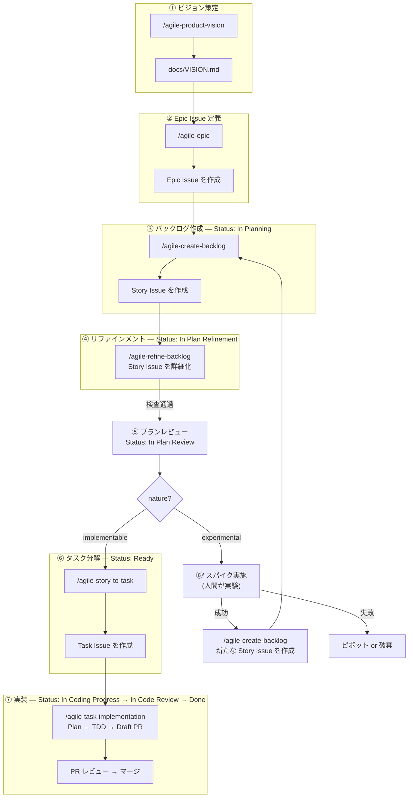

# Agile 開発ワークフローガイド

`agile-*` スキル群を使ったプロダクト開発ワークフロー。アジャイル / XP の知見を取り入れつつ、**チームの稼働状況に応じて緩急をつけられる軽量な構成**にしている。閾値（タイムボックス、Epic 同時数、ペルソナ数等）は `agile-project-setup` で生成する `team-context.md` に集約されており、フルタイム / 混合 / 副業 のいずれの体制にも合わせられる。

---

## 目次

### 基礎

- **[setup.md](setup.md)** — 前提条件・チームコンテキスト・セットアップ手順・テンプレート解決ロジック
- **[operations.md](operations.md)** — Issue 分類体系・GitHub Projects ビュー・Status フロー・トラブルシューティング・Contributing
- **[references.md](references.md)** — 参考にしている書籍・記事・フレームワークの一覧と各スキルへの紐付け

### 概念（Scrum Expansion Pack 準拠）

- **[concepts/outcome-done.md](concepts/outcome-done.md)** — Definition of Outcome Done（Output Done と Outcome Done の二重化）
- **[concepts/example-mapping.md](concepts/example-mapping.md)** — 4 色マップによるビジネスルール網羅
- **[concepts/three-amigos.md](concepts/three-amigos.md)** — PdO / Dev / QA 3 視点の並列サブエージェント orchestration
- **[concepts/ai-decision-boundary.md](concepts/ai-decision-boundary.md)** — AI と人間の権限境界マスター表
- **[concepts/holistic-testing.md](concepts/holistic-testing.md)** — Discover → Understand → Build → Deploy → Observe の 5 段階
- **[concepts/cynefin.md](concepts/cynefin.md)** — Cynefin 4 区分と Chaotic 軽量フロー
- **[concepts/strategy.md](concepts/strategy.md)** — Strategy 4 性質（Intent / Focus / Coherence / Memorability）
- **[concepts/quality-scoring.md](concepts/quality-scoring.md)** — 品質スコアリングの統一フォーマット

---

## 全体像



`nature:chaotic` の Story は Step 1.5 軽量フローで Refinement → Ready に直行する（詳細は [concepts/cynefin.md](concepts/cynefin.md)）。

---

## 開発スタイル

- アジャイル / XP の知見を活用するが、スクラムのフレームワークには縛られない
- 定例で「次にどの Story Issue をやるか」を決める程度の軽い計画
- 実装は CodingAgent が主体。Task Issue 単位で実装し、PR 単位で成果物が出る
- Issue 階層は **Epic Issue → Story Issue → Task Issue の 3 層**。リファインメント済み Story Issue を `/agile-story-to-task` で Task Issue に分解し、CodingAgent に渡す

---

## 6 つのスキル

### 1. `/agile-product-vision` — ビジョン策定

チームの前提認知を揃えるための `docs/VISION.md` を対話的に作成・更新する。

**5 層構造**:
1. **Why**: ミッション、エレベーターピッチ、ビジョンステートメント
2. **Who**: ターゲットユーザー / ペルソナ、ステークホルダーマップ
3. **What**: ユーザーの課題と現在の解決策、Not-to-do リスト、成功指標
4. **How**: ソリューション概要、トレードオフスライダー
5. **When/Risk**: タイムライン見通し、リスクリスト、リソース見積もり

**更新頻度**: 四半期〜半年単位で定期実行。Strategy 4 性質点検（[concepts/strategy.md](concepts/strategy.md)）も毎回走る。

### 2. `/agile-epic` — Epic Issue 定義

Opportunity Canvas を用いて Epic Issue を作成・更新する。

**2 つのモード**:
- **0→1**: VISION.md から Epic Issue 候補を導出
- **1→N**: 新しいトリガー（ユーザーの声、データ等）から Epic Issue を追加

**Opportunity Canvas の構造**:
- 左側 = **Problem Space（事実）**: ユーザーの課題、ターゲットユーザー、現在の解決策、ビジネス上の課題
- 右側 = **Solution Space（仮説）**: ユーザーの価値ストーリー、成功指標、導入戦略、ビジネスインパクト、予算感

**4 リスクチェック**: 価値 / ユーザビリティ / 実現可能性 / 事業継続性

**注意**: アクティブな Epic Issue 数は team-context のプリセット上限に従う（軽量 2-3 / 標準 5-7 / 集中 10+）。

### 3. `/agile-create-backlog` — バックログ作成

Epic Issue を Story Mapping で分解し、Cynefin ドメイン分類で仕分けて Story Issue を作成する。

**6 ステップ**:
1. Epic Issue 読み込み
2. ストーリーマップ作成（横 = 活動の流れ、縦 = 詳細度）
3. 探索（サブタスク・例外・代替パスを発散的に洗い出す）
4. **Cynefin ドメイン分類**（このステップがパイプライン全体の分岐点）
5. リリーススライス（Opening Game → Mid Game → End Game）
6. Story Issue 登録

詳細は [concepts/cynefin.md](concepts/cynefin.md) 参照。

### 4. `/agile-refine-backlog` — リファインメント

Story Issue の要件を、CodingAgent が Issue 本文だけ読んで実装を開始できるレベルまで具体化する。シーケンス図でアクター間の相互作用と正常系 / 異常系パターンを洗い出し、画面仕様・API 仕様・受入基準を確定させる。

**原則**: 1 Story Issue = 1 つのユーザー価値。複数の価値が混在していたら分割する。

**リファインメントの流れ（共通）**:
1. ビジョン整合レビュー（PdO 視点サブエージェント — Three Amigos の事前判定）
2. シーケンス図作成（アクター・システム間の相互作用 + alt/opt で正常系 / 異常系パターンを統合表現）
3. 画面仕様・API 仕様・イベントロギング
4. Outcome Done の定義（[concepts/outcome-done.md](concepts/outcome-done.md)）
5. Example Mapping によるビジネスルール抽出（[concepts/example-mapping.md](concepts/example-mapping.md)）
6. 受入基準生成
7. Three Amigos 並列網羅性検査（[concepts/three-amigos.md](concepts/three-amigos.md)）

**リファインメント完了後の分岐**:
- `nature:implementable` → `/agile-story-to-task` で Task Issue 分解 → CodingAgent へ
- `nature:experimental` → 人間がスパイクを実施 → 成功なら `/agile-create-backlog` で新 Story Issue 作成 / 失敗ならピボットまたは破棄
- `nature:chaotic` → 軽量フロー（[concepts/cynefin.md](concepts/cynefin.md)）

### 5. `/agile-story-to-task` — タスク分解

リファインメント済みの Story Issue を、CodingAgent が着手可能な Task Issue に分解する。

- 1 Task Issue = 1 PR 単位で分割
- 各 Task Issue に振る舞い仕様・テスト設計・受入確認を含め、親 Story Issue を読まなくても実装できるレベルにする
- テストピラミッド（ユニット中心・E2E 最小限）に基づくテスト設計
- Outcome Done に観測指標がある Story には `[Telemetry]` Task を必ず含める（[concepts/holistic-testing.md](concepts/holistic-testing.md)）

### 6. `/agile-task-implementation` — 実装

Task Issue を XP ペアプログラミング体制で実装し、Draft PR を作成する。

- **役割分担**: ユーザー = ナビゲーター（戦略判断）、Claude = ドライバー（コード記述）
- **フロー**: Task Issue 読み込み → Plan mode で計画 → 計画品質スコアリング → ナビゲーター承認 → TDD 実装 → 検証 → Draft PR
- 計画承認後はドライバーが一気通貫で実装。行き詰まったときだけナビゲーターに相談

> 注: Issue / PR の作成自体は内部的に `/agile-create-issue` / `/agile-create-pull-request` に委譲される。これらは個別に呼ぶ必要はないが、`gh skill install` 時には個別インストールが必要。

---

## 日常の回し方

```
定例（軽い同期）
  ├── 完了した Story Issue の確認
  ├── 次に取り組む Story Issue のピック
  ├── 必要ならリファインメント実施（/agile-refine-backlog）
  └── 新しい気づきがあれば Epic / VISION の見直しを提案
```

CodingAgent に渡した後は Task Issue 単位で PR が出てくるので、レビュー → マージの流れ。

---

## Story Issue テンプレート

`agile-create-backlog` と `agile-refine-backlog` で共通のテンプレートを使い、段階的に TBD を埋めていく。

テンプレートの解決順序は agile-* 系の 3 段階解決ロジックに従う（[setup.md](setup.md) 参照）:

1. リポジトリの `.github/ISSUE_TEMPLATE/story.md` を最優先
2. 無ければ `agile-create-backlog/templates/story.md`（同梱）をフォールバック
3. フォールバック使用時はリポジトリへの登録確認を行う

**create-backlog 段階で埋める項目**: ストーリー文、概要、粗い受入基準、ラベル

**refine-backlog 段階で埋める項目**: シーケンス図、画面遷移、画面仕様（正常系 / 異常系 / API 仕様）、ビジネスルール、未解決の質問、Outcome Done、詳細な受入基準、ロギング
