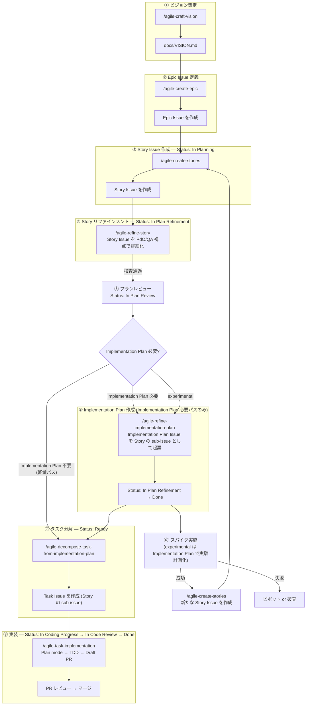

# Agile 開発ワークフローガイド

`agile-*` スキル群を使ったプロダクト開発ワークフロー。アジャイル / XP の知見を取り入れつつ、**チームの稼働状況に応じて緩急をつけられる軽量な構成**にしている。閾値（タイムボックス、Epic 同時数、ペルソナ数等）は `agile-project-setup` で生成する `team-context.json` に集約されており、フルタイム / 混合 / 副業 のいずれの体制にも合わせられる。

---

## 目次

### 基礎

- **[setup.md](setup.md)** — 前提条件・チームコンテキスト・セットアップ手順・テンプレート解決ロジック
- **[operations.md](operations.md)** — Issue 分類体系・GitHub Projects ビュー・Status フロー・トラブルシューティング・Contributing

### 概念（Scrum Expansion Pack 準拠）

- **[concepts/outcome-done.md](concepts/outcome-done.md)** — Definition of Outcome Done（Output Done と Outcome Done の二重化）
- **[concepts/example-mapping.md](concepts/example-mapping.md)** — 4 色マップによるビジネスルール網羅
- **[concepts/three-amigos.md](concepts/three-amigos.md)** — PdO / Dev / QA 3 視点の並列サブエージェント orchestration
- **[concepts/ai-decision-boundary.md](concepts/ai-decision-boundary.md)** — AI と人間の権限境界マスター表
- **[concepts/holistic-testing.md](concepts/holistic-testing.md)** — Discover → Understand → Build → Deploy → Observe の 5 段階
- **[concepts/cynefin.md](concepts/cynefin.md)** — Cynefin 4 区分と Chaotic 軽量フロー
- **[concepts/strategy.md](concepts/strategy.md)** — Strategy 4 性質（Intent / Focus / Coherence / Memorability）
- **[concepts/quality-scoring.md](concepts/quality-scoring.md)** — 品質スコアリングの統一フォーマット
- **[concepts/implementation-plan.md](concepts/implementation-plan.md)** — Implementation Plan 層（Story と Task の間の bridge ドキュメント）

---

## 全体像



`nature:chaotic` の Story は Step 1.5 軽量フローで Refinement → Ready → 直接 `/agile-task-implementation` に直行する（Implementation Plan も Task 分解もスキップ。詳細は [concepts/cynefin.md](concepts/cynefin.md)）。

Implementation Plan 必要性の判定基準は [concepts/implementation-plan.md](concepts/implementation-plan.md) 参照。

---

## 開発スタイル

- アジャイル / XP の知見を活用するが、スクラムのフレームワークには縛られない
- 定例で「次にどの Story Issue をやるか」を決める程度の軽い計画
- 実装は CodingAgent が主体。Task Issue 単位で実装し、PR 単位で成果物が出る
- Issue 階層は **Epic → Story → (Implementation Plan + Task) の 3〜4 層**。Implementation Plan と Task は Story の直下 sub-issue として並列

---

## 9 つのスキル

### 1. `/agile-craft-vision` — ビジョン策定

チームの前提認知を揃えるための `docs/VISION.md` を対話的に作成・更新する。

**5 層構造**:
1. **Why**: ミッション、エレベーターピッチ、ビジョンステートメント
2. **Who**: ターゲットユーザー / ペルソナ、ステークホルダーマップ
3. **What**: ユーザーの課題と現在の解決策、Not-to-do リスト、成功指標
4. **How**: ソリューション概要、トレードオフスライダー
5. **When/Risk**: タイムライン見通し、リスクリスト、リソース見積もり

**更新頻度**: 四半期〜半年単位で定期実行。Strategy 4 性質点検（[concepts/strategy.md](concepts/strategy.md)）も毎回走る。

### 2. `/agile-create-epic` — Epic Issue 定義

Opportunity Canvas を用いて Epic Issue を作成・更新する。

**2 つのモード**:
- **0→1**: VISION.md から Epic Issue 候補を導出
- **1→N**: 新しいトリガー（ユーザーの声、データ等）から Epic Issue を追加

**4 リスクチェック**: 価値 / ユーザビリティ / 実現可能性 / 事業継続性

**注意**: アクティブな Epic Issue 数は team-context のプリセット上限に従う（軽量 2-3 / 標準 5-7 / 集中 10+）。

### 3. `/agile-create-stories` — Story Issue 作成

Epic Issue を Story Mapping で分解し、Cynefin ドメイン分類で仕分けて Story Issue を作成する。

**6 ステップ**:
1. Epic Issue 読み込み
2. ストーリーマップ作成
3. 探索（サブタスク・例外・代替パス）
4. **Cynefin ドメイン分類**
5. リリーススライス
6. Story Issue 登録

詳細は [concepts/cynefin.md](concepts/cynefin.md) 参照。

### 4. `/agile-refine-story` — Story リファインメント (PdO/QA 視点)

Story Issue を **PdO/QA 視点 (What/Why)** で詳細化する。受入基準・Outcome 仮説・ビジネスルールを確定。技術詳細 (API 仕様・Task 分解等) は Implementation Plan に分離する。

**9 ステップ**:
1. Story Issue 読み込み
1.5. chaotic 軽量フロー (該当時のみ)
2. ビジョン整合レビュー (PdO 視点)
3. ユーザー体験フロー (概念レベル)
4. Outcome Done 定義
5. Example Mapping (ビジネスルール)
6. 受入基準生成
7. PdO + QA Three Amigos 並列網羅性検査
8. Implementation Plan 必要性判定
9. 次スキル案内

**判定後の分岐**:
- Implementation Plan 必要 → `/agile-refine-implementation-plan`
- Implementation Plan 不要 (軽量パス) → `/agile-decompose-task-from-implementation-plan` (Story 入力モード)
- chaotic → `/agile-task-implementation` 直行

### 5. `/agile-refine-implementation-plan` — Implementation Plan 作成 (Dev リード視点)

Story Refinement 完了後、**Story の sub-issue として Implementation Plan Issue を作成**。エンジニア視点の戦略 (技術詳細シーケンス図、API 仕様、データモデル、画面詳細、ロギング実装、テスト戦略、Task 分解、横断的判断) を確定させる。

**15 ステップ**:
1. 副チェック (Implementation Plan 必要性再判定)
2. Story 読み込み + 既存実装探索
3. 技術詳細シーケンス図
4. API 仕様詳細
5. データモデル
6. 画面詳細仕様
7. ロギング実装
8. テスト戦略
9. Task 分解計画
10. 横断的判断
11. 意図的に扱わないこと
12. 品質スコアリング (8 点、7 点以上で合格)
13. Three Amigos レビュー (Dev + PdO + QA、Dev がメイン責務)
14. Implementation Plan Issue 起票
15. 次スキル案内

Implementation Plan の責務・判定基準は [concepts/implementation-plan.md](concepts/implementation-plan.md) 参照。

### 6. `/agile-decompose-task-from-implementation-plan` — タスク分解

Implementation Plan から Task Issue を起票。Implementation Plan の「Task 分解 (PR 計画)」を踏襲。

**2 つのモード**:
- **Implementation Plan ベースモード**: Implementation Plan Issue を入力に、Implementation Plan の Task 分解を踏襲して Task 起票
- **軽量モード**: Implementation Plan 不要の軽量 Story の場合、Story から直接 Task 起票

- 1 Task = 1 PR 単位、半日〜2日、3-6 個目安
- Outcome Done に観測指標がある Story には `[Telemetry]` Task を必ず含める（[concepts/holistic-testing.md](concepts/holistic-testing.md)）

### 7. `/agile-task-implementation` — 実装

Task Issue を XP ペアプログラミング体制で実装し、Draft PR を作成する。

- **役割分担**: ユーザー = ナビゲーター（戦略判断）、Claude = ドライバー（コード記述）
- **フロー**: Task Issue 読み込み + 関連 Implementation Plan 確認 → Plan mode で計画 → 計画品質スコアリング → ナビゲーター承認 → TDD 実装 → 検証 → Draft PR
- 関連する Implementation Plan があれば本文を context として参照する

### 8. `/agile-project-setup` — プロジェクトセットアップ

`agile-*` スキル群が前提とする GitHub Project (v2) の構成を、対話で 1 回流すだけで揃える。

- Issue Type の登録確認 (Epic / Story / **Implementation Plan** / Task)
- GitHub Project (v2) の用意
- Status フィールドに 7 つのオプションを登録
- 推奨ビュー作成案内 (Backlog / Sprint)
- `team-context.json` の生成

> 注: Issue / PR の作成自体は内部的に `/agile-create-issue` / `/agile-create-pull-request` に委譲される。これらは個別に呼ぶ必要はないが、`gh skill install` 時には個別インストールが必要。

### 9. `/agile-update-skills` — 一括最新化

agile-* スキル群と `docs/agile-workflow/` を一括で最新化する。`agile-project-setup` の Step 7.5 から委譲呼び出しされる他、定期実行 (月 1 回程度) で agile-* の最新版に追従できる。

- `gh skill install` で 11 スキル (10 + 自己) を上書きインストール
- `docs/agile-workflow/` 配下 12 ファイルを curl で取得 (配置先は対話で確認、デフォルト `docs/agile-workflow/`)

---

## 日常の回し方

```
定例（軽い同期）
  ├── 完了した Story Issue の確認
  ├── 次に取り組む Story Issue のピック
  ├── 必要なら Story リファインメント (/agile-refine-story)
  ├── 必要なら Implementation Plan 作成 (/agile-refine-implementation-plan)
  └── 新しい気づきがあれば Epic / VISION の見直しを提案
```

CodingAgent に渡した後は Task Issue 単位で PR が出てくるので、レビュー → マージの流れ。

---

## Story Issue テンプレート

`agile-create-stories` と `agile-refine-story` で共通のテンプレートを使い、段階的に TBD を埋めていく。Story は **PdO/QA 視点 (What/Why)** に絞られている。

テンプレートの解決順序は agile-* 系の 3 段階解決ロジックに従う（[setup.md](setup.md) 参照）:

1. リポジトリの `.github/ISSUE_TEMPLATE/story.md` を最優先
2. 無ければ `agile-create-stories/templates/story.md`（同梱）をフォールバック
3. フォールバック使用時はリポジトリへの登録確認を行う

**create-stories 段階で埋める項目**: ストーリー文、概要、粗い受入基準、ラベル

**refine-story 段階で埋める項目**: ユーザー体験フロー (概念)、Outcome Done、ビジネスルール、未解決の質問、詳細な受入基準

> エンジニア視点の詳細 (技術詳細シーケンス図、API 仕様、データモデル、画面詳細、ロギング実装、テスト戦略、Task 分解、横断的判断) は **Implementation Plan** に分離されている。Implementation Plan が必要な Story はその起票時に `/agile-create-issue` が `templates/implementation-plan.md` を使う。

## Implementation Plan Issue テンプレート

Story の sub-issue として起票される Implementation Plan Issue は、エンジニア視点の戦略を集約する:

1. リポジトリの `.github/ISSUE_TEMPLATE/implementation-plan.md` を最優先
2. 無ければ `agile-create-issue/templates/implementation-plan.md`（同梱）をフォールバック

詳細は [concepts/implementation-plan.md](concepts/implementation-plan.md) 参照。

---

## References

ワークフロー全体にわたって効いている横断ソース。個別概念の References は各 `concepts/*.md` 末尾に記載している。

- 📦 [Scrum Guide Expansion Pack v1.0 (June 2025)](https://scrumexpansion.org/) — Holistic Testing / Definition of Outcome Done / Strategy as Empirical Capability / AI and Scrum / Complexity（Cynefin）など現代的拡張章を網羅
- 📄 [The New New Product Development Game](https://hbr.org/1986/01/the-new-new-product-development-game)（Hirotaka Takeuchi & Ikujiro Nonaka, HBR 1986）— Scrum の起源論文（Self-organizing teams / Overlapping development phases）
- 📖 [SCRUMMASTER THE BOOK](https://www.amazon.co.jp/s?k=SCRUMMASTER+THE+BOOK)（Zuzana Šochová）— #ScrumMasterWay モデル、サーバントリーダーシップ
- 📖 [コーチング・アジャイル・チームス](https://www.amazon.co.jp/s?k=コーチング・アジャイル・チームス)（Lyssa Adkins）— アジャイルコーチング、Three Amigos のファシリテーション
