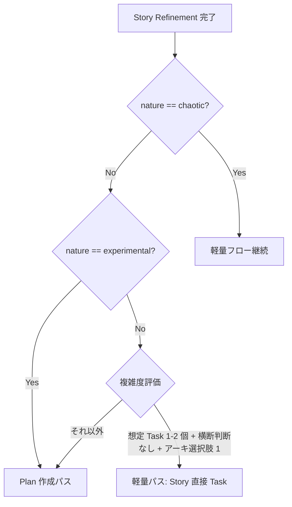

# Implementation Plan 層

Story Refinement の出力結果として、Sprint で実装に着手する前に **「人間と AI コーディングエージェントの bridge ドキュメント」** を Implementation Plan Issue (Issue Type: `Implementation Plan`) として永続化する。Story の「What/Why」と Task の「PR 単位の作業」の間に挟まる "How の戦略" 層に相当する。

## 位置づけ

```
Epic (Issue type=Epic)
 └─ Story (Issue type=Story)               ← PdO/QA 視点: What/Why
     ├─ Implementation Plan (Issue type)    ← Dev リード視点: How の戦略
     └─ Task (Issue type=Task)              ← 実装者視点: 1 PR 単位
```

Plan と Task は **どちらも Story の直下 sub-issue**。Plan は Task の親ではなく **並列で並ぶ**（時系列順では Plan Done → Task 起票）。

## Scrum Guide Expansion Pack との対応

Expansion Pack の Sprint Backlog 定義に対応する:

> "The Sprint Backlog is an artifact. It is composed of the Sprint Goal (the why for the Sprint), the set of Product Backlog Items selected (the what), and often has an **actionable plan for delivering the Increment (the how)**."

| Scrum 公式 | GitHub Issue マッピング |
|---|---|
| Product Backlog Item (PBI) | Story (Issue type=Story) |
| Sprint Backlog の "actionable plan for the Increment" | **Implementation Plan (Issue type=新規)** |
| Sprint Backlog の Task List | Task (Issue type=Task) |

「PBI ごとに切り分けた Sprint Backlog の中身」を Implementation Plan として可視化する設計。

## Story と Implementation Plan の責務マップ

現状の Story テンプレ / `agile-refine-backlog` には **エンジニア視点 (How)** の情報が多数含まれていたが、本層導入後は **Plan に移管** し、Story を **PdO/QA 視点 (What/Why) に絞る**。

| セクション | 改修後の所在 | 理由 |
|-----------|-------------|------|
| ユーザーストーリー文 | Story | What/Why の核 |
| 概要 / 背景 | Story | What/Why の文脈 |
| 受入基準 | Story | Yes/No 判定可能、PdO/QA レビュー対象 |
| Outcome Done テーブル | Story | Why の検証、観測指標 |
| ビジネスルール (Example Mapping) | Story | ビジネス制約、What/Why の根拠 |
| 未解決の質問 | Story | Refinement の宿題、ビジネス側論点 |
| 実験計画 (experimental の場合) | Story | 検証計画 = What/Why |
| ユーザー体験フロー図 (画面遷移・actor 概念のみ) | Story | 概念レベルに絞る、技術詳細は除外 |
| 技術詳細シーケンス図 (API 呼び出し、データフロー) | **Plan** | 実装視点、Dev レビュー対象 |
| 画面詳細仕様 (DOM、状態管理、コンポーネント分割) | **Plan** | 実装視点 |
| API 仕様詳細 (リクエスト/レスポンス/エラー/認証) | **Plan** | 実装視点 |
| 共通 API 仕様 | **Plan** | 実装視点 |
| ロギング実装 (GA event 名、カスタムイベント実装) | **Plan** | 実装視点 (観測指標自体は Outcome Done に残る) |
| データモデル / 型定義 | **Plan** | 実装視点 |
| テスト戦略 (ユニット/統合/E2E 配分) | **Plan** | 実装視点 |
| Task 分解計画 | **Plan** | 実装視点 |
| 横断的判断 (セキュリティ / パフォーマンス / リトライ) | **Plan** | 実装視点 |
| 意図的に扱わないこと | **Plan** | 実装スコープ管理 |

判定基準: 「ユーザー視点 / ビジネス視点で語れる」→ Story、「実装者視点 / アーキ視点で語れる」→ Plan。

## Plan 必要性の判定基準

すべての Story に Plan を作るのは過剰。以下のフローで判定する。



### 閾値テーブル

| 観点 | 軽量パス (Plan 不要) | Plan 作成パス |
|------|--------------------|--------------|
| 想定 Task 数 | 1-2 個 | 3 個以上 |
| 横断的判断 (DB / Auth / API ポリシー等) | なし | あり |
| アーキ選択肢 | 1 つに決まる | 複数候補、要議論 |
| nature ラベル | implementable | experimental, implementable で複雑 |

### team-context preset 別の補正

| preset | 補正 |
|--------|------|
| 軽量 (副業 1-3 名 / 週 20h 以下) | 想定 Task 3 個まで軽量パス許可 |
| 標準 (40-80h) | デフォルト基準を厳格適用 |
| 集中 (100h+) | 想定 Task 2 個でも Plan 作成推奨 |

実際の閾値は `~/.claude/skills/references/team-context.md` の「Plan 作成パスの想定 Task 数閾値」「横断的判断閾値」を参照する。

## 判定は 3 箇所で実施

判定基準を 3 つのスキルが参照する:

| スキル | 判定タイミング | 役割 |
|--------|---------------|------|
| `agile-refine-backlog` Step 8 | Refinement の最後 | 次スキルを案内 (流れの中) |
| `agile-refine-implementation-plan` Step 1 | Plan スキル呼び出し直後 | 副チェック (過剰な Plan 作成を防ぐ) |
| `agile-implementation-plan-to-task` Step 1 | Task 起票スキル呼び出し時 | 入力種別判定 (ロバスト分岐) |

判定基準そのものは本ドキュメント (concepts/implementation-plan.md) に一元化、各スキルは参照のみ。

## Status 遷移

既存の 7 オプション (In Planning → In Plan Refinement → In Plan Review → Ready → In Coding Progress → In Code Review → Done) をそのまま流用。新規 Status は追加しない。

| Issue Type | 使う Status |
|------------|------------|
| Story | 全 7 ステップ |
| **Implementation Plan** | In Planning → In Plan Refinement → In Plan Review → **Done** (Coding 系をスキップ) |
| Task | Ready → In Coding Progress → In Code Review → Done |

Plan Issue は PR を出さないので、`In Coding Progress` / `In Code Review` を使わない。`In Plan Review` でレビュー完了したら直接 `Done` へ遷移。

## Done のカスケード

Story の Done 条件:

1. 受入基準すべて満たす
2. Plan が Done (作成された場合のみ)
3. 全 Task が Done
4. 受入確認完了

GitHub Projects 標準 Workflow「Sub-issue all closed → Parent auto-close」を有効化すれば半自動化できる。

## Three Amigos の責務分割

現状の `agile-refine-backlog` で PdO/Dev/QA の 3 視点を並列レビューしているが、Story と Plan に分離した後は責務を分け直す:

| 視点 | Story Refinement (改修後) | Plan Refinement (新規) |
|------|--------------------------|----------------------|
| **PdO** | 受入基準のビジネス妥当性、Outcome 整合 | Plan が Story の Outcome を逸脱していないかチェック |
| **Dev** | **概念レベルの実現可能性のみ** (詳細は Plan へ) | **メイン責務に格上げ**: 実装戦略、API 設計、データモデル、テスト戦略 |
| **QA** | 受入基準のテスト可能性 | Plan のテスト戦略の網羅性 |

Dev 視点の詳細な技術検査は Plan Refinement に移動。Story Refinement は PdO + QA メインで進める。

## 軽量パスでの省略運用

Plan 不要パスでは、Story の sub-issue として直接 Task が並ぶ:

```
Story #45 (Status: Ready)
 ├─ Task #46 (Ready)
 ├─ Task #47 (Ready)
 └─ Task #48 (Ready)
```

Plan が必要なパスでは:

```
Story #45 (Status: In Plan Refinement → ... → Ready)
 ├─ Plan #46 (Status: In Plan Refinement → Done)
 │   ↓ Plan Done を受けて起票
 ├─ Task #47 (Ready)
 ├─ Task #48 (Ready)
 └─ Task #49 (Ready)
```

Plan と Task は時系列で並ぶが、GitHub Project View では「Type=Implementation Plan」と「Type=Task」を別 lane にすると視覚的に整理できる。

## NEVER — アンチパターン

- **絶対に** Plan を Task の親 Issue にしない — Plan と Task はどちらも Story の sub-issue として並列。Plan が Task を子に持つと階層が深くなりすぎ、Done のカスケードも複雑化する
- **絶対に** Plan で PR を出さない — Plan は実装ドキュメントなので PR は出ない。`In Coding Progress` / `In Code Review` Status は使わない。`In Plan Review → Done` で完結
- **絶対に** 軽量 Story に Plan を作らない — 想定 Task 1-2 個 + 横断判断なしの Story に Plan を作るのはオーバースペック。team-context preset の閾値に従う
- **絶対に** Story にエンジニア視点の詳細を残さない (Plan が作成された場合) — Story と Plan の責務が重複すると、PdO/QA レビューが API 仕様等まで踏み込んで認知負荷が上がる
- **絶対に** Plan を Story の前に作らない — Plan の前提は Story の受入基準・Outcome 仮説。Story Refinement を先に終わらせる
