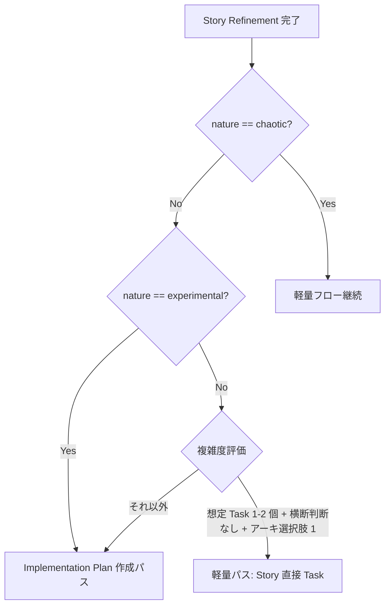

# Implementation Plan 層

Story Refinement の出力結果として、Sprint で実装に着手する前に **「人間と AI コーディングエージェントの bridge ドキュメント」** を Implementation Plan Issue (Issue Type: `Implementation Plan`) として永続化する。Story の「What/Why」と Task の「PR 単位の作業」の間に挟まる "How の戦略" 層に相当する。

## 導入の背景

人間だけの Scrum チームなら、Refinement で技術的な要件定義を対話的に行ってそれをそのまま Sprint Backlog Item (= Task) に落とし込めばよく、技術的な Planning を独立したドキュメントとして残す必要はない。共有理解はチーム内の会話と頭の中にあれば十分だから。

しかし AI コーディングエージェントと協業することを考えると、技術的な要件定義がドキュメントとして永続化されている方が引き渡しの精度が上がる。AI は会話の文脈を持たないので、Refinement で確定した API 仕様・Task 分解・横断的判断などを毎回ゼロから再構築する必要が出てしまう。

そこで本ワークフローでは Story Refinement と Task 分解の間に **Implementation Plan** を作成するフローを採用した。Implementation Plan は実装中も進化してよい使い捨てドキュメントとして、Story の sub-issue に並列で並ぶ。

この方針の参考にしたソース:

- [Scrum Guide Expansion Pack v1.0 (June 2025)](https://scrumexpansion.org/) — Sprint Backlog の "actionable plan for the Increment" 定義、PBI フォーマット自由原則
- [Is Your Product Backlog Ready for the AI Agents?](https://www.scrum.org/resources/blog/your-product-backlog-ready-ai-agents) (scrum.org blog) — "Prompt-Ready PBIs" 概念 (PBI に explicit schemas / negative constraints / API context を含める)
- [The AI-Augmented Scrum Guide (March 2026, community)](https://agileleadershipdayindia.org/blogs/ai-augmented-scrum-framework/the-ai-augmented-scrum-guide.html) — "PBI vs Sprint Backlog vs 別アーティファクトは未確定" と明言、人間と AI の hybrid teams 向け Scrum 拡張

## 位置づけ

```
Epic (Issue type=Epic)
 └─ Story (Issue type=Story)               ← PdO/QA 視点: What/Why
     ├─ Implementation Plan (Issue type)    ← Dev リード視点: How の戦略
     └─ Task (Issue type=Task)              ← 実装者視点: 1 PR 単位
```

Implementation Plan と Task は **どちらも Story の直下 sub-issue**。Implementation Plan は Task の親ではなく **並列で並ぶ**（時系列順では Implementation Plan Done → Task 起票）。

## Scrum Guide Expansion Pack との対応

Expansion Pack の Sprint Backlog 定義に対応する:

> "The Sprint Backlog is an artifact. It is composed of the Sprint Goal (the why for the Sprint), the set of Product Backlog Items selected (the what), and often has an **actionable plan for delivering the Increment (the how)**."

| Scrum 公式 | GitHub Issue マッピング |
|---|---|
| Product Backlog Item (PBI) | Story (Issue type=Story) |
| Sprint Backlog の "actionable plan for the Increment" | **Implementation Plan (Issue type=新規)** |
| Sprint Backlog の Task List | Task (Issue type=Task) |

「PBI ごとに切り分けた Sprint Backlog の中身」を Implementation Plan として可視化する設計。

## Story と Implementation Plan の責務マップ

Story は **PdO/QA 視点 (What/Why)**、Implementation Plan は **Dev リード視点 (How)** で責務を分ける。判定基準は「ユーザー視点 / ビジネス視点で語れる」→ Story、「実装者視点 / アーキ視点で語れる」→ Implementation Plan。

| セクション | 所在 | 理由 |
|-----------|------|------|
| ユーザーストーリー文 | Story | What/Why の核 |
| 概要 / 背景 | Story | What/Why の文脈 |
| 受入基準 | Story | Yes/No 判定可能、PdO/QA レビュー対象 |
| Outcome Done テーブル | Story | Why の検証、観測指標 |
| ビジネスルール (Example Mapping) | Story | ビジネス制約、What/Why の根拠 |
| 未解決の質問 | Story | Refinement の宿題、ビジネス側論点 |
| 実験計画 (experimental の場合) | Story | 検証計画 = What/Why |
| ユーザー体験フロー図 (画面遷移・actor 概念のみ) | Story | 概念レベルに絞る |
| 技術詳細シーケンス図 (API 呼び出し、データフロー) | **Implementation Plan** | 実装視点、Dev レビュー対象 |
| 画面詳細仕様 (DOM、状態管理、コンポーネント分割) | **Implementation Plan** | 実装視点 |
| API 仕様詳細 (リクエスト/レスポンス/エラー/認証) | **Implementation Plan** | 実装視点 |
| ロギング実装 (GA event 名、カスタムイベント実装) | **Implementation Plan** | 実装視点 (観測指標自体は Outcome Done に残る) |
| データモデル / 型定義 | **Implementation Plan** | 実装視点 |
| テスト戦略 (ユニット/統合/E2E 配分) | **Implementation Plan** | 実装視点 |
| Task 分解計画 | **Implementation Plan** | 実装視点 |
| 横断的判断 (セキュリティ / パフォーマンス / リトライ) | **Implementation Plan** | 実装視点 |
| 意図的に扱わないこと | **Implementation Plan** | 実装スコープ管理 |

## Implementation Plan 必要性の判定基準

すべての Story に Implementation Plan を作るのは過剰。以下のフローで判定する。



### 閾値テーブル

| 観点 | 軽量パス (Implementation Plan 不要) | Implementation Plan 作成パス |
|------|--------------------|--------------|
| 想定 Task 数 | 1-2 個 | 3 個以上 |
| 横断的判断 (DB / Auth / API ポリシー等) | なし | あり |
| アーキ選択肢 | 1 つに決まる | 複数候補、要議論 |
| nature ラベル | implementable | experimental, implementable で複雑 |

### team-context preset 別の補正

| preset | 補正 |
|--------|------|
| 軽量 (副業 1-3 名 / 週 20h 以下) | 想定 Task 3 個まで軽量パス許可 |
| 標準 (40-80h) | デフォルト基準を厳格適用 |
| 集中 (100h+) | 想定 Task 2 個でも Implementation Plan 作成推奨 |

実際の閾値は `~/.claude/skills/references/team-context.md` の「Implementation Plan 作成パスの想定 Task 数閾値」「横断的判断閾値」を参照する。

## 判定は 3 箇所で実施

判定基準を 3 つのスキルが参照する:

| スキル | 判定タイミング | 役割 |
|--------|---------------|------|
| `agile-refine-backlog` Step 8 | Refinement の最後 | 次スキルを案内 (流れの中) |
| `agile-refine-implementation-plan` Step 1 | Implementation Plan スキル呼び出し直後 | 副チェック (過剰な Implementation Plan 作成を防ぐ) |
| `agile-implementation-plan-to-task` Step 1 | Task 起票スキル呼び出し時 | 入力種別判定 (ロバスト分岐) |

判定基準そのものは本ドキュメント (concepts/implementation-plan.md) に一元化、各スキルは参照のみ。

## Status 遷移

既存の 7 オプション (In Planning → In Plan Refinement → In Plan Review → Ready → In Coding Progress → In Code Review → Done) をそのまま流用。新規 Status は追加しない。

| Issue Type | 使う Status |
|------------|------------|
| Story | 全 7 ステップ |
| **Implementation Plan** | Ready → In Coding Progress → In Code Review → Done (Task と同じ 4 Status) |
| Task | Ready → In Coding Progress → In Code Review → Done |

Implementation Plan は Task と同じ 4 Status を使う。これにより Sprint ビュー (Filter: `Ready` / `In Coding Progress` / `In Code Review` / `Done`) に Implementation Plan も表示され、Story 配下で Implementation Plan と Task のレビュー進捗を統一的に追える。Implementation Plan は PR を出さないが、`In Code Review` は「Implementation Plan ドキュメントのレビュー (Dev + PdO + QA)」を意味する。

| Implementation Plan Status | 意味 |
|---|---|
| Ready | Implementation Plan Issue 起票完了、Refinement 待ち (現状の `agile-refine-implementation-plan` フローでは通常使わない) |
| In Coding Progress | Implementation Plan 本文を編集中 (Refinement 継続) |
| In Code Review | Implementation Plan レビュー中 (Dev + PdO + QA) |
| Done | Implementation Plan 承認完了 |

`agile-refine-implementation-plan` は Step 1-13 で Refinement を進めて Step 14 で **Refinement 完了済み内容を Implementation Plan Issue として起票** する流れなので、起票時の Status は `In Code Review` (レビュー待ち) になる。再 Refinement が必要なら `In Coding Progress` に戻して編集 → `In Code Review` に戻す。

## Done のカスケード

Story の Done 条件:

1. 受入基準すべて満たす
2. Implementation Plan が Done (作成された場合のみ)
3. 全 Task が Done
4. 受入確認完了

GitHub Projects 標準 Workflow「Sub-issue all closed → Parent auto-close」を有効化すれば半自動化できる。

## Three Amigos の責務分割

Story Refinement と Implementation Plan Refinement で PdO/Dev/QA の責務を分ける:

| 視点 | Story Refinement | Implementation Plan Refinement |
|------|------------------|----------------|
| **PdO** | 受入基準のビジネス妥当性、Outcome 整合 | Implementation Plan が Story の Outcome を逸脱していないかチェック |
| **Dev** | 概念レベルの実現可能性のみ (詳細は Implementation Plan へ) | **メイン責務**: 実装戦略、API 設計、データモデル、テスト戦略 |
| **QA** | 受入基準のテスト可能性 | Implementation Plan のテスト戦略の網羅性 |

Story Refinement は PdO + QA メインで進める。Dev 視点の詳細な技術検査は Implementation Plan Refinement に集約する。

## 軽量パスでの省略運用

Implementation Plan 不要パスでは、Story の sub-issue として直接 Task が並ぶ:

```
Story #45 (Status: In Coding Progress; 最初の Task 起票で Ready → In Coding Progress 遷移済)
 ├─ Task #46 (Ready)
 ├─ Task #47 (Ready)
 └─ Task #48 (Ready)
```

Implementation Plan が必要なパスでは:

```
Story #45 (Status: In Plan Refinement → ... → In Coding Progress; Implementation Plan 起票で遷移済)
 ├─ Implementation Plan #46 (Status: In Code Review → Done)
 │   ↓ Implementation Plan Done を受けて起票
 ├─ Task #47 (Ready)
 ├─ Task #48 (Ready)
 └─ Task #49 (Ready)
```

Implementation Plan と Task は Sprint ビュー (Filter: Ready / In Coding Progress / In Code Review / Done) で Story 配下に並んで表示される。

---

## References

- 📦 [Scrum Guide Expansion Pack v1.0 (June 2025)](https://scrumexpansion.org/) — Sprint Backlog の "actionable plan for the Increment" 定義、PBI フォーマット自由原則
- 🌐 [Is Your Product Backlog Ready for the AI Agents?](https://www.scrum.org/resources/blog/your-product-backlog-ready-ai-agents)（scrum.org blog）— "Prompt-Ready PBIs" 概念（PBI に explicit schemas / negative constraints / API context を含める）
- 🌐 [The AI-Augmented Scrum Guide (March 2026, community)](https://agileleadershipdayindia.org/blogs/ai-augmented-scrum-framework/the-ai-augmented-scrum-guide.html) — 人間と AI の hybrid teams 向け Scrum 拡張
- 📖 [Architecture Decision Records (ADR)](https://adr.github.io/) — Implementation Plan を「実装中に進化してよい使い捨てドキュメント」と位置づける考え方の参考
