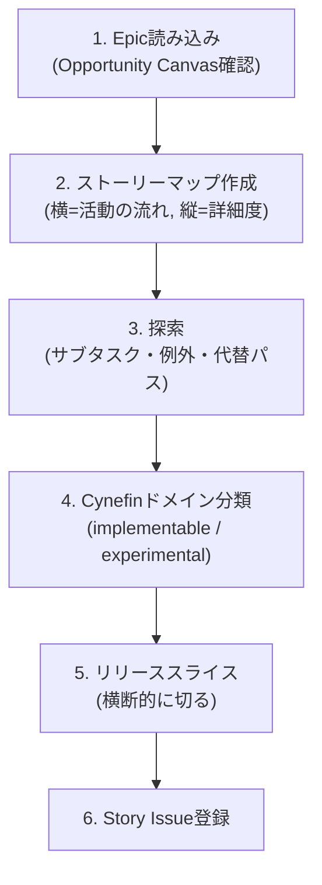

# Agile Create Backlog

Epic Issue を Story Mapping で分解し、Cynefin ドメイン分類を経て Story Issue を作成する。

## When to Use

- Epic を Story に分解するとき
- ストーリーマッピングでバックログを構築するとき
- リリーススライスを定義するとき
- `/agile-create-backlog` で手動実行

## When NOT to Use

- Epic 自体がまだない（→ `/agile-epic`）
- 個別 Story の詳細化・受入基準作成（→ `/agile-refine-backlog`）
- プロダクトの方向性が未定義（→ `/agile-product-vision`）

## コーチングの原則

- **ストーリーは会話のトークン** — カードに書くのはキーワードだけ。詳細は対話で引き出す。共有理解を生むのは文書ではなく会話
- **ケーキスライスで切れ** — 技術レイヤー（フロント/バック/DB）ではなく、ユーザーに価値が届く縦切りで分割する。スポンジだけ渡されても嬉しくない
- **「作れるか」ではなく「知っているか」で分類せよ** — Cynefin 分類の判断基準は技術的難易度ではない。因果関係が事前にわかるか（implementable）、やってみないとわからないか（experimental）
- テンプレの質問で詰まったら **GROW モデル** （Goal → Reality → Options → Will）の順で問いを組み立て直す

## Workflow



---

## Step 1: Epic 読み込み + ビジョン確認

**Epic の特定**: ユーザーが Epic 番号を指定していない場合、GitHub MCP の `list_issues` で Epic 一覧を取得し、ユーザーに提示して選択してもらう。該当する Epic がない場合は `/agile-epic` での作成を案内する。

対象 Epic Issue を GitHub MCP の `issue_read` で読み込み、Opportunity Canvas の内容を確認する:
- ソリューションアイデア（何を作るか）
- ターゲットユーザー（誰のためか）
- ユーザーの課題（なぜ必要か）

Story Issue 登録後（Step 6 の後）、 **サブエージェントを起動** して作成した Story 群とビジョンの整合を検査する。

**サブエージェントへの指示**:
```
以下の Story Issue 一覧と docs/VISION.md を読み込み、整合性を検査してください。

検査観点:
1. 各 Story はビジョンのミッションに貢献するか
2. Not-to-do リストに該当する Story がないか
3. ビジョンの成功指標に紐づかない Story がないか

NG の Story がある場合は、具体的にどの Story がどの観点で不整合かを報告してください。
```

サブエージェントの結果に NG がある場合はユーザーに報告し、Story の修正・削除を検討する。

## Step 2: ストーリーマップ作成

ユーザーの典型的な行動を左から右へ時系列で並べる。

**バックボーン（横軸）の構築**
- 主質問: 「このEpicのソリューションを使うとき、ユーザーは最初に何をして、次に何をして、最後に何をするか?」
- 深掘り: 「その流れを誰かに説明するとしたら、どんな順番で話すか?」
- アクティビティ（大きな目標）の下にユーザータスク（動詞句）を並べる

**注意**:
- ワークフローモデルの精密さを求めない。ストーリーマップは会話のための地図
- 最初は「1マイル幅、1インチ深さ」— 全体像を先に、詳細は後

## Step 3: 探索（ブルースカイ）

各タスクの下にぶら下がる詳細を洗い出す:
- **サブタスク**: そのタスクをさらに分解すると?
- **代替パス**: 他のやり方はあるか?
- **異常パターン**: 何がうまくいかない可能性があるか?
- **UI詳細**: 画面やインタラクションのイメージは?

この段階ではスコープを気にしない。「あったらいいな」も含めて全部出す。スコープの絞り込みは Step 5 で行う。

## Step 4: Cynefin ドメイン分類

**このステップがパイプライン全体の分岐点。** 各ストーリー候補を以下の基準で分類する。

### 判断フレームワーク

ユーザーに以下の質問を順に投げかける:

> 1. 「いま行動を起こさないと事業や顧客に深刻な被害が出る状況ですか?」
> 2. （No なら）「このストーリーについて、受入基準（{状況}のとき、{操作}したら、{結果}になる）を今すぐ書けますか?」

| 1 への回答 | 2 への回答 | 分類 | ラベル | 意味 |
|---|---|---|---|---|
| Yes | — | Chaotic | `nature:chaotic` | 本番障害・セキュリティインシデント・データ損失等。仕様化を待つより**先に行動して安定化**することを最優先（act → sense → respond） |
| No | 「書ける」または「調べればわかる」 | Clear / Complicated | `nature:implementable` | 因果関係が明確。ベストプラクティスや専門知識で解決可能 |
| No | 「やってみないとわからない」 | Complex | `nature:experimental` | 因果関係が事後にしか見えない。実験（Safe-to-Fail プローブ）が必要 |

### implementable の特徴

- 要件を正常パターン/異常パターンで記述できる
- 既存の技術・パターンで実装できる見込みがある
- → `/agile-refine-backlog` で仕様書レベルまで詳細化 → CodingAgent へ

### experimental の特徴

- 「ユーザーがこう使うはず」が推測の域を出ない
- 技術的にフィージブルかわからない
- ビジネス的に成立するか検証が必要
- → この段階（Step 6）で実験計画を作成 → 人間がスパイクを実施 → 結果をもとに `/agile-create-backlog` で新たな Story を作成

### chaotic の特徴

- 因果関係を分析する時間的余裕がなく、即時対応が求められる
- 例: 本番サービス停止、データ破損、セキュリティインシデント
- → `/agile-refine-backlog` の **軽量フロー**（受入基準のみ）→ `/agile-task-implementation` で hotfix → 安定化後に postmortem を別 Issue で記録

### 分類の注意点

- **全部 implementable は危険信号。** バックログに experimental が1つもないなら、検証されていない前提の上に実装を積み上げている可能性が高い
- 迷ったら experimental 寄りに分類する。過剰に仕様化するより、実験で学ぶほうが手戻りが少ない
- **chaotic は安易に使わない**: 「なんとなく急ぎ」レベルでは chaotic ではない。事業継続が損なわれる切迫した状況のみ。普段の急ぎ案件は implementable で対応する
- **MANDATORY** : `references/cynefin-guide.md` を読み込み、具体的な分類例を参照する

---

## Step 5: リリーススライス

ストーリーマップを **横断的に** 水平線で切り、リリース単位を定義する。

- 主質問: 「最小限のユーザー体験として成立するストーリーの組み合わせはどれか?」
- 深掘り: 「もし半分の期間しかなかったら、どのストーリーだけで最初のリリースを作るか?」

**スライスの考え方**:
- **Opening Game（歩く骨格）**: 最もシンプルな動作バージョン。全レイヤーを貫通する最小セット。ここでアーキテクチャとユーザー体験を早期検証
- **Mid Game**: 主要機能を充実させる。ユーザーテストのフィードバックを反映
- **End Game**: リリース前の仕上げ。想定外の作業が出ることを前提にバッファを持つ

各スライスに名前・ターゲットアウトカム・成功指標を設定する。

## Step 5.5: 品質スコアリング

Story Issue を登録する **前に**、各 Story 候補について以下の 6 点スコアリングで提案品質をチェックする:

| # | 観点 | 合格基準 |
|---|------|---------|
| 1 | **ストーリーマップ整合** | アクティビティ → タスク → 詳細 の階層が成立しており、Step 2 のマップ上で位置が明確 |
| 2 | **nature 分類妥当** | Cynefin 4 区分（Clear / Complicated / Complex / Chaotic）のいずれかに明確に当てはまる。判定根拠を提示できる |
| 3 | **リリーススライス整合** | Opening Game / Mid Game / End Game のいずれに属するかが Step 5 で決まっている |
| 4 | **Epic との対応明示** | 親 Epic を sub-issue としてリンクできる状態（Epic Issue 番号が確定） |
| 5 | **ビジョン整合** | Story 群とビジョンの整合サブエージェント検査で OK 判定（NG / 要確認なら修正済み） |
| 6 | **INVEST 性質** | Independent / Negotiable / Valuable / Estimable / Small / Testable のチェックを通過 |

**6 点中 5 点以上で合格。4 点以下は書き直し。** ユーザーに各 Story のスコアを一覧で提示し、書き直しが必要な Story は Step 3-5 を再開する。合格した Story 群について Step 6 で起票する。

## Step 6: Story Issue 登録

ユーザーの指示で GitHub Issue を作成する。

**MANDATORY** : Story テンプレートを次の順で解決し、本文出力に使う:

1. リポジトリ側 `.github/ISSUE_TEMPLATE/story.md` を最優先
2. 無ければ本スキル同梱の `templates/story.md` をフォールバック

**テンプレートの全セクションを必ず保持し**、埋められない箇所は `> TBD` で残す（セクションごと削除しない）。テンプレートに存在しないセクション（例: `### ラベル`）を独自に追加してはならない。

- **タイトル**: ストーリー文（「{ユーザー種別}として、{目標}のために、{アクション}したい」）を適度に短縮したユーザーストーリー形式にする。単なるToDoの動詞句（例:「依頼を作成する」）ではなく、誰が・なぜ・何をするかがわかる形にする（例:「依頼者として助けてくれる人を見つけるために依頼を投稿したい」→「助けてくれる人を見つけるために依頼を投稿する」）。`nature:experimental` の場合は「〇〇について実験する」「〇〇を検証する」のように調査・実験であることがタイトルだけでわかる形にする
- **Issue 作成**: `/agile-create-issue` スキルに委譲する。以下のパラメータを渡す:
  - Issue Type: `"Story"`
  - ラベル: `nature:implementable` or `nature:experimental`
  - 親 Issue: Epic Issue（sub-issue としてリンク）
  - テンプレート解決・登録確認、Mermaid 検証、ステータス設定（In Planning）、親子リンクは `/agile-create-issue` が処理する
- **Do NOT Load**: Step 1〜5 の対話フェーズではテンプレートを読むな。ストーリー候補の発散がテンプレートの枠に引きずられることを防ぐ

**対話の流れ**（implementable / experimental 共通）:
1. まず必須項目を聞く: ストーリー文・概要・受入基準（粗い観点）
2. 必須項目を埋めた後に「画面遷移やデザインリンクなど、今の段階で埋められるものはありますか?」とオプショナルに聞く
3. テンプレートのTBDセクションは無理に埋めない。 `/agile-refine-backlog` で詳細化する

---

## 決定境界

全体マップは `docs/agile-workflow/concepts/ai-decision-boundary.md`を参照。本スキル固有の人間承認ゲート:

- **nature 分類確定（implementable / experimental）** — 「受入基準を今すぐ書けるか / やってみないとわからないか」の判定は人間。AI は質問を投げるだけ
- **リリーススライスの境界決定** — Opening Game / Mid Game / End Game をどこで切るかは人間判断
- **Story 起票実行** — `/agile-create-issue` への委譲前の最終確認

NEVER（次節）はこのゲートの違反を具体的に列挙している。

---

## エッジケース

| 状況 | 対応 |
|------|------|
| Epic の Opportunity Canvas が不十分 | 「Epic の Problem Space を先に埋めましょう」と `/agile-epic` に誘導 |
| ストーリーが大きすぎる（1スプリントに収まらない） | INVEST の S（Small）を満たすまで縦切りで分割する |
| ストーリーが小さすぎる（単独でユーザー価値がない） | 隣のストーリーと統合する。タスクレベルまで分解しない |
| Cynefin 分類で意見が割れる | experimental 寄りに倒す。検証コストは実装の手戻りコストより常に安い |
| Issue Type `Story` が Organization に未設定 | Organization Settings → Planning → Issue types で `Story` を作成するようユーザーに案内する |

## NEVER — アンチパターン

- **NEVER: 技術レイヤーで切るな** — 「フロントエンド Story」「バックエンド Story」は NG。ユーザーに価値が届く縦切りで常に分割する
- **NEVER: 全ストーリーを implementable にするな** — experimental が0件のバックログは、未検証の前提の上に実装を積み上げている。最も危険な状態
- **NEVER: Story の下に Sub-issue（タスク）を作るな** — Issue 階層は Epic → Story の2層のみ。タスク分解は CodingAgent の責務。人間がタスク管理する粒度ではない
- **NEVER: スコープを探索フェーズ（Step 3）で絞るな** — 探索は発散のフェーズ。収束はリリーススライス（Step 5）で行う。早すぎるスコープ削減はイノベーションを殺す
- **NEVER: ストーリーマップの精密さにこだわるな** — マップは会話の道具であって、正式な仕様書ではない。完璧なマップより、チームの共有理解のほうが100倍価値がある

---

## References

このスキルが参考にしている書籍・記事・フレームワーク:

- 🌐 [Story Map Concepts](https://www.jpattonassociates.com/wp-content/uploads/2015/03/story_mapping.pdf)（Jeff Patton, PDF）— Story Mapping・バックボーン・Walking Skeleton・Opening/Mid/End Game リリーススライス
- 📖 [不確実な世界を確実に生きる カネヴィンフレームワークへの招待](https://www.amazon.co.jp/s?k=不確実な世界を確実に生きる+カネヴィン)（コグニティブ・エッジ / 田村洋一）— Cynefin 4 区分（Clear / Complicated / Complex / Chaotic）
- 🌐 [Agile Story Essentials](https://www.jpattonassociates.com/wp-content/uploads/2015/03/story_essentials_quickref.pdf)（Jeff Patton, PDF）— INVEST 性質
- 📖 [アートオブアジャイルデベロップメント](https://www.amazon.co.jp/s?k=アートオブアジャイルデベロップメント)（Jim Shore）— リリース計画
- 📦 [Scrum Guide Expansion Pack](https://scrumexpansion.org/) — Complexity 拡張（Cynefin 4 区分の現代解釈）
