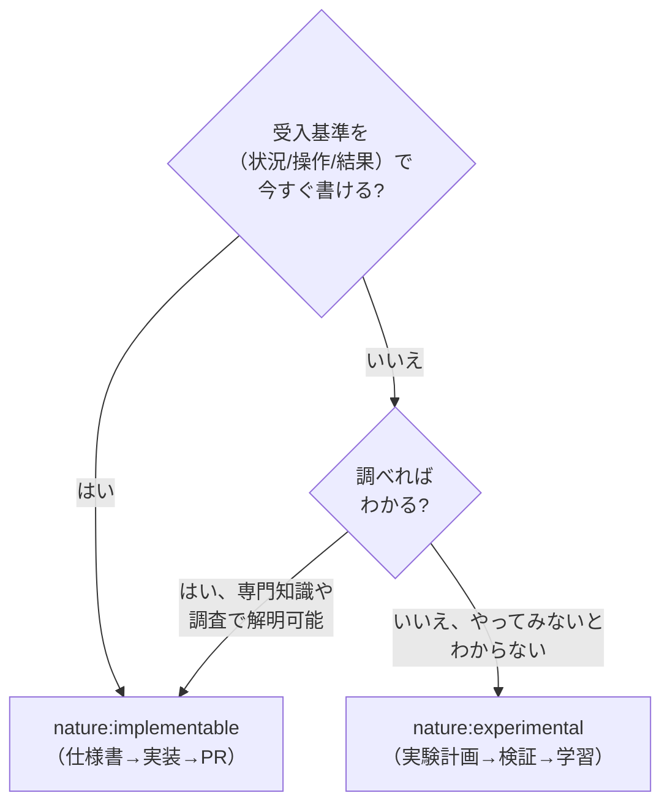

# Cynefin ドメイン分類ガイド

## 判断の核心

「因果関係が事前にわかるか?」が唯一の判断基準。技術的な難易度ではない。

## ドメイン定義と分類例

### Clear（明白）→ `nature:implementable`

因果関係が誰にとっても明白。ベストプラクティスが確立されている。

**ソフトウェア開発での例**:
- CRUD 操作の実装
- 既存パターンに沿ったフォーム画面
- 標準的な認証フロー（OAuth, JWT）
- 既知のライブラリを使った機能追加

### Complicated（煩雑）→ `nature:implementable`

因果関係は分析や専門知識で解明できる。グッドプラクティスが複数存在する。

**ソフトウェア開発での例**:
- パフォーマンス最適化（計測→分析→改善のサイクルで解決可能）
- 外部 API との複雑な連携（仕様書を読めば設計できる）
- データベーススキーマの設計（正規化の理論で判断可能）
- セキュリティ要件の実装（OWASP 等のガイドラインに従える）

### Complex（複雑）→ `nature:experimental`

因果関係は事後にしか見えない。「やってみないとわからない」領域。

**ソフトウェア開発での例**:
- 「ユーザーがこの UI を直感的に使えるか?」→ プロトタイプで検証が必要
- 「この機能にユーザーは課金してくれるか?」→ MVP で市場反応を見る必要
- 「このアルゴリズムで十分な精度が出るか?」→ スパイクで実験が必要
- 「この技術スタックでスケールするか?」→ PoC で負荷テストが必要
- 「チームがこのワークフローを受け入れるか?」→ パイロット運用が必要

## 判定フローチャート



## experimental ストーリーの後続フロー

```
experimental Story
  → /agile-refine-backlog で実験計画を設計
  → 人間が実験を実施（スパイク/プロトタイプ/ユーザーテスト）
  → 結果を評価
  → 成功: 新たな implementable Story を生成
  → 失敗: ピボットまたは破棄
```

## よくある誤分類

| 誤分類 | 正しい分類 | 理由 |
|--------|-----------|------|
| 「難しいから experimental」 | Complicated → implementable | 難易度が高くても、専門知識で解決可能なら implementable |
| 「簡単だから implementable」 | Complex → experimental | 実装は簡単でも「ユーザーが使うか」が不明なら experimental |
| 「前例がないから experimental」 | Complicated → implementable | 自チームに前例がなくても、業界に確立されたパターンがあれば implementable |
