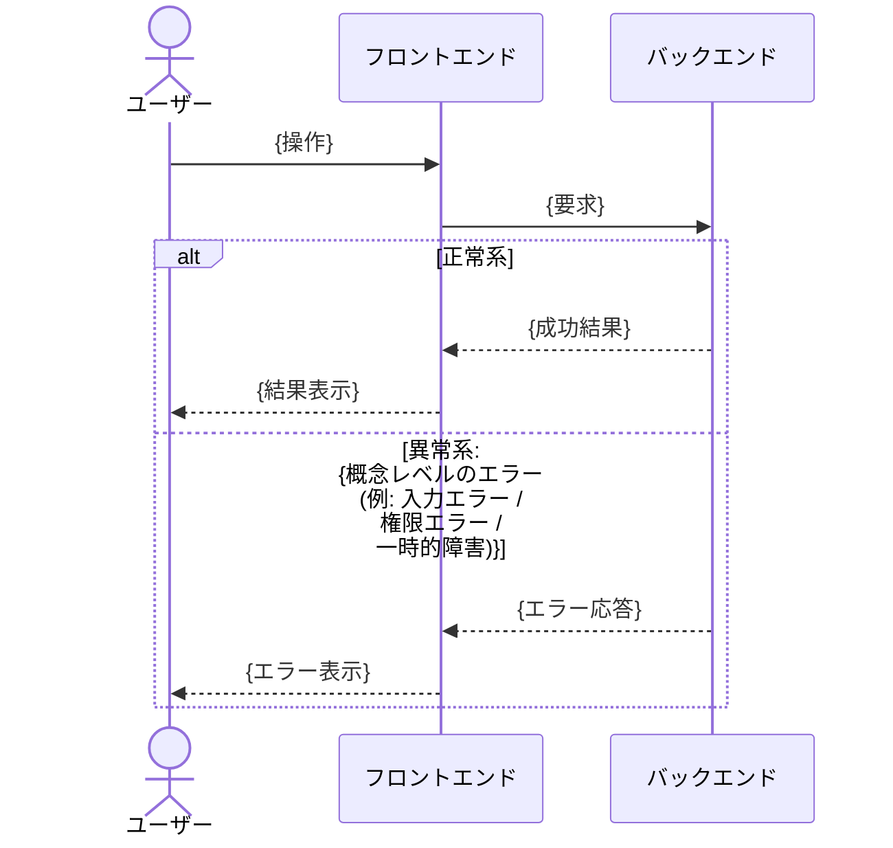

## {タイトル}

<!-- implementable: 短い動詞句（例: 「検索結果を一覧表示する」） -->
<!-- experimental: 実験・調査であることがわかる形（例: 「ユーザーが直感的に操作できるUIパターンについて実験する」） -->

### ストーリー

{ユーザー種別} として、{達成したい目標} のために、{実行したいアクション} したい。

### 概要

{背景・文脈。関連ドキュメントやリンクがあれば貼る}

### ユーザー体験フロー

> TBD（refine-backlog で作成）

<!-- 概念レベルの sequenceDiagram。actor + 画面遷移 + 主要インタラクション。 -->
<!-- API 呼び出しの詳細、データフロー、内部処理は書かない (それは Implementation Plan へ移す)。 -->
<!-- alt/opt の異常系は「異常系: バリデーションエラー」など概念レベルで止める。 -->

### Outcome Done（観測指標）

> TBD（refine-backlog で親 Epic の Outcome 仮説をもとに記述）

| 観測指標 | 期待する変化 | 観測タイミング | 観測手段 |
|---------|------------|--------------|---------|
| {指標名} | {例: 完了率が X% → Y% に上昇} | {即時 / 数日 / 数週} | {既存ロギング / Implementation Plan のロギング実装で追加 / 手動集計} |

**動かなかった場合の学び**:
> {仮説が反証されたら次にどう動くか}

<!-- 観測手段を持たない指標は仮説として無効。観測コストが見合わない場合は `> 観測しない（理由: ...）` で残してよい -->
<!-- 受入基準（Output Done）と Outcome Done は別物。受入基準 = 自動テスト可能な振る舞い、Outcome Done = 観測でしか判定できない事後評価 -->
<!-- 観測手段の具体的な実装方法 (GA event 名、カスタムイベントの実装等) は Implementation Plan に書く -->

### ビジネスルール

> TBD（refine-backlog の Example Mapping で抽出）

- {ルール 1: 例: 「依頼の編集は依頼者本人と管理者のみ可能」}
- {ルール 2: 例: 「金額は 1 円以上、上限は会員ランク依存」}

<!-- シーケンス図に出てこない暗黙の業務制約も含める（権限・上限値・状態遷移・業務時間など） -->
<!-- 5 個超えたら Story が大きすぎる兆候。/agile-create-backlog に戻って分割検討 -->

### 受入基準

- [ ] {状況}のとき、{操作}したら、{結果}になる

<!-- ユーザー体験フローの alt/else ブロックと、ビジネスルールの具体例から導出 -->
<!-- 1 つのルールが 1〜3 つの受入基準に展開されることが多い -->
<!-- Yes/No 判定可能なレベルで書く。実装の詳細は書かない (それは Implementation Plan へ) -->

### 未解決の質問

> TBD（refine-backlog の Example Mapping で発見、解決待ち）

- {質問 1: 例: 「キャンセル後の返金は何営業日以内？要法務確認」}

<!-- 3 個超えたらリファインメント未完了。依頼元（PdO・法務など）への確認を先行 -->

### 実装プラン

<!-- Implementation Plan 作成パスの場合は、agile-refine-implementation-plan が完了した後に Implementation Plan Issue へのリンクを追記する -->
<!-- 軽量パス (Implementation Plan 不要) の場合はこのセクションを削除してよい -->

> TBD（refine-backlog の Step 8 で判定。必要なら /agile-refine-implementation-plan で作成）

### 実験計画（nature:experimental の場合のみ）

| 項目 | 内容 |
|------|------|
| 検証したい仮説 | |
| 実験方法 | |
| 合格基準 | |
| 実験期限 | |
| 実験後のアクション | |
