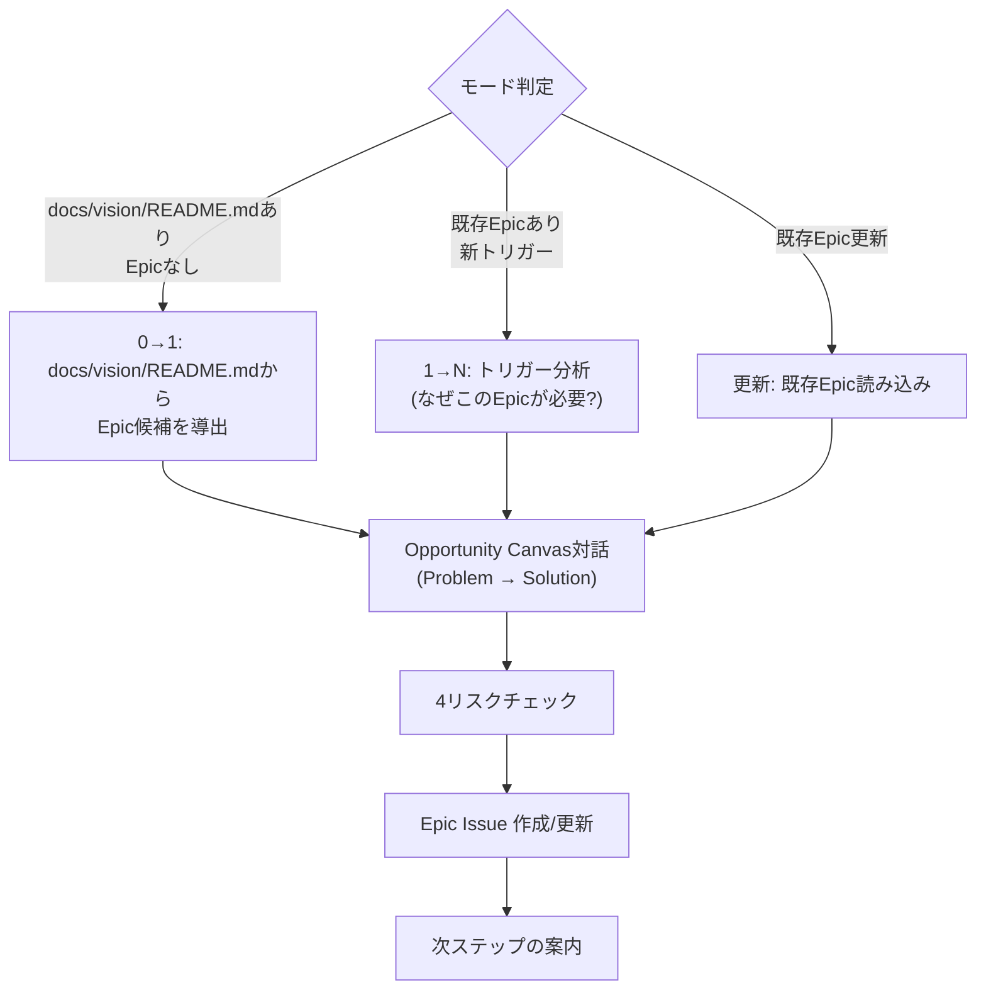

# Agile Epic

> 🗣️ **ユーザーへの質問**: 選択肢が有限なら `AskUserQuestion` ツールを優先 (2-4 個の選択肢、推奨は先頭に `(Recommended)` を付ける)。自由記述が要る箇所はテキスト対話のまま。

Opportunity Canvasで構造化したEpic Issue（Issue Type: `Epic`）を対話的に作成・更新する。

> 閾値（同時アクティブ Epic 数の上限など）は `.claude/skills/references/team-context.json` を参照する。設定がなければ「軽量プリセット」（副業チーム想定 = アクティブ Epic 2-3 個）をデフォルトに動く。

## When to Use

- ビジョンからEpicを導出するとき（0→1）
- 新しいトリガー（ユーザーの声、データ、技術的機会）からEpicを追加するとき（1→N）
- 既存Epicの内容を見直すとき（更新）
- `/agile-create-epic` で手動実行

## When NOT to Use

- プロダクトの方向性自体が未定義（→ `/agile-craft-vision`）
- EpicをStoryに分解したい（→ `/agile-create-stories`）
- 個別Storyの詳細化（→ `/agile-refine-story`）

## コーチングの原則

- **事実が先、仮説は後** — Opportunity Canvasの左側（Problem Space）を事実で埋めてから右側（Solution Space）に進む。ソリューションから考え始めると「誰も使わない機能」を作ってしまう
- **1つの問題に複数のソリューション候補** — 最初に思いついたソリューションが最善とは限らない。問題を理解した上で少なくとも2つの解決策を検討する
- **テンプレの質問で詰まったらGROWモデルで掘り下げろ** — 定型質問で十分な回答が得られない場合、Goal（理想）→ Reality（現状）→ Options（選択肢）→ Will（意思決定）の順で問いを組み立て直す

## Workflow



### モード判定

- **0→1**: `docs/vision/README.md` が存在し、Issue Type `Epic` のIssueがまだない → docs/vision/README.mdのLayer 3（What）から機能クラスターを抽出し、Epic候補を提示
- **1→N**: 既存Epicがある状態で新たなEpicを作成 → まずトリガー分析（後述）を実施
- **更新**: ユーザーが既存Epic Issueを指定 → Issue本文を読み込み、変更箇所を対話で特定

---

## 0→1モード: ビジョンからのEpic導出

docs/vision/README.mdのLayer 3（What: ユーザーの課題、Not-to-doリスト、成功指標）を読み込み、以下を問いかける:

- 「ビジョンを実現するために、最低限必要な機能の塊は何か?」
- 「Not-to-doリストに入っていないもので、最初のリリースに不可欠なものはどれか?」
- 「これらの機能を2-3個のEpicにまとめるとしたら、どう分けるか?」

Epic候補を列挙した後、1つずつOpportunity Canvas対話に進む。

## 1→Nモード: トリガー分析

新しいEpicを作る前に、なぜ今このEpicが必要なのかを明らかにする:

- **トリガーの特定**: 「このEpicを検討するきっかけは何か?」（ユーザーの声 / データ分析 / ステークホルダー要望 / 技術的機会 / 競合動向）
- **既存Epicとの関係**: 「既存のEpicと重複・矛盾しないか?」→ 既存Epicのタイトル一覧を GitHub MCP の `list_issues` で取得し提示
- **ビジョンとの整合**: 「docs/vision/README.mdのミッション・Not-to-doリストと整合しているか?」→ Not-to-doの「やらないこと」に該当するなら、それでも進める根拠を確認

---

## Opportunity Canvas対話

Canvasは **左側=Problem Space（調査可能な事実）** と **右側=Solution Space（検証が必要な仮説）** に分かれる。左側を先に埋める。

### Problem Space（事実）

**ソリューションアイデア**
- 「一言で言うと、何を作ろうとしているか?」— ここではソリューションの名前だけ。詳細はSolution Spaceで扱う。具体的な技術名（ライブラリ名・SaaS名等）ではなくサービス視点で記述する

**ユーザーの課題（Jobs-to-be-done）**
- 主質問: 「ターゲットユーザーが今抱えている課題・ニーズは何か?」
- 深掘り: 「その課題はどれくらいの頻度で発生するか?」「解決されないとユーザーにどんな悪影響があるか?」「その課題を抱えている人は実際に何人くらいいるか?」

**ターゲットユーザー**
- 主質問: 「この課題を最も切実に抱えているのは具体的にどんな人か?」
- 深掘り: 「docs/vision/README.mdのペルソナと一致するか?」「全ユーザー共通の課題か、特定セグメントだけか?」

**現在の解決策**
- 主質問: 「ユーザーは今この課題をどう解決しているか?」
- 深掘り: 「その解決策のどこが不十分か?」「ユーザー独自のワークアラウンドがあるなら、そこに価値のヒントがある」
- 注意: **何も対処していないなら、その課題は十分に深刻でない可能性がある**

**ビジネス上の課題**
- 主質問: 「この課題を放置すると、ビジネスにどんな悪影響があるか?」
- 深掘り: 「顧客満足度低下? 解約率増加? 競合流出? 売上機会損失? 具体的な数字やエピソードはあるか?」

### Solution Space（仮説）

**ユーザーの価値ストーリー**
- 主質問: 「このソリューションが完成したとして、ユーザーはどうやって価値を得るか? ストーリーで語ってほしい」
- 深掘り: 「ユーザーはそのソリューションをどう発見し、初めて使い、継続的に使うようになるか?」
- 注意: 「〇〇ができるようになる」だけでなく、ユーザーの行動変化を具体的に描く

**成功指標（Outcome 仮説）**
- 主質問: 「ユーザーの価値ストーリー通りに使われたとして、何を測れば成功とわかるか?」
- 深掘り:
  - 「その指標はユーザーの行動に紐づいているか?（ページビューではなく、完了率やリテンション率など）」
  - 「指標が動かなかった場合、何を学びとし、次にどう動くか?」
  - 「観測手段（既存計測 / 追加ロギング / 手動集計）は揃っているか?」
- 記録形式: `指標 / 目標値 / 仮説（X→Y の因果）/ 観測手段 / 観測期間 / 動かなかった場合の学び` の 6 列構造化テーブルで記述する
- 安全弁: 観測コストが投資に見合わない指標は `> 観測しない（理由: ...）` で残してよい。仮説検証しないなら学習も期待しないトレードオフを明示する

**導入戦略**
- 主質問: 「ユーザーはこの機能をどう知り、どう学び、どう使い始めるか?」
- 深掘り: 「既存のユーザー導線に自然に組み込めるか? それとも別途オンボーディングが必要か?」

**ビジネスインパクト**
- 主質問: 「このEpicの成功は、ビジネスのどの指標を動かすか?」
- 深掘り: 「売上・コスト削減・顧客獲得・リテンション、最も影響が大きいのはどれか?」
- 注: 上の Outcome 仮説テーブルにビジネス系指標が含まれていれば、ここで二重に書かない。Outcome 仮説 = 検証可能な観測対象、ビジネスインパクト = ビジネス文脈での意義、と分担する

**予算感**
- 主質問: 「この課題の解決に、チームの時間をどれくらい投資する価値があるか?」
- 深掘り: 「期待されるビジネスインパクトに見合う投資規模か?」
- 注意: 正確な見積もりではなく「大・中・小」程度の粗い感覚でよい。実装前にコストを正確に見積もることは不可能

---

## 4リスクチェック + ビジョン整合（サブエージェント）

Opportunity Canvas 対話の後、 **サブエージェントを起動** して4リスク評価とビジョン整合を検査させる。

**サブエージェントへの指示**:
```
以下の Epic Issue の Opportunity Canvas 内容と docs/vision/README.md を読み込み、検査してください。

検査観点:
1. 価値リスク: ユーザーはこれを選んで使ってくれるか? Problem Spaceのユーザー課題が曖昧でないか
2. ユーザビリティリスク: ユーザーは使い方がわかるか? 導入戦略が具体的か
3. 実現可能性リスク: 今のチーム・技術・時間で作れるか? 未経験の技術領域や外部依存がないか
4. 事業継続性リスク: ビジネスとして成立するか? コストが見合うか
5. ビジョン整合: ミッションに貢献するか? Not-to-doリストに該当しないか?

各観点の判定（低/中/高リスク）と根拠を返してください。
ビジョンと不整合がある場合はその旨も報告してください。
```

**サブエージェントの結果に基づく対応**:
- 高リスク項目がある → Epic Issue 本文に `> ⚠️ リスク: {内容}` として明記
- ビジョン不整合がある → ユーザーに報告し、進めるか判断を求める

---

## 品質スコアリング

Epic Issue を作成 / 更新する **前に**、以下の 7 点スコアリングで完成度をチェックする:

| # | 観点 | 合格基準 |
|---|------|---------|
| 1 | **Problem Space 充足** | ユーザー課題・ターゲット・現在の解決策・ビジネス上の課題が事実ベースで埋まっている |
| 2 | **Solution Space 仮説** | 価値ストーリー・成功指標・導入戦略・ビジネスインパクト・予算感が記述されている |
| 3 | **4 リスク評価** | 価値 / ユーザビリティ / 実現可能性 / 事業継続性 のすべてに評価結果が入っている |
| 4 | **Outcome 仮説完成度** | 指標 / 仮説（X→Y）/ 観測手段 / 観測期間 / 動かなかった場合の学び の 5 列が埋まっている、または「観測しない」が明示されている |
| 5 | **ビジョン整合** | 4 リスクサブエージェント検査でビジョン整合 OK 判定 |
| 6 | **既存 Epic との重複なし** | `list_issues` で既存 Epic を検索し重複していないことを確認済み |
| 7 | **Mermaid 構文有効** | 本文内に mermaid ブロックがある場合 `validate-mermaid.mjs` でパス（スクリプト未配置時はスキップ） |

**7 点中 6 点以上で合格。5 点以下は書き直し。** ユーザーに各観点のスコアを提示して承認を得てから次の「Epic Issue 作成/更新」に進む。

---

## Epic Issue 作成/更新

**MANDATORY** : Epic テンプレートを次の順で解決し、本文出力に使う:

1. リポジトリ側 `.github/ISSUE_TEMPLATE/epic.md` を最優先
2. 無ければ本スキル同梱の `templates/epic.md` をフォールバック

**テンプレートの全セクションを必ず保持し**、埋められない箇所は `> TBD: {なぜ未定か}` で残す（セクションごと削除しない）。テンプレートに存在しないセクション（例: `### ラベル`）を独自に追加してはならない。

- **新規作成**: `/agile-create-issue` スキルに委譲する。Issue Type: `"Epic"`、本文に Opportunity Canvas の対話結果 + 4リスクチェック結果を構造化して記載。テンプレート解決・登録確認・Mermaid 検証は `/agile-create-issue` が処理する
- **更新**: 既存 Issue の本文を `issue_write` で書き換える。変更箇所のみ更新し、他は維持。更新前に mermaid ブロックがあれば `node .claude/scripts/validate-mermaid.mjs` で検証する
- **Do NOT Load**: Opportunity Canvas対話フェーズではテンプレートを読むな。ユーザーの回答がテンプレートの枠に引きずられることを防ぐ

## 次ステップの案内

Epic Issue作成後、以下を案内する:
- 「このEpicをStoryに分解するには `/agile-create-stories` を使ってください」
- 他にEpic候補がある場合は続けて作成を提案

---

## 決定境界

全体マップは `docs/agile-workflow/concepts/ai-decision-boundary.md`を参照。本スキル固有の人間承認ゲート:

- **Problem Space の事実確定** — ユーザーの課題・現在の解決策・ビジネス上の課題は事実。AI は推測せず、人間が知識を提供する
- **4 リスク評価結果の採否** — サブエージェントが各リスクを判定するが、リスク許容と Epic 進行の判断は人間
- **Outcome 仮説の確定** — 指標の選び方・観測コストの判断・「動かなかったときの学び」は人間が決める
- **Epic 起票実行** — `/agile-create-issue` への委譲前の最終確認は人間

NEVER（次節）はこのゲートの違反を具体的に列挙している。

---

## エッジケース

| 状況 | 対応 |
|------|------|
| docs/vision/README.mdが存在しない | 「先にビジョンを策定しましょう」と `/agile-craft-vision` に誘導 |
| Problem Spaceがほぼ埋まらない（「ユーザーの課題」「ターゲットユーザー」の2項目が具体的に書けない） | リサーチフェーズが必要。Epicを作る前にユーザーインタビュー等を提案 |
| Solution Spaceで意見が発散する | 複数案をそのまま記録し、「検証すべき仮説」として明示。1つに絞ることを強制しない |
| アクティブ Epic が `team-context.json` の上限を超えそう | プリセット上限（軽量: 2-3 / 標準: 5-7 / 集中: 10+）を提示し、「優先順位をつけましょう」と促す。team-context.json がなければ軽量上限を適用 |
| 既存Epicと重複するトリガー | 「既存のEpic #{番号} と重複していませんか?」と確認。既存Epicの更新で済むなら新規作成しない |
| Issue Type `Epic` が Organization に未設定 | Organization Settings → Planning → Issue types で `Epic` を作成するようユーザーに案内する |
| docs/vision/README.mdのフォーマットが想定と異なる | Layer 3（What）相当の情報を対話で補完する。フォーマット修正は `/agile-craft-vision` に委ねる |

## NEVER — アンチパターン

- **NEVER: Problem Spaceを飛ばしてSolution Spaceから書くな** — 課題の事実が不明なままソリューションを設計すると、「誰も困っていない問題」を解決する機能を作ってしまう。これがプロダクト開発の最大の無駄
- **NEVER: 4リスクチェックを省略するな** — 「作ったけど誰も使わなかった」を防ぐ最後の砦。特に価値リスク（ユーザーが本当に使うか?）は最も見落とされやすい
- **NEVER: アクティブな Epic を `team-context.json` の上限を超えて持つな** — 採用プリセットの上限（軽量: 2-3 / 標準: 5-7 / 集中: 10+）を超えると稼働が全方位に分散してどの Epic も完成しない。team-context.json がなければ軽量上限（2-3）をデフォルトに
- **NEVER: ユーザー課題を推測で書くな** — 「〇〇に困っているはず」ではなく「〇〇に困っていると言っていた / データで確認した」と書く。推測はSolution Spaceの仮説として扱う
- **NEVER: Canvas全項目の完璧な記入を強制するな** — 不明な箇所は `> TBD: {なぜ未定か}` で残す。特にSolution Spaceは仮説なので、最初から完璧である必要はない
- **NEVER: Epic Issueにタスクレベルの詳細を書くな** — EpicはOpportunity Canvas粒度。具体的なStory/タスク分解は `/agile-create-stories` の責務
- **NEVER: Epic Issueに具体的な技術名・実装手段を書くな** — EpicはPdOがサービス視点で書くもの。「Better Auth」「Stripe Identity」「Stripe Connect」のような具体技術ではなく「メール+パスワード認証」「本人確認」「エスクロー決済」のようにユーザー・ビジネス視点で記述する。技術選定はStory以降の責務

---

## References

このスキルが参考にしている書籍・記事・フレームワーク:

- 🌐 [Opportunity Canvas](https://www.jpattonassociates.com/opportunity-canvas/)（Jeff Patton）— Opportunity Canvas 構造そのもの
- 📖 [INSPIRED](https://www.amazon.co.jp/s?k=INSPIRED+Marty+Cagan)（Marty Cagan）— 4 リスクチェック（Value / Usability / Feasibility / Business Viability）
- 🌐 [Product Discovery Immersion](https://jpattonassociates.com/product-discovery-immersion/)（Jeff Patton）— 0→1 / 1→N の Discovery 手法
- 📖 [アートオブアジャイルデベロップメント](https://www.amazon.co.jp/s?k=アートオブアジャイルデベロップメント)（Jim Shore）— Epic / Theme の扱い
