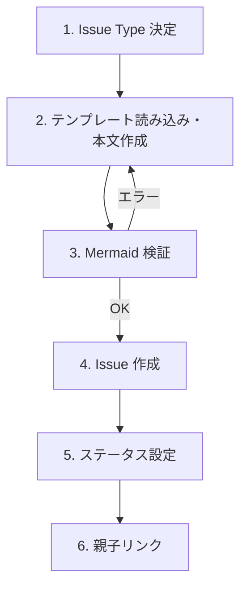

# Create Issue

GitHub Issue を作成する。Issue Type に応じたテンプレート適用、Mermaid 検証、ステータス設定、親子リンクを実行する。

**MANDATORY**: ステータス更新時は `.claude/skills/references/github-projects.md` を参照すること。

## When to Use

- Issue を新規作成するとき
- 他のアジャイルスキル（`/agile-epic`, `/agile-create-backlog`, `/agile-refine-implementation-plan`, `/agile-implementation-plan-to-task`）から呼び出されるとき

## When NOT to Use

- Issue の更新・編集（→ `issue_write` を直接使う）
- agile workflow 連携が不要で、軽く Issue を起票するだけのとき（→ `/create-issue` を使う）

## Workflow



---

## Step 1: Issue Type 決定

**他のスキルから呼び出された場合**: 文脈から Issue Type が確定しているため、確認不要でそのまま進む。

**単独で呼び出された場合**: ユーザーに Issue Type を聞く:
- 「どの種類の Issue を作成しますか？ Epic / Story / Implementation Plan / Task」

| Issue Type | テンプレート | 用途 |
|------------|------------|------|
| Epic | `.github/ISSUE_TEMPLATE/epic.md` | Opportunity Canvas によるプロダクト機会の定義 |
| Story | `.github/ISSUE_TEMPLATE/story.md` | ユーザーストーリー単位の要件定義 (What/Why) |
| Implementation Plan | `.github/ISSUE_TEMPLATE/implementation-plan.md` | Story の実装戦略 (How)。Story と並列の sub-issue として起票 |
| Task | `.github/ISSUE_TEMPLATE/task.md` | 1 PR 単位の実装作業 |

---

## Step 2: テンプレート読み込み・本文作成

### テンプレートの解決順序

該当 Issue Type のテンプレートを以下の順で探索する:

1. **リポジトリ設定を優先**: 利用先リポジトリの `.github/ISSUE_TEMPLATE/<type>.md`（`<type>` は `epic` / `story` / `implementation-plan` / `task`）が存在すれば、それを使う
2. **同梱デフォルトをフォールバック**: 1が無ければ、本スキル同梱の `templates/<type>.md`（このスキルディレクトリ内）を使う
3. **登録の確認**: 2を使った場合、Issue 作成完了後（Step 6 の後）にユーザーに確認する:
   - 「同梱テンプレートを `.github/ISSUE_TEMPLATE/<type>.md` としてリポジトリに登録しますか？」
   - Yes → 同梱テンプレを当該パスに書き出し、`git add` してコミットを案内する
   - No → そのまま続行（次回フォールバック使用時も毎回確認）

### 本文作成ルール

1. 解決したテンプレートを読み込む
2. テンプレートの**全セクションを必ず保持**し、埋められない箇所は `> TBD` で残す（セクションごと削除しない）
3. テンプレートに存在しないセクションを独自に追加しない
4. 本文を `/tmp/issue-body.md` に書き出す（CLI にインラインで markdown を渡すとエスケープが壊れるため、必ずファイル経由で渡す）

---

## Step 3: Mermaid 検証

本文に mermaid ブロックが含まれる場合、Issue 作成**前に**検証する:

```bash
cat /tmp/issue-body.md | node .claude/scripts/validate-mermaid.mjs
```

エラーがあれば mermaid 図を修正して再検証。

mermaid ブロックがない場合はスキップ。

---

## Step 4: Issue 作成

GitHub MCP の `issue_write` で Issue を作成する:

- `type`: Step 1 で決定した Issue Type（`"Epic"` / `"Story"` / `"Implementation Plan"` / `"Task"`）
- `title`: 呼び出し元スキルまたはユーザーが指定
- `body`: `/tmp/issue-body.md` の内容
- `labels`: 呼び出し元スキルが指定（例: `nature:implementable`, `nature:experimental`）

---

## Step 5: ステータス設定

作成後の Status を Issue Type に応じて設定する。`.claude/skills/references/github-projects.md` のコマンドテンプレートに従い更新。fallback もそちらに記載。

| Issue Type | 初期 Status |
|------------|------------|
| Story Issue | **In Planning** |
| Implementation Plan Issue | **In Code Review** (Refinement 完了済み内容で起票するためレビュー待ち) |
| Task Issue | **Ready** |
| Epic Issue | 設定不要 |

---

## Step 6: 親子リンク

呼び出し元スキルが親 Issue を指定している場合、GitHub MCP の `sub_issue_write` で `method: "add"` を指定して親子関係をリンクする。

| Issue Type | 親 | リンク方法 |
|------------|-----|----------|
| Story | Epic | Story を Epic の sub-issue に |
| Implementation Plan | Story | Implementation Plan を Story の sub-issue に (Task と並列で並ぶ) |
| Task | Story | Task を Story の sub-issue に (Implementation Plan と並列で並ぶ) |
| Epic | なし | リンク不要 |

---

## Step 7: 同梱テンプレート登録の確認（Step 2 でフォールバックを使った場合のみ）

Step 2 で同梱デフォルトテンプレートを使った場合、ここで初めて登録確認をユーザーに行う:

> 「リポジトリに `.github/ISSUE_TEMPLATE/<type>.md` がなかったため、同梱テンプレートを使いました。これをリポジトリに登録しますか？」

- **Yes** → 同梱テンプレ（`templates/<type>.md`）をプロジェクトの `.github/ISSUE_TEMPLATE/<type>.md` に書き出し、`git add .github/ISSUE_TEMPLATE/<type>.md` を実行してコミットコマンドを案内する
- **No** → 何もしない（次回フォールバック時も再度確認する）

---

## 決定境界

全体マップは `docs/agile-workflow/concepts/ai-decision-boundary.md`を参照。本スキル固有の人間承認ゲート:

- **Issue 起票実行** — Step 4 の `issue_write` 呼び出しは人間が「これで起票して」と承認した後
- **同梱フォールバックテンプレ登録確認** — Step 7 で `.github/ISSUE_TEMPLATE/<type>.md` への書き出しを行うかは人間判断（軽量版採用フローの一部）

NEVER（次節）はこのゲートの違反を具体的に列挙している。

---

## エッジケース

| 状況 | 対応 |
|------|------|
| リポジトリ・同梱とも `.github/ISSUE_TEMPLATE/<type>.md` も `templates/<type>.md` も見つからない | Issue Type の標準的な構造（Epic: Opportunity Canvas、Story: ユーザーストーリー形式、Implementation Plan: 戦略 + Task 分解 + 横断的判断、Task: 受入基準形式）で生成する旨を案内し続行 |
| Mermaid 検証スクリプトが見つからない | 警告を出して検証スキップ（Issue 作成は続行） |
| ステータス更新が失敗 | 手動更新を案内して続行（Issue 作成自体はブロックしない） |
| 親 Issue が指定されたが存在しない | ユーザーに確認して、リンクなしで作成するか中断するか判断 |
| 同梱テンプレ登録時に既に同名ファイルが存在 | 上書きするかをユーザーに確認 |

## NEVER — アンチパターン

- **絶対に** テンプレートのセクションを勝手に削除しない — 埋められなければ `> TBD` で残す。後工程（`/agile-refine-backlog`）で埋める前提
- **絶対に** Mermaid 検証をスキップして Issue を作成しない — GitHub 上でレンダリングエラーになり、読めない Issue が残る
- **絶対に** CLI にインラインで markdown を渡さない — エスケープが壊れる。必ず `/tmp/issue-body.md` 経由
- **絶対に** テンプレートにないセクションを追加しない — テンプレートの構造が崩れると後工程のスキルが正しく解析できなくなる

---

## References

このスキルが参考にしている書籍・記事・フレームワーク:

- 📦 [Scrum Guide Expansion Pack](https://scrumexpansion.org/) — AI and Scrum（決定境界: Issue 起票実行は人間判断）
