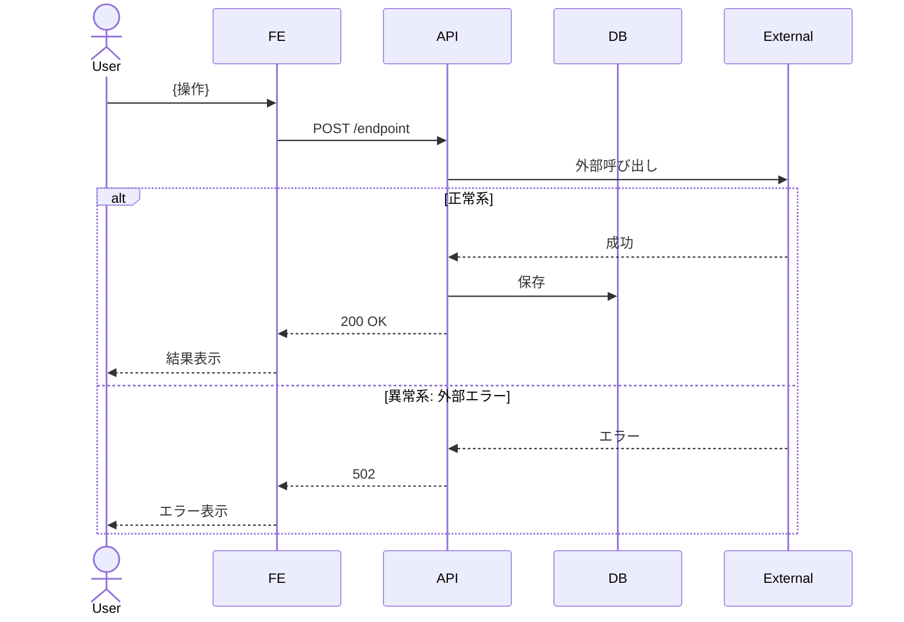
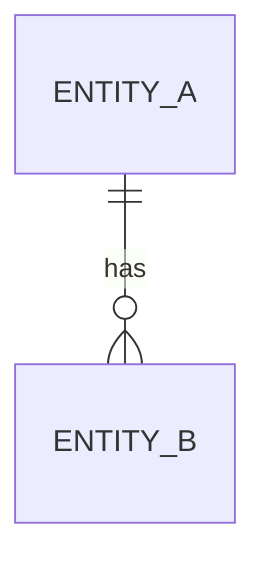
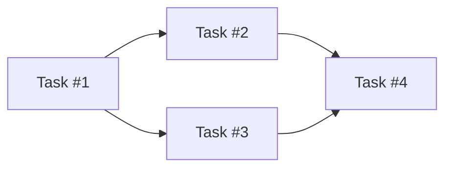

## {Implementation Plan タイトル} — for Story #{N}

> 親 Story: #{N}
> 最終更新: {YYYY-MM-DD}

<!-- Story と並列の sub-issue として起票する。Status は Task と同じ 4 Status (Ready / In Coding Progress / In Code Review / Done) を使い、起票時は In Code Review (Refinement 完了済みのため) -->

### 全体方針 (Strategy)

> TBD（agile-refine-implementation-plan で記入）

<!-- 3-5 行で実装の全体方針、アーキ判断、ライブラリ選定方針 -->
<!-- 「Schema First」「外部依存は新規 service ラッパーに分離」など、Task をまたがる判断を書く -->

### 技術詳細シーケンス図

> TBD（Story の概念フロー図より詳細な、実装視点のシーケンス）

<!-- API 呼び出し詳細、データフロー、内部処理、エラーハンドリングまで踏み込む -->
<!-- alt/opt で正常系/異常系を統合 -->



### API 仕様詳細

> TBD

<!-- 各エンドポイントについて以下のテーブルを記入 -->

#### {エンドポイント名}

| 項目 | 内容 |
|------|------|
| エンドポイント | |
| メソッド | |
| リクエスト | |
| レスポンス | |
| 認証・認可 | |
| バリデーション | |
| エラーレスポンス | |

### データモデル

> TBD（必要なら ER 図 / 型定義）



または型定義:

```typescript
interface ExampleType {
  // ...
}
```

### 画面詳細仕様

> TBD（画面が複数あれば「#### {画面名}」セクションを繰り返す）

#### {画面名}

| 項目 | 内容 |
|------|------|
| DOM 構造 | |
| 状態管理 | |
| コンポーネント分割 | |
| デザインリンク | |

### ロギング実装

> TBD（Story の Outcome Done「観測手段」と整合させること）

| インタラクション | 収集方法 | イベント名 | 備考 |
|-----------------|---------|-----------|------|
| | GA自動収集 / GA推奨 / カスタム / 不要 | | |

<!-- GA 自動収集 / GA 推奨イベント / カスタムイベント / ロギング不要 のいずれか -->
<!-- Story の Outcome Done テーブルの「観測手段」欄と矛盾していないか確認 -->

### テスト戦略

> TBD（ユニット / 統合 / E2E の配分と方針）

| 種別 | 範囲 | モック方針 | 配分目安 |
|------|------|-----------|---------|
| ユニット | | | XX% |
| 統合 | | | XX% |
| E2E | | | XX% |

### Task 分解 (PR 計画)

> TBD（後段 /agile-implementation-plan-to-task の入力になる）

<!-- 1 Task = 1 PR、半日〜2日 -->
<!-- 分割パターンと個数目安は team-context.json の「タスク分割単位」に従う -->
<!--   USE_CASE: 3-6 個 / LAYER: 4-8 個 / COMPONENT: 3-7 個 / VERTICAL_SLICE: 5-10 個 -->
<!-- Infra 改修は team-context.json の「基盤・インフラ系改修の扱い」で INLINE / SEPARATE_PR を判断 -->
<!-- 10 個超えたら Story 自体を分割すべき兆候 -->

| # | Task タイトル | スコープ | 依存 | 想定 PR 数 |
|---|--------------|---------|------|----------|
| 1 | | | なし | 1 |
| 2 | | | #1 | 1 |



### 横断的判断

> TBD

- **セキュリティ**: {認証認可、データ保護、入力検証等}
- **パフォーマンス**: {p95 レイテンシ目標、負荷想定、最適化方針}
- **リトライ / フォールバック**: {外部依存への対応}
- **運用 (ログ・監視・アラート)**: {SRE 観点}

### 意図的に扱わないこと

> TBD（「ついで対応」を防ぐ明示的な除外項目）

<!-- 実装中の「ついで」修正を防ぐためのスコープ管理 -->
<!-- 例: 「Redis 永続化はしない、MVP は in-memory」 -->
<!-- 例: 「キャッシング層は Outcome 検証後に再評価」 -->

- {除外項目 1}

### 未解決の質問

> TBD（Implementation Plan Refinement で発見、解決待ち）

<!-- 解決できない論点は質問として記録 -->

- {質問 1: 例: 「Vision API の月額予算上限は?」}
