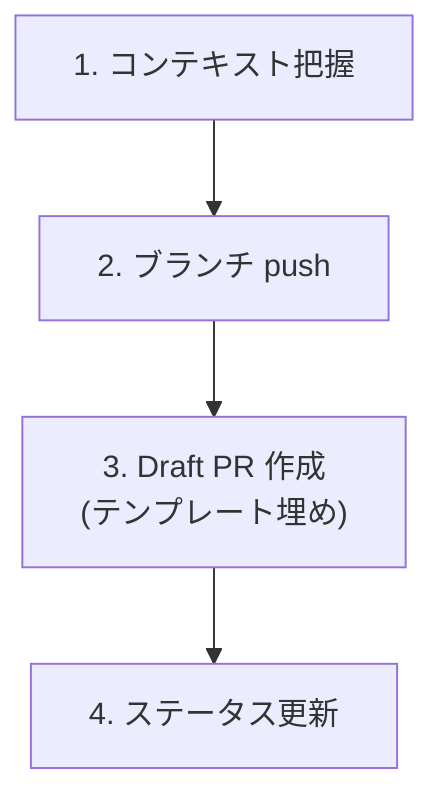

# Create Pull Request

実装済みの変更から Draft PR を作成する。

**MANDATORY**: ステータス更新時は `.claude/skills/references/github-projects.md` を参照すること。

## When to Use

- 実装が完了し PR を作成するとき
- 「PR 作って」「プルリク出して」と指示されたとき
- `/agile-task-implementation` の Step 6 から呼び出されたとき

## When NOT to Use

- まだ実装が途中のとき（先に実装を完了させる）
- テストが通っていないとき（先に検証を完了させる）

## Workflow

---

## Step 1: コンテキスト把握

PR に必要な情報を収集する:

- **対応する Task Issue** — ユーザーが指定、または現在のブランチ名・コミット履歴から推定
- **変更内容** — `git diff main...HEAD` と `git log main..HEAD --oneline` で把握
- **テスト結果** — 直近のテスト実行結果を確認。未実行ならプロジェクトの CLAUDE.md（モノレポなら `apps/*/CLAUDE.md` 等）に従い実行

---

## Step 2: ブランチ push

未 push のコミットがあれば push する。

---

## Step 3: Draft PR 作成

### テンプレートの解決順序

PR 本文のテンプレートを以下の順で探索する:

1. **リポジトリ設定を優先**: 利用先リポジトリの `.github/pull_request_template.md` が存在すれば、それを使う
2. **同梱デフォルトをフォールバック**: 1が無ければ、本スキル同梱の `templates/pull_request_template.md` を使う
3. **登録の確認**: 2を使った場合、PR 作成完了後（Step 4 の後）にユーザーに確認する:
   - 「同梱テンプレートを `.github/pull_request_template.md` としてリポジトリに登録しますか？」
   - Yes → 同梱テンプレを当該パスに書き出し、`git add` してコミットを案内する
   - No → そのまま続行（次回フォールバック使用時も毎回確認）

### 本文作成と PR 作成

解決したテンプレートに従い本文を埋め、`/tmp/pr-body.md` に書き出してから `gh pr create --draft --body-file /tmp/pr-body.md` で Draft PR を作成する。**CLI にインラインで markdown を渡すとエスケープが壊れるため、必ずファイル経由で渡すこと。**

### テンプレートの埋め方

| セクション | 埋め方 |
|-----------|--------|
| **PR タイトル** | Task Issue のタイトルをベースに、実装内容がわかる簡潔な形にする |
| **概要** | 何を実装したかを1-2文で。技術的な「どう」ではなく「何が変わったか」 |
| **Issues** | 対応する Issue がある場合のみ `Closes #XX` で記載。関連性がないなら空欄にせず「なし」と書く |
| **実装サマリー** | 変更内容を箇条書き。コミット単位ではなく機能単位で整理 |
| **自動テスト** | 追加・変更したテストケースを列挙 |
| **手動確認** | Task Issue のテスト設計「受入確認」セクションから転記 |

### PR 本文の品質基準

- **タイトルは70文字以内** — GitHub の一覧で切れないように
- **実装概要はレビュワーの最初の30秒を助ける** — diff を開く前に全体像がわかること
- **サマリーは diff の読み順ガイド** — どこから読めばいいかレビュワーが判断できること

---

## Step 4: ステータス更新

対応する Task Issue の Status を **"In Code Review"** に更新する。`.claude/skills/references/github-projects.md` のコマンドテンプレートに従い更新。

---

## Step 5: 同梱テンプレート登録の確認（Step 3 でフォールバックを使った場合のみ）

Step 3 で同梱デフォルトテンプレートを使った場合、ここで初めて登録確認をユーザーに行う:

> 「リポジトリに `.github/pull_request_template.md` がなかったため、同梱テンプレートを使いました。これをリポジトリに登録しますか？」

- **Yes** → 同梱テンプレ（`templates/pull_request_template.md`）をプロジェクトの `.github/pull_request_template.md` に書き出し、`git add` を実行してコミットコマンドを案内する
- **No** → 何もしない（次回フォールバック時も再度確認する）

---

## 決定境界

全体マップは `docs/agile-workflow/concepts/ai-decision-boundary.md`を参照。本スキル固有の人間承認ゲート:

- **Draft → Ready 切り替え** — Release 判断。AI は明示指示なしに `--draft` を外さない（既存運用と一致）
- **マージ** — 本スキルの責務外。マージは常に人間判断
- **Closes #N の追記** — 自動推測しない。Issue 紐付けはユーザーが Issue 番号を明示した場合のみ

NEVER（次節）はこのゲートの違反を具体的に列挙している。

---

## エッジケース

| 状況 | 対応 |
|------|------|
| Task Issue が特定できない | ユーザーに Issue 番号を聞く |
| テストが通っていない | PR 作成前にテスト実行を促す |
| 既に同じブランチの PR が存在 | 既存 PR を更新（`gh pr edit`）するか確認 |
| main との conflict がある | ユーザーに報告し、rebase/merge の判断を仰ぐ |
| リポジトリ・同梱とも PR テンプレートが見つからない | 汎用構造（概要 / Issues / 実装サマリー / 自動テスト / 手動確認）で生成する旨を案内し続行 |
| 同梱テンプレ登録時に既に同名ファイルが存在 | 上書きするかをユーザーに確認 |
## NEVER — アンチパターン

- **絶対に** テスト未実行で PR を出さない — CI 失敗が確定している PR はレビュワーの時間を奪う
- **絶対に** テンプレートのセクションを空欄で残さない — 該当なしなら「なし」と明記。空欄はレビュワーに「書き忘れか意図的か」を判断させる

---

## References

このスキルが参考にしている書籍・記事・フレームワーク:

- 📦 [Scrum Guide Expansion Pack](https://scrumexpansion.org/) — AI and Scrum（決定境界: Draft → Ready 切り替え / マージは人間判断）

スキル横断で効いているソースは [docs/agile-workflow/references.md](../../docs/agile-workflow/references.md) を参照。
