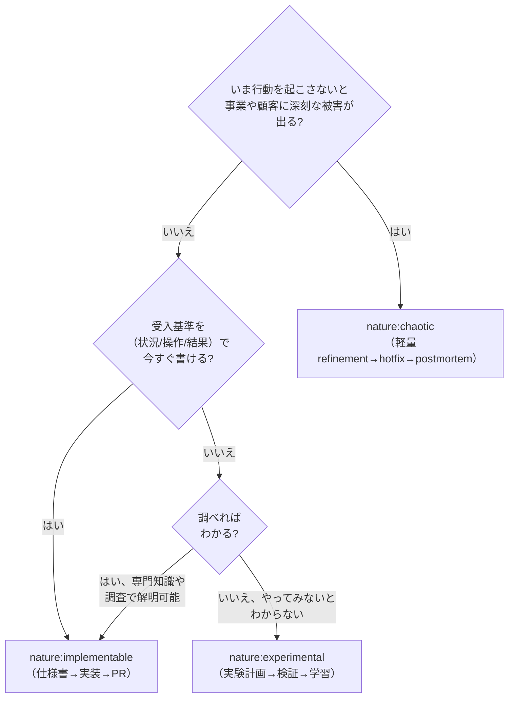

# Cynefin ドメイン分類ガイド

## 判断の核心

「因果関係が事前にわかるか?」が唯一の判断基準。技術的な難易度ではない。

## ドメイン定義と分類例

### Clear（明白）→ `nature:implementable`

因果関係が誰にとっても明白。ベストプラクティスが確立されている。

**ソフトウェア開発での例**:
- CRUD 操作の実装
- 既存パターンに沿ったフォーム画面
- 標準的な認証フロー（OAuth, JWT）
- 既知のライブラリを使った機能追加

### Complicated（煩雑）→ `nature:implementable`

因果関係は分析や専門知識で解明できる。グッドプラクティスが複数存在する。

**ソフトウェア開発での例**:
- パフォーマンス最適化（計測→分析→改善のサイクルで解決可能）
- 外部 API との複雑な連携（仕様書を読めば設計できる）
- データベーススキーマの設計（正規化の理論で判断可能）
- セキュリティ要件の実装（OWASP 等のガイドラインに従える）

### Complex（複雑）→ `nature:experimental`

因果関係は事後にしか見えない。「やってみないとわからない」領域。

**ソフトウェア開発での例**:
- 「ユーザーがこの UI を直感的に使えるか?」→ プロトタイプで検証が必要
- 「この機能にユーザーは課金してくれるか?」→ MVP で市場反応を見る必要
- 「このアルゴリズムで十分な精度が出るか?」→ スパイクで実験が必要
- 「この技術スタックでスケールするか?」→ PoC で負荷テストが必要
- 「チームがこのワークフローを受け入れるか?」→ パイロット運用が必要

### Chaotic（混沌）→ `nature:chaotic`

因果関係を分析する時間的余裕がない。即時対応が求められる。Cynefin の Chaotic ドメインでは `act → sense → respond`（行動 → 観測 → 応答）が原則で、仕様の言語化（sense → categorize → respond）を待たずに行動して安定化を試みる。

**ソフトウェア開発での例**:
- 本番サービス停止 / 重大障害（決済が通らない、ログインできない）
- セキュリティインシデント（漏洩、不正アクセスの進行中）
- データ損失 / 破損（顧客データの整合性が崩れている）
- 規制対応の緊急依頼（法令施行日まで時間がない）

**Chaotic と判定したら**:
1. `agile-create-stories` で `nature:chaotic` ラベル付きで起票
2. `agile-refine-story` の **軽量フロー**（受入基準のみ）を通す。シーケンス図・Outcome Done・Example Mapping はスキップ可
3. `agile-task-implementation` で hotfix 実装（TDD は妥協しない — 安定化後に必ずテスト追加）
4. 安定化後、別 Issue で **postmortem** を記録: なぜ Chaotic に至ったか、再発防止策、追加テスト

**Chaotic と Complex の違い**:
- Complex: 「やってみないとわからない、検証する時間はある」 → 実験計画
- Chaotic: 「やってみないと**もわからない、検証する時間もない**」 → 即行動

**よくある誤判断**:
- 「複雑だから Complex」と分類して悠長に実験計画を立てる → 被害拡大
- 「とりあえず後で修正でいいや」と Clear 扱い → 同じ事故が再発
- 「単に急ぎだから Chaotic」と濫用 → 通常の急ぎ案件は Complicated → implementable で対応する。Chaotic は事業継続が損なわれる切迫した状況のみ

## 判定フローチャート



## experimental ストーリーの後続フロー

```
experimental Story
  → /agile-refine-story で実験計画を設計
  → 人間が実験を実施（スパイク/プロトタイプ/ユーザーテスト）
  → 結果を評価
  → 成功: 新たな implementable Story を生成
  → 失敗: ピボットまたは破棄
```

## よくある誤分類

| 誤分類 | 正しい分類 | 理由 |
|--------|-----------|------|
| 「難しいから experimental」 | Complicated → implementable | 難易度が高くても、専門知識で解決可能なら implementable |
| 「簡単だから implementable」 | Complex → experimental | 実装は簡単でも「ユーザーが使うか」が不明なら experimental |
| 「前例がないから experimental」 | Complicated → implementable | 自チームに前例がなくても、業界に確立されたパターンがあれば implementable |
| 「単に急ぎだから chaotic」 | Complicated → implementable | 急ぎでも事業継続が損なわれるレベルでなければ通常フロー。chaotic 濫用は軽量フローの濫用に直結 |
| 「複雑そうだから chaotic」 | Complex → experimental | 複雑なだけで時間がある状況は Complex。実験計画を組む余裕があるかで判別 |
