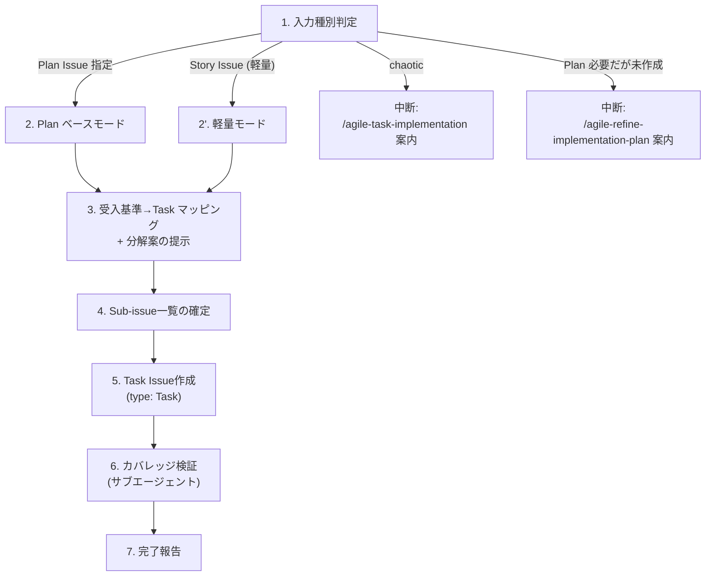

# Agile Implementation Plan to Task

Refinement 完了済みの Implementation Plan Issue から Task Sub-issue を起票する。Plan の「Task 分解計画」セクションを踏襲して Task を作る。Plan 不要の軽量 Story では Story から直接 Task 起票する軽量モードも対応。

## When to Use

- Implementation Plan Issue が Done になり、Task Sub-issue を起票するとき
- 軽量パス (Plan 不要) の Story から直接 Task を起票するとき
- `/agile-implementation-plan-to-task` で手動実行

## When NOT to Use

- Plan も Story も未 Refined（→ `/agile-refine-backlog` または `/agile-refine-implementation-plan`）
- Epic を Story に分解したい（→ `/agile-create-backlog`）
- `nature:chaotic` Story → Task 分解不要、`/agile-task-implementation` 直行
- 1 PR で完結する小さな Story → Sub-issue は不要、チェックリストで十分 (= 軽量パス)

## コーチングの原則

- **「何を成立させるか」で切れ** — 「frontend/backend/infra」を固定テンプレにしない。まず「何を成立させるタスクか」で切り、結果としてレイヤーに分かれるならOK
- **親の受入基準とのマッピングを先に考えろ** — 分解を始める前に、親 Story の受入基準を 1つずつ見て「この受入基準はどの Task でカバーされるか」をマッピングする。マッピングできない受入基準があれば分解軸が間違っている
- テンプレの質問で詰まったら **GROW モデル** （Goal → Reality → Options → Will）の順で問いを組み立て直す

## Workflow



---

## Step 1: 入力種別判定 + Plan 必要性判定

入力に応じて分岐する。判定基準は `docs/agile-workflow/concepts/implementation-plan.md` を参照。

### 入力種別の判定

| 入力 | 判定 | 動作 |
|------|------|------|
| **Plan Issue 番号指定** | Plan ベースモード | Step 2 へ進む (Plan の Task 分解計画を踏襲) |
| **Story Issue だけ指定 + nature:chaotic** | 中断 | 「Task 分解不要。`/agile-task-implementation` 直行を案内」 |
| **Story Issue だけ指定 + Plan 必要パス** | 中断 | 「先に `/agile-refine-implementation-plan` を呼んでください」 |
| **Story Issue だけ指定 + 軽量パス** | 軽量モード | Step 2' へ進む (Story から直接 Task 起票) |

### Plan 必要性の判定 (Story Issue だけ指定の場合)

`team-context.md` の閾値を参照:

- `nature:experimental` → Plan 必要
- `nature:implementable` で「想定 Task が閾値超え or 横断的判断あり」→ Plan 必要
- それ以外 → 軽量パス (Story 入力モード で続行)

人間承認ゲート: 判定結果をユーザーに提示し、確認を得てから進む。

---

## Step 2: Plan ベースモードでの Task 起票

GitHub MCP の `issue_read` で **Plan Issue** を読み込み、本文の「Task 分解 (PR 計画)」セクションを抽出。

Plan に書かれた Task 一覧をそのまま起票候補とする。Plan の Task ごとに以下を確認:

- タイトル (Plan の Task テーブルから取得)
- スコープ (Plan のスコープ列)
- 依存関係 (Plan の依存列)
- カバーする受入基準 (Plan の Strategy / 受入基準マッピングから推定)

Plan の Task が 10 個超えていたら Plan 自体に問題がある (`/agile-refine-implementation-plan` での見直しを案内)。

---

## Step 2': 軽量モードでの Task 起票

Story Issue を読み込み、Plan なしで Task を起票する。

**軽量モードの想定**:
- Task 数 1-2 個 (軽量プリセットなら 3 個まで許可)
- 横断的判断なし
- アーキ選択肢が決まっている

### team-context.md の分割設定を読み込む

`~/.claude/skills/references/team-context.md`（または利用先プロジェクトの `.claude/skills/references/team-context.md`）から以下を取得:

- `機能実装の分割パターン`: `USE_CASE` / `LAYER` / `COMPONENT` / `VERTICAL_SLICE` / `CUSTOM`
- `基盤・インフラ系改修の扱い`: `INLINE` / `SEPARATE_PR` / `N_A`
- `Task 1 個 = 何か（人間語）`: 自由記述例

未配置なら `USE_CASE` + `INLINE` をデフォルトとして仮定。

**親の受入基準を 1つずつ見て、どの Task でカバーするかをマッピングする。** 切り方は分割パターンに従う:

| 分割パターン | 軽量モードでの切り方 |
|---|---|
| `USE_CASE` | 受入基準を 1-3 ユースケースにグルーピング → 各ユースケース = 1 Task (BE+FE 統合) |
| `LAYER` | BE 担当 Task / FE 担当 Task に分割。リポジトリごとに別 Task |
| `COMPONENT` | 触るコンポーネント / サービスごとに 1 Task |
| `VERTICAL_SLICE` | 受入基準のスライス（バリデーション、エラー処理、UI 状態など）ごとに 1 Task |
| `CUSTOM` | team-context の自由記述例を踏襲 |

### Infra 系改修の扱い

team-context の `基盤・インフラ系改修の扱い` に従う:

- `INLINE`: 機能 Task に統合
- `SEPARATE_PR`: DB migration / Terraform / IAM の変更が必要なら独立 Task として切る (`[Migration]` / `[Infra]` prefix)
- `N_A`: Infra 系の改修が出てきたら Story 自体を見直すサイン → 中断

軽量モードで Task が 3 個超えそうなら、「これは Plan 作成パスにすべきです」と提案し中断、`/agile-refine-implementation-plan` を案内する。

---

## Step 3: 受入基準→Task マッピング + 分解案の提示

**入力モード別の分解出発点**:

- **Plan ベースモード**: Plan の「Task 分解 (PR 計画)」セクションを起点に、各 Task が親 Story のどの受入基準をカバーするかをマッピング
- **軽量モード**: 親 Story の受入基準を 1つずつ見て、どの Task でカバーするかを直接マッピング

| 分解の起点 | 切り方 |
|-----------|--------|
| Plan あり | Plan の Task 分解計画を踏襲 (Plan で確定済み) |
| Plan なし軽量モード | Step 2' で読み込んだ team-context の分割パターンに従う (USE_CASE / LAYER / COMPONENT / VERTICAL_SLICE) |
| Plan なし軽量モード + Infra 変更必要 + `SEPARATE_PR` 設定 | [Migration] / [Infra] を独立 Task として切る。複雑になりすぎなら Plan 作成パスに引き戻す |
| Outcome Done に観測指標がある | 上記に加えて [Telemetry] Task を分解末尾に追加（粒度は独立 Sub-issue / 既存 Task に統合のどちらでも可） |

**Sub-issue にすべきかの判断:**
- ① 担当者・レビュー・blocked状態を持たせる価値があるか
- ② 独立して完了条件を書けるか
- ③ レビュー単位として意味があるか
- 3つとも Yes なら Sub-issue。そうでなければチェックリストで十分

**粒度:** 1 Task = 1 PR、半日〜2日。team-context の分割パターンに応じた個数目安（USE_CASE: 3-6 / LAYER: 4-8 / COMPONENT: 3-7 / VERTICAL_SLICE: 5-10）。10超えたら Story 自体を分割すべき。

分解軸が明確なら単案で提示。迷う場合は2-3パターンを提示する。

## Step 4: Sub-issue一覧の確定

以下の形式で一覧を提示して承認を得る。

| # | タイトル | 依存 | カバーする受入基準 |
|---|---|---|---|
| 1 | [Schema] APIスキーマ定義 | なし | — |
| 2 | [BE] エンドポイント実装 | #1 | AC1, AC3 |
| 3 | [FE] フォーム画面実装 | #1 | AC2, AC4 |
| 4 | [Test] E2Eテスト | #2, #3 | AC1〜AC4 |
| 5 | [Telemetry] 観測イベント追加と確認 | #2, #3 | Outcome Done の観測指標 |

**タイトル:** `[軸] 動詞 + 対象`。軸はレイヤーに限らない（`[Flow]`, `[Validation]`, `[Migration]`, `[Telemetry]` 等もOK）。親 Story のタイトルを繰り返さない。

## Step 5: Task Issue作成 + 品質スコアリング

**MANDATORY** : Task テンプレートを次の順で解決し、本文出力に使う:

1. リポジトリ側 `.github/ISSUE_TEMPLATE/task.md` を最優先
2. 無ければ本スキル同梱の `templates/task.md` をフォールバック

テンプレートの全セクションを保持し、独自セクションを追加しない。テンプレート解決・登録確認は `/agile-create-issue` 委譲時に処理されるため、本ステップでは構造把握として読み込むのみ。

**Do NOT Load**: Step 3 の分解検討フェーズではテンプレートを読むな。分解の思考がテンプレートの枠に引きずられることを防ぐ。

**Issue Type**: `type: "Task"` を指定。

**各 Task の本文を作成したら、Issue に書き込む前に以下の 7 点スコアリングで品質チェックする:**

| # | 観点 | 合格基準 |
|---|------|---------|
| 1 | **概要の具体性** | 何をするかが1〜2文で明確。スコープの境界がわかる |
| 2 | **振る舞い仕様の網羅性** | 親 Story の受入基準（正常系・異常系）から、この Task に関連する振る舞いが漏れなく抜粋・具体化されている |
| 3 | **完了条件の判定可能性** | 「振る舞い仕様の全行が実装されている」「CI green」を含み、Yes/No で判定可能 |
| 4 | **テストピラミッドの設計** | ユニットテストが大部分を占め、統合テストは外部依存がある場合のみ、E2E は最小限という構成になっている |
| 5 | **受入確認の明示** | PdO/QA が手動で確認するシナリオが書かれている（自動テストでカバーしにくい UI・文言・操作感等） |
| 6 | **親の受入基準との対応** | カバーする受入基準が明示され、この Task の存在理由が明確 |
| 7 | **着手可能性** | 対象モジュール・参考実装・ADR が明記され、CodingAgent が「どこから手をつけるか」迷わない |
| 8 | **Outcome Done の観測保証** | 親 Story の Outcome Done に観測指標がある場合、その観測手段（イベント追加・ダッシュボード作成・ログ送信）が Task として明示されている。「観測しない」と明示されている Story は対象外（観点スキップ可） |

**8 点中 7 点以上で合格。6 点以下は書き直し。** ユーザーに各 Task のスコアを提示して承認を得てから Issue を作成する。

**作成手順:**
`/agile-create-issue` スキルに委譲する。Issue Type: `"Task"`、親 Issue: 対象の Story Issue を指定。テンプレート解決・登録確認・親子リンクは `/agile-create-issue` が処理する。

### 親 Story の Status 自動更新 (初回のみ)

**最初の Task Issue 起票完了後**、親 Story の Status を確認して必要なら遷移させる:

| 現在の親 Story Status | 処理 |
|---|---|
| `Ready` | `In Coding Progress` に更新 (最初の Task が作成された = 実装フェーズ入り) |
| `In Coding Progress` | スキップ (Plan 経由で既に遷移済み / 2 回目以降の Task 起票) |
| `In Code Review` / `Done` | 何もしない (異常ケース、警告のみ) |

複数 Task をまとめて起票する場合も Status 更新コマンドは 1 回だけ実行する。一度 `Ready` → `In Coding Progress` に遷移したら以降の Task 起票では再度の更新は不要。

更新コマンドは `.claude/skills/references/github-projects.md` のテンプレートに従う。失敗時はリトライ 1 回、それでも失敗すれば手動更新を案内して作業継続。

## Step 6: カバレッジ検証（サブエージェント）

**サブエージェントを起動**し、親の受入基準カバレッジと各 Task の品質を検証する。

**サブエージェントへの指示:**
```
親 Story Issue と作成した Task Sub-issue 一覧を読み、検証してください。

検査観点:
1. 親 Story の全受入基準（正常系・異常系）が、いずれかの Task の振る舞い仕様でカバーされているか
2. どの受入基準もカバーしていない Task がないか（スコープ外の混入）
3. Task 間の依存関係に循環がないか
4. 各 Task の振る舞い仕様に、CodingAgent が TDD を開始できるだけの具体性があるか
5. テスト設計がテストピラミッドに沿っているか（ユニットテスト中心、E2E 最小限）
6. 手動の受入確認シナリオが書かれているか
7. Outcome Done の観測保証: 親 Story の Outcome Done に観測指標がある場合、その実装 Task（イベント追加 / ダッシュボード作成 / ログ送信）が存在しているか。「観測しない」が明示されている Story はこの観点は対象外

未カバーの受入基準 / 情報不足の Task / 観測実装の欠落があれば報告。
```

**結果に基づく対応:**
- 未カバーの受入基準 → 追加 Task を提案
- Task の関連仕様が不足 → 親 Story から該当仕様を抜粋して補完
- 受入基準が曖昧で落とせない → `/agile-refine-backlog` に差し戻し提案
- 全受入基準カバー + 全 Task 品質合格 → Step 7 へ

## Step 7: 完了報告

| # | タイトル | Issue | 依存 |
|---|---|---|---|
| 1 | [Schema] APIスキーマ定義 | owner/repo#XX | なし |
| 2 | [BE] エンドポイント実装 | owner/repo#XX | #1 |

完了報告には親 Story の Status 更新結果も含める。例:
```
✓ Task 起票完了: #X1, #X2, ...
✓ 親 Story #N: Status を In Coding Progress に更新 (初回 Task 起票のため)
```

---

## 決定境界

全体マップは `docs/agile-workflow/concepts/ai-decision-boundary.md`を参照。本スキル固有の人間承認ゲート:

- **分解粒度の確定** — Step 5 の 7 点品質スコアリング後、各 Task の採否は人間
- **テスト戦略選択** — ユニット / 統合 / E2E の配分は人間判断（テストピラミッドの解釈）
- **Task 起票実行** — `/agile-create-issue` への委譲前の最終確認

NEVER（次節）はこのゲートの違反を具体的に列挙している。

---

## エッジケース

| 状況 | 対応 |
|------|------|
| 親 Story の受入基準が TBD | `/agile-refine-backlog` に誘導 |
| Sub-issue が 10 個以上 | Story の分割を提案 |
| 1 PR で完結する小さな Story | Sub-issue 不要、チェックリストで十分と案内 |
| 1つの受入基準を複数 Task が部分カバー | 各 Task の完了条件に担当範囲を明示し、合算で受入基準を満たすことを検証 |
| MCP ツール利用不可 | 一覧と本文テンプレをユーザーに提示し作成を委ねる |

## NEVER — アンチパターン

- **NEVER: 技術レイヤーで固定的に切るな** — 「何を成立させるか」で切り、結果としてレイヤーに分かれるのは OK
- **NEVER: 親の受入基準をそのままコピーするな** — Task の完了条件は実装視点で書き直す。コピーすると「何をテストすれば閉じてよいか」が曖昧になる
- **NEVER: 単なる作業メモを Sub-issue にするな** — 独立してレビューできない作業はチェックリストで十分
- **NEVER: カバレッジ検証を省略するな** — 全 Task 完了しても親の受入基準が満たせない事態を防ぐ唯一の手段
- **NEVER: Plan を作るべき複雑度の Story を軽量モードで強引に処理するな** — Task 数が想定より増えそうなら中断し、`/agile-refine-implementation-plan` を案内する
- **NEVER: Plan ベースモードで Plan の Task 分解計画を勝手に書き換えるな** — Plan が確定済みの分解計画は踏襲する。変更が必要なら Plan を再 Refinement する

---

## References

このスキルが参考にしている書籍・記事・フレームワーク:

- 🌐 [Agile Story Essentials](https://www.jpattonassociates.com/wp-content/uploads/2015/03/story_essentials_quickref.pdf)（Jeff Patton, PDF）— INVEST・Task 分解粒度
- 📖 [アジャイル型プロジェクトマネジメント](https://www.amazon.co.jp/s?k=アジャイル型プロジェクトマネジメント)（Jim Highsmith）— Task 設計
- 📦 [Scrum Guide Expansion Pack](https://scrumexpansion.org/) — Holistic Testing Observe 段階（Telemetry Task 必須化、品質スコアリング #8）
