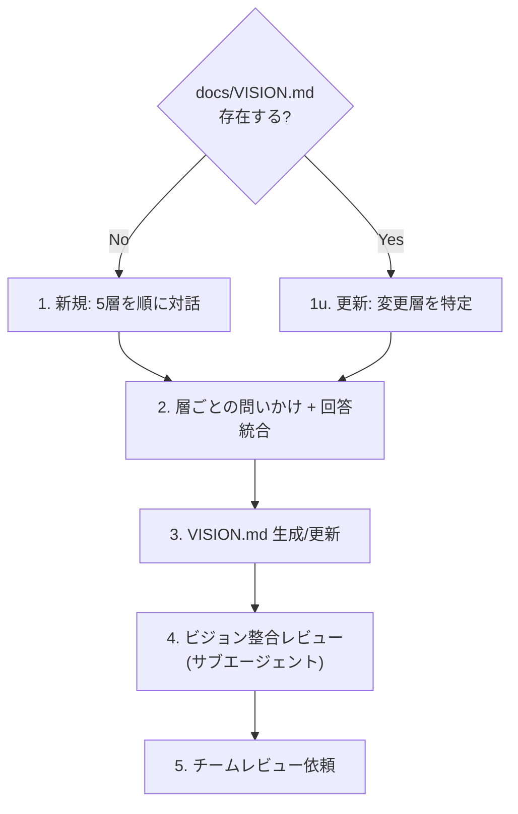

# Agile Product Vision

docs/VISION.md を対話的に作成・更新し、チームの前提認知を揃える。

## When to Use

- プロダクトの方向性を初めて定義するとき（新規作成）
- 状況変化に応じてビジョンを見直すとき（更新）
- チーム内で前提認知のズレを感じたとき
- `/agile-product-vision` で手動実行

## When NOT to Use

- Epic/Featureの具体的な定義（→ `/agile-epic`）
- バックログのStory分解（→ `/agile-create-backlog`）

## コーチングの原則

- **答えを書くな、問いを投げろ** — エージェントが勝手にビジョンを創作するとチームのオーナーシップが失われる。対話で引き出し、統合して文書化する
- **TBDは正当** — 「まだわからない」を `> TBD: {なぜ未定か・いつ決めるか}` として残す。無理に埋めると根拠のない記述が混入し「誰がこれ決めたの?」問題を起こす
- **1セッション30-60分** — 超えると集中力が切れ「全部大事」症候群に陥る。終わらなければ次回に分割
- テンプレの質問で詰まったら **GROW モデル** （Goal → Reality → Options → Will）の順で問いを組み立て直す

## Workflow



### モード判定

- **新規作成**: `docs/VISION.md` が存在しない、または空 → 5層すべてを順に対話
- **更新**: 既存VISION.mdを読み込み → ユーザーに「どの層を見直したいか」を確認 → 該当層のみ対話

---

## 5層構造 — 対話ガイド

各層は独立した関心事。上の層ほど変わりにくく、下の層ほど状況に応じて変わる。副業チームでは **Layer 3（Not-to-doリスト）が最も価値が高い** — スコープを絞る合意がないと稼働時間が分散する。

### Layer 1: Why — なぜ作るのか

| セクション | 問いかけ | 副業チームでの判断基準 |
|-----------|---------|---------------------|
| ミッション | 「このプロダクトが消えたら誰が困る? 既存ツールでは何が足りない?」「2-5 年後に振り返ったとき、このプロダクトは『何を成し遂げた』と語られたいか?（**Intent**: 戦略の継続性を確認）」 | 「なぜ」を3回繰り返して本質に迫る。「私たちは〇〇のために存在する」の一文に凝縮。Intent の問いで「短期的に流行りの機能 = ミッション」と混同していないか自己検査する |
| エレベーターピッチ | 「技術を知らない人に30秒で説明するなら?」 | テンプレ: [対象]にとっての[課題]を解決する[製品名]は、[代替手段]と違い[差別化要因]を提供する |
| ビジョンステートメント | 「2-5年後、成功したらユーザーは何を"もうやらなくて済む"か?」 | 1ページ以内。仕様書ではなく北極星。チームが詳細を補える余白を残す |

### Layer 2: Who — 誰のためか

| セクション | 問いかけ | 副業チームでの判断基準 |
|-----------|---------|---------------------|
| ペルソナ | 「最も恩恵を受ける人の典型的な1日は? 一番ストレスの瞬間は?」 | 1-2ペルソナに絞る。「この情報で設計が変わるか?」にNoなら削る |
| ステークホルダーマップ | 「開発チーム以外で味方は? 説得が必要な人は?」 | 助けを求める前から知り合いになっておく |

### Layer 3: What — 何を作り、何を作らないか

| セクション | 問いかけ | 副業チームでの判断基準 |
|-----------|---------|---------------------|
| 課題と現在の解決策 | 「ユーザーは今どう解決してる? 独自のワークアラウンドは?」 | ワークアラウンドがあるなら価値のヒント。何もしていないなら問題が小さい可能性 |
| Not-to-doリスト | 「やること / やらないこと / あとで決める、を3列で」 | **最重要セクション**。「あとで決める」欄を必ず設ける。惜しいものは「あったらいいな」か「必要」かを問う |
| 成功指標（Outcome 仮説） | 「何が測れたら成功? 初期の最低限と将来の本格的成功は?」「指標が動いたら、その因果を何で説明する仮説を持っているか?」「観測手段（既存計測 / 追加実装）はあるか?」 | 段階的に基準を上げてよい。行動ベースの指標を優先。**指標 / 仮説（X→Y）/ 観測手段 / 観測期間** の 4 点セットで記述（観測手段がない指標は仮説として無効）。観測コストが見合わないなら `> 観測しない（理由: ...）` で残してよい |

### Layer 4: How — どう実現するか

| セクション | 問いかけ | 副業チームでの判断基準 |
|-----------|---------|---------------------|
| ソリューション概要 | 「技術的な方向はざっくりどうする?」「いま書いた内容は『方向性』か『具体策』か?（**Focus**: 具体策が混ざっているなら方向性に戻して書き直す）」 | 方向性のみ。詳細はADRとEpicに委ねる。Focus の問いで「もう実装が見えている = 方向性が固まっている」とは限らないことに注意。具体策レベル（特定 SaaS 名・特定ライブラリ名）が混ざるとビジョン段階で意思決定の自由度が失われる |
| トレードオフスライダー | 「スコープ/予算/期間/品質に1-4の順位を。同順位禁止」 | 意見が割れること自体が価値。「期間不足時にどうする?」で判断基準を引き出す |

### Layer 5: When/Risk — いつまでに、何がリスクか

| セクション | 問いかけ | 副業チームでの判断基準 |
|-----------|---------|---------------------|
| タイムライン | 「期日固定でスコープ調整? コア機能確約で期日柔軟?」 | Layer 4のトレードオフスライダーと整合しているか確認 |
| リスクリスト | 「夜も眠れない心配事は?」 | 4リスク観点（価値/UX/実現可能性/事業）で漏れチェック |
| リソース見積もり | 「人数・期間はどれくらい? 直感でよい」 | 明示的に「根拠ある推測」とマーク |

---

## Step 3: VISION.md 生成/更新

- **新規作成時**: **MANDATORY** `references/vision-template.md` を読み込み、テンプレート構造に従って出力する。未決セクションは `> TBD: ...` で残す
- **更新時**: テンプレートの再読み込みは不要。既存VISION.mdの該当セクションのみ書き換える
- **Do NOT Load**: 対話フェーズ（Step 1-2）ではテンプレートを読むな。ユーザーの回答がテンプレートの枠に引きずられることを防ぐ

## Step 4: ビジョン整合レビュー（サブエージェント）

VISION.md 生成後、 **サブエージェントを起動** して内容の整合性を検査する。

**サブエージェントへの指示**:
```
生成された docs/VISION.md を読み込み、以下を検査してください:
1. 5層間の整合性: ミッション(Layer 1)とNot-to-doリスト(Layer 3)が矛盾していないか
2. トレードオフの整合性: スライダー(Layer 4)とタイムライン方針(Layer 5)が整合しているか
3. ペルソナと課題の対応: ペルソナ(Layer 2)の課題がLayer 3で扱われているか
4. TBDの妥当性: TBDが3層以上ある場合はリサーチフェーズが必要な可能性を指摘

各観点の判定（OK / 要確認）と理由を返してください。
```

結果をユーザーに提示し、要確認の箇所があれば対話で解消する。

## Step 5: チームレビュー依頼

- 各層の内容がチームの認識と合っているか確認
- TBDセクションの扱い（今決めるか、次回に持ち越すか）
- 必要に応じてPR作成を提案する

---

## 決定境界

全体マップは `docs/agile-workflow.md` の「AI 決定境界」章を参照。本スキル固有の人間承認ゲート:

- **各 Layer の確定** — Layer 1〜5 のいずれも、AI は問いを投げて回答を整理するだけ。決定そのもの（ミッション、ペルソナ選択、Not-to-do リスト、トレードオフ順位）は人間が出す
- **TBD のまま完了とする可否** — TBD 3 層以上はリサーチが必要な兆候だが、それでも完了とするかは人間判断
- **トレードオフスライダーの順位付け** — チームの意思決定そのもので、AI が代理してはならない

NEVER（次節）はこのゲートの違反を具体的に列挙している。

---

## エッジケース

| 状況 | 対応 |
|------|------|
| ユーザーが「わからない」と答えた | TBDにするか、GROWモデルで別の角度から問い直す |
| 5層のうち3層以上がTBD | 「リサーチが必要かもしれない」と提案。無理にセッションを続けない |
| 更新時に「全部見直したい」 | 新規作成フローに切り替え。既存内容を叩き台として提示 |
| 1回の対話で全層を完了できない | 途中でVISION.mdを生成し、残りをTBDに。次回セッションで継続 |

## NEVER — アンチパターン

- **NEVER: VISION.mdを勝手に書くな** — エージェントが独自にビジョンを創作すると、チームが「自分たちのもの」と感じなくなり、ドキュメントが死文化する
- **NEVER: Not-to-doリストを省略するな** — 副業チームで最も起きやすい失敗は「全部やろうとして何も完成しない」。やらないことの合意がスコープ管理の生命線
- **NEVER: ペルソナを3つ以上作るな** — 副業チームの稼働時間では1-2ペルソナが限界。3つ以上作ると「誰のために作っているか」が曖昧になり、全機能が中途半端になる
- **NEVER: 全セクション完了を強制するな** — TBDが残ることは正常。無理に埋めると検証されていない仮定が「決定事項」として扱われ、後工程で手戻りを起こす
- **NEVER: 2時間以上かけるな** — 認知負荷が限界を超えると「とりあえず全部大事」という非決定に陥る。30-60分で区切り、残りは次回に
