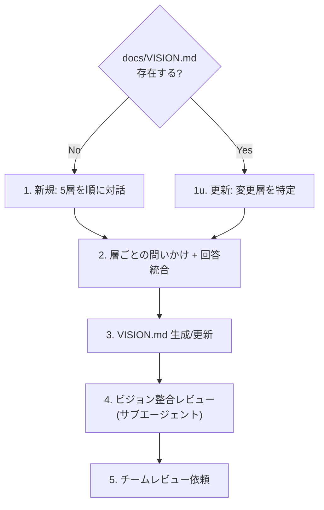

# Agile Product Vision

docs/VISION.md を対話的に作成・更新し、チームの前提認知を揃える。

## When to Use

- プロダクトの方向性を初めて定義するとき（新規作成）
- 状況変化に応じてビジョンを見直すとき（更新）
- チーム内で前提認知のズレを感じたとき
- `/agile-product-vision` で手動実行

## When NOT to Use

- Epic/Featureの具体的な定義（→ `/agile-epic`）
- バックログのStory分解（→ `/agile-create-backlog`）

## コーチングの原則

- **答えを書くな、問いを投げろ** — エージェントが勝手にビジョンを創作するとチームのオーナーシップが失われる。対話で引き出し、統合して文書化する
- **TBDは正当** — 「まだわからない」を `> TBD: {なぜ未定か・いつ決めるか}` として残す。無理に埋めると根拠のない記述が混入し「誰がこれ決めたの?」問題を起こす
- **1セッション30-60分** — 超えると集中力が切れ「全部大事」症候群に陥る。終わらなければ次回に分割
- テンプレの質問で詰まったら **GROW モデル** （Goal → Reality → Options → Will）の順で問いを組み立て直す

## Workflow



### モード判定

- **新規作成**: `docs/VISION.md` が存在しない、または空 → 5層すべてを順に対話
- **更新**: 既存VISION.mdを読み込み → ユーザーに「どの層を見直したいか」を確認 → 該当層のみ対話

> 💡 Vision skill は **四半期〜半年で定期実行する** 想定で設計されている。市場・チーム・技術環境の変化に追従するために定期的に走らせる。Step 4 の Strategy 点検も毎回走るので、別途 Strategy レビューを呼ぶ必要はない。

---

## 5層構造 — 対話ガイド

> 閾値（タイムボックス・ペルソナ数等）は `.claude/skills/references/team-context.md` を参照する。設定がなければ「軽量プリセット」（副業チーム想定）をデフォルトに動く。

各層は独立した関心事。上の層ほど変わりにくく、下の層ほど状況に応じて変わる。稼働時間が限られるチームでは **Layer 3（Not-to-doリスト）が最も価値が高い** — スコープを絞る合意がないと稼働が分散する。

### Layer 1: Why — なぜ作るのか

| セクション | 問いかけ | 稼働状況に応じた判断基準 |
|-----------|---------|---------------------|
| ミッション | 「このプロダクトが消えたら誰が困る? 既存ツールでは何が足りない?」 | 「なぜ」を3回繰り返して本質に迫る。「私たちは〇〇のために存在する」の一文に凝縮 |
| エレベーターピッチ | 「技術を知らない人に30秒で説明するなら?」 | テンプレ: [対象]にとっての[課題]を解決する[製品名]は、[代替手段]と違い[差別化要因]を提供する |
| ビジョンステートメント | 「2-5年後、成功したらユーザーは何を"もうやらなくて済む"か?」 | 1ページ以内。仕様書ではなく北極星。チームが詳細を補える余白を残す |

### Layer 2: Who — 誰のためか

| セクション | 問いかけ | 稼働状況に応じた判断基準 |
|-----------|---------|---------------------|
| ペルソナ | 「最も恩恵を受ける人の典型的な1日は? 一番ストレスの瞬間は?」 | 1-2ペルソナに絞る。「この情報で設計が変わるか?」にNoなら削る |
| ステークホルダーマップ | 「開発チーム以外で味方は? 説得が必要な人は?」 | 助けを求める前から知り合いになっておく |

### Layer 3: What — 何を作り、何を作らないか

| セクション | 問いかけ | 稼働状況に応じた判断基準 |
|-----------|---------|---------------------|
| 課題と現在の解決策 | 「ユーザーは今どう解決してる? 独自のワークアラウンドは?」 | ワークアラウンドがあるなら価値のヒント。何もしていないなら問題が小さい可能性 |
| Not-to-doリスト | 「やること / やらないこと / あとで決める、を3列で」 | **最重要セクション**。「あとで決める」欄を必ず設ける。惜しいものは「あったらいいな」か「必要」かを問う |
| 成功指標（Outcome 仮説） | 「何が測れたら成功? 初期の最低限と将来の本格的成功は?」「指標が動いたら、その因果を何で説明する仮説を持っているか?」「観測手段（既存計測 / 追加実装）はあるか?」 | 段階的に基準を上げてよい。行動ベースの指標を優先。**指標 / 仮説（X→Y）/ 観測手段 / 観測期間** の 4 点セットで記述（観測手段がない指標は仮説として無効）。観測コストが見合わないなら `> 観測しない（理由: ...）` で残してよい |

### Layer 4: How — どう実現するか

| セクション | 問いかけ | 稼働状況に応じた判断基準 |
|-----------|---------|---------------------|
| ソリューション概要 | 「技術的な方向はざっくりどうする?」 | 方向性のみ。詳細はADRとEpicに委ねる |
| トレードオフスライダー | 「スコープ/予算/期間/品質に1-4の順位を。同順位禁止」 | 意見が割れること自体が価値。「期間不足時にどうする?」で判断基準を引き出す |

### Layer 5: When/Risk — いつまでに、何がリスクか

| セクション | 問いかけ | 稼働状況に応じた判断基準 |
|-----------|---------|---------------------|
| タイムライン | 「期日固定でスコープ調整? コア機能確約で期日柔軟?」 | Layer 4のトレードオフスライダーと整合しているか確認 |
| リスクリスト | 「夜も眠れない心配事は?」 | 4リスク観点（価値/UX/実現可能性/事業）で漏れチェック |
| リソース見積もり | 「人数・期間はどれくらい? 直感でよい」 | 明示的に「根拠ある推測」とマーク |

---

## Step 3: VISION.md 生成/更新

- **新規作成時**: **MANDATORY** `references/vision-template.md` を読み込み、テンプレート構造に従って出力する。未決セクションは `> TBD: ...` で残す
- **更新時**: テンプレートの再読み込みは不要。既存VISION.mdの該当セクションのみ書き換える
- **Do NOT Load**: 対話フェーズ（Step 1-2）ではテンプレートを読むな。ユーザーの回答がテンプレートの枠に引きずられることを防ぐ

## Step 4: ビジョン整合レビュー + Strategy 点検（サブエージェント x 2 並列）

VISION.md 生成後、**2 つのサブエージェントを並列起動**し、それぞれ独立した視点で検査する。1 つの LLM に「内的整合性」と「戦略性質」を同時に持たせると認知が混ざるため、視点ごとに分担する（Three Amigos と同じ方針）。

主エージェントの責務はオーケストレーション:
1. 2 サブエージェントを **同一メッセージ内で並列起動**
2. 結果が出揃ったら視点別に整理してユーザーに提示
3. ユーザー回答を踏まえて修正後、未解消視点だけ再起動

### Sub-agent 1: 5 層整合レビュー（既存）

```
あなたは Vision 構造の整合性を検査します。Strategy 性質や個別の表現品質
には踏み込まず、5 層内の論理的な整合だけを見てください。

生成された docs/VISION.md を読み込み、以下を検査してください:

1. 5 層間の整合性: ミッション(Layer 1)と Not-to-do リスト(Layer 3)が矛盾していないか
2. トレードオフの整合性: スライダー(Layer 4)とタイムライン方針(Layer 5)が整合しているか
3. ペルソナと課題の対応: ペルソナ(Layer 2)の課題が Layer 3 で扱われているか
4. TBD の妥当性: TBD が 3 層以上ある場合はリサーチフェーズが必要な可能性を指摘

各観点の判定（OK / 要確認）と理由を返してください。
```

### Sub-agent 2: Strategy 4 性質点検（新規）

```
あなたは Scrum Expansion Pack の Strategy 拡張（Strategy as Empirical
Capability、John Coleman）の視点で Vision を検査します。5 層内の整合性や
TBD の数には踏み込まず、戦略としての性質だけを見てください。

生成された docs/VISION.md を読み込み、以下 4 性質を検査してください:

1. Intent（戦略の継続性）: ミッションに具体策（特定 SaaS 名・特定ライブラリ
   名・特定機能名）が混ざっていないか。「私たちは何を成し遂げたいか」が
   短期トレンドに流されない記述になっているか。例: ×「LINE で簡単にやり取り
   できるサービス」(具体策混入) → ○「困っている人と助けたい人を最短経路で
   つなぐ」(方向性のみ)
2. Focus（選別の鋭さ）: Not-to-do リストが空 / TBD ばかりではないか。「やら
   ないこと」の合意が具体的に明示されているか。「あとで決める」だけで終わって
   いないか
3. Coherence（内的整合性）: Layer 1 ミッション、Layer 4 トレードオフスライダー、
   Layer 5 タイムラインが互いに矛盾していないか。例: ミッションで「品質最優先」
   と謳いつつトレードオフで「期日固定」を選んでいる、など
4. Memorability（記憶しやすさ）: エレベーターピッチ・ビジョンステートメントが、
   チームメンバーが日常の判断時に思い出せる短さ・具体性を持っているか。30 秒
   以内に口頭で説明できる長さか

各性質の判定（OK / 要確認 / NG）と、要確認・NG の場合は VISION.md の具体的
箇所と理由を返してください。
```

### 結果統合（主エージェント）

2 サブエージェントの結果が出揃ったら、視点を **混ぜずに分けて** ユーザーに提示する:

```
[5 層整合レビュー]
- (各観点の判定と理由)

[Strategy 性質点検]
- (各性質の判定と理由)
```

視点間で矛盾する指摘（例: 整合性は OK だが Strategy で「ミッションに具体策混入」NG）が出ても、それぞれ独立した論点として提示する。視点を勝手に統合しない。

要確認 / NG の項目があれば、視点ごとに対話で解消する。修正後は **該当視点のサブエージェントだけ** 再起動（OK 判定の視点は再検査しない）。

## Step 4.5: 品質スコアリング

Step 4 の 2 サブエージェント検査が両方とも合格したら、最終確認として以下の 8 点スコアリングを実施する:

| # | 観点 | 合格基準 |
|---|------|---------|
| 1 | **Layer 1 ミッション完成度** | 1 文に凝縮され、Intent（具体策混入なし）が成立 |
| 2 | **Layer 2 ペルソナ妥当性** | `team-context.md` のペルソナ上限内、生活感ある記述 |
| 3 | **Layer 3 Not-to-do 充足** | 空 / 全 TBD でない、Focus（選別の鋭さ）が効いている |
| 4 | **Layer 4 トレードオフ** | スライダーが同順位なし、Layer 1-3 と整合 |
| 5 | **Layer 5 リスク網羅** | 4 リスク観点（価値 / UX / 実現可能性 / 事業）すべてに記載あり |
| 6 | **TBD 数** | 3 層未満（3 層以上は要確認 — リサーチが必要な兆候） |
| 7 | **Memorability** | エレベーターピッチが 30 秒以内で口頭説明可能な短さ |
| 8 | **全体整合性** | 5 層が矛盾しない（Coherence）|

**8 点中 7 点以上で合格。6 点以下は書き直し。** ユーザーに各観点のスコアを提示し、書き直しが必要なら対話を再開する。合格なら Step 5 へ。

## Step 5: チームレビュー依頼

- 各層の内容がチームの認識と合っているか確認
- TBDセクションの扱い（今決めるか、次回に持ち越すか）
- 必要に応じてPR作成を提案する

---

## 決定境界

全体マップは `docs/agile-workflow/concepts/ai-decision-boundary.md`を参照。本スキル固有の人間承認ゲート:

- **各 Layer の確定** — Layer 1〜5 のいずれも、AI は問いを投げて回答を整理するだけ。決定そのもの（ミッション、ペルソナ選択、Not-to-do リスト、トレードオフ順位）は人間が出す
- **TBD のまま完了とする可否** — TBD 3 層以上はリサーチが必要な兆候だが、それでも完了とするかは人間判断
- **トレードオフスライダーの順位付け** — チームの意思決定そのもので、AI が代理してはならない

NEVER（次節）はこのゲートの違反を具体的に列挙している。

---

## エッジケース

| 状況 | 対応 |
|------|------|
| ユーザーが「わからない」と答えた | TBDにするか、GROWモデルで別の角度から問い直す |
| 5層のうち3層以上がTBD | 「リサーチが必要かもしれない」と提案。無理にセッションを続けない |
| 更新時に「全部見直したい」 | 新規作成フローに切り替え。既存内容を叩き台として提示 |
| 1回の対話で全層を完了できない | 途中でVISION.mdを生成し、残りをTBDに。次回セッションで継続 |

## NEVER — アンチパターン

- **NEVER: VISION.mdを勝手に書くな** — エージェントが独自にビジョンを創作すると、チームが「自分たちのもの」と感じなくなり、ドキュメントが死文化する
- **NEVER: Not-to-doリストを省略するな** — 稼働時間が限られるチームで最も起きやすい失敗は「全部やろうとして何も完成しない」。やらないことの合意がスコープ管理の生命線
- **NEVER: ペルソナを team-context.md の上限を超えて作るな** — `team-context.md` で採用したプリセット値（軽量: 1-2 / 標準: 2-3 / 集中: 3-5）を超えると「誰のために作っているか」が曖昧になる。設定がなければ軽量プリセット（1-2）をデフォルトに
- **NEVER: 全セクション完了を強制するな** — TBDが残ることは正常。無理に埋めると検証されていない仮定が「決定事項」として扱われ、後工程で手戻りを起こす
- **NEVER: 2時間以上かけるな** — 認知負荷が限界を超えると「とりあえず全部大事」という非決定に陥る。30-60分で区切り、残りは次回に
- **NEVER: Step 4 の 5 層整合レビューと Strategy 点検の結果を統合してまとめるな** — 性格の違う検査を 1 つの結論にすると、ユーザーが「整合性はあるが戦略性が弱い」のような微妙な指摘を見落とす。視点別に分けて提示する
