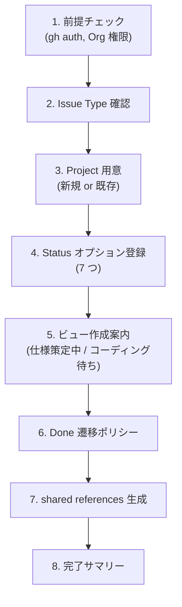

# Agile Project Setup

`agile-*` スキル群が前提とする GitHub Project (v2) の構成を、対話で 1 回流すだけで揃える。やる範囲は次のとおり:

- Issue Type の登録確認（Epic / Story / Task）
- GitHub Project (v2) の用意（新規作成 or 既存の取り込み）
- Status フィールドに 7 つのオプションを登録
- 推奨ビュー 2 つの作成案内（仕様策定中 / コーディング待ち）
- Done への遷移ポリシーの決定
- `shared/references/github-projects.md.template` からプロジェクト固有値を埋めて `.claude/skills/references/github-projects.md` を生成

## When to Use

- `agile-*` スキル群を初めて自分のプロジェクトに導入するとき
- Project は作ったが `.claude/skills/references/github-projects.md` をまだ作っていない / 古いとき
- Status オプションやビューの設定がバラついていて整えたいとき

## When NOT to Use

- agile 系を使わず軽量版 (`create-issue` / `create-pull-request`) だけで十分な場合 — Project 設定は不要
- 既に `.claude/skills/references/github-projects.md` が動いていて、変更したい箇所がピンポイントな場合 — 該当箇所を直接編集する方が速い

## Workflow



---

## Step 1: 前提チェック

```bash
gh auth status
gh org list
```

確認すること:
- `gh auth status` が成功し、`'project'` スコープを含むトークンであること（プロジェクト操作に必要）
- ユーザーが対象 Organization のメンバーで、Projects の作成権限を持っていること

スコープ不足の場合は `gh auth refresh -s project,read:org` を案内する。

ユーザーに「対象 Organization 名」と「Project の対象 Repository（あれば）」を確認する。

---

## Step 2: Issue Type 確認

`Epic` / `Story` / `Implementation Plan` / `Task` の 4 つの Issue Type が Organization に登録されている必要がある。**これは Web UI でしか設定できない**ので、案内のみ。

確認手順:

> Organization Settings → Planning → Issue types に移動し、`Epic` / `Story` / `Implementation Plan` / `Task` が登録されているか確認してください。
> URL: `https://github.com/organizations/<ORG>/settings/issue-types`

未登録ならその場で作成してもらう。色やアイコンの選択肢は自由。

| Issue Type | 主責務 |
|------------|--------|
| Epic | プロダクト機会 (Opportunity Canvas) |
| Story | PdO/QA 視点の要件 (受入基準・Outcome 仮説・ビジネスルール) |
| Implementation Plan | Dev リード視点の戦略 (技術詳細・API 仕様・Task 分解) |
| Task | 1 PR 単位の実装作業 |

確認できたら次へ。4 つ揃わないと agile-* スキルは Issue 作成時にエラーになる。

---

## Step 2.5: チームコンテキストヒアリング

agile-* スキル群の閾値（タイムボックス・Epic 同時数・ペルソナ数など）はチームの稼働状況に依存する。フルタイムチームと副業チームで同じ閾値を使うと、前者は緩すぎ、後者は厳しすぎになる。本ステップで前提を聞き取って `~/.claude/skills/references/team-context.md`（または利用先プロジェクトの `.claude/skills/references/team-context.md`）に保存し、各 agile-* スキルが参照できるようにする。

### ヒアリング項目

ユーザーに以下を聞く（既知なら飛ばしてよい）:

1. **体制**: 全員フルタイム / 副業混合 / 全員副業 のどれか
2. **メンバー数**: 何人か
3. **週合計稼働時間**: チーム全体での 1 週間の合計（推定でよい）
4. **チーム固有事情**: 時差・拠点・スキル偏りなど、閾値に影響しそうな前提

### プリセット提案

ヒアリング結果から **3 プリセットのいずれか** を提案する:

| プリセット | 想定 | 主な閾値 |
|---|---|---|
| **軽量** | 全員副業 / 週合計 20 時間以下 | Epic 2-3、ペルソナ 1-2、refine 25-30 分、Vision 30-60 分 |
| **標準** | フルタイム 1-2 名 + 副業混合 / 週合計 40-80 時間 | Epic 5-7、ペルソナ 2-3、refine 30-60 分、Vision 60-90 分 |
| **集中** | 全員フルタイム / 週合計 100 時間以上 | Epic 10+、ペルソナ 3-5、refine 60-90 分、Vision 2-3 時間 |

ユーザーがプリセットを選択（またはカスタマイズ希望）したら、Step 7 の shared references 生成で `team-context.md.template` をベースに値を埋めて配置する。

### team-context.md.template の取得とプレースホルダ置換

```bash
mkdir -p .claude/skills/references
curl -fsSL https://raw.githubusercontent.com/mrtry-lab/skills/main/shared/references/team-context.md.template \
  -o .claude/skills/references/team-context.md

# 例: 軽量プリセット採用
sed -i '' \
  -e 's|<FULL_TIME / SIDE_PROJECT / MIXED>|SIDE_PROJECT|g' \
  -e 's|<軽量 / 標準 / 集中>|軽量|g' \
  -e 's|<N>|3|g' \
  -e 's|<HOURS>|15|g' \
  .claude/skills/references/team-context.md

# 採用値の <VALUE> 列も軽量プリセット値で置換 (8 個の閾値、上から順に)
sed -i '' \
  -e 's|<VALUE>|2-3|1' \
  -e 's|<VALUE>|1-2|1' \
  -e 's|<VALUE>|30-60 分|1' \
  -e 's|<VALUE>|25-30 分|1' \
  -e 's|<VALUE>|5 個|1' \
  -e 's|<VALUE>|3 個|1' \
  -e 's|<VALUE>|3 個|1' \
  -e 's|<VALUE>|2 件以上|1' \
  .claude/skills/references/team-context.md
```

> 7 番目の `3 個` は「Plan 作成パスの想定 Task 数閾値」、8 番目の `2 件以上` は「Plan 作成パスの横断的判断閾値」。標準プリセットならそれぞれ `2 個` / `1 件以上`、集中なら `1 個` / `1 件以上`。

> ⚠️ プリセットを置換しないまま `<VALUE>` を残すと、agile-* スキルがプレースホルダ文字列を読んでしまう。Step 7 で github-projects.md を生成するのと同じタイミングで team-context.md も配置を完了させる。

### 設定なしでも動く（軽量プリセットがデフォルト）

`team-context.md` が配置されていない場合、agile-* スキル群は **軽量プリセット**（副業チーム想定）をデフォルトとして動作する。最初は team-context なしで始めて、運用しながら必要を感じたタイミングで作成しても OK。

---

## Step 3: Project 用意

ユーザーに既存 Project を使うか新規作成かを聞く。

### 新規作成の場合

```bash
gh project create \
  --owner <ORG> \
  --title "<Project Name>"
```

出力から `Project URL` と `Project Number` を控える。Project Number は URL 末尾の数字（例: `https://github.com/orgs/<ORG>/projects/2` なら `2`）。

### 既存 Project を使う場合

```bash
gh project list --owner <ORG>
```

一覧から対象を選んでもらい、その Number を控える。

### Project ID と Status Field ID を取得

```bash
gh project field-list <NUMBER> --owner <ORG> --format json
```

出力から以下を控える:
- Project ID（後で `gh project field-create` 等で使う）
- Status フィールドが存在するか（あれば既存 Option を取り込み、なければ Step 4 で作成）

---

## Step 4: Status オプション登録

agile-* スキルは以下の 7 オプションを Status フィールドの値として参照する:

```
In Planning → In Plan Refinement → In Plan Review → Ready → In Coding Progress → In Code Review → Done
```

### Status フィールドが未作成の場合

`gh project field-create` で作成:

```bash
gh project field-create <NUMBER> --owner <ORG> \
  --name "Status" \
  --data-type "SINGLE_SELECT" \
  --single-select-options "In Planning,In Plan Refinement,In Plan Review,Ready,In Coding Progress,In Code Review,Done"
```

### Status フィールドが既に存在する場合

既存 Option ID を取り込む方針。`gh project field-list` の出力から各 Option Name と ID をマッピングし、不足オプションがあれば Web UI で追加する（`gh` CLI から既存フィールドへの Option 追加は 2026 時点で未対応のことがある — 状況に応じて Web UI に逃がす）。

### Option ID の取得

オプション登録後にもう一度 `gh project field-list <NUMBER> --owner <ORG> --format json` を実行し、各オプションの `id` を控える。Step 7 でプレースホルダ置換に使う。

---

## Step 5: 推奨ビュー作成案内

`gh` CLI ではビューの新規作成は対応が薄い（2026 時点）。Web UI で 2 つ作る案内をする:

> Project ページ → 上部のビュータブの「+」→ 「New view」で以下 2 つを作成してください:
>
> **ビュー 1: 仕様策定中のチケット**
> - Layout: Board または Table
> - Filter: `status:"In Planning","In Plan Refinement","In Plan Review"`
> - 用途: PdO が仕様を固めるフェーズで見る
>
> **ビュー 2: コーディング待ちのチケット**
> - Layout: Board または Table
> - Filter: `status:"Ready","In Coding Progress","In Code Review"`
> - 用途: CodingAgent が実装するフェーズで見る

作成完了をユーザーに確認してから次へ。ビュー URL を控えると後の完了サマリーに使える。

---

## Step 6: Done 遷移ポリシー

PR がマージされたら Status を `Done` にしたい。これは agile-* スキル群では遷移処理を持っていないので、運用方針をユーザーに選んでもらう:

| 選択肢 | 内容 |
|---|---|
| **A. GitHub Projects の Auto-archive ワークフローを使う（推奨）** | Project ページの「Workflows」設定で「Item closed」→ `Set value: Status = Done` のルールを有効化する。Issue/PR がクローズされたら自動で Done に遷移 |
| **B. 手動運用** | レビュー完了後にユーザーが手動で Status を Done にする |

A を選ぶ場合の手順:

> Project ページ → 右上の「⋯」→ 「Workflows」→ 「Auto-add to project」と「Item closed」を有効化し、後者で `Status = Done` を設定

選択結果を後で完了サマリーに記載する。

---

## Step 7: shared references 生成

`mrtry-lab/skills/shared/references/github-projects.md.template` を取得し、ここまでで集めた値で置換して `.claude/skills/references/github-projects.md` に書き出す。**Step 2.5 で team-context.md.template も同じディレクトリに配置済み**であることを確認する（未済なら Step 2.5 のコマンドを再実行）。

### 値の整理

これまでに集めた値:

| プレースホルダ | 値 |
|---|---|
| `<YOUR_PROJECT_NAME>` | Step 3 で確認した Project 名 |
| `<YOUR_GITHUB_ORG>` | Step 1 で確認した Org 名 |
| `<YOUR_PROJECT_NUMBER>` | Step 3 で確認した Number |
| `<YOUR_PROJECT_ID>` | Step 3-4 の `field-list` 出力 |
| `<YOUR_STATUS_FIELD_ID>` | 同上 |
| `<STATUS_OPTION_ID_IN_PLANNING>` 〜 `<STATUS_OPTION_ID_DONE>` | Step 4 終了後の `field-list` 出力 |

### 置換と書き出し

```bash
mkdir -p .claude/skills/references

curl -fsSL https://raw.githubusercontent.com/mrtry-lab/skills/main/shared/references/github-projects.md.template \
  -o .claude/skills/references/github-projects.md

# macOS sed の例
sed -i '' \
  -e 's|<YOUR_PROJECT_NAME>|<実際の Project 名>|g' \
  -e 's|<YOUR_GITHUB_ORG>|<実際の Org>|g' \
  -e 's|<YOUR_PROJECT_NUMBER>|<実際の番号>|g' \
  -e 's|<YOUR_PROJECT_ID>|<実際の ID>|g' \
  -e 's|<YOUR_STATUS_FIELD_ID>|<実際の Field ID>|g' \
  -e 's|<STATUS_OPTION_ID_IN_PLANNING>|<実値>|g' \
  -e 's|<STATUS_OPTION_ID_IN_PLAN_REFINEMENT>|<実値>|g' \
  -e 's|<STATUS_OPTION_ID_IN_PLAN_REVIEW>|<実値>|g' \
  -e 's|<STATUS_OPTION_ID_READY>|<実値>|g' \
  -e 's|<STATUS_OPTION_ID_IN_CODING_PROGRESS>|<実値>|g' \
  -e 's|<STATUS_OPTION_ID_IN_CODE_REVIEW>|<実値>|g' \
  -e 's|<STATUS_OPTION_ID_DONE>|<実値>|g' \
  .claude/skills/references/github-projects.md
```

Linux（GNU sed）は `-i ''` ではなく `-i`。

### user scope に置きたい場合

複数プロジェクトで使い回したい場合は出力先を `~/.claude/skills/references/github-projects.md` にする。ただし Project ID 等が異なる別プロジェクトを跨ぐ場合はプロジェクト個別に project scope に置く方が安全。

### 確認

```bash
grep -n "<YOUR_\|<STATUS_OPTION" .claude/skills/references/github-projects.md
# 何も出なければプレースホルダは全て置換済み
```

---

## Step 8: 完了サマリー

ユーザーに次の情報を提示して完了:

```
✓ Project: <Project URL>
✓ ビュー:
  - 仕様策定中のチケット: <ビュー URL>
  - コーディング待ちのチケット: <ビュー URL>
✓ Done 遷移ポリシー: <A: Auto-archive 有効化済み | B: 手動運用>
✓ 配置ファイル: .claude/skills/references/github-projects.md
✓ Issue Type 確認: Epic / Story / Task が登録済み

次のステップ:
- 必要な agile-* スキルをインストール: gh skill install mrtry-lab/skills <skill-name> --agent claude-code --scope <user|project>
- Mermaid 検証を使うなら docs/agile-workflow/setup.md の「validate-mermaid スクリプトの配置」を参照
- 最初の Story 作成は /agile-product-vision → /agile-epic → /agile-create-backlog の順
```

`.claude/skills/references/github-projects.md` を git 管理下に置く方針なら `git add` してコミットを促す（Project ID 等は機密ではないので公開リポジトリでも問題ないが、ユーザー判断）。

---

## 決定境界

全体マップは `docs/agile-workflow/concepts/ai-decision-boundary.md`を参照。本スキル固有の人間承認ゲート:

- **Org 選択 / Issue Type 登録** — Web UI 操作のため完全に人間。AI は手順を案内するだけ
- **Project 作成 vs 既存利用** — Step 3 の判断は人間。新規 Project URL を作るのは取り消しコストが高い操作
- **Status オプション登録** — `gh project field-create` 実行前に人間承認
- **Done 遷移ポリシー選択** — Step 6 の Auto-archive 利用 / 手動運用は人間判断
- **チームコンテキストとプリセット選択** — Step 2.5 の体制ヒアリングと「軽量 / 標準 / 集中」プリセット選択は人間判断。AI は提案するだけ

NEVER（次節）はこのゲートの違反を具体的に列挙している。

---

## エッジケース

| 状況 | 対応 |
|------|------|
| `gh auth status` で project スコープなし | `gh auth refresh -s project,read:org` を案内 |
| Org の Issue Type 設定権限がない | Org 管理者への依頼を案内し、Step 2 を保留してもユーザー判断で先に進める（Issue 作成時に失敗する旨を明示） |
| `gh project field-create` で Status オプションを一気に作れない（既存 Status フィールドが衝突等） | Web UI でフィールド削除 → 作り直し、または Web UI でオプション追加に切り替える |
| Project 既存で Option 名が微妙に違う（例: `In Coding` vs `In Coding Progress`） | スキル側がリテラル文字列でマッチするので、**Status 名を agile-* 規約に揃える**ことを推奨。リネームが難しい場合のみユーザー判断で例外運用 |
| 途中で中断 | 既に作った Project は残るので、再実行時は Step 3 で「既存を使う」分岐に進む。`.claude/skills/references/github-projects.md` は未完成でも残るので、必要なら削除して再生成 |

## NEVER — アンチパターン

- **絶対に** Status オプション名を勝手に変えない — agile-* スキルは `In Planning` / `In Plan Refinement` 等のリテラルでマッチする。リネームすると全スキルが壊れる
- **絶対に** プレースホルダ未置換のまま `.claude/skills/references/github-projects.md` を有効化しない — `<YOUR_GITHUB_ORG>` のような文字列がそのまま `gh` コマンドに渡って失敗する
- **絶対に** Issue Type の登録ステップをスキップしない — Org に Issue Type がないと agile-create-issue が即座に失敗する。手戻りが大きい

---

## References

このスキルが参考にしている書籍・記事・フレームワーク:

- 📖 [アジャイルサムライ](https://www.amazon.co.jp/s?k=アジャイルサムライ)（Jonathan Rasmusson）— Inception Deck 思想（チームコンテキスト確認）
- 📦 [Scrum Guide Expansion Pack](https://scrumexpansion.org/) — Strategy（チーム前提を揃える）
