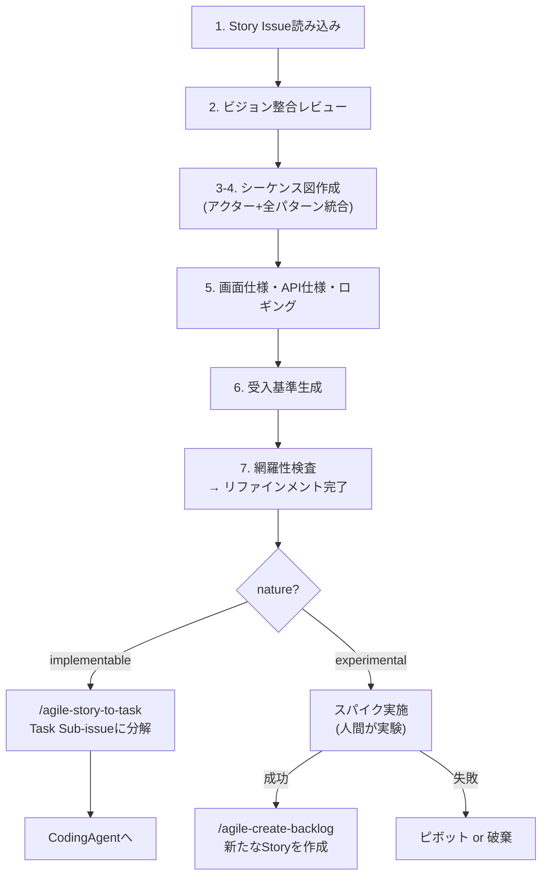
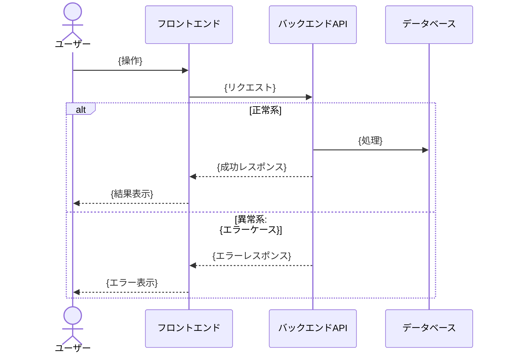

# Agile Refine Backlog

Story Issue の要件を、CodingAgent が Issue 本文だけ読んで実装を開始できるレベルまで具体化する。アクター間の相互作用・正常系/異常系パターン・画面仕様・API 仕様・受入基準を確定させ、implementable は実装可能な仕様に、experimental は実験計画に仕上げる。

## When to Use

- Story Issue の要件を実装可能なレベルまで具体化するとき（implementable / experimental 共通）
- シーケンス図・画面仕様・API 仕様・受入基準を確定させるとき
- 実験計画を策定するとき
- `/agile-refine-backlog` で手動実行

## When NOT to Use

- Epic の定義（→ `/agile-epic`）
- Epic から Story への分解（→ `/agile-create-backlog`）
- リファインメント済み Story の Task 分解（→ `/agile-story-to-task`）
- プロダクトの方向性が未定義（→ `/agile-product-vision`）

## コア原則

- **リファインされた Issue = CodingAgent の作業指示書。** CodingAgent が Issue 本文だけを読んでコーディングを開始できなければ、リファインメントは未完了
- **決定的なことは全て決める、非決定的なことは決めない** — ユーザーの操作→システムの応答（ビジネスルール・画面遷移・エラー対処）は先に定義する。内部設計・アルゴリズム選択・最適化手法は CodingAgent に委ねる
- **実装方法は書くな、振る舞いを書け** — どの関数・どのファイルを変更するかは CodingAgent の責務。人間が書くのは「何が起きるべきか」
- テンプレの質問で詰まったら **GROW モデル** （Goal → Reality → Options → Will）の順で問いを組み立て直す

## Workflow



---

## Step 1: Story Issue 読み込み

**Story の特定**: ユーザーが Issue 番号や URL を指定していない場合、`.claude/skills/references/github-projects.md` のコマンドテンプレートで **Status "In Plan Refinement"** のアイテムを抽出し、チケット名の一覧をユーザーに提示して選択してもらう。0 件の場合は **Status "In Planning"** で再検索し、「In Plan Refinement のチケットが 0 件ですが、In Planning のものを Refinement しますか？」とチケット名の一覧を提示。In Planning も 0 件の場合は「対象のチケットがありません。Issue 番号を直接指定してください」と案内する。

対象の Story Issue のステータスが "In Plan Refinement" でない場合、`.claude/skills/references/github-projects.md` のコマンドテンプレートに従い **"In Plan Refinement"** に更新する。

対象の Story Issue を GitHub MCP の `issue_read` で読み込み、以下を確認する:
- `nature:implementable` であることを確認
- 親 Epic の Opportunity Canvas（背景の確認）
- 既に埋まっているセクションと TBD のセクション

**MANDATORY** : テンプレート構造の確認のため、Story テンプレートを次の順で解決する:

1. リポジトリ側 `.github/ISSUE_TEMPLATE/story.md` を最優先
2. 無ければ `agile-create-backlog/templates/story.md`（同梱フォールバック）を参照する
3. いずれも存在しない場合は、Issue 本文の既存構造をベースにし、不足セクション（シーケンス図、受入基準、ロギング）を追加する

Issue 本文が解決したテンプレートに沿っていない場合は、テンプレートの構造に合わせて整形してから詳細化を開始する。

**nature ラベルがない場合**: 「このストーリーの受入基準（{状況}のとき、{操作}したら、{結果}になる）を今すぐ書けますか?」と聞き、Cynefin 分類を実施してラベルを付与してから詳細化を開始する。

---

## Step 2: ビジョン整合レビュー（サブエージェント）

**サブエージェントを起動** し、以下を検査させる。メインのコンテキストを圧迫しないよう、評価はサブエージェントに委譲する。

**サブエージェントへの指示**:
```
以下の Story Issue と docs/VISION.md を読み込み、整合性を検査してください。

検査観点:
1. 価値の単一性: この Story が提供するユーザー価値は1つに絞られているか
2. ミッション整合: ビジョンのミッションに貢献するか
3. Not-to-do 整合: Not-to-do リストに該当しないか
4. 成功指標への紐づき: ビジョンの成功指標に関連するか

結果を以下の形式で返してください:
- 各観点の判定（OK / 要確認 / NG）
- NG・要確認の場合は具体的な理由
```

**サブエージェントの結果に基づく対応**:
- 全てOK → Step 3 に進む
- 要確認/NG がある → ユーザーに結果を提示し、「進めてよいですか?」と確認。必要なら Story 分割や内容修正を行う

---

## Step 3-4: シーケンス図の作成（アクター洗い出し + 全パターン列挙を統合）

ストーリーに関わる全アクターを洗い出し、正常系/異常系の全インタラクションを mermaid の `sequenceDiagram` で時系列に表現する。**この図がパターン一覧を兼ねる。**

**対話の流れ**:
1. 「このストーリーのメインユーザーは誰ですか?」
2. 「ユーザーとゴールの間に、どんなアクター（システム・コンポーネント・外部サービス）が関わりますか?」
3. 正常系の流れを時系列で組み立てる
4. 各インタラクションについて「何がうまくいかないか」を以下の観点で洗い出す:
   - 入力値の問題（バリデーション）
   - 権限の問題（認証・認可）
   - 外部依存の問題（タイムアウト、エラー、停止）
   - データの問題（未存在、重複、競合）
   - ユーザー状態の問題（途中離脱、同時操作、ブラウザバック）
5. 異常系を `alt` / `opt` ブロックで図に統合する

**各異常パターンに対して「対処」を図中に記述する**:
- ユーザーに何を表示するか（`-->>` の戻りメッセージとして）
- エラーレスポンスのコードとメッセージ

**出力する図のフォーマット**:



図を作成したらユーザーに提示し、「このアクターやパターンで漏れはありませんか?」と確認する。

**補助図（必要な場合のみ）**: エンティティの状態遷移が複雑な場合は、ステートマシン図を補助的に追加する。

---

## Step 5: 画面仕様・API仕様

シーケンス図で列挙した全パターンに基づいて、具体的な仕様を埋める。

### 5a. 画面遷移・画面仕様

- シーケンス図の正常系フローから画面遷移を導出する
- 各画面で表示する内容・インタラクションを定義する
- デザインリンク（Figma 等）があれば貼ってもらう

### 5b. API / バックエンド仕様

- シーケンス図から必要な API エンドポイントを導出する
- 各エンドポイントのリクエスト/レスポンス/エラーレスポンスをシーケンス図のパターンに基づいて定義する

### 5c. イベントロギング

シーケンス図をもとに、プロダクト改善に役立つユーザーインタラクションのロギングを検討する。

**方針**:
1. **GA自動収集で取れるもの** （画面遷移、スクロール、クリック等）→ 個別実装不要。「GA自動収集」と記載
2. **GA推奨イベントに該当するもの** （login, sign_up, purchase 等）→ 推奨イベントとして実装済みの前提。該当するイベント名を記載
3. **上記でカバーできないが改善に役立つもの** → カスタムイベントとして新規作成を検討

**対話の流れ**:
1. Step 4 のパターン一覧から、ユーザーが起こすインタラクション（正常系・異常系とも）を抽出する
2. 各インタラクションについて以下を判定し、一覧をユーザーに提示する:
   - GA自動収集でカバーされるか
   - GA推奨イベントに該当するか
   - カスタムイベントが必要か
   - ロギング不要か
3. 「この一覧でカバーできていますか? 他に測りたいインタラクションはありますか?」と確認

**カスタムイベントを検討すべき観点**:
- 機能の利用有無（この機能が使われているか）
- フローの離脱ポイント（どこで止めたか）
- エラー発生とリトライ（同じ操作を繰り返しているか）
- 操作時間（異常に時間がかかっていないか）

### 5d. オプショナル項目

- 「他に埋められそうなセクションはありますか?」

---

## Step 6: 受入基準生成

Step 4 で定義した全パターンから受入基準を生成する。各パターンが1つの受入基準に対応する:

```
- [ ] {状況}のとき、{操作}したら、{結果}になる
```

- 正常パターン → 正常パターンの受入基準
- 異常パターン → 異常パターンの受入基準
- 1つの受入基準で1つの振る舞いをテストする

---

## Step 7: 網羅性検査（サブエージェント）

**サブエージェントを起動** し、Issue 本文全体を渡して網羅性を検査させる。メインのコンテキストには検査結果のみを返す。

**サブエージェントへの指示**:
```
以下の Story Issue 本文を読み込み、CodingAgent にそのまま渡して実装完了できるかを検査してください。

検査観点:
1. アクターの網羅性: ネットワーク図の全アクターが仕様に反映されているか
2. インタラクションの網羅性: 各アクター間のやりとりに正常パターンと異常パターンが列挙されているか
3. 対処の完全性: 全異常パターンに対処（ユーザーへの表示、システム状態、リカバリー）が定義されているか
4. 受入基準の対応: 全パターンに対応する受入基準が存在するか
5. 画面仕様の完全性: 各画面の表示内容・遷移先・インタラクションが明確か
6. API仕様の完全性: エンドポイント・リクエスト・レスポンス・エラーが具体的か
7. 前提条件の明示: CodingAgent が知っておくべき前提（認証状態、データ状態等）が書かれているか
8. ロギングの検討: イベントロギングが検討され、収集方法が判定されているか

結果を以下の形式で返してください:
- 各観点の判定（OK / 未定義パターンあり）
- 未定義パターンがある場合は、具体的にどのアクター間のどのパターンが未定義か
- 改善提案
```

**サブエージェントの結果に基づく対応**:
- **未定義パターンあり**: 結果をユーザーに提示し、追加質問する。回答を反映したら再度サブエージェントで検査する
- **全観点OK**: Issue 本文を `issue_write` で更新する **前に**、Mermaid 構文を検証する:
  ```bash
  echo "{Issue本文}" | node .claude/scripts/validate-mermaid.mjs
  ```
  バリデーションエラーがあれば Mermaid 図を修正してから更新する。
  
  リファインメント完了とし、`.claude/skills/references/github-projects.md` のコマンドテンプレートに従い Status を **"In Plan Review"** に自動更新する。nature に応じて次のアクションを案内:
  - `nature:implementable` → 「リファインメント完了です。`/agile-story-to-task` で Task Sub-issue に分解してください。分解後、各 Task を CodingAgent に渡せます」
  - `nature:experimental` → 「実験計画が完成しました。スパイクを実施してください。完了後、結果をもとに `/agile-create-backlog` で新たな Story を作成してください」

---

## エッジケース

| 状況 | 対応 |
|------|------|
| nature ラベルがない | Cynefin 分類を実施してラベルを付与してから詳細化を開始 |
| 画面がないバックエンド Story | 画面仕様セクションは「該当なし」。シーケンス図はAPI中心で構成する |
| 対話中に Story が大きすぎることが判明 | `/agile-create-backlog` に戻って分割を提案 |
| 未解決の疑問が残る | 該当箇所に `> TBD: {疑問内容}` を残し、リファインメント完了としない（Project の Status も更新しない） |
| アクターが1つしかない（ユーザー→フロントエンドのみ等） | ネットワーク図は省略可。ただしパターン列挙は省略しない |

## NEVER — アンチパターン

- **NEVER: リファインメント未完了の Story を Ready 状態にするな** — 検査を通過していない Story を Ready にすると、implementable は CodingAgent が不完全な仕様で実装を始め、experimental は曖昧な実験計画でスパイクに入ってしまう
- **NEVER: 実装方法を書くな** — 「UserServiceのloginメソッドを修正」のような指示を書くと、CodingAgentがより良いアプローチ（例: 別クラスへの分離）を選べなくなる。仕様変更時にも古い実装指示に引きずられる。Issue には「何が起きるべきか」だけを書く
- **NEVER: 未定義のパターンを残したまま Ready 状態にするな** — CodingAgentは未定義パターンに遭遇すると自己判断で実装するが、その判断がビジネスルールと合わない場合、本番で初めて問題が発覚する
- **NEVER: シーケンス図を省略するな（複数アクターが関わる場合）** — 図なしでパターンを列挙すると「フロントエンド→バックエンド」間は考えても「バックエンド→外部サービス」間を見落とす。図が全インタラクションの検討漏れを防ぐ唯一の手段
- **NEVER: Claude が洗い出したパターンだけで完了とするな** — LLMは一般的なパターンは網羅できるが、ドメイン固有の業務ルール（例: 特定時間帯の制約、法的要件）は知り得ない。必ずユーザーに確認する
