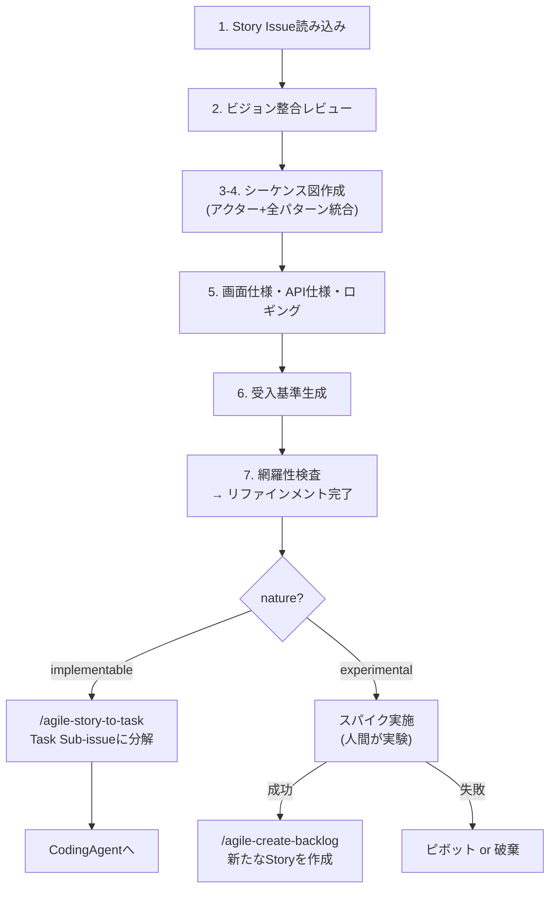
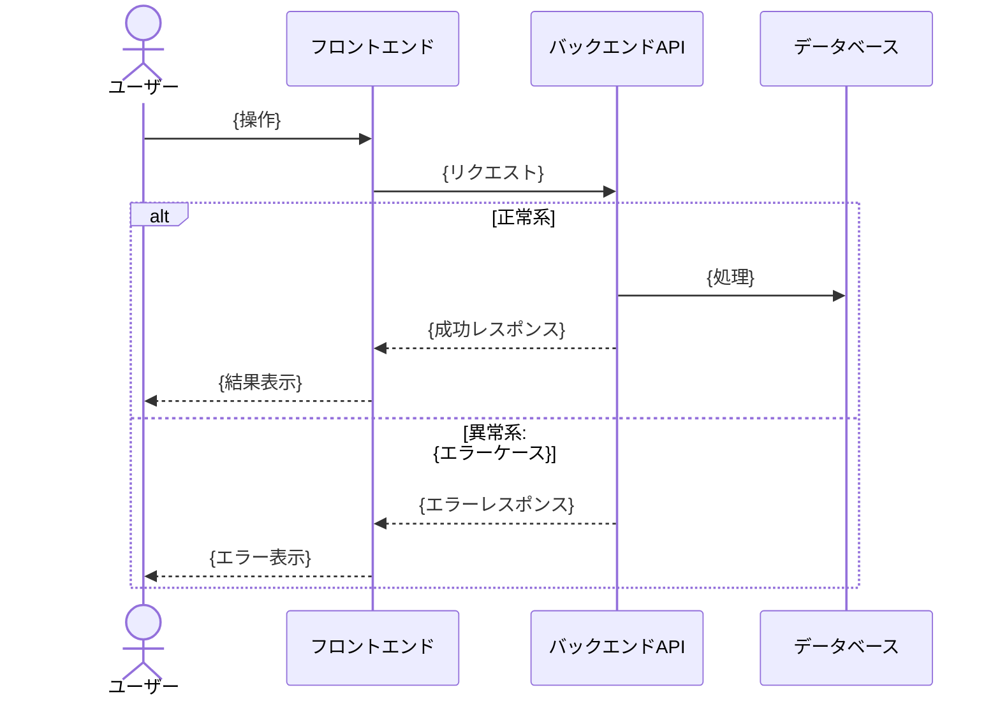

# Agile Refine Backlog

Story Issue の要件を、CodingAgent が Issue 本文だけ読んで実装を開始できるレベルまで具体化する。アクター間の相互作用・正常系/異常系パターン・画面仕様・API 仕様・受入基準を確定させ、implementable は実装可能な仕様に、experimental は実験計画に仕上げる。

> 閾値（リファインメントセッションのタイムボックス、Example Mapping のルール上限、未解決質問の上限）は `.claude/skills/references/team-context.md` を参照する。設定がなければ「軽量プリセット」（副業チーム想定 = refine 25-30 分、ルール 5 個、質問 3 個）をデフォルトに動く。

## When to Use

- Story Issue の要件を実装可能なレベルまで具体化するとき（implementable / experimental 共通）
- シーケンス図・画面仕様・API 仕様・受入基準を確定させるとき
- 実験計画を策定するとき
- `/agile-refine-backlog` で手動実行

## When NOT to Use

- Epic の定義（→ `/agile-epic`）
- Epic から Story への分解（→ `/agile-create-backlog`）
- リファインメント済み Story の Task 分解（→ `/agile-story-to-task`）
- プロダクトの方向性が未定義（→ `/agile-product-vision`）

## コア原則

- **リファインされた Issue = CodingAgent の作業指示書。** CodingAgent が Issue 本文だけを読んでコーディングを開始できなければ、リファインメントは未完了
- **決定的なことは全て決める、非決定的なことは決めない** — ユーザーの操作→システムの応答（ビジネスルール・画面遷移・エラー対処）は先に定義する。内部設計・アルゴリズム選択・最適化手法は CodingAgent に委ねる
- **実装方法は書くな、振る舞いを書け** — どの関数・どのファイルを変更するかは CodingAgent の責務。人間が書くのは「何が起きるべきか」
- テンプレの質問で詰まったら **GROW モデル** （Goal → Reality → Options → Will）の順で問いを組み立て直す

## Workflow



---

## Step 1: Story Issue 読み込み

**Story の特定**: ユーザーが Issue 番号や URL を指定していない場合、`.claude/skills/references/github-projects.md` のコマンドテンプレートで **Status "In Plan Refinement"** のアイテムを抽出し、チケット名の一覧をユーザーに提示して選択してもらう。0 件の場合は **Status "In Planning"** で再検索し、「In Plan Refinement のチケットが 0 件ですが、In Planning のものを Refinement しますか？」とチケット名の一覧を提示。In Planning も 0 件の場合は「対象のチケットがありません。Issue 番号を直接指定してください」と案内する。

対象の Story Issue のステータスが "In Plan Refinement" でない場合、`.claude/skills/references/github-projects.md` のコマンドテンプレートに従い **"In Plan Refinement"** に更新する。

対象の Story Issue を GitHub MCP の `issue_read` で読み込み、以下を確認する:
- `nature:implementable` であることを確認
- 親 Epic の Opportunity Canvas（背景の確認）
- 既に埋まっているセクションと TBD のセクション

**MANDATORY** : テンプレート構造の確認のため、Story テンプレートを次の順で解決する:

1. リポジトリ側 `.github/ISSUE_TEMPLATE/story.md` を最優先
2. 無ければ `agile-create-backlog/templates/story.md`（同梱フォールバック）を参照する
3. いずれも存在しない場合は、Issue 本文の既存構造をベースにし、不足セクション（シーケンス図、受入基準、ロギング）を追加する

Issue 本文が解決したテンプレートに沿っていない場合は、テンプレートの構造に合わせて整形してから詳細化を開始する。

**nature ラベルがない場合**: 「このストーリーの受入基準（{状況}のとき、{操作}したら、{結果}になる）を今すぐ書けますか?」と聞き、Cynefin 分類を実施してラベルを付与してから詳細化を開始する。Chaotic の判定（事業継続への深刻な影響の有無）も同時に確認する。

---

## Step 1.5: nature:chaotic の場合の軽量フロー（該当時のみ）

Story が `nature:chaotic` ラベルを持つ場合、通常の Step 2 〜 Step 7 を流すと時間がかかりすぎ、Cynefin Chaotic ドメインの原則（`act → sense → respond`）に反する。安定化を最優先するため、以下の最小限で完了とする。

**実施するステップ**:
- **Step 6 受入基準のみ**: hotfix 完了の判定条件を最小限で記述（例: 「ユーザー X が再ログインできる」「エラー率が Y% 以下に戻る」）
- **PdO 視点 1 サブエージェントだけ走らせる**（Step 7 の Sub-agent A 相当のみ）: 「事業影響観点で hotfix 内容が妥当か」だけ検査。Dev/QA 視点は安定化後の postmortem で代替する

**スキップするステップ**:
- Step 2 ビジョン整合レビュー（緊急対応にビジョン整合検査は時間的に合わない）
- Step 3-4 シーケンス図（仕様化より先に修正する）
- Step 5a-d 画面 / API / ロギング設計
- Step 5e Outcome Done（緊急対応の Outcome は「事業継続」一択で自明）
- Step 5f Example Mapping（ルール抽出より先に修正する）
- Step 7 通常の Three Amigos 並列検査（PdO 視点だけで完了とする）

**完了後**:
- Status を **"Ready"** に直接設定（In Plan Refinement / In Plan Review はスキップ）
- `/agile-task-implementation` または緊急時は手動修正フローへ直結
- 「Chaotic でも CI green は守る」: TDD を妥協しない。修正ロジックには必ずテストを書く

**事後 — 必ず実施**:
安定化後、別 Issue として **postmortem** を記録する。内容:
- なぜ Chaotic に至ったか（観測抜け / モニタリング不足 / 予防可能だったか）
- 再発防止策（観測強化 / プロセス改善 / 教育）
- 追加すべきテスト（hotfix で慌てて書けなかった部分）

postmortem を残すことで、Chaotic ドメイン → Complicated / Complex への学習移行が起きる。

`nature:chaotic` でない通常の Story は Step 2 へ進む。

---

## Step 2: ビジョン整合レビュー（PdO 視点サブエージェント — Three Amigos の 1 人目）

**サブエージェントを起動** し、PdO 視点で以下を検査させる。これは refinement に着手すべきストーリーかの **事前判定** で、Step 7 の事後検証（Three Amigos 並列検査）とは別目的。メインのコンテキストを圧迫しないよう、評価はサブエージェントに委譲する。

**サブエージェントへの指示**:
```
あなたは PdO（プロダクトオーナー）視点で Story Issue を検査します。
技術的実現性やテスト手順には踏み込まず、ユーザー価値・ビジョン整合・Not-to-do
との衝突だけを見てください。

以下の Story Issue と docs/VISION.md を読み込み、整合性を検査してください。

検査観点:
1. 価値の単一性: この Story が提供するユーザー価値は1つに絞られているか
2. ミッション整合: ビジョンのミッションに貢献するか
3. Not-to-do 整合: Not-to-do リストに該当しないか
4. 成功指標への紐づき: ビジョンの成功指標に関連するか

結果を以下の形式で返してください:
- 各観点の判定（OK / 要確認 / NG）
- NG・要確認の場合は具体的な理由
```

**サブエージェントの結果に基づく対応**:
- 全てOK → Step 3 に進む
- 要確認/NG がある → ユーザーに結果を提示し、「進めてよいですか?」と確認。必要なら Story 分割や内容修正を行う

---

## Step 3-4: シーケンス図の作成（アクター洗い出し + 全パターン列挙を統合）

ストーリーに関わる全アクターを洗い出し、正常系/異常系の全インタラクションを mermaid の `sequenceDiagram` で時系列に表現する。**この図がパターン一覧を兼ねる。**

**対話の流れ**:
1. 「このストーリーのメインユーザーは誰ですか?」
2. 「ユーザーとゴールの間に、どんなアクター（システム・コンポーネント・外部サービス）が関わりますか?」
3. 正常系の流れを時系列で組み立てる
4. 各インタラクションについて「何がうまくいかないか」を以下の観点で洗い出す:
   - 入力値の問題（バリデーション）
   - 権限の問題（認証・認可）
   - 外部依存の問題（タイムアウト、エラー、停止）
   - データの問題（未存在、重複、競合）
   - ユーザー状態の問題（途中離脱、同時操作、ブラウザバック）
5. 異常系を `alt` / `opt` ブロックで図に統合する

**各異常パターンに対して「対処」を図中に記述する**:
- ユーザーに何を表示するか（`-->>` の戻りメッセージとして）
- エラーレスポンスのコードとメッセージ

**出力する図のフォーマット**:



図を作成したらユーザーに提示し、「このアクターやパターンで漏れはありませんか?」と確認する。

**補助図（必要な場合のみ）**: エンティティの状態遷移が複雑な場合は、ステートマシン図を補助的に追加する。

---

## Step 5: 画面仕様・API仕様

シーケンス図で列挙した全パターンに基づいて、具体的な仕様を埋める。

### 5a. 画面遷移・画面仕様

- シーケンス図の正常系フローから画面遷移を導出する
- 各画面で表示する内容・インタラクションを定義する
- デザインリンク（Figma 等）があれば貼ってもらう

### 5b. API / バックエンド仕様

- シーケンス図から必要な API エンドポイントを導出する
- 各エンドポイントのリクエスト/レスポンス/エラーレスポンスをシーケンス図のパターンに基づいて定義する

### 5c. イベントロギング

シーケンス図をもとに、プロダクト改善に役立つユーザーインタラクションのロギングを検討する。

**方針**:
1. **GA自動収集で取れるもの** （画面遷移、スクロール、クリック等）→ 個別実装不要。「GA自動収集」と記載
2. **GA推奨イベントに該当するもの** （login, sign_up, purchase 等）→ 推奨イベントとして実装済みの前提。該当するイベント名を記載
3. **上記でカバーできないが改善に役立つもの** → カスタムイベントとして新規作成を検討

**対話の流れ**:
1. Step 4 のパターン一覧から、ユーザーが起こすインタラクション（正常系・異常系とも）を抽出する
2. 各インタラクションについて以下を判定し、一覧をユーザーに提示する:
   - GA自動収集でカバーされるか
   - GA推奨イベントに該当するか
   - カスタムイベントが必要か
   - ロギング不要か
3. 「この一覧でカバーできていますか? 他に測りたいインタラクションはありますか?」と確認

**カスタムイベントを検討すべき観点**:
- 機能の利用有無（この機能が使われているか）
- フローの離脱ポイント（どこで止めたか）
- エラー発生とリトライ（同じ操作を繰り返しているか）
- 操作時間（異常に時間がかかっていないか）

### 5d. オプショナル項目

- 「他に埋められそうなセクションはありますか?」

---

## Step 5e: Outcome Done の定義

受入基準（次の Step 6）が **Output Done**（実装が完了した状態）を定義するのに対し、ここでは **Outcome Done**（このストーリー完了でどの指標がどう動けば価値が出たと判断できるか）を定義する。CodingAgent が「動いて受入基準を満たす実装」を作ることと「ユーザーの行動が変わる実装」を作ることは別問題で、後者を逸さないための歯止め。

**対話の流れ**:
1. 親 Epic の Outcome 仮説テーブルを参照する（Epic に書かれた指標のうち、このストーリーが寄与する範囲を特定）
2. Story 単位の Outcome Done を以下フォーマットで記述する:

   | 観測指標 | 期待する変化 | 観測タイミング | 観測手段 |
   |---|---|---|---|
   | {指標名} | {例: 完了率が現状 X% → Y% に上昇} | {即時 / 数日 / 数週 / 次回観測サイクル} | {既存ロギング / Step 5c で追加するイベント / 手動集計} |

3. 「観測手段」欄が Step 5c のイベントロギング設計と矛盾しないか確認する。**観測手段を持たない指標は仮説として無効** — 削除するか、Step 5c に観測用イベントを追記する
4. 「動かなかったときに何を学びとするか」を一行で記述する（仮説の反証も学習として扱う）

**安全弁**:
- 観測コストが投資に見合わないストーリーは `> 観測しない（理由: ...）` で残してよい。すべてのストーリーに Outcome 仮説を強制するとリファインメントが過剰に重くなる
- 探索系（`nature:experimental`）の Story は実験計画セクションが Outcome Done を兼ねる。重複記述は不要

**この Step を独立させる理由**:
- 受入基準（Step 6）と Outcome Done を混ぜて書くと、CodingAgent が「指標が動くかどうか」をテスト条件と誤解しがち。受入基準 = 自動テスト可能な振る舞い、Outcome Done = 観測でしか判定できない事後評価、と階層を分ける

---

## Step 5f: Example Mapping によるビジネスルール抽出

シーケンス図はアクター間のフロー網羅に強いが、業務ルール（誰がいつ何を許可されるか、どの値が有効か、状態遷移の制約）の抜けに弱い。Example Mapping で 4 色の発想に従ってルール網羅を行い、シーケンス図と補完関係を作る。

**4 色マップと既存セクションの対応**:

| 色 | 意味 | 既存対応 |
|---|------|---------|
| 黄 | User Story（題目） | Step 1 で読み込んだ Story 本体 |
| 青 | Rules（ビジネスルール） | **新規。本ステップで抽出して Story 本文の「ビジネスルール」欄に記録** |
| 緑 | Examples（具体例） | 次の Step 6 で受入基準として展開 |
| 赤 | Questions（未解決の質問） | Story 本文の「未解決の質問」欄に記録、`> TBD` で残す |

**対話の流れ**（タイムボックス 25 分目安）:

ルール列挙時、漏れを防ぐために Three Amigos の 3 視点で問う（人間との対話レベルの問い掛けで、サブエージェント検査は Step 7 で別途行う）:
- **PdO 視点**: 「このルールはユーザー価値を損なわないか? ビジネス上の制約はないか?」
- **Dev 視点**: 「このルールは実装可能か? どのレイヤーで判定するか?」
- **QA 視点**: 「このルールはテストできるか? 境界値や異常系を観測できるか?」

1. **ルール列挙（青）**: 「このストーリーで許可すべき条件 / 拒否すべき条件 / 入力の制約 / 状態遷移の制約は?」
   - シーケンス図の alt/else から抽出されるもの + 図に出てこない暗黙のもの（権限、上限値、業務時間、レート制限など）
   - 例: 「金額は 1 円以上、上限は会員ランク依存」「キャンセルは依頼者本人のみ可能」「24 時間以内の編集は履歴に残さない」
2. **具体例（緑）**: 各ルールに対して 1〜3 個の具体例（典型値・境界値・エッジケース）。これが Step 6 受入基準の入力になる
3. **質問（赤）**: 解決できない論点は質問として記録。例:「キャンセル後の返金は何営業日以内? 要法務確認」

**判断基準**（閾値は `team-context.md` のプリセットに従う。下記カッコ内は軽量プリセット値）:

- ルール **上限超え（軽量: 5 個 / 標準: 7 個 / 集中: 10 個）** → Story の責務が広がりすぎ。Step 5f を中断し `/agile-create-backlog` に戻って Story 分割を検討
- 質問 **上限超え（軽量: 3 個 / 標準: 5 個 / 集中: 8 個）** → リファインメント完了とせず、依頼元（PdO・法務など）への確認を先行。完了は確認待ち
- タイムボックス **超過（軽量: 25 分 / 標準: 30-60 分 / 集中: 60-90 分）** → ルールが複雑すぎる兆候。同上

**シーケンス図と並行ではなく直列で行う理由**:

シーケンス図でアクター・フローを明確化した後の方が、ルールの言語化が楽。順番として「Who/What の流れ → Why のルール → 受入基準」となり、論理的な階段ができる。

---

## Step 6: 受入基準生成

Step 4 のシーケンス図パターンと **Step 5f のルール / 具体例** から受入基準を生成する。各シーケンス図 alt/else → 1 基準、各ルールの具体例 → 1〜3 基準として展開する:

```
- [ ] {状況}のとき、{操作}したら、{結果}になる
```

- 正常パターン → 正常パターンの受入基準
- 異常パターン → 異常パターンの受入基準
- 1つの受入基準で1つの振る舞いをテストする

---

## Step 7: Three Amigos 並列網羅性検査（サブエージェント x 3）

**3 つのサブエージェントを並列起動** し、それぞれ独立した視点で網羅性を検査する。1 つの LLM に複数視点をまとめて持たせると認知が混ざり、視点の片方が他方を弱めてしまうため、視点ごとに分担して並列処理する（Three Amigos の本旨）。

主エージェントの責務はオーケストレーションのみ:

1. 3 サブエージェントを **同一メッセージ内で並列起動**（Agent ツールを 3 つ並べる）
2. 結果が出揃ったら視点別に整理してユーザーに提示
3. ユーザー回答を踏まえて修正後、未解消視点だけ再起動

各サブエージェントには「他視点には踏み込まない」と明示し、責務の混入を防ぐ。

### Sub-agent A: PdO 視点（事後検証）

```
あなたは PdO 視点で Story Issue の網羅性を検査します。技術的実現性やテスト手順
には踏み込まず、ユーザー価値・ビジョン整合・Not-to-do との衝突だけを見てくだ
さい。Step 2 で同じ視点の事前判定を実施済みなので、本検査では「リファイン過程
で価値仮説からズレていないか」を中心に確認します。

以下の Story Issue 本文と docs/VISION.md を読み込み、検査してください。

検査観点:
1. ビジョン整合（事後）: Step 2 のレビュー以降に追加された記述が、依然として
   ミッションに沿っているか
2. Outcome Done の妥当性: 設定された指標は本当にユーザー価値を反映するか。
   観測しやすさを優先して価値の薄い指標になっていないか
3. Not-to-do 違反の混入: 受入基準に「やるべきでないこと」が紛れていないか
4. 価値の単一性維持: Story 全体として 1 つのユーザー価値に絞られているか

結果は以下の形式で返してください:
- 各観点の判定（OK / 要確認 / NG）
- 要確認・NG の場合は具体的な箇所と理由
```

### Sub-agent B: Dev 視点（実装可能性）

```
あなたは CodingAgent / 開発者視点で Story Issue の網羅性を検査します。
ビジネス価値の妥当性やテスト手順には深入りせず、「このまま実装に渡したとき
迷う点はあるか / 技術的に実現できるか」だけを見てください。

以下の Story Issue 本文を読み込み、検査してください。

検査観点:
1. アクターの網羅性: シーケンス図の全アクターが仕様に反映されているか
2. インタラクションの網羅性: 各アクター間のやりとりに正常パターンと異常
   パターンが列挙されているか
3. 画面仕様の完全性: 各画面の表示内容・遷移先・インタラクションが明確か
4. API 仕様の完全性: エンドポイント・リクエスト・レスポンス・エラーが具体的か
5. 前提条件の明示: 認証状態・データ状態など CodingAgent が知っておくべき
   前提が書かれているか
6. ロギング設計の収集方法判定: GA 自動 / GA 推奨 / カスタム / 不要の
   いずれかが各イベントについて判定されているか
7. Outcome Done の観測手段: 技術的に実現可能で、Step 5c のロギング設計と
   矛盾していないか

結果は以下の形式で返してください:
- 各観点の判定（OK / 未定義あり）
- 未定義の場合は具体的な箇所と何が足りないか
```

### Sub-agent C: QA 視点（テスタビリティ）

```
あなたは QA エンジニア視点で Story Issue の網羅性を検査します。実装の詳細や
ビジネス整合には踏み込まず、「テスト可能か / 漏れているテストケースはないか」
だけを見てください。

以下の Story Issue 本文を読み込み、検査してください。

検査観点:
1. 受入基準の対応: シーケンス図の全パターン（正常・異常）に対応する受入基準
   が存在するか
2. 異常系対処の完全性: 全異常パターンに対処（ユーザー表示・システム状態・
   リカバリー）が定義されているか
3. 手動受入確認シナリオ: 自動テストでカバーしにくい UI・文言・操作感の
   受入確認シナリオが書かれているか
4. ビジネスルール網羅: Step 5f で抽出したルールがすべて受入基準に対応している
   か。実装時に見落とす可能性のあるルール（暗黙の権限・上限値・状態遷移など）
   が残っていないか
5. Outcome Done の観測タイミング妥当性: 観測タイミング（即時 / 数日 / 数週）
   が指標の性質と合っているか
6. 境界値・エッジケースの観測可能性: 異常系を観測できるテレメトリ・ログが
   設計されているか

結果は以下の形式で返してください:
- 各観点の判定（OK / 未定義あり）
- 未定義の場合は具体的な箇所と漏れているテストケース
```

### 結果統合（主エージェント）

3 サブエージェントの結果が出揃ったら、視点を **混ぜずに分けて** ユーザーに提示する:

```
[PdO 視点 検査結果]
- (各観点の判定と理由)

[Dev 視点 検査結果]
- (各観点の判定と理由)

[QA 視点 検査結果]
- (各観点の判定と理由)
```

視点間で **矛盾する指摘** が出た場合（例: PdO「Not-to-do 違反」 vs Dev「技術的には容易」）は、それ自体を論点としてユーザーに提示し、採否判断を仰ぐ。視点を勝手に統合してまとめない。

### 視点別の合格基準（点数化）

各サブエージェントが返す観点を点数化し、視点ごとに合格判定する:

| 視点 | 観点総数 | 合格ライン |
|---|---:|---|
| Sub-agent A（PdO） | 4 | **4 点中 3 点以上 OK で合格** |
| Sub-agent B（Dev） | 7 | **7 点中 6 点以上 OK で合格** |
| Sub-agent C（QA） | 6 | **6 点中 5 点以上 OK で合格** |

**3 視点すべて合格でリファインメント完了**。1 視点でも不合格なら次の「結果に基づく対応」へ。

### 結果に基づく対応

- **いずれかの視点で不合格 / 未定義 / 要確認 / NG**: ユーザーに提示し追加質問。回答を反映後、**該当視点のサブエージェントだけ** 再起動する（OK / 合格判定の視点は再検査しない）
- **3 視点すべて合格**: Issue 本文を `issue_write` で更新する **前に** Mermaid 構文を検証する:
  ```bash
  echo "{Issue本文}" | node .claude/scripts/validate-mermaid.mjs
  ```
  バリデーションエラーがあれば Mermaid 図を修正してから更新する。

  3 視点合格を確認したうえでリファインメント完了とし、`.claude/skills/references/github-projects.md` のコマンドテンプレートに従い Status を **"In Plan Review"** に自動更新する。nature に応じて次のアクションを案内:
  - `nature:implementable` → 「リファインメント完了です。`/agile-story-to-task` で Task Sub-issue に分解してください。分解後、各 Task を CodingAgent に渡せます」
  - `nature:experimental` → 「実験計画が完成しました。スパイクを実施してください。完了後、結果をもとに `/agile-create-backlog` で新たな Story を作成してください」

---

## 決定境界

全体マップは `docs/agile-workflow/concepts/ai-decision-boundary.md`を参照。本スキル固有の人間承認ゲート:

- **Example Mapping のルール抽出** — Step 5f のビジネスルール列挙はドメイン知識が必要で、AI は問いを投げるだけ。ルール本体は人間が言語化する
- **Outcome Done の確定** — Step 5e の観測手段・期待する変化は人間判断（観測コストと学習価値のトレードオフ）
- **リファインメント完了** — Status: In Plan Review への遷移は人間承認。網羅性検査がパスしても、最終 OK は人間
- **質問 3 個超時の差し戻し** — 「依頼元への確認待ち」とするか、強行するかは人間判断

NEVER（次節）はこのゲートの違反を具体的に列挙している。

---

## エッジケース

| 状況 | 対応 |
|------|------|
| nature ラベルがない | Cynefin 分類を実施してラベルを付与してから詳細化を開始 |
| 画面がないバックエンド Story | 画面仕様セクションは「該当なし」。シーケンス図はAPI中心で構成する |
| 対話中に Story が大きすぎることが判明 | `/agile-create-backlog` に戻って分割を提案 |
| 未解決の疑問が残る | 該当箇所に `> TBD: {疑問内容}` を残し、リファインメント完了としない（Project の Status も更新しない） |
| アクターが1つしかない（ユーザー→フロントエンドのみ等） | ネットワーク図は省略可。ただしパターン列挙は省略しない |

## NEVER — アンチパターン

- **NEVER: リファインメント未完了の Story を Ready 状態にするな** — 検査を通過していない Story を Ready にすると、implementable は CodingAgent が不完全な仕様で実装を始め、experimental は曖昧な実験計画でスパイクに入ってしまう
- **NEVER: 実装方法を書くな** — 「UserServiceのloginメソッドを修正」のような指示を書くと、CodingAgentがより良いアプローチ（例: 別クラスへの分離）を選べなくなる。仕様変更時にも古い実装指示に引きずられる。Issue には「何が起きるべきか」だけを書く
- **NEVER: 未定義のパターンを残したまま Ready 状態にするな** — CodingAgentは未定義パターンに遭遇すると自己判断で実装するが、その判断がビジネスルールと合わない場合、本番で初めて問題が発覚する
- **NEVER: シーケンス図を省略するな（複数アクターが関わる場合）** — 図なしでパターンを列挙すると「フロントエンド→バックエンド」間は考えても「バックエンド→外部サービス」間を見落とす。図が全インタラクションの検討漏れを防ぐ唯一の手段
- **NEVER: Claude が洗い出したパターンだけで完了とするな** — LLMは一般的なパターンは網羅できるが、ドメイン固有の業務ルール（例: 特定時間帯の制約、法的要件）は知り得ない。必ずユーザーに確認する
