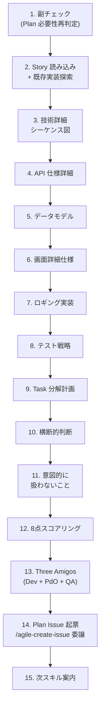
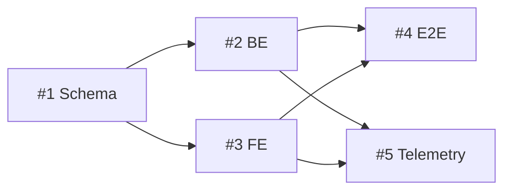

# Agile Refine Implementation Plan

Story Refinement 完了後、Story の sub-issue として Implementation Plan Issue を作成し、エンジニア視点の戦略を詳細化する。Story の「What/Why」と Task の「PR 単位の作業」の間に挟まる "How の戦略" 層を可視化する。

> 閾値（リファインメントセッションのタイムボックス）は `.claude/skills/references/team-context.md` を参照する。設定がなければ「軽量プリセット」をデフォルトに動く。

## When to Use

- Story Refinement が完了し、Plan 作成パスと判定された Story の Plan を作るとき
- 既存 Plan Issue を見直すとき (再 Refinement)
- `/agile-refine-implementation-plan` で手動実行
- `/agile-refine-backlog` の Step 9 から案内されたとき

## When NOT to Use

- Story の受入基準・Outcome がまだ未確定（→ `/agile-refine-backlog` を先に実行）
- 軽量パス (想定 Task 1-2 個 + 横断判断なし) → Plan は作らず `/agile-implementation-plan-to-task` で直接 Task 起票
- `nature:chaotic` の hotfix → Plan も Task 分解も不要、`/agile-task-implementation` 直行
- Plan の責務マップは `docs/agile-workflow/concepts/implementation-plan.md` を参照

## コーチングの原則

- **Plan は使い捨てドキュメント** — Expansion Pack の「PBI can evolve anytime, even while Product Developers work on it」と整合。実装中に変わってよい余白を残す
- **What/Why は Story、How は Plan** — エンジニア視点の詳細だけを Plan に書く。受入基準・Outcome の妥当性議論は Story Refinement に戻す
- **「ついで対応」を防ぐ** — 「意図的に扱わないこと」セクションで実装スコープを明示。Plan のフォーカスを鋭く保つ
- テンプレの質問で詰まったら **GROW モデル** （Goal → Reality → Options → Will）の順で問いを組み立て直す

## Workflow



---

## Step 1: 副チェック (Plan 必要性再判定)

Plan スキルが呼ばれた時点で、本当に Plan が必要かを再判定する。`docs/agile-workflow/concepts/implementation-plan.md` の判定フローを適用する。

**判定基準** (team-context.md preset 補正適用):

- `nature:chaotic` → Plan 不要、軽量フロー継続を案内
- `nature:experimental` → Plan 必須、続行
- `nature:implementable` で「想定 Task 1-2 個 + 横断判断なし + アーキ選択肢 1 つ」→ 軽量パス推奨
- それ以外 → Plan 作成パス、続行

**軽量パスの可能性が高い場合**:
> 「この Story なら Plan を作らず直接 Task 起票で十分そうです。それでも Plan を作りますか?」

ユーザーが「作る」と言えば続行、「不要」と言えば `/agile-implementation-plan-to-task` (Story 入力モード) を案内して終了。

---

## Step 2: Story 読み込み + 既存実装の探索

GitHub MCP の `issue_read` で対象 Story Issue を読み込み、以下を context として把握する:

- ユーザーストーリー文・概要
- 受入基準
- Outcome Done テーブル (観測指標・観測手段)
- ビジネスルール
- ユーザー体験フロー (概念レベルのシーケンス図)
- 未解決の質問

**既存実装の探索**: リポジトリ内の類似実装を Read / Grep で探索する。新規実装するのか既存パターンを踏襲するのかの判断材料を集める。

- 同種の API エンドポイント (例: `routes/*.ts`)
- 類似のデータモデル (例: 型定義、ER 図)
- 既存のテスト構造
- ADR (`docs/adr/`) の関連判断

**Status 遷移**: Plan Issue を **In Plan Refinement** に更新 (Step 14 で Plan Issue を起票するため、まだ Issue は存在しない。Step 14 後に遷移)。

---

## Step 3: 技術詳細シーケンス図

Story の概念フロー図を基に、**実装視点のシーケンス図** を作成する。Story のフロー図とは別物として、より詳細なレベルで書く。

**Story の概念フロー図との違い**:

| 観点 | Story の概念フロー | Plan の技術詳細シーケンス |
|------|------------------|----------------------|
| 粒度 | ユーザー操作 → システム応答 | API 呼び出し、データフロー、内部処理 |
| Participant | actor + 主要システム | actor + FE / API / DB / External 等を細分化 |
| 異常系 | 「異常系: 入力エラー」など概念レベル | 具体的なエラーレスポンスコード、フォールバック |

**対話の流れ**:
1. Story の概念フロー図を読み込む
2. 各ステップを「実装視点で何が起きるか」に展開
3. 外部依存 (Vision API、DB、外部サービス) の呼び出しを追加
4. エラーパスを具体化 (タイムアウト、レート制限、認証エラー等)
5. mermaid `sequenceDiagram` で表現、`alt/opt` で正常系/異常系を統合

---

## Step 4: API 仕様詳細

シーケンス図で列挙した API 呼び出しすべてについて、具体的な仕様を決める。

各エンドポイントについて以下を記述:

| 項目 | 内容 |
|------|------|
| エンドポイント | URL パス |
| メソッド | GET / POST / PUT / DELETE / PATCH |
| リクエスト | ヘッダ・パラメータ・body スキーマ |
| レスポンス | 成功時 body スキーマ |
| 認証・認可 | 認証方式 (Bearer Token / Cookie 等)、必要なスコープ |
| バリデーション | 入力検証ルール |
| エラーレスポンス | エラーコード一覧 + body スキーマ |

OpenAPI 形式で書いてもよい。

---

## Step 5: データモデル

新規エンティティの追加・既存エンティティの拡張がある場合、データモデルを定義する。

**選択肢**:
- **ER 図** (Mermaid `erDiagram`): エンティティ間の関係を可視化
- **型定義** (TypeScript / Schema): 構造を具体化
- **DB スキーマ** (CREATE TABLE 相当): RDB の場合

新規データが不要な場合はこの Step をスキップし「該当なし」と明記。

---

## Step 6: 画面詳細仕様

Story のユーザー体験フローから派生する各画面の **実装詳細** を記述。

各画面について:

| 項目 | 内容 |
|------|------|
| DOM 構造 | 主要コンポーネント階層 |
| 状態管理 | local state / global state / server state の方針 |
| コンポーネント分割 | 再利用可能なコンポーネントの単位 |
| デザインリンク | Figma 等のリンク |

画面が複数あればテーブル / セクションを繰り返す。

BE のみの Story (API だけ) ではこの Step をスキップ可。

---

## Step 7: ロギング実装

Story の Outcome Done テーブル「観測手段」欄と整合する形で、ロギング実装方針を確定する。

**判定**:

| インタラクション | 収集方法 |
|-----------------|---------|
| 画面遷移 / スクロール / クリック | GA 自動収集 (実装不要) |
| login, sign_up, purchase 等 | GA 推奨イベント (実装済み前提) |
| 上記でカバーできない測定したいインタラクション | カスタムイベント (新規実装) |
| 改善に役立たない | ロギング不要 |

カスタムイベントが必要な場合、イベント名・パラメータ・送信タイミングを具体化。

**Story の Outcome Done との整合性**: 観測手段欄に書かれた指標すべてに、ここで対応するロギング実装方針が紐づいているか確認。整合しなければ Story に戻して修正提案。

---

## Step 8: テスト戦略

ユニット / 統合 / E2E の配分と方針を決める。テストピラミッドに従い、ユニットを厚く、E2E を薄く。

| 種別 | 範囲 | モック方針 | 配分目安 |
|------|------|-----------|---------|
| ユニット | 関数・クラス単位、ビジネスロジック | 外部依存はすべてモック | 70-80% |
| 統合 | 複数モジュール、DB アクセス | 外部 SaaS のみモック | 15-25% |
| E2E | ユーザー操作シナリオ全体 | できる限りモックなし | 5-10% |

具体的なテストツール (Jest / Vitest / Playwright 等) も明記。

---

## Step 9: Task 分解計画

実装単位の PR (Task) に分解する。これは後段 `/agile-implementation-plan-to-task` の **入力になる重要な成果物**。

**粒度の基本ルール**（全パターン共通）:
- 1 Task = 1 PR
- 半日〜2日で完了するサイズ
- 10 個超えたら Story 自体を分割すべき兆候、`/agile-create-backlog` に戻す

**Task 数の目安と分割の切り口は team-context.md の「タスク分割単位」に従う**。`~/.claude/skills/references/team-context.md`（または利用先プロジェクトの `.claude/skills/references/team-context.md`）を読み込んで以下を取得する:

- `機能実装の分割パターン`: `USE_CASE` / `LAYER` / `COMPONENT` / `VERTICAL_SLICE` / `CUSTOM`
- `基盤・インフラ系改修の扱い`: `INLINE` / `SEPARATE_PR` / `N_A`
- `Task 1 個 = 何か（人間語）`: 自由記述例

team-context.md が未配置の場合は **軽量プリセット相当の `USE_CASE` + `INLINE`** をデフォルトとして仮定し、その旨を Plan に注記する。

### 分割パターン別ガイダンス

| 分割パターン | 1 Story あたりの Task 数目安 | 典型的な切り方 |
|---|---|---|
| `USE_CASE` | 3-6 個 | ユースケース単位で BE+FE を 1 PR にまとめる。1 Task = 1 ユースケース完成 |
| `LAYER` | 4-8 個 | BE / FE / Mobile / Infra のレイヤごとに分割。リポジトリ越境の依存に注意 |
| `COMPONENT` | 3-7 個 | サービス / モジュール / コンポーネント単位。`UserService` 追加、`OrderRepository` 改修など |
| `VERTICAL_SLICE` | 5-10 個 | 機能の小スライス（バリデーション層、エラーハンドリング、UI 1 状態など）を BE+FE 横断で |
| `CUSTOM` | チーム判断 | 「Task 1 個 = 何か」欄を踏襲。team-context の自由記述例を引用する |

### Infra 系改修の扱い

`基盤・インフラ系改修の扱い` の設定に従う:

- `INLINE`: Infra 改修が必要でも機能 Task に統合する。Task 一覧に独立した Infra Task を作らない
- `SEPARATE_PR`: DB migration / Terraform / IAM の変更があれば **独立した Task** として切り出す（タイトル prefix `[Infra]` / `[Migration]` 推奨）
- `N_A`: Infra 改修が発生しない前提。Plan 内で Infra に触れる必要が出たら Story を見直すサイン

### Task 一覧の形式

| # | Task タイトル | スコープ | 依存 | 想定 PR 数 |
|---|--------------|---------|------|----------|
| 1 | [Schema] API スキーマ定義 | apps/api/openapi/*.yaml | なし | 1 |
| 2 | [BE] エンドポイント実装 | apps/api/src/routes/*.ts | #1 | 1 |
| 3 | [FE] 撮影 UI | apps/web/src/*.tsx | #1 | 1 |
| 4 | [Test] E2E シナリオ | apps/e2e/*.spec.ts | #2, #3 | 1 |
| 5 | [Telemetry] 観測イベント | apps/api/src/metrics/* | #2, #3 | 1 |

Task タイトルの prefix（`[BE]` / `[FE]` / `[Schema]` / `[Migration]` / `[Telemetry]` 等）は分割パターンによって意味が変わる。`USE_CASE` なら prefix なしのユースケース名でも OK。`LAYER` なら prefix は必須。

**依存グラフ**: Mermaid `flowchart` で依存関係を可視化。循環なし。



---

## Step 10: 横断的判断

Task 単位では扱いにくい、Story 全体にまたがる判断を明示する。

- **セキュリティ**: 認証認可、データ保護、入力検証、画像/ファイル取扱い
- **パフォーマンス**: p95 レイテンシ目標、負荷想定、最適化方針
- **リトライ / フォールバック**: 外部依存への対応、サーキットブレーカー
- **運用 (ログ・監視・アラート)**: SRE 観点、メトリクス、SLI/SLO

「該当なし」も明記してよい。

---

## Step 11: 意図的に扱わないこと

実装スコープを明示的に絞り、「ついで対応」を防ぐ。Expansion Pack の Focus Value (やらないこと) と同じ精神。

例:
- 「Redis 永続化はしない、MVP は in-memory」
- 「認識結果キャッシングは Outcome 検証後に再評価」
- 「リトライ機構は SDK 内蔵に任せ、明示実装しない」
- 「画像のサムネイル生成は別 Story で扱う」

これがあると AI が Task 実装中に「ついで」を提案する頻度が激減する。

---

## Step 12: 品質スコアリング

Plan Issue を起票する **前に**、以下の 8 点スコアリングで完成度をチェックする:

| # | 観点 | 合格基準 |
|---|------|---------|
| 1 | **Strategy 明確性** | 全体方針が 3-5 行で説明可能 |
| 2 | **技術詳細シーケンス図** | 正常系/異常系の全パターンを網羅 |
| 3 | **API 仕様完備** | リクエスト/レスポンス/エラー/認証/バリデーション全記述 |
| 4 | **データモデル** | 必要なら ER 図 or 型定義あり (該当なしも OK) |
| 5 | **テスト戦略** | ユニット / 統合 / E2E の配分が明示 |
| 6 | **Task 分解整合** | PR 単位 (半日〜2日)、team-context の分割パターンに沿った Task 数、依存循環なし |
| 7 | **横断的判断** | セキュリティ / パフォーマンス / リトライ / 運用が記述 |
| 8 | **意図的に扱わないこと** | 明示されている (Focus の鋭さ) |

**8 点中 7 点以上で合格。6 点以下は書き直し。** ユーザーに各観点のスコアを提示して承認を得てから Step 13 へ。

---

## Step 13: Three Amigos レビュー (Dev + PdO + QA)

**3 つのサブエージェントを並列起動** し、Plan を多角的に検査する。

### Sub-agent A: Dev 視点 (メイン責務)

```
あなたは Dev リード視点で Implementation Plan を検査します。
実装可能性、API 設計の妥当性、データモデルの整合、テスト戦略の網羅性、Task 分解の合理性を見てください。

検査観点:
1. 実装戦略は技術的に妥当か (アーキ選択、ライブラリ選定)
2. API 設計は RESTful / RPC 原則に準拠しているか
3. データモデルは正規化されているか、関係が適切か
4. テスト戦略はテストピラミッドに沿っているか
5. Task 分解は 1 PR = 半日〜2日の粒度に収まるか、team-context の分割パターン（USE_CASE / LAYER / COMPONENT / VERTICAL_SLICE）に沿っているか、依存関係に循環がないか
6. 横断的判断 (セキュリティ・パフォーマンス) に重要な漏れがないか

各観点の判定 (OK / 要確認 / NG) と根拠を返してください。
```

### Sub-agent B: PdO 視点

```
あなたは PdO 視点で Implementation Plan を検査します。
Plan が Story の Outcome 仮説・受入基準・ビジネスルールを逸脱していないかを見てください。

検査観点:
1. Plan の実装内容が Story の Outcome を実現できるか
2. 受入基準が Plan で漏れなくカバーされているか
3. ビジネスルールが Plan の API 仕様・データモデルに反映されているか
4. Not-to-do リストや「意図的に扱わないこと」が VISION の Not-to-do と矛盾しないか

各観点の判定と根拠を返してください。
```

### Sub-agent C: QA 視点

```
あなたは QA 視点で Implementation Plan を検査します。
テスト戦略の網羅性、テスト容易性、観測可能性を見てください。

検査観点:
1. テスト戦略の配分は妥当か (ユニット中心、E2E 最小)
2. 各 Task の完了条件が Yes/No 判定可能か
3. エラーケースのテストが網羅されているか
4. ロギング実装は Outcome 観測に十分か

各観点の判定と根拠を返してください。
```

### 結果統合

3 サブエージェントの結果が出揃ったら、**視点を混ぜずに分けて** ユーザーに提示する:

```
[Dev 視点レビュー]
- (各観点の判定と理由)

[PdO 視点レビュー]
- (各観点の判定と理由)

[QA 視点レビュー]
- (各観点の判定と理由)
```

要確認 / NG の項目があれば対話で解消。修正後は該当視点だけ再起動。

---

## Step 14: Plan Issue 起票

`/agile-create-issue` スキルに委譲する。以下のパラメータを渡す:

- **Issue Type**: `"Implementation Plan"`
- **タイトル**: 「Implementation Plan for Story #{N}: {Story タイトル}」
- **本文**: Step 3-11 で確定した内容を `templates/implementation-plan.md` の構造に従って書く
- **親 Issue**: 対象 Story (sub-issue としてリンク)
- **ラベル**: Story の nature ラベルを継承 (`nature:implementable` / `nature:experimental`)

`/agile-create-issue` がテンプレート解決・Mermaid 検証・親子リンクを実行する。Status は In Planning で起票され、起票後 In Plan Refinement → In Plan Review → Done と遷移させる (起票後すぐに Done でもよいが、レビュープロセスに乗せるなら In Plan Review を経由)。

---

## Step 15: 次スキル案内

Plan Issue 起票完了後、ユーザーに次スキルを案内する:

```
✓ Implementation Plan Issue 起票完了: #{Plan Issue 番号}
✓ Status: In Plan Refinement (レビュー完了後 Done に遷移)
✓ 親 Story: #{Story Issue 番号}

次のステップ:
- Plan のレビュー完了 → /agile-implementation-plan-to-task で Task 起票
- 必要なら Plan の内容を修正してから Task 起票に進む
```

`/agile-implementation-plan-to-task` には Plan Issue 番号を渡す。Plan の Task 分解セクションを読んで Task Issue 群を起票する。

---

## 決定境界

全体マップは `docs/agile-workflow/concepts/ai-decision-boundary.md`を参照。本スキル固有の人間承認ゲート:

- **Plan 必要性の最終判断** — Step 1 副チェックで「Plan 不要かも」と提案されたとき、Plan を作るかどうかは人間判断
- **API 設計・データモデルの確定** — Step 4-5 の技術選択は AI が提案、人間が決定
- **テスト戦略の配分** — Step 8 のテストピラミッド解釈は人間判断
- **Task 分解粒度の確定** — Step 9 の Task 数・依存関係は人間承認
- **Plan Issue 起票実行** — Step 14 の `/agile-create-issue` 委譲前の最終確認

NEVER（次節）はこのゲートの違反を具体的に列挙している。

---

## エッジケース

| 状況 | 対応 |
|------|------|
| Story の受入基準が TBD | `/agile-refine-backlog` に戻して受入基準を確定してから Plan 作成 |
| Story の Outcome Done が未定義 | 同上 (Plan の観測手段が定まらない) |
| Task 想定が 10 個超 | Story が大きすぎる、`/agile-create-backlog` で Story 分割を提案 |
| 既存実装の探索で類似パターンが見つからない | 「新規実装」を Plan に明記、ADR 作成を提案 |
| Dev 視点レビューで実装不可と判定 | Plan を作り直し、または Story Refinement に戻して受入基準を緩める |
| Plan の規模が大きすぎる (5000 行超) | Story 分割か Plan 分割を検討 |
| MCP ツール利用不可 | 一覧と本文テンプレをユーザーに提示し作成を委ねる |

---

## NEVER — アンチパターン

- **絶対に** Story の責務 (受入基準・Outcome 仮説・ビジネスルール) を Plan に重複させない — Story と Plan の責務分離が崩れる
- **絶対に** Plan で PR を出さない — Plan はドキュメントなので PR は出ない。`In Coding Progress` / `In Code Review` Status は使わない
- **絶対に** Plan を Task の親 Issue にしない — Plan と Task はどちらも Story の sub-issue として並列
- **絶対に** 軽量 Story に Plan を作らない — 想定 Task 1-2 個 + 横断判断なしの Story に Plan を作るのはオーバースペック。Step 1 副チェックで判定
- **絶対に** Three Amigos 並列検査をスキップしない — 3 視点で多角的に検査することが Plan の品質保証の中核
- **絶対に** Plan を Story の前に作らない — Plan の前提は Story の受入基準・Outcome 仮説。Story Refinement を先に終わらせる

---

## References

このスキルが参考にしている書籍・記事・フレームワーク:

- 📦 [Scrum Guide Expansion Pack](https://scrumexpansion.org/) — Sprint Backlog "actionable plan for the Increment" / AI and Scrum (Plan 作成への AI 活用)
- 📖 [INSPIRED](https://www.amazon.co.jp/s?k=INSPIRED+Marty+Cagan)（Marty Cagan）— Discovery → Delivery への引き渡しドキュメント
- 📖 [アジャイル型プロジェクトマネジメント](https://www.amazon.co.jp/s?k=アジャイル型プロジェクトマネジメント)（Jim Highsmith）— 実装戦略の設計
