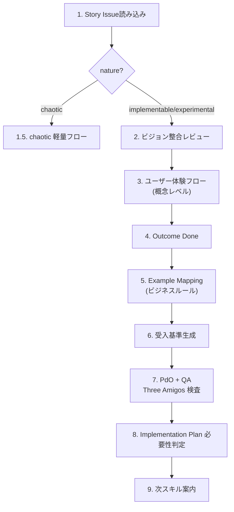
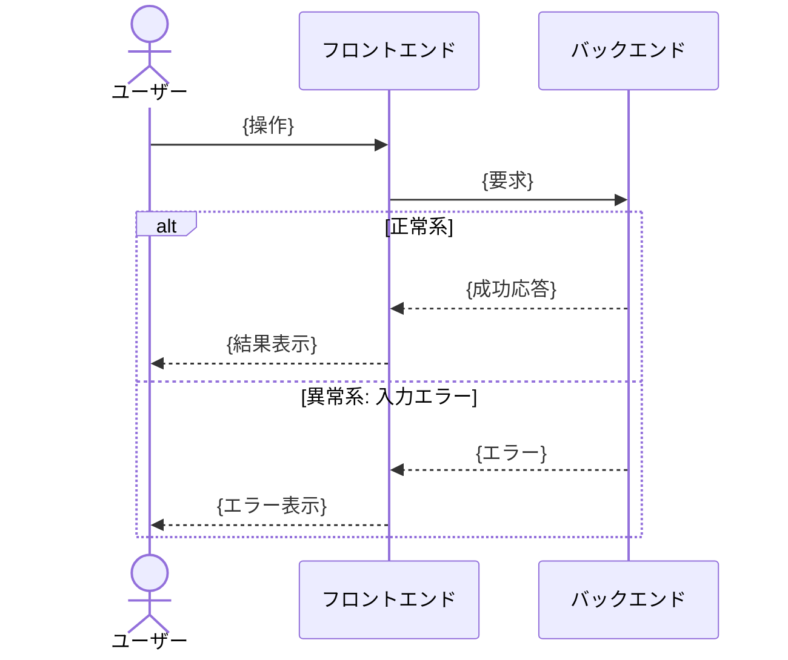

# Agile Refine Backlog

> 🗣️ **ユーザーへの質問**: 選択肢が有限なら `AskUserQuestion` ツールを優先 (2-4 個の選択肢、推奨は先頭に `(Recommended)` を付ける)。自由記述が要る箇所はテキスト対話のまま。
> 📋 **進捗管理**: Workflow が 5 つ以上の Step を持つ場合、各 Step を `TaskCreate` で起こし、着手時に `TaskUpdate` で `in_progress`、完了時に `completed` に遷移させる。途中中断時の再開ポイントが示せ、並列サブエージェント (Three Amigos 等) の進捗も可視化できる。
> 📐 **不可逆操作の承認**: Issue 起票 / PR 作成 / Project Status 遷移 / Workflow 設定変更など外部状態を変える操作の前に、`ExitPlanMode` で計画を提示し人間の承認を取る (Plan mode 経由)。

Story Issue を **PdO/QA 視点 (What/Why)** で詳細化する。受入基準・Outcome 仮説・ビジネスルールを確定させ、Story を Ready 状態に持っていく。エンジニア視点の詳細 (API 仕様・データモデル・Task 分解等) は **Implementation Plan** に分離する。

> 閾値（リファインメントセッションのタイムボックス、Example Mapping のルール上限、未解決質問の上限）は `.claude/skills/references/team-context.json` を参照する。設定がなければ「軽量プリセット」（副業チーム想定 = refine 25-30 分、ルール 5 個、質問 3 個）をデフォルトに動く。

## When to Use

- Story Issue を PdO/QA 視点で詳細化するとき
- 受入基準・Outcome 仮説・ビジネスルールを確定させるとき
- 実験計画を策定するとき (experimental Story)
- `/agile-refine-story` で手動実行

## When NOT to Use

- Epic の定義（→ `/agile-create-epic`）
- Epic から Story への分解（→ `/agile-create-stories`）
- 実装戦略・API 仕様・Task 分解の詳細化（→ `/agile-refine-implementation-plan`）
- リファインメント済み Story の Task 分解（→ `/agile-decompose-task-from-implementation-plan`）
- プロダクトの方向性が未定義（→ `/agile-craft-vision`）

## コア原則

- **What/Why は Story、How は Implementation Plan** — Story には「何を/なぜ」だけを書く。「どう実装するか」は Implementation Plan に分離する
- **Story = PdO/QA レビュー対象** — エンジニア視点の詳細を Story に書くと、PdO/QA レビュー時の認知負荷が増す
- **実装方法は書くな、振る舞いを書け** — どの関数・どのファイルを変更するかは Implementation Plan / CodingAgent の責務。Story には「何が起きるべきか」を書く
- **Implementation Plan の責務マップは `docs/agile-workflow/concepts/implementation-plan.md` 参照** — 何が Story で何が Implementation Plan に行くかの境界を確認
- テンプレの質問で詰まったら **GROW モデル** （Goal → Reality → Options → Will）の順で問いを組み立て直す

## Workflow



---

## Step 1: Story Issue 読み込み

**Story の特定**: ユーザーが Issue 番号や URL を指定していない場合、`.claude/skills/references/github-projects.json` のコマンドテンプレートで **Status "In Plan Refinement"** のアイテムを抽出し、チケット名の一覧をユーザーに提示して選択してもらう。0 件の場合は **Status "In Planning"** で再検索し、「In Plan Refinement のチケットが 0 件ですが、In Planning のものを Refinement しますか？」とチケット名の一覧を提示。In Planning も 0 件の場合は「対象のチケットがありません。Issue 番号を直接指定してください」と案内する。

対象の Story Issue のステータスが "In Plan Refinement" でない場合、`bash ~/.claude/skills/agile-update-skills/scripts/update-issue-status.sh <story-issue-number> "In Plan Refinement" [app-name]` を実行する。

対象の Story Issue を GitHub MCP の `issue_read` で読み込み、以下を確認する:
- `nature` ラベル (implementable / experimental / chaotic)
- 親 Epic の Opportunity Canvas（背景の確認）
- 既に埋まっているセクションと TBD のセクション

**MANDATORY** : テンプレート構造の確認のため、Story テンプレートを次の順で解決する:

1. リポジトリ側 `.github/ISSUE_TEMPLATE/story.md` を最優先
2. 無ければ `agile-create-stories/templates/story.md`（同梱フォールバック）を参照する

Issue 本文が解決したテンプレートに沿っていない場合は、テンプレートの構造に合わせて整形してから詳細化を開始する。新 Story テンプレは PdO/QA 視点に絞られているので、既存 Issue にエンジニア視点セクション (API 仕様等) が含まれる場合は、本 Refinement での扱いをユーザーに確認: 「これらは Implementation Plan に移しますか? それとも Story から削除しますか?」

**nature ラベルがない場合**: 「このストーリーの受入基準（{状況}のとき、{操作}したら、{結果}になる）を今すぐ書けますか?」と聞き、Cynefin 分類を実施してラベルを付与してから詳細化を開始する。Chaotic の判定（事業継続への深刻な影響の有無）も同時に確認する。

---

## Step 2: nature:chaotic の場合の軽量フロー（該当時のみ）

Story が `nature:chaotic` ラベルを持つ場合、通常の Step 3 〜 Step 10 を流すと時間がかかりすぎ、Cynefin Chaotic ドメインの原則（`act → sense → respond`）に反する。安定化を最優先するため、以下の最小限で完了とする。

**実施するステップ**:
- **Step 7 受入基準のみ**: hotfix 完了の判定条件を最小限で記述（例: 「ユーザー X が再ログインできる」「エラー率が Y% 以下に戻る」）
- **PdO 視点 1 サブエージェントだけ走らせる**（Step 8 の Sub-agent A 相当のみ）: 「事業影響観点で hotfix 内容が妥当か」だけ検査

**スキップするステップ**:
- Step 3 ビジョン整合レビュー
- Step 4 ユーザー体験フロー
- Step 5 Outcome Done（緊急対応の Outcome は「事業継続」一択で自明）
- Step 6 Example Mapping
- Step 8 通常の Three Amigos 並列検査（PdO 視点だけで完了）
- Step 9 Implementation Plan 必要性判定 (chaotic は常に Implementation Plan 不要)

**完了後**:
- Status を **"Ready"** に直接設定
- `/agile-implement-task` に直結 (Task 分解もスキップ)
- 「Chaotic でも CI green は守る」: TDD を妥協しない

**事後 — 必ず実施**:
安定化後、別 Issue として **postmortem** を記録する。詳細は `docs/agile-workflow/concepts/cynefin.md` 参照。

`nature:chaotic` でない通常の Story は Step 3 へ進む。

---

## Step 3: ビジョン整合レビュー（PdO 視点サブエージェント — 事前判定）

**サブエージェントを起動** し、PdO 視点で以下を検査させる。これは refinement に着手すべきストーリーかの **事前判定** で、Step 8 の事後検証とは別目的。メインのコンテキストを圧迫しないよう、評価はサブエージェントに委譲する。

**サブエージェントへの指示**:
```
あなたは PdO（プロダクトオーナー）視点で Story Issue を検査します。
技術的実現性やテスト手順には踏み込まず、ユーザー価値・ビジョン整合・Not-to-do
との衝突だけを見てください。

以下の Story Issue と docs/vision/README.md を読み込み、整合性を検査してください。

検査観点:
1. 価値の単一性: この Story が提供するユーザー価値は1つに絞られているか
2. ミッション整合: ビジョンのミッションに貢献するか
3. Not-to-do 整合: Not-to-do リストに該当しないか
4. 成功指標への紐づき: ビジョンの成功指標に関連するか

結果を以下の形式で返してください:
- 各観点の判定（OK / 要確認 / NG）
- NG・要確認の場合は具体的な理由
```

**サブエージェントの結果に基づく対応**:
- 全てOK → Step 4 に進む
- 要確認/NG がある → ユーザーに結果を提示し、「進めてよいですか?」と確認

---

## Step 4: ユーザー体験フロー (概念レベル)

ユーザーがゴールに到達するまでの **概念レベル** の体験フローを mermaid `sequenceDiagram` で表現する。

**Story のフロー図と Implementation Plan の技術詳細シーケンス図の違い**:

| 観点 | Story (本 Step) | Implementation Plan |
|------|-----------------|------|
| 粒度 | ユーザー操作 → システム応答 | API 呼び出し、データフロー、内部処理 |
| Participant | actor + 主要システム (FE / Backend 等) | actor + FE / API / DB / External 等を細分化 |
| 異常系 | 「異常系: 入力エラー」「異常系: 権限エラー」など概念レベル | 具体的なエラーレスポンスコード、フォールバック |

**Story 側で書くこと**:
- ユーザー操作の流れ
- システムからの応答 (成功時 / 失敗時の概念)
- 画面遷移の有無
- 異常系のパターン (バリデーション失敗、権限不足、一時的障害) を概念レベルで

**Story 側で書かないこと (Implementation Plan に委ねる)**:
- API のリクエスト/レスポンスの具体構造
- DB アクセスや外部呼び出しの順序
- エラーレスポンスコードの詳細
- 内部処理の分岐

**対話の流れ**:
1. 「このストーリーのメインユーザーは誰ですか?」
2. 「ユーザーがゴールに到達するまでにどんな画面 / システムと相互作用しますか?」
3. 正常系の流れを概念レベルで組み立てる
4. 異常系のパターン (概念レベル) を `alt` / `opt` ブロックで統合する

**出力する図のフォーマット**:



図を作成したらユーザーに提示し、「この体験フローで漏れはありませんか?」と確認する。

---

## Step 5: Outcome Done の定義

受入基準（Step 7）が **Output Done**（実装が完了した状態）を定義するのに対し、ここでは **Outcome Done**（このストーリー完了でどの指標がどう動けば価値が出たと判断できるか）を定義する。

**対話の流れ**:
1. 親 Epic の Outcome 仮説テーブルを参照する
2. Story 単位の Outcome Done を以下フォーマットで記述する:

   | 観測指標 | 期待する変化 | 観測タイミング | 観測手段 |
   |---|---|---|---|
   | {指標名} | {例: 完了率が現状 X% → Y% に上昇} | {即時 / 数日 / 数週 / 次回観測サイクル} | {既存ロギング / Implementation Plan のロギング実装で追加 / 手動集計} |

3. 「観測手段」欄が現実的か確認する。**観測手段を持たない指標は仮説として無効** — 削除するか、Implementation Plan で観測実装を追加する前提にする
4. 「動かなかったときに何を学びとするか」を一行で記述する（仮説の反証も学習として扱う）

**安全弁**:
- 観測コストが投資に見合わないストーリーは `> 観測しない（理由: ...）` で残してよい
- 探索系（`nature:experimental`）の Story は実験計画セクションが Outcome Done を兼ねる

**Implementation Plan との分担**:
- 観測指標の **存在 / 期待値 / 観測手段の方針** は Story (本 Step) で確定
- 観測手段の **具体実装** (GA event 名、カスタムイベント実装の詳細) は Implementation Plan の Step 8 で確定

---

## Step 6: Example Mapping によるビジネスルール抽出

Story のビジネスルール (誰がいつ何を許可されるか、どの値が有効か、状態遷移の制約) を Example Mapping で網羅する。

**4 色マップと既存セクションの対応**:

| 色 | 意味 | 既存対応 |
|---|------|---------|
| 黄 | User Story（題目） | Step 1 で読み込んだ Story 本体 |
| 青 | Rules（ビジネスルール） | **本ステップで抽出して Story 本文の「ビジネスルール」欄に記録** |
| 緑 | Examples（具体例） | 次の Step 7 で受入基準として展開 |
| 赤 | Questions（未解決の質問） | Story 本文の「未解決の質問」欄に記録、`> TBD` で残す |

**対話の流れ**（タイムボックス 25 分目安）:

ルール列挙時、漏れを防ぐために PdO / QA の 2 視点で問う:
- **PdO 視点**: 「このルールはユーザー価値を損なわないか? ビジネス上の制約はないか?」
- **QA 視点**: 「このルールはテストできるか? 境界値や異常系を観測できるか?」

(Dev 視点の「実装可能性」「どのレイヤーで判定するか」は Implementation Plan Refinement の Step 13 で扱う)

1. **ルール列挙（青）**: 「このストーリーで許可すべき条件 / 拒否すべき条件 / 入力の制約 / 状態遷移の制約は?」
   - 体験フロー図の alt/else から抽出されるもの + 図に出てこない暗黙のもの（権限、上限値、業務時間、レート制限など）
   - 例: 「金額は 1 円以上、上限は会員ランク依存」「キャンセルは依頼者本人のみ可能」
2. **具体例（緑）**: 各ルールに対して 1〜3 個の具体例（典型値・境界値・エッジケース）
3. **質問（赤）**: 解決できない論点は質問として記録

**判断基準**（閾値は `team-context.json` のプリセットに従う。下記カッコ内は軽量プリセット値）:

- ルール **上限超え（軽量: 5 個 / 標準: 7 個 / 集中: 10 個）** → Story の責務が広がりすぎ。`/agile-create-stories` に戻って Story 分割を検討
- 質問 **上限超え（軽量: 3 個 / 標準: 5 個 / 集中: 8 個）** → リファインメント完了とせず、依頼元（PdO・法務など）への確認を先行
- タイムボックス **超過（軽量: 25 分 / 標準: 30-60 分 / 集中: 60-90 分）** → ルールが複雑すぎる兆候。同上

---

## Step 7: 受入基準生成

Step 4 のユーザー体験フローと **Step 6 のルール / 具体例** から受入基準を生成する:

```
- [ ] {状況}のとき、{操作}したら、{結果}になる
```

- 正常パターン → 正常パターンの受入基準
- 異常パターン → 異常パターンの受入基準
- 1つの受入基準で1つの振る舞いをテストする
- **Yes/No 判定可能**なレベルで書く
- 実装の詳細は書かない (それは Implementation Plan へ)

---

## Step 8: PdO + QA Three Amigos 並列網羅性検査

**2 つのサブエージェントを並列起動** し、PdO 視点と QA 視点で網羅性を検査する。Dev 視点の詳細検査は Implementation Plan Refinement (Step 13) に移管された。

主エージェントの責務はオーケストレーションのみ:

1. 2 サブエージェントを **同一メッセージ内で並列起動**
2. 結果が出揃ったら視点別に整理してユーザーに提示
3. ユーザー回答を踏まえて修正後、未解消視点だけ再起動

### Sub-agent A: PdO 視点（事後検証）

```
あなたは PdO 視点で Story Issue の網羅性を検査します。技術的実現性やテスト手順
には踏み込まず、ユーザー価値・ビジョン整合・Not-to-do との衝突だけを見てくだ
さい。Step 3 で同じ視点の事前判定を実施済みなので、本検査では「リファイン過程
で価値仮説からズレていないか」を中心に確認します。

以下の Story Issue 本文と docs/vision/README.md を読み込み、検査してください。

検査観点:
1. ビジョン整合（事後）: Step 3 のレビュー以降に追加された記述が、依然として
   ミッションに沿っているか
2. Outcome Done の妥当性: 設定された指標は本当にユーザー価値を反映するか
3. Not-to-do 違反の混入: 受入基準に「やるべきでないこと」が紛れていないか
4. 価値の単一性維持: Story 全体として 1 つのユーザー価値に絞られているか

結果は以下の形式で返してください:
- 各観点の判定（OK / 要確認 / NG）
- 要確認・NG の場合は具体的な箇所と理由
```

### Sub-agent B: QA 視点（テスタビリティ）

```
あなたは QA エンジニア視点で Story Issue の網羅性を検査します。実装の詳細や
ビジネス整合には踏み込まず、「テスト可能か / 漏れているテストケースはないか」
だけを見てください。

以下の Story Issue 本文を読み込み、検査してください。

検査観点:
1. 受入基準の対応: ユーザー体験フローの全パターン（正常・異常）に対応する受入基準
   が存在するか
2. 異常系対処の完全性: 全異常パターンに対処（ユーザー表示・概念レベルでの対処）
   が定義されているか
3. ビジネスルール網羅: Step 6 で抽出したルールがすべて受入基準に対応しているか
4. Outcome Done の観測タイミング妥当性: 観測タイミングが指標の性質と合っているか
5. 受入確認シナリオ: 自動テストでカバーしにくい UI・文言・操作感の観点が含まれるか

結果は以下の形式で返してください:
- 各観点の判定（OK / 未定義あり）
- 未定義の場合は具体的な箇所と漏れているテストケース
```

### 結果統合（主エージェント）

2 サブエージェントの結果が出揃ったら、視点を **混ぜずに分けて** ユーザーに提示する:

```
[PdO 視点 検査結果]
- (各観点の判定と理由)

[QA 視点 検査結果]
- (各観点の判定と理由)
```

視点間で **矛盾する指摘** が出た場合は、それ自体を論点としてユーザーに提示し、採否判断を仰ぐ。

### 視点別の合格基準（点数化）

| 視点 | 観点総数 | 合格ライン |
|---|---:|---|
| Sub-agent A（PdO） | 4 | **4 点中 3 点以上 OK で合格** |
| Sub-agent B（QA） | 5 | **5 点中 4 点以上 OK で合格** |

**2 視点すべて合格で Story Refinement 完了**。1 視点でも不合格なら追加質問。

### 結果に基づく対応

- **いずれかの視点で不合格 / 未定義 / 要確認 / NG**: ユーザーに提示し追加質問。回答を反映後、**該当視点のサブエージェントだけ** 再起動する
- **2 視点すべて合格**: Issue 本文を `issue_write` で更新する **前に** Mermaid 構文を検証する:
  ```bash
  echo "{Issue本文}" | node .claude/scripts/validate-mermaid.mjs
  ```
  バリデーションエラーがあれば Mermaid 図を修正してから更新する。Story Status を **"In Plan Review"** に自動更新し、Step 9 へ進む。

---

## Step 9: Implementation Plan 必要性判定

`docs/agile-workflow/concepts/implementation-plan.md` の判定フローを適用し、Implementation Plan を作るか軽量パスかを判定する。

**判定基準**:

| 条件 | 帰結 |
|------|------|
| `nature:chaotic` (Step 2 で対応済み、ここに来ない) | — |
| `nature:experimental` | **Implementation Plan 必須** (実験計画として Strategy が必要) |
| `nature:implementable` で **想定 Task 1-2 個 + 横断的判断なし + アーキ選択肢 1 つ** | **軽量パス** (Implementation Plan 不要、Story 直接 Task) |
| `nature:implementable` でそれ以外 | **Implementation Plan 作成** |

**team-context.json preset 補正**:

- 軽量プリセット (副業 1-3 名) → 想定 Task 3 個まで軽量パス許可
- 標準プリセット → デフォルト基準を厳格適用
- 集中プリセット → 想定 Task 2 個でも Implementation Plan 作成推奨

実際の閾値は `team-context.json` の「Implementation Plan 作成パスの想定 Task 数閾値」「横断的判断閾値」を参照。

**人間承認ゲート**: AI が判定根拠と結論をユーザーに提示し、最終決定は人間。「この Story は Implementation Plan 作成パスです」「軽量パスです」をユーザーが承認。

---

## Step 10: 次スキル案内

判定結果に基づき次スキルを案内:

- **Implementation Plan 必要** → 「次は `/agile-refine-implementation-plan` を実行してください。Implementation Plan Issue を Story の sub-issue として起票します。」
- **Implementation Plan 不要 (軽量パス)** → 「次は `/agile-decompose-task-from-implementation-plan` を実行してください (Story 入力モード)。Story から直接 Task Issue を起票します。」
- **chaotic** (Step 2 経由) → 「Status を Ready に設定済みです。`/agile-implement-task` で hotfix 実装に進んでください。」

---

## 決定境界

全体マップは `docs/agile-workflow/concepts/ai-decision-boundary.md`を参照。本スキル固有の人間承認ゲート:

**Plan mode の活用**: 下記の人間承認ゲートのうち、Issue / PR / Project Status / Workflow など外部状態を変える操作の直前は `ExitPlanMode` 経由でユーザー承認を取る (Plan mode で計画提示 → ユーザーが承認/修正指示)。読み取り系・対話系のゲートは通常のテキスト確認で十分。

- **Example Mapping のルール抽出** — Step 6 のビジネスルール列挙はドメイン知識が必要で、AI は問いを投げるだけ
- **Outcome Done の確定** — Step 5 の観測手段・期待する変化は人間判断（観測コストと学習価値のトレードオフ）
- **Story Refinement 完了** — Status: In Plan Review への遷移は人間承認
- **Implementation Plan 必要性の最終判断** — Step 9 で AI が判定するが、最終決定は人間
- **質問 3 個超時の差し戻し** — 「依頼元への確認待ち」とするか、強行するかは人間判断

NEVER（次節）はこのゲートの違反を具体的に列挙している。

---

## エッジケース

| 状況 | 対応 |
|------|------|
| nature ラベルがない | Cynefin 分類を実施してラベルを付与してから詳細化を開始 |
| 既存 Story にエンジニア視点セクションが含まれる (API 仕様等) | ユーザーに確認: 「Implementation Plan に移しますか? Story から削除しますか?」 |
| 対話中に Story が大きすぎることが判明 | `/agile-create-stories` に戻って分割を提案 |
| 未解決の疑問が残る | 該当箇所に `> TBD: {疑問内容}` を残し、リファインメント完了としない |
| 体験フローで「実装方法を書きたい衝動」が出る | Implementation Plan に書く、Story には書かない (責務分離を守る) |

## NEVER — アンチパターン

- **NEVER: Story にエンジニア視点の詳細を書くな** — API 仕様詳細・データモデル・画面 DOM 構造・ロギング実装は Implementation Plan の責務。Story にこれらを書くと PdO/QA レビューの認知負荷が上がる
- **NEVER: リファインメント未完了の Story を Ready 状態にするな** — Step 8 の検査を通過していない Story を Ready にすると、後工程で実装中の手戻りが多発する
- **NEVER: 実装方法を書くな** — 「UserServiceのloginメソッドを修正」のような指示は書かない。Story には「何が起きるべきか」だけを書く
- **NEVER: 未定義のパターンを残したまま Ready 状態にするな** — CodingAgent / Implementation Plan は未定義パターンに遭遇すると自己判断で実装するが、その判断がビジネスルールと合わない場合、本番で初めて問題が発覚する
- **NEVER: ユーザー体験フローを省略するな（複数アクターが関わる場合）** — 図なしでパターンを列挙すると見落としが発生する
- **NEVER: Claude が洗い出したパターンだけで完了とするな** — LLM は一般的なパターンは網羅できるが、ドメイン固有の業務ルールは知り得ない。必ずユーザーに確認する
- **NEVER: Implementation Plan 必要性判定を独断で決めるな** — Step 9 の判定は人間承認ゲート。AI が「Implementation Plan 不要」と判断しても、人間が「Implementation Plan を作りたい」と言えばそれに従う

---

## References

このスキルが参考にしている書籍・記事・フレームワーク:

- 🌐 Painless Functional Specifications by Joel Spolsky — 仕様書記法 (PdO/QA 視点の What/Why に絞り込んだ部分)
  - [Part 1: Why Bother?](https://www.joelonsoftware.com/2000/10/02/painless-functional-specifications-part-1-why-bother/)
  - [Part 2: What's a Spec?](https://www.joelonsoftware.com/2000/10/03/painless-functional-specifications-part-2-whats-a-spec/)
- 🌐 [Agile Story Essentials](https://www.jpattonassociates.com/wp-content/uploads/2015/03/story_essentials_quickref.pdf)（Jeff Patton, PDF）— Refinement・受入基準・INVEST
- 📖 [INSPIRED](https://www.amazon.co.jp/s?k=INSPIRED+Marty+Cagan)（Marty Cagan）— Refinement の進め方
- 📦 [Scrum Guide Expansion Pack](https://scrumexpansion.org/) — Holistic Testing（Definition of Outcome Done / Example Mapping / Three Amigos）/ PBI フォーマット自由
