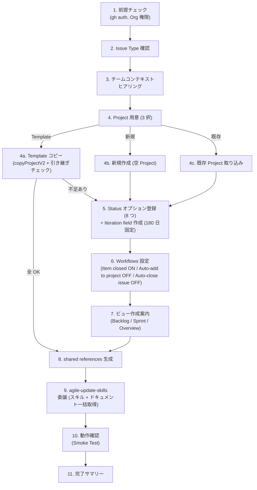

# Agile Project Setup

> 🗣️ **ユーザーへの質問**: 選択肢が有限なら `AskUserQuestion` ツールを優先 (2-4 個の選択肢、推奨は先頭に `(Recommended)` を付ける)。自由記述が要る箇所はテキスト対話のまま。
> 📋 **進捗管理**: Workflow が 5 つ以上の Step を持つ場合、各 Step を `TaskCreate` で起こし、着手時に `TaskUpdate` で `in_progress`、完了時に `completed` に遷移させる。途中中断時の再開ポイントが示せ、並列サブエージェント (Three Amigos 等) の進捗も可視化できる。
> 📐 **不可逆操作の承認**: Issue 起票 / PR 作成 / Project Status 遷移 / Workflow 設定変更など外部状態を変える操作の前に、`ExitPlanMode` で計画を提示し人間の承認を取る (Plan mode 経由)。

`agile-*` スキル群が前提とする GitHub Project (v2) の構成を、対話で 1 回流すだけで揃える。やる範囲は次のとおり:

- Issue Type の登録確認 (Epic / Story / Implementation Plan / Task)
- GitHub Project (v2) の用意 — **3 経路**:
  - **Template からコピー (Recommended)**: `mrtry-lab/Agile Project Sample` を copyProjectV2 で複製。Status 8 options / Iteration field 180 日 / 3 Views / Workflows が初期状態で揃った Project が一発で立ち上がる
  - 新規作成: 空 Project を作って Status / Iteration field / Workflows / Views を手動で組み立てる (template 不使用)
  - 既存 Project の取り込み: 手動で構成済みの Project を確認、不足分だけ補完
- 引き継ぎ状況の自動チェック (template 経路) — Status options / Iteration field / Workflows / Views を skill が検査
- 不足項目だけ手動 setup の fallback に降りる
- `shared/references/github-projects.json.template` からプロジェクト固有値を埋めて `.claude/skills/references/github-projects.json` を生成

## When to Use

- `agile-*` スキル群を初めて自分のプロジェクトに導入するとき
- Project は作ったが `.claude/skills/references/github-projects.json` をまだ作っていない / 古いとき
- Status オプションやビューの設定がバラついていて整えたいとき

## When NOT to Use

- agile 系を使わず軽量版 (`create-issue` / `create-pull-request`) だけで十分な場合 — Project 設定は不要
- 既に `.claude/skills/references/github-projects.json` が動いていて、変更したい箇所がピンポイントな場合 — 該当箇所を直接編集する方が速い

## Workflow



---

## Step 1: 前提チェック

同梱スクリプトで gh 認証と `project` スコープを確認:

```bash
bash <skill-dir>/scripts/check-prereqs.sh
```

(skill-dir は `~/.claude/skills/agile-setup-project/` か `<project>/.claude/skills/agile-setup-project/`。以降同じ)

スクリプトが exit code 2 (project スコープ不足) を返したら `gh auth refresh -s project,read:org` を案内する。

ユーザーに「対象 Organization 名」と「Project の対象 Repository（あれば）」を確認する。

---

## Step 2: Issue Type 確認

`Epic` / `Story` / `Implementation Plan` / `Task` の 4 つの Issue Type が Organization に登録されている必要がある。**GraphQL API / gh CLI とも未対応**で、Web UI 操作が必須。

### 実行方法 (browser 操作が主、手動が fallback)

**Claude が browser で操作する** のが既定。実行前に `AskUserQuestion` でユーザーに「これから browser で Issue Type 4 つの登録を実行します。よろしいですか?」を確認してから着手する。

`Read` で `<skill-dir>/references/browser-issue-types.md` を読み込み、その指示書に従って browser を操作する。`<ORG>` を Step 1 で取得した値に置換。完了後、画面 screenshot をユーザーに提示して確認を取る。

**手動 fallback**: browser が利用できない / 失敗したときは以下を案内:

> Organization Settings → Planning → Issue types に移動し、`Epic` / `Story` / `Implementation Plan` / `Task` が登録されているか確認してください。
> URL: `https://github.com/organizations/<ORG>/settings/issue-types`
>
> 未登録ならその場で作成してもらう。色やアイコンの選択肢は自由。

| Issue Type | 主責務 |
|------------|--------|
| Epic | プロダクト機会 (Opportunity Canvas) |
| Story | PdO/QA 視点の要件 (受入基準・Outcome 仮説・ビジネスルール) |
| Implementation Plan | Dev リード視点の戦略 (技術詳細・API 仕様・Task 分解) |
| Task | 1 PR 単位の実装作業 |

確認できたら次へ。4 つ揃わないと agile-* スキルは Issue 作成時にエラーになる。

---

## Step 3: チームコンテキストヒアリング

agile-* スキル群の閾値（タイムボックス・Epic 同時数・ペルソナ数など）はチームの稼働状況に依存する。フルタイムチームと副業チームで同じ閾値を使うと、前者は緩すぎ、後者は厳しすぎになる。本ステップで前提を聞き取って `~/.claude/skills/references/team-context.json`（または利用先プロジェクトの `.claude/skills/references/team-context.json`）に保存し、各 agile-* スキルが参照できるようにする。

### ヒアリング項目

ヒアリングはすべて `AskUserQuestion` を使い、**質問本文 + 各選択肢の具体例** を必ず添える。「USE_CASE / LAYER / ...」のような技術キーで聞き返さない — ユーザーは初見でその語を知らない前提。各質問の前に「なぜ聞くか」「答えが skill 全体にどう効くか」を 1 文補足する。

#### Q1. チーム体制

> 「このプロダクトに継続的に手を入れるチームの体制を教えてください。これでプリセット (タイムボックスや同時並行 Epic 数の上限など) のデフォルト値が決まります」

`AskUserQuestion`:

| label | description |
|---|---|
| 全員フルタイム | このプロダクトの開発が本業。1 日 6-8h 程度を割ける |
| フルタイム + 副業 (混合) | コア担当はフルタイム、サポートが副業 / 業務委託 |
| 全員副業 / 隙間時間 | 本業の合間に進める。1 人あたり週 5-10h 程度 (Recommended for 個人プロジェクト) |

#### Q2. メンバー数 (テキスト)

> 「現在このプロダクトに関わっている人は何人ですか? (1 人でも OK)」

自由入力。

#### Q3. 週合計稼働時間 (テキスト)

> 「チーム全員の稼働を足して、1 週間でだいたい何時間ぐらいになりますか? 厳密でなくて、感覚で大丈夫です」

例も提示: 「副業 3 人 × 5h なら 15h」「フルタイム 2 人 + 副業 1 人 × 5h なら 85h」

→ Q1 + Q3 でプリセット (軽量 / 標準 / 集中) を自動判定:

| プリセット | 想定稼働 | 主な閾値 |
|---|---|---|
| **軽量** | 週 20h 以下 / 副業中心 | Epic 2-3、ペルソナ 1-2、refine 25-30 分、Vision 30-60 分 |
| **標準** | 週 40-80h / 混合 | Epic 5-7、ペルソナ 2-3、refine 30-60 分、Vision 60-90 分 |
| **集中** | 週 100h 以上 / フルタイム中心 | Epic 10+、ペルソナ 3-5、refine 60-90 分、Vision 2-3 時間 |

判定結果をユーザーに提示し、AskUserQuestion で「この設定で進めてよいか / 別のプリセットに切り替えるか」を確認。

#### Q4. チーム固有事情 (テキスト、任意)

> 「他にチーム特有の事情があれば教えてください。例: 時差 (国内のみ / EU と JP / etc)、拠点 (全員リモート / 一部出社)、スキル偏り (フロント中心、BE は外部協力者依存)、その他 (育休復帰予定など)。なければスキップで OK」

---

#### タスク分割単位 (3 問)

> 「ここからは『1 PR の単位』をどう切るかを聞きます。これによって、後で Story を Implementation Plan / Task に分解するときの粒度のデフォルトが決まります。」

##### Q5. リポジトリ構成

> 「このプロダクトのコードは 1 つのリポジトリにまとまっていますか? それとも FE / BE などで分かれていますか?」

`AskUserQuestion`:

| label | description |
|---|---|
| 1 つにまとまっている (モノレポ) | フロントエンド・バックエンドが同じリポジトリ内のサブディレクトリ。1 つの PR で BE+FE 両方を変更できる |
| 複数に分かれている | 例: `my-app-web` / `my-app-api` のように別々のリポジトリ。1 つの PR は 1 リポジトリ内に閉じる |

(値: `MONOREPO` / `MULTI_REPO`)

##### Q6. 機能実装の分割パターン

> 「1 つの『ユーザーが使う機能 (= Story)』を実装するとき、どういう単位で PR を切るのが自然ですか?」

`AskUserQuestion` (Q5 の回答に応じて推奨を Recommended マークで提示):

| label | description |
|---|---|
| ユースケース単位 (Recommended for モノレポ) | 「メモを保存する」のような 1 ユースケースを BE+FE まとめて 1 PR にする。モノレポで自然 |
| レイヤ単位 (Recommended for マルチレポ) | バックエンド側の PR・フロントエンド側の PR・モバイル側の PR と、技術レイヤ別に切る。リポジトリが分かれていると物理的にこれになる |
| コンポーネント / サービス単位 | `UserService` を追加、`OrderRepository` を改修、のように 1 つのサービス / モジュール単位で切る。DDD / マイクロサービス / モジュラモノリス向き |
| バーティカルスライス (薄く縦切り) | 「バリデーション部分だけを BE+FE 横断で 1 PR」「エラー表示まわりだけを 1 PR」のように機能の薄い縦切り。TDD で 1 PR を半日サイズに厳格に保ちたいチーム向き |
| 上記のどれでもない / 独自運用 | 自由記述。混在パターン (例: 通常は USE_CASE、Infra だけ別 PR) などはここで具体的に書く |

(値: `USE_CASE` / `LAYER` / `COMPONENT` / `VERTICAL_SLICE` / `CUSTOM`)

##### Q7. 基盤・インフラ系改修の扱い

> 「DB マイグレーション、Terraform、IAM 設定変更みたいなインフラ系の変更は、機能 PR と一緒にしますか? それとも別 PR にしますか?」

`AskUserQuestion`:

| label | description |
|---|---|
| 機能 PR に含める (まとめて 1 PR) | 例: メモ保存機能の PR の中に migration ファイルも入る。MVP 期で Infra をほぼ触らない、もしくは安定運用前 |
| インフラ変更だけ別 PR にする | DB migration / Terraform / IAM などは独立した PR にして、機能 PR とは切り離す。本番運用中でロールバック単位を分けたい時にこっち |
| 該当しない (Infra 改修が発生しないプロダクト) | フロントエンドだけ、SaaS フル活用でインフラを書かない、など。Q5-Q6 でも `Infra` のレイヤが出てこないチーム |

(値: `INLINE` / `SEPARATE_PR` / `N_A`)

##### Q8. Task 1 個 = 何か (人間語、テキスト)

> 「最後に、ここまでの回答を人間語で 1 行にまとめてください。後で Story を Task に分解するスキルがこの 1 行を引用します。例: 『1 ユースケース分の BE+FE 統合 PR、ただし DB migration は別 PR』、『BE / FE / Mobile のいずれかの 1 レイヤ』」

(値: `task_unit_description`)

ヒアリングが終わったら、Step 8 の shared references 生成で `team-context.json.template` をベースに値を埋めて配置する。

### team-context.json.template の取得とプレースホルダ置換

同梱スクリプトで一括処理:

```bash
bash <skill-dir>/scripts/generate-team-context.sh \
  --preset light \
  --type SIDE_PROJECT \
  --members 3 \
  --hours 15 \
  --repo-type MONOREPO \
  --task-split USE_CASE \
  --infra SEPARATE_PR \
  --task-unit-desc "1 ユースケース分の BE+FE 統合 PR、DB migration は別 PR"

# 同一リポジトリで複数アプリ運用する場合は --app を付ける
bash <skill-dir>/scripts/generate-team-context.sh ... --app fieldnote
# → .claude/skills/references/team-context.fieldnote.json に出力
```

- `--preset` (`light` / `standard` / `focused`) でチーム稼働時間に応じた 8 閾値が自動で埋まる
- `--repo-type` / `--task-split` / `--infra` / `--task-unit-desc` はヒアリング結果をそのまま渡す
- 単一アプリのときは出力先デフォルト `.claude/skills/references/team-context.json`、`--app <name>` 指定時は `team-context.<name>.json`
- 同一リポジトリで複数アプリを扱う場合は、Step 1 でアプリ識別子を確認しておき、ここで `--app` に渡す (詳細はリポジトリルートの `CLAUDE.md` 参照)

スクリプトは GNU sed / BSD sed を自動判別し、最後にプレースホルダ未置換が残っていないかチェックする。

### 設定なしでも動く（軽量プリセットがデフォルト）

`team-context.json` が配置されていない場合、agile-* スキル群は **軽量プリセット**（副業チーム想定）をデフォルトとして動作する。最初は team-context なしで始めて、運用しながら必要を感じたタイミングで作成しても OK。

---

## Step 4: Project 用意

ユーザーに **3 択** を `AskUserQuestion` で提示する:

| label | description |
|---|---|
| Template からコピー (Recommended) | `mrtry-lab/Agile Project Sample` を copyProjectV2 で複製。Status 8 options / Iteration field 180 日 / 3 Views / Workflows が初期状態で揃う。引き継ぎ状況を skill が自動チェック、全 OK なら Step 5/6/7 をスキップして Step 8 へ直行 |
| 新規作成 (Template 不使用) | `gh project create` で空 Project を作って Step 5/6/7 を手動で通す |
| 既存 Project を取り込む | 既に手動構成した Project を使う。Step 5 で options 不足を検査、Workflows / Views も同様に補完案内 |

ユーザーが Template 経路を選んだら **Step 4a** へ。新規 / 既存なら **Step 4b / 4c** に進む。

### Step 4a: Template からコピー

#### 4a-1. Template source と新 Project タイトルを確認

- Template source default: `mrtry-lab/Agile Project Sample` (= owner=mrtry-lab, number=3)
- ユーザーが別 template を持っていれば override 可能 (テキスト対話で `<owner>/<number>` を受ける)
- 新 Project の owner (dest-owner): ユーザーの Org or User
- 新 Project のタイトル: ユーザーから入力

#### 4a-2. `copy-from-template.sh` でコピー実行

```bash
eval "$(bash <skill-dir>/scripts/copy-from-template.sh \
  --source-owner mrtry-lab \
  --source-number 3 \
  --dest-owner <DEST_OWNER> \
  --title "<NEW_TITLE>")"
```

スクリプトが `copyProjectV2` mutation を実行、新 Project の各種 ID (PROJECT_ID / STATUS_FIELD_ID / OPT_PLANNING ... OPT_DONE / ITERATION_FIELD_ID / CURRENT_ITERATION_ID) を env-var 形式で stdout に出力 → `eval` で current shell に取り込む。

`exit 2` (source not template) / `exit 3` (copy 失敗) / `exit 4` (ID 抽出失敗) はそれぞれ案内文を出して中断。

#### 4a-3. 引き継ぎ状況を `check-template-copy-state.sh` で検査

```bash
eval "$(bash <skill-dir>/scripts/check-template-copy-state.sh \
  --owner <DEST_OWNER> --number $NUMBER)"
```

スクリプトが `ALL_OK` / `MISSING_STATUS_OPTIONS` / `ITERATION_FIELD_PRESENT` / `WORKFLOW_ITEM_CLOSED_ENABLED` / `WORKFLOW_AUTO_ADD_ENABLED` / `WORKFLOW_AUTO_CLOSE_ENABLED` / `MISSING_VIEWS` を env-var で出力。

- **`ALL_OK="true"`** → 引き継ぎ完了。**Step 5 / 6 / 7 をスキップして Step 8 (shared references 生成) に直行**
- **`ALL_OK="false"`** → 不足項目をユーザーに提示し、対応する Step に降りる:
  - `MISSING_STATUS_OPTIONS` が空でない → Step 5 (Status options) を実行
  - `ITERATION_FIELD_PRESENT="false"` → Step 5 (Iteration field 作成パス) を実行
  - `WORKFLOW_ITEM_CLOSED_ENABLED="false"` / `WORKFLOW_AUTO_ADD_ENABLED="true"` / `WORKFLOW_AUTO_CLOSE_ENABLED="true"` のいずれか → Step 6 (Workflows 設定) を実行
  - `MISSING_VIEWS` が空でない → Step 7 (Views 作成) を実行

skill 側は条件分岐で必要な Step だけを通す。揃った項目は再実行しない。

### Step 4b: 新規作成 (Template 不使用)

```bash
gh project create \
  --owner <ORG> \
  --title "<Project Name>"
```

出力から `Project URL` と `Project Number` を控える。その後 **Step 5 / 6 / 7 を全て通す** 必要がある。

### Step 4c: 既存 Project を取り込む

```bash
gh project list --owner <ORG>
```

一覧から対象を選んでもらい、その Number を控える。Step 5 / 6 / 7 で現状確認 → 不足分は手動補完。`check-template-copy-state.sh` を流用して不足項目を検出するのが楽。

### Project ID と Status Field ID を取得 (4b / 4c の場合)

```bash
gh project field-list <NUMBER> --owner <ORG> --format json
```

出力から以下を控える:
- Project ID (後で `gh project field-create` 等で使う)
- Status フィールドが存在するか (あれば既存 Option を取り込み、なければ Step 5 で作成)

---

## Step 5: Status オプション登録

agile-* スキルは以下の 8 オプションを Status フィールドの値として参照する:

```
In Planning → In Plan Refinement → In Plan Review → Ready → In Coding Progress
  → In Code Review → Awaiting sprint review → Done
```

`Awaiting sprint review` は子 Plan/Task が全 Done になった Story が受け入れ確認待ちで一時的に滞留する Status。`/agile-sprint-review` が verify して Done に進める。

### Status フィールド作成 / 既存チェック

同梱スクリプトで実行:

```bash
bash <skill-dir>/scripts/setup-status-field.sh \
  --owner <ORG> --project <NUMBER>
```

挙動:
- Status フィールドが未作成 → `gh project field-create` で 8 オプション一括登録
- Status フィールドが既存 → スキップ。期待される 8 オプション一覧を出力するので、不足があれば Web UI または GraphQL `updateProjectV2Field` で追加。既存 field に option を追加する場合、既存 option の id を引数に含めて全 option を渡し直す (id を渡さないと再生成される)

### Option ID の取得

オプション登録後にもう一度 `gh project field-list <NUMBER> --owner <ORG> --format json` を実行し、各オプションの `id` を控える。Step 8 でプレースホルダ置換に使う。

### Iteration フィールド作成 (Sprint View 用)

Sprint View は `iteration:@current` でスコープする設計なので、Project に Iteration field を 1 つ追加する。**期間 (duration) は 180 日 (約半年) 固定**。日付ベースの auto-advance を実質起こさないためで、preset 選択は行わない。

#### Iteration field 作成

GraphQL `createProjectV2Field` + `updateProjectV2Field` で Iteration field を作り、初回 iteration を生成する。**Web UI でも作れる** が、duration / iterations を一発で埋めるなら GraphQL が早い:

```bash
START_DATE=$(date -u +%Y-%m-%d)  # 今日を起点
DURATION_DAYS=180                 # 固定 (半年)

# 1. Iteration field 作成 (iterations は空で OK)
FIELD_RESPONSE=$(gh api graphql -f query='
  mutation($p: ID!, $start: Date!, $dur: Int!) {
    createProjectV2Field(input: {
      projectId: $p
      dataType: ITERATION
      name: "Iteration"
      iterationConfiguration: {
        startDate: $start
        duration: $dur
        iterations: []
      }
    }) {
      projectV2Field { ... on ProjectV2IterationField { id } }
    }
  }' -f p="$PROJECT_ID" -f start="$START_DATE" -F dur="$DURATION_DAYS")

ITERATION_FIELD_ID=$(echo "$FIELD_RESPONSE" | jq -r '.data.createProjectV2Field.projectV2Field.id')

# 2. 初回 iteration "Iteration 1" を生成 (1 つだけ。future iteration は pre-create しない)
ITERATION_RESPONSE=$(gh api graphql -f query='
  mutation($f: ID!, $start: Date!, $dur: Int!) {
    updateProjectV2Field(input: {
      fieldId: $f
      iterationConfiguration: {
        startDate: $start
        duration: $dur
        iterations: [{ startDate: $start, duration: $dur, title: "Iteration 1" }]
      }
    }) {
      projectV2Field {
        ... on ProjectV2IterationField {
          configuration { iterations { id title startDate } }
        }
      }
    }
  }' -f f="$ITERATION_FIELD_ID" -f start="$START_DATE" -F dur="$DURATION_DAYS")

CURRENT_ITERATION_ID=$(echo "$ITERATION_RESPONSE" | jq -r '.data.updateProjectV2Field.projectV2Field.configuration.iterations[0].id')
```

`ITERATION_FIELD_ID` と `CURRENT_ITERATION_ID` を控える。Step 8 でプレースホルダ置換に使う。

**future iteration は pre-create しない**: 180 日経って current iteration の期限が切れた時、`@current` は空になる (= Sprint Board 空)。次 iteration が必要になったら手動で作成する運用。これで「ユーザー操作以外で Story が動かない」設計が成立する。

> 補足: Web UI での作成は `browser-iteration-field.md` を参照。browser MCP がある環境では skill が代行できる。手動 fallback は `https://github.com/orgs/<ORG>/projects/<NUMBER>/settings` → New field → Iteration → duration を 180 に指定。

---

## Step 6: Workflows 設定

GitHub Projects 標準 Workflow を設定する。**ビュー作成 (Step 7) より先に実行する**: ビューの filter 設計が Workflow 挙動と整合している必要があるため。

GitHub Projects v2 の Workflow API は読み取り限定 (`deleteProjectV2Workflow` のみ存在し、enable / update mutation は未提供) なので、**Web UI 操作が必須**。

### 実行方法 (browser 操作が主、手動が fallback)

**Claude が browser で操作する** のが既定。実行前に `AskUserQuestion` でユーザーに「これから browser で Workflows 設定 (Item closed を有効化、Auto-add to project / Auto-close issue を無効化) を実行します。よろしいですか?」を確認してから着手する。

`Read` で `<skill-dir>/references/browser-workflows.md` を読み込み、`<ORG>` / `<NUMBER>` を実値に置換して browser を操作。完了後、各 Workflow の有効/無効状態を screenshot で確認。

それでも手動が必要な場合 (組織ポリシーで Workflow が使えない等) は **C 案: 手動運用** を選ぶ:

| 選択肢 | 内容 |
|---|---|
| 手動運用に切り替え (Workflow は使わない) | Status 更新は手動で行う運用に。完了サマリーに「手動運用」と記載 |

#### 手動 fallback の案内

Step 3 で取得した Owner と Project Number を使って URL を組み立てる:

> Workflows 設定ページを開いてください:
> https://github.com/orgs/<ORG>/projects/<NUMBER>/workflows
>
> **有効化する 1 つ** (Edit → 保存 → Turn on):
>
> 1. **Item closed** — Issue/PR がクローズされたら Status を Done に自動遷移
>    - Action: `Set Status = Done`
>    - 効果: PR マージ → Issue close → Status が Done に同期 (片方向)
>
> **無効化する 2 つ** (デフォルトで有効なら OFF にする):
>
> 2. **Auto-add to project** — Issue/PR を自動的に Project に追加する Workflow
>    - 理由: agile-* スキル群は `agile-create-issue` で **明示的に Project に追加 + 適切な初期 Status を設定** する設計
>    - Auto-add を有効化すると、skill 経由でない Issue (gh / Web UI 直作成) も流入し、初期 Status が未設定 / 親 Issue リンクなしで Backlog に乗ってノイズになる
>
> 3. **Auto-close issue** — Status=Done で issue を auto-close する Workflow
>    - 理由: Story を Done にしても Backlog View に残しておきたい (Epic close 時に cascade close する設計)
>    - これが ON だと Story Done で即 issue close → Backlog から消える → `/agile-sprint-review` の Step 6 (Epic close 確認) が動かなくなる
>    - Plan/Task の close は PR merge の「Closes #N」リンクで GitHub 標準機能として行われるので、この Workflow を OFF にしても影響なし

---

## Step 7: 推奨ビュー作成案内

`gh` CLI / GraphQL API ともに View 作成・編集 mutation が未提供 (`createProjectV2View` 等が存在しない)。**Web UI 操作が必須**。

### 実行方法 (browser 操作が主、手動が fallback)

**Claude が browser で操作する** のが既定。実行前に `AskUserQuestion` でユーザーに「これから browser で 3 つのビュー (Backlog / Sprint / Overview) を作成します。よろしいですか?」を確認してから着手する。

`Read` で `<skill-dir>/references/browser-views.md` を読み込み、`<ORG>` / `<NUMBER>` を実値に置換して browser を操作。指示書には既存 View の削除 / Parent issue フィールド存在チェック / Backlog / Sprint / Overview の 3 View 作成が含まれる。完了後、各 View URL を skill 呼び出し元に返す。

#### 手動 fallback の案内

Step 4 で取得した Owner と Project Number を使って URL を組み立て、ユーザーに直接ジャンプしてもらう:

> Project ページを開いてください:
> https://github.com/orgs/<ORG>/projects/<NUMBER>
>
> まず、**デフォルトで作られている View (例: `View 1`, `Table` など) をすべて削除** してください (View タブで右クリック → Delete view)。最終的に Backlog / Sprint / Overview の 3 つだけが残る状態にします。
>
> 続いて、上部のビュータブの「+」→「New view」で以下 3 つを作成してください:
>
> **Backlog** (Layout: Board)
> - Group by: **Parent issue** (Epic ごとに swimlane が並ぶ)
> - Filter: `is:open status:"In Planning","In Plan Refinement","In Plan Review","Ready","In Coding Progress","Done" type:"Story"`
>
> **Sprint** (Layout: Board)
> - Group by: **Parent issue** (Story ごとに swimlane が並ぶ)
> - Filter: `iteration:@current status:"Ready","In Coding Progress","In Code Review","Done" type:"Implementation Plan","Task"`
>
> Sprint は **current iteration スコープ**。Plan/Task の open/closed には依存しないので、PR merge で Task が closed になっても current iteration の間は Sprint Done 列に残り続ける。次 iteration に入った瞬間に前 iteration の subtree は Sprint から自動で消える。closed Story の swimlane が居残る問題はこの設計で発生しなくなる。
>
> **Overview** (Layout: Table)
> - Group by: **Type**
> - Filter: (空 = 全件、is:open は付けない)
> - Show hierarchy: **On**
> - 表示フィールド: Title / Type / Status / Sub-issues progress
>
> Overview は **全件俯瞰** が役割。closed / Done / archived 以外の全 Issue を Type 別の階層 Table で見せるので、Filter は意図的に空にする。
>
> ⚠️ Parent issue フィールドが Project に追加されていない場合は、Project Settings (`https://github.com/orgs/<ORG>/projects/<NUMBER>/settings`) → New field → Parent issue を追加する。

---

## Step 8: shared references 生成

`mrtry-lab/skills/shared/references/github-projects.json.template` を取得し、ここまでで集めた値で置換して `.claude/skills/references/github-projects.json` に書き出す。**Step 3 で team-context.json.template も同じディレクトリに配置済み**であることを確認する（未済なら Step 3 のコマンドを再実行）。

### 値の整理

これまでに集めた値:

| プレースホルダ | 値 |
|---|---|
| `<YOUR_PROJECT_NAME>` | Step 4 で確認した Project 名 |
| `<YOUR_GITHUB_ORG>` | Step 1 で確認した Org 名 |
| `<YOUR_PROJECT_NUMBER>` | Step 4 で確認した Number |
| `<YOUR_PROJECT_ID>` | Step 4-4 の `field-list` 出力 |
| `<YOUR_STATUS_FIELD_ID>` | 同上 |
| `<STATUS_OPTION_ID_IN_PLANNING>` 〜 `<STATUS_OPTION_ID_DONE>` | Step 5 終了後の `field-list` 出力 |
| `<STATUS_OPTION_ID_AWAITING_REVIEW>` | Step 5 終了後の `field-list` 出力 (Awaiting sprint review の option id) |
| `<YOUR_ITERATION_FIELD_ID>` | Step 5 の Iteration field 作成で控えた `ITERATION_FIELD_ID` |
| `<CURRENT_ITERATION_ID>` | Step 5 の Iteration 生成で控えた `CURRENT_ITERATION_ID` (8 桁 hex) |

### 置換と書き出し

同梱スクリプトに env var で値を渡して実行:

```bash
PROJECT_NAME="My Project" \
OWNER="my-org" \
NUMBER=1 \
PROJECT_ID="PVT_xxx" \
STATUS_FIELD_ID="PVTSSF_xxx" \
OPT_PLANNING="xxx" \
OPT_PLAN_REFINEMENT="xxx" \
OPT_PLAN_REVIEW="xxx" \
OPT_READY="xxx" \
OPT_CODING="xxx" \
OPT_CODE_REVIEW="xxx" \
OPT_AWAITING_REVIEW="xxx" \
OPT_DONE="xxx" \
ITERATION_FIELD_ID="PVTIF_xxx" \
CURRENT_ITERATION_ID="xxxxxxxx" \
  bash <skill-dir>/scripts/generate-github-projects-ref.sh

# 複数アプリ運用なら APP_NAME も付ける
APP_NAME="fieldnote" PROJECT_NAME=... bash <skill-dir>/scripts/generate-github-projects-ref.sh
# → .claude/skills/references/github-projects.fieldnote.json に出力
```

各値の取得元:
- `PROJECT_NAME` / `OWNER` / `NUMBER`: Step 4 で取得
- `PROJECT_ID` / `STATUS_FIELD_ID` / `OPT_*`: `gh project field-list <NUMBER> --owner <OWNER> --format json` の出力から抽出

GNU sed / BSD sed を自動判別。未置換のプレースホルダが残った場合は WARN を出して exit 1 する。

### user scope に置きたい場合

複数プロジェクトで使い回したい場合は出力先を `~/.claude/skills/references/github-projects.json` にする (`OUTPUT=~/.claude/skills/references/github-projects.json` を env で指定)。ただし Project ID 等が異なる別プロジェクトを跨ぐ場合はプロジェクト個別に project scope に置く方が安全。

---

## Step 9: agile-* スキルとドキュメントの一括取得

各 agile-* スキル本体と `docs/agile-workflow/` (判定基準・概念定義・用途マッピング・Status フロー) は対象プロジェクトに揃っている必要がある。これらを **`/agile-update-skills` に委譲して一括取得** する (同梱の `scripts/update.sh` が `gh skill install` ループと curl フェッチを実行)。

> 続けて `/agile-update-skills` を実行してください。このスキルは同梱スクリプト `scripts/update.sh` を呼び出し、以下を一括で行います:
> 1. 全 agile-* スキル (10 個 + agile-update-skills 自身) を `gh skill install` で配置
> 2. `docs/agile-workflow/` 配下 12 ファイル (README / setup / operations + concepts/ 9) を curl で取得 (配置先はユーザー指定、デフォルト `docs/agile-workflow/`)

`/agile-update-skills` は単独でも呼べる: agile-* の最新版に追従したいとき / `docs/agile-workflow/` を更新したいときに定期実行できる。詳細は `agile-update-skills/SKILL.md` 参照。

委譲後、配置完了をユーザーに確認して Step 10 へ。

---

## Step 10: 動作確認 (Smoke Test)

ここまでの設定が正しく動作するかを、各 Issue Type で test Issue を起票して検証する。Issue Type 登録 / Status 設定 / 親子リンク / ビューのフィルタ / Status 遷移を end-to-end でチェックする。

### 実施可否

`AskUserQuestion` で確認:

| 選択肢 | 内容 |
|---|---|
| 動作確認する (Recommended) | 4 つの Issue Type で test Issue を起票し、検証後 cleanup |
| スキップ | 後で `/agile-create-issue` 等を呼んで個別に確認する |

### 動作確認手順

ユーザーに「test 用に使う対象 repository は?」を質問し (`<owner>/<repo>` の形式)、以下を順に実行:

#### 1. test Epic 起票

`/agile-create-issue` に委譲:
- Issue Type: `Epic`
- Title: `[smoke-test] Epic`
- Label: `smoke-test`
- Body: `agile-setup-project smoke test (削除予定)`

**検証**:
- Project に追加されているか (`gh project item-list <NUMBER> --owner <ORG>`)
- Issue Type が `Epic` で登録されているか

#### 2. test Story 起票 (Epic の sub-issue)

`/agile-create-issue` に委譲:
- Issue Type: `Story`
- Title: `[smoke-test] Story`
- 親 Issue: 上で起票した Epic
- Label: `smoke-test`

**検証**:
- Status が **`In Planning`** で起票されているか
- Epic の sub-issue としてリンクされているか

#### 3. test Implementation Plan 起票 (Story の sub-issue)

`/agile-create-issue` に委譲:
- Issue Type: `Implementation Plan`
- Title: `[smoke-test] Implementation Plan`
- 親 Issue: 上で起票した Story
- Label: `smoke-test`

**検証**:
- Status が **`In Code Review`** で起票されているか
- Story の sub-issue としてリンクされているか
- ここで親 Story の Status が `Ready` → `In Coding Progress` に遷移するか (Plan 起票の自動遷移ロジック確認)

> 注: Story を直接 `In Coding Progress` に乗せたい場合は、Story の Status を一度 `Ready` に手動更新してから Plan を起票して挙動を確認する。Refinement を経ていないと Story Status が `In Planning` のままなので、警告ログだけ出る (これも想定挙動)。

#### 4. test Task 起票 (Story の sub-issue)

`/agile-create-issue` に委譲:
- Issue Type: `Task`
- Title: `[smoke-test] Task`
- 親 Issue: 上で起票した Story
- Label: `smoke-test`

**検証**:
- Status が **`Ready`** で起票されているか
- Story の sub-issue として Implementation Plan と並列で並ぶか

#### 5-7. ビュー確認 (3 並列 subagent)

3 つのビュー (Backlog / Sprint / Overview) はそれぞれ独立した観点で見るため、**主エージェントは `Agent` ツールで 3 つのサブエージェントを並列起動** し、結果を集約してユーザーに提示する。各 subagent には対応する View URL と「期待される表示内容」を渡し、GraphQL API で View 設定と表示対象 Issue を取得 → 期待と一致するか報告する。並列化することで View 確認の context を主エージェントに溜めず、3 視点を独立に評価できる。

**Sub-agent A: Backlog ビュー検査**

URL: `https://github.com/orgs/<ORG>/projects/<NUMBER>/views/<BACKLOG_VIEW>`

期待:
- Story が Group by Parent issue (Epic) で Epic ごとの swimlane に並ぶ
- Epic 自体はグループヘッダーとして見える (item としては表示されない)
- Implementation Plan / Task は **表示されない** (type フィルタが効いている)
- Story を持たない Epic はヘッダーが生成されず Backlog に出ない (ノイズ排除)

**Sub-agent B: Sprint ビュー検査**

URL: `https://github.com/orgs/<ORG>/projects/<NUMBER>/views/<SPRINT_VIEW>`

期待:
- Implementation Plan / Task が Group by Parent issue (Story) で Story ごとの swimlane に並ぶ
- Story 自体はグループヘッダーとして見える (item としては表示されない)
- Epic は **表示されない** (type フィルタが効いている)
- 子 (Plan/Task) を持たない Story はヘッダーが生成されず Sprint に出ない (Refinement 完了済み・実装着手前 Story はノイズ排除)

**Sub-agent C: Overview ビュー検査**

URL: `https://github.com/orgs/<ORG>/projects/<NUMBER>/views/<OVERVIEW_VIEW>`

期待:
- Table レイアウトで全 Issue が Group by Type で並ぶ (Epic / Story / Implementation Plan / Task の各セクション)
- Show hierarchy が On なので Epic 配下の Story、Story 配下の Plan/Task がツリーで折りたたみ可能
- Sub-issues progress 列で各 Issue の完了率が見える (例: Epic は `1/1 100%`、Story は `1/2 50%` 等)
- `is:open` フィルタが効いて closed Issue は出ない

**結果統合 (主エージェント)**

3 視点の判定 (OK / 要確認 / NG) を分けて提示。Three Amigos と同じく、視点を勝手にマージしない。NG の View があれば該当 subagent を再起動して詳細を確認。

#### 8. Status 遷移コマンド確認

```bash
bash ~/.claude/skills/agile-update-skills/scripts/update-issue-status.sh <task-number> "In Code Review"
```

(複数アプリ運用なら `[app-name]` も追加)

**期待**:
- スクリプトが `ok: Issue #X -> Status: In Code Review` を返す
- Sprint ビューで Task の Status が `In Code Review` に更新されている

#### 9. Cleanup

`AskUserQuestion`:

| 選択肢 | 内容 |
|---|---|
| Close + delete する (Recommended) | 4 つの test Issue を close → delete (Issue 数を清浄に保つ) |
| Close だけする | 一覧から消えるが、検索可能な状態で残す |
| 何もしない | smoke-test ラベルで後から手動 cleanup する |

選択に応じて実行 (例: `gh issue close <N> --reason "not planned" --delete` を 4 件)。

### 検証結果サマリー

最後にユーザーに以下を提示:

```
動作確認結果:
  ✓ Epic 起票 + Project 追加 + type=Epic
  ✓ Story 起票 + Status In Planning + Epic の sub-issue
  ✓ Implementation Plan 起票 + Status In Code Review + Story の sub-issue
  ✓ Task 起票 + Status Ready + Story の sub-issue
  ✓ Backlog ビュー: Story が Epic ごとの swimlane に並ぶ。Story 不在の Epic は出ない
  ✓ Sprint ビュー: Implementation Plan / Task が Story ごとの swimlane に並ぶ。子不在の Story は出ない
  ✓ Overview ビュー: Type 別の階層 Table。Sub-issues progress で進捗が見える
  ✓ update-issue-status.sh: Task を In Code Review に遷移
  ✓ Cleanup 完了 (4 件 close + delete)
```

NG があれば原因候補:

| 症状 | 原因 |
|---|---|
| Issue Type が「未設定」で起票される | Org の Issue Types 未登録 (Step 2 を再実施) |
| Status が設定されない | github-projects.json のプレースホルダ未置換 (Step 8 を再実施) |
| Project に追加されない | Auto-add を完全に依存している (Step 6 のスキル明示追加が機能していないので、`agile-create-issue` を再確認) |
| Backlog ビューに Implementation Plan / Task や Epic 単体が表示される | Filter の `type:"Story"` が反映されていない (Step 7 で再設定) |
| Status 遷移コマンド失敗 | option ID 未置換 / Project Item ID 未解決 (github-projects.json と Project 整合を再確認) |

---

## Step 11: 完了サマリー

ユーザーに次の情報を提示して完了:

```
✓ Project: <Project URL>
✓ ビュー:
  - Backlog: <ビュー URL>
  - Sprint: <ビュー URL>
  - Overview: <ビュー URL>
✓ Workflows: <A: Item closed を有効化 + Auto-add to project / Auto-close issue を無効化 | B: 手動運用>
✓ 配置ファイル:
  - .claude/skills/references/github-projects.json
  - .claude/skills/references/team-context.json
  - <DOCS_DIR>/ (agile-workflow ドキュメント 12 ファイル)
✓ Issue Type 確認: Epic / Story / Implementation Plan / Task が登録済み
✓ 動作確認 (smoke test): <実施結果サマリー | スキップ>

次のステップ:
- 必要な agile-* スキルをインストール: gh skill install mrtry-lab/skills <skill-name> --agent claude-code --scope <user|project>
- Mermaid 検証を使うなら docs/agile-workflow/setup.md の「validate-mermaid スクリプトの配置」を参照
- 最初の Story 作成は /agile-craft-vision → /agile-create-epic → /agile-create-stories の順
```

`.claude/skills/references/github-projects.json` を git 管理下に置く方針なら `git add` してコミットを促す（Project ID 等は機密ではないので公開リポジトリでも問題ないが、ユーザー判断）。

---

## 決定境界

全体マップは `docs/agile-workflow/concepts/ai-decision-boundary.md`を参照。本スキル固有の人間承認ゲート:

**Plan mode の活用**: 下記の人間承認ゲートのうち、Issue / PR / Project Status / Workflow など外部状態を変える操作の直前は `ExitPlanMode` 経由でユーザー承認を取る (Plan mode で計画提示 → ユーザーが承認/修正指示)。読み取り系・対話系のゲートは通常のテキスト確認で十分。

- **Org 選択 / Issue Type 登録** — Web UI 操作のため完全に人間。AI は手順を案内するだけ
- **Project 作成 vs 既存利用** — Step 4 の判断は人間。新規 Project URL を作るのは取り消しコストが高い操作
- **Status オプション登録** — `gh project field-create` 実行前に人間承認
- **Workflows 設定判断** — Step 6 の Workflows (Item closed を有効化 / Auto-add to project / Auto-close issue を無効化) を反映するかは人間判断 (Web UI 操作必須、API 自動化不可)
- **agile-update-skills 実行確認** — Step 9 で `/agile-update-skills` に委譲する判断 (ドキュメント配置先選択は委譲先の人間承認ゲート) は人間判断
- **動作確認の実施可否** — Step 10 で smoke test を回すか、cleanup ポリシーは人間判断
- **チームコンテキストとプリセット選択** — Step 3 の体制ヒアリングと「軽量 / 標準 / 集中」プリセット選択は人間判断。AI は提案するだけ

NEVER（次節）はこのゲートの違反を具体的に列挙している。

---

## エッジケース

| 状況 | 対応 |
|------|------|
| `gh auth status` で project スコープなし | `gh auth refresh -s project,read:org` を案内 |
| Org の Issue Type 設定権限がない | Org 管理者への依頼を案内し、Step 2 を保留してもユーザー判断で先に進める（Issue 作成時に失敗する旨を明示） |
| `gh project field-create` で Status オプションを一気に作れない（既存 Status フィールドが衝突等） | Web UI でフィールド削除 → 作り直し、または Web UI でオプション追加に切り替える |
| Project 既存で Option 名が微妙に違う（例: `In Coding` vs `In Coding Progress`） | スキル側がリテラル文字列でマッチするので、**Status 名を agile-* 規約に揃える**ことを推奨。リネームが難しい場合のみユーザー判断で例外運用 |
| 途中で中断 | 既に作った Project は残るので、再実行時は Step 4 で「既存を使う」分岐に進む。`.claude/skills/references/github-projects.json` は未完成でも残るので、必要なら削除して再生成 |

## NEVER — アンチパターン

- **絶対に** Status オプション名を勝手に変えない — agile-* スキルは `In Planning` / `In Plan Refinement` 等のリテラルでマッチする。リネームすると全スキルが壊れる
- **絶対に** プレースホルダ未置換のまま `.claude/skills/references/github-projects.json` を有効化しない — `<YOUR_GITHUB_ORG>` のような文字列がそのまま `gh` コマンドに渡って失敗する (`generate-github-projects-ref.sh` の終端チェックで防いでいる)
- **絶対に** Issue Type の登録ステップをスキップしない — Org に Issue Type がないと agile-create-issue が即座に失敗する。手戻りが大きい
- **絶対に** SKILL.md にインライン bash (`sed -i ... template.md` ループ等) を書き戻さない — 単一実行可能ファイル化 (`scripts/*.sh`) が本スキル設計の核。SKILL.md は対話と引数収集に専念する

---

## References

このスキルが参考にしている書籍・記事・フレームワーク:

- 📖 [アジャイルサムライ](https://www.amazon.co.jp/s?k=アジャイルサムライ)（Jonathan Rasmusson）— Inception Deck 思想（チームコンテキスト確認）
- 📦 [Scrum Guide Expansion Pack](https://scrumexpansion.org/) — Strategy（チーム前提を揃える）
