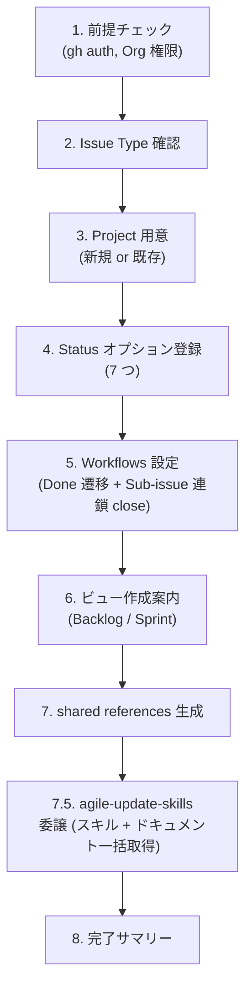

# Agile Project Setup

> 🗣️ **ユーザーへの質問**: 選択肢が有限なら `AskUserQuestion` ツールを優先 (2-4 個の選択肢、推奨は先頭に `(Recommended)` を付ける)。自由記述が要る箇所はテキスト対話のまま。
> 📋 **進捗管理**: Workflow が 5 つ以上の Step を持つ場合、各 Step を `TaskCreate` で起こし、着手時に `TaskUpdate` で `in_progress`、完了時に `completed` に遷移させる。途中中断時の再開ポイントが示せ、並列サブエージェント (Three Amigos 等) の進捗も可視化できる。
> 📐 **不可逆操作の承認**: Issue 起票 / PR 作成 / Project Status 遷移 / Workflow 設定変更など外部状態を変える操作の前に、`ExitPlanMode` で計画を提示し人間の承認を取る (Plan mode 経由)。

`agile-*` スキル群が前提とする GitHub Project (v2) の構成を、対話で 1 回流すだけで揃える。やる範囲は次のとおり:

- Issue Type の登録確認（Epic / Story / Task）
- GitHub Project (v2) の用意（新規作成 or 既存の取り込み）
- Status フィールドに 7 つのオプションを登録
- 推奨ビュー 2 つの作成案内 (Backlog / Sprint)
- Done への遷移ポリシーの決定
- `shared/references/github-projects.json.template` からプロジェクト固有値を埋めて `.claude/skills/references/github-projects.json` を生成

## When to Use

- `agile-*` スキル群を初めて自分のプロジェクトに導入するとき
- Project は作ったが `.claude/skills/references/github-projects.json` をまだ作っていない / 古いとき
- Status オプションやビューの設定がバラついていて整えたいとき

## When NOT to Use

- agile 系を使わず軽量版 (`create-issue` / `create-pull-request`) だけで十分な場合 — Project 設定は不要
- 既に `.claude/skills/references/github-projects.json` が動いていて、変更したい箇所がピンポイントな場合 — 該当箇所を直接編集する方が速い

## Workflow



---

## Step 1: 前提チェック

同梱スクリプトで gh 認証と `project` スコープを確認:

```bash
bash <skill-dir>/scripts/check-prereqs.sh
```

(skill-dir は `~/.claude/skills/agile-setup-project/` か `<project>/.claude/skills/agile-setup-project/`。以降同じ)

スクリプトが exit code 2 (project スコープ不足) を返したら `gh auth refresh -s project,read:org` を案内する。

ユーザーに「対象 Organization 名」と「Project の対象 Repository（あれば）」を確認する。

---

## Step 2: Issue Type 確認

`Epic` / `Story` / `Implementation Plan` / `Task` の 4 つの Issue Type が Organization に登録されている必要がある。**GraphQL API / gh CLI とも未対応**で、Web UI 操作が必須。

### 手動 vs 自動化の選択

`AskUserQuestion` で確認:

| 選択肢 | 内容 |
|---|---|
| 手動で確認・登録する (Recommended) | URL を案内し、ユーザーがブラウザで実行 |
| Chrome 拡張で自動化する | Claude for Chrome 等が有効なら、`references/browser-issue-types.md` の指示書で Claude がブラウザ操作 |

#### 手動の場合の案内

> Organization Settings → Planning → Issue types に移動し、`Epic` / `Story` / `Implementation Plan` / `Task` が登録されているか確認してください。
> URL: `https://github.com/organizations/<ORG>/settings/issue-types`

未登録ならその場で作成してもらう。色やアイコンの選択肢は自由。

#### 自動化を選んだ場合

`Read` で `<skill-dir>/references/browser-issue-types.md` を読み込み、その指示書に従って Chrome 拡張経由でブラウザ操作を実行する。`<ORG>` を Step 1 で取得した値に置換した上で実行する。完了後、画面 screenshot をユーザーに提示して確認を取る。失敗したら手動案内に切り替え。

| Issue Type | 主責務 |
|------------|--------|
| Epic | プロダクト機会 (Opportunity Canvas) |
| Story | PdO/QA 視点の要件 (受入基準・Outcome 仮説・ビジネスルール) |
| Implementation Plan | Dev リード視点の戦略 (技術詳細・API 仕様・Task 分解) |
| Task | 1 PR 単位の実装作業 |

確認できたら次へ。4 つ揃わないと agile-* スキルは Issue 作成時にエラーになる。

---

## Step 2.5: チームコンテキストヒアリング

agile-* スキル群の閾値（タイムボックス・Epic 同時数・ペルソナ数など）はチームの稼働状況に依存する。フルタイムチームと副業チームで同じ閾値を使うと、前者は緩すぎ、後者は厳しすぎになる。本ステップで前提を聞き取って `~/.claude/skills/references/team-context.json`（または利用先プロジェクトの `.claude/skills/references/team-context.json`）に保存し、各 agile-* スキルが参照できるようにする。

### ヒアリング項目

ユーザーに以下を聞く（既知なら飛ばしてよい）:

1. **体制**: 全員フルタイム / 副業混合 / 全員副業 のどれか
2. **メンバー数**: 何人か
3. **週合計稼働時間**: チーム全体での 1 週間の合計（推定でよい）
4. **チーム固有事情**: 時差・拠点・スキル偏りなど、閾値に影響しそうな前提

#### タスク分割単位（追加で 3 問）

`agile-refine-implementation-plan` / `agile-decompose-task-from-implementation-plan` が Task 粒度（1 PR の範囲）を判断するために使う。リポジトリ構成と運用方針で決まり、後段スキルの自動分割提案を左右する。

1. **リポジトリ構成**: モノレポ (`MONOREPO`) / 複数リポジトリ (`MULTI_REPO`)
2. **機能実装の分割パターン**: リポジトリ構成から推奨を提示しつつ、ユーザーに選ばせる。

   | 値 | 推奨される構成 | 1 PR の典型 |
   |---|---|---|
   | `USE_CASE` | モノレポ | 1 ユースケース分、BE+FE 統合 |
   | `LAYER` | マルチレポ | レイヤ単位（BE / FE / Mobile / Infra のいずれか） |
   | `COMPONENT` | DDD・モジュラモノリス・マイクロサービス | サービス / モジュール単位 (`UserService` 追加など) |
   | `VERTICAL_SLICE` | TDD で半日 1 PR 厳守 | 機能の一部 (バリデーションだけ等) を BE+FE 横断 |
   | `CUSTOM` | 上記に当てはまらない | 自由記述 |

3. **基盤・インフラ系改修の扱い**:
   - `INLINE`: 機能 PR に Infra 変更を含める（Infra をほぼ触らない MVP 期）
   - `SEPARATE_PR`: DB migration / Terraform / IAM 等は機能 PR と別に切る（本番運用中、ロールバック単位を分けたい）
   - `N_A`: Infra 系の改修自体が発生しない（フロント onlyプロジェクト等）

最後に 4 つ目の自由記述として「Task 1 個 = 何か（人間語）」を 1 行で書いてもらう。例: 「1 ユースケース分の BE+FE 統合 PR」「BE か FE か Infra のいずれかのレイヤ 1 つ」。これは後段スキルが人間語のサンプルとして引用する。

### プリセット提案

ヒアリング結果から **3 プリセットのいずれか** を提案する:

| プリセット | 想定 | 主な閾値 |
|---|---|---|
| **軽量** | 全員副業 / 週合計 20 時間以下 | Epic 2-3、ペルソナ 1-2、refine 25-30 分、Vision 30-60 分 |
| **標準** | フルタイム 1-2 名 + 副業混合 / 週合計 40-80 時間 | Epic 5-7、ペルソナ 2-3、refine 30-60 分、Vision 60-90 分 |
| **集中** | 全員フルタイム / 週合計 100 時間以上 | Epic 10+、ペルソナ 3-5、refine 60-90 分、Vision 2-3 時間 |

ユーザーがプリセットを選択（またはカスタマイズ希望）したら、Step 7 の shared references 生成で `team-context.json.template` をベースに値を埋めて配置する。

### team-context.json.template の取得とプレースホルダ置換

同梱スクリプトで一括処理:

```bash
bash <skill-dir>/scripts/generate-team-context.sh \
  --preset light \
  --type SIDE_PROJECT \
  --members 3 \
  --hours 15 \
  --repo-type MONOREPO \
  --task-split USE_CASE \
  --infra SEPARATE_PR \
  --task-unit-desc "1 ユースケース分の BE+FE 統合 PR、DB migration は別 PR"

# 同一リポジトリで複数アプリ運用する場合は --app を付ける
bash <skill-dir>/scripts/generate-team-context.sh ... --app fieldnote
# → .claude/skills/references/team-context.fieldnote.json に出力
```

- `--preset` (`light` / `standard` / `focused`) でチーム稼働時間に応じた 8 閾値が自動で埋まる
- `--repo-type` / `--task-split` / `--infra` / `--task-unit-desc` はヒアリング結果をそのまま渡す
- 単一アプリのときは出力先デフォルト `.claude/skills/references/team-context.json`、`--app <name>` 指定時は `team-context.<name>.json`
- 同一リポジトリで複数アプリを扱う場合は、Step 1 でアプリ識別子を確認しておき、ここで `--app` に渡す (詳細はリポジトリルートの `CLAUDE.md` 参照)

スクリプトは GNU sed / BSD sed を自動判別し、最後にプレースホルダ未置換が残っていないかチェックする。

### 設定なしでも動く（軽量プリセットがデフォルト）

`team-context.json` が配置されていない場合、agile-* スキル群は **軽量プリセット**（副業チーム想定）をデフォルトとして動作する。最初は team-context なしで始めて、運用しながら必要を感じたタイミングで作成しても OK。

---

## Step 3: Project 用意

ユーザーに既存 Project を使うか新規作成かを聞く。

### 新規作成の場合

```bash
gh project create \
  --owner <ORG> \
  --title "<Project Name>"
```

出力から `Project URL` と `Project Number` を控える。Project Number は URL 末尾の数字（例: `https://github.com/orgs/<ORG>/projects/2` なら `2`）。

### 既存 Project を使う場合

```bash
gh project list --owner <ORG>
```

一覧から対象を選んでもらい、その Number を控える。

### Project ID と Status Field ID を取得

```bash
gh project field-list <NUMBER> --owner <ORG> --format json
```

出力から以下を控える:
- Project ID（後で `gh project field-create` 等で使う）
- Status フィールドが存在するか（あれば既存 Option を取り込み、なければ Step 4 で作成）

---

## Step 4: Status オプション登録

agile-* スキルは以下の 7 オプションを Status フィールドの値として参照する:

```
In Planning → In Plan Refinement → In Plan Review → Ready → In Coding Progress → In Code Review → Done
```

### Status フィールド作成 / 既存チェック

同梱スクリプトで実行:

```bash
bash <skill-dir>/scripts/setup-status-field.sh \
  --owner <ORG> --project <NUMBER>
```

挙動:
- Status フィールドが未作成 → `gh project field-create` で 7 オプション一括登録
- Status フィールドが既存 → スキップ。期待される 7 オプション一覧を出力するので、不足があれば Web UI で追加 (gh CLI は既存フィールドへの option 追加未対応)

### Option ID の取得

オプション登録後にもう一度 `gh project field-list <NUMBER> --owner <ORG> --format json` を実行し、各オプションの `id` を控える。Step 7 でプレースホルダ置換に使う。

---

## Step 5: Workflows 設定

PR マージ時の Status 遷移、Epic Done 時の sub-issue 連鎖 close など、GitHub Projects 標準 Workflow を有効化する。**ビュー作成 (Step 6) より先に実行する**: Backlog ビューの `is:open` フィルタが Sub-issue 連鎖 close に依存しているため。

GitHub Projects v2 の Workflow API は読み取り限定 (`deleteProjectV2Workflow` のみ存在し、enable / update mutation は未提供) なので、**Web UI 操作が必須**。

### 手動 vs 自動化の選択

`AskUserQuestion` で確認:

| 選択肢 | 内容 |
|---|---|
| 手動で設定する (Recommended) | URL を案内し、ユーザーがブラウザで 3 つの Workflow を操作 |
| Chrome 拡張で自動化する | `references/browser-workflows.md` の指示書で Claude がブラウザ操作 |
| 手動運用に切り替え (Workflow は使わない) | Status 更新は手動で行う運用に。完了サマリーに「手動運用」と記載 |

#### 手動の場合の案内

Step 3 で取得した Owner と Project Number を使って URL を組み立てる:

> Workflows 設定ページを開いてください:
> https://github.com/orgs/<ORG>/projects/<NUMBER>/workflows
>
> **有効化する 2 つ** (Edit → 保存 → Turn on):
>
> 1. **Item closed** — Issue/PR がクローズされたら Status を Done に自動遷移
>    - Action: `Set Status = Done`
>    - 効果: PR マージ → Issue close → Status が Done に。手動更新不要
>
> 2. **Auto-close issue / Auto-close parent** — Sub-issue all closed → Parent auto-close
>    - 名前は実装時期により「Auto-close issue」「Sub-issue closed」等の表記揺れあり
>    - 効果: Epic 配下の全 Story が close → Epic も自動 close。Story 配下の全 Task が close → Story も自動 close
>    - **これにより Backlog ビュー (Filter `is:open`) から Done Epic 配下が自動除外される**
>
> **無効化する 1 つ** (デフォルトで有効になっている場合は OFF にする):
>
> 3. **Auto-add to project** — Issue/PR を自動的に Project に追加する Workflow
>    - 理由: agile-* スキル群は `agile-create-issue` で **明示的に Project に追加 + 適切な初期 Status を設定** する設計
>    - Auto-add を有効化すると、skill 経由でない Issue (gh / Web UI 直作成) も流入し、初期 Status が未設定 / 親 Issue リンクなしで Backlog に乗ってノイズになる
>    - 「skill 経由でしか起票しない」運用を徹底するなら **OFF が正解**

これにより Status 更新の手動オペが激減し、かつ skill 起票以外の Issue が混入しない状態を保てる。

#### 自動化を選んだ場合

`Read` で `<skill-dir>/references/browser-workflows.md` を読み込み、`<ORG>` / `<NUMBER>` を実値に置換して Chrome 拡張経由でブラウザ操作を実行。完了後 screenshot で結果確認。失敗したら手動案内に fallback。

---

## Step 6: 推奨ビュー作成案内

`gh` CLI / GraphQL API ともに View 作成・編集 mutation が未提供 (`createProjectV2View` 等が存在しない)。**Web UI 操作が必須**。

### 手動 vs 自動化の選択

`AskUserQuestion` で確認:

| 選択肢 | 内容 |
|---|---|
| 手動で作成する (Recommended) | URL を案内し、ユーザーがブラウザで Backlog / Sprint の 2 View を作成 |
| Chrome 拡張で自動化する | `references/browser-views.md` の指示書で Claude がブラウザ操作 (Parent issue フィールドの追加もカバー) |

#### 手動の場合の案内

Step 3 で取得した Owner と Project Number を使って URL を組み立て、ユーザーに直接ジャンプしてもらう:

> Project ページを開いてください:
> https://github.com/orgs/<ORG>/projects/<NUMBER>
>
> まず、**デフォルトで作られている View (例: `View 1`, `Table` など) をすべて削除** してください (View タブで右クリック → Delete view)。最終的に Backlog / Sprint の 2 つだけが残る状態にします。
>
> 続いて、上部のビュータブの「+」→「New view」で以下 2 つを作成してください。**両方とも Layout は Board** にしてください (Group by の値が swimlane として可視化されるため):
>
> **Backlog**
> - Layout: **Board**
> - Group by: **Parent issue** (Epic ごとに swimlane が並ぶ)
> - Filter: `is:open status:"In Planning","In Plan Refinement","In Plan Review","Ready","In Coding Progress","Done" type:"Epic","Story"`
> - 用途: Open な Epic 配下の Story / Implementation Plan / Task を Epic 別に俯瞰
> - 仕組み: Epic が Done になると Sub-issue all closed → Parent auto-close で連鎖 close され、`is:open` フィルタで自動的に Backlog から外れる (Step 5 の Workflow 有効化済み前提)
>
> **Sprint**
> - Layout: **Board**
> - Group by: **Parent issue** (Story ごとに swimlane が並ぶ)
> - Filter: `status:"Ready","In Coding Progress","In Code Review","Done" type:"Story","Implementation Plan","Task"`
> - 用途: 実装フェーズに入った Story 配下の Task / Implementation Plan を Story 別に追う

両ビューに `Ready` / `In Coding Progress` が重複表示されるが、Backlog は Story 中心、Sprint は Task 中心という役割の違いで意味が違う。

作成完了をユーザーに確認してから次へ。ビュー URL (`https://github.com/orgs/<ORG>/projects/<NUMBER>/views/<VIEW_NUMBER>`) を控えると後の完了サマリーに使える。

> ⚠️ Group by の "Parent issue" は GitHub Projects v2 のフィールド。Backlog では Epic を、Sprint では Story を **Parent issue として指定** することで階層表示と swimlane が機能する。Parent issue フィールドが Project に追加されていない場合は、Project Settings (`https://github.com/orgs/<ORG>/projects/<NUMBER>/settings`) → New field → Parent issue を追加する。

#### 自動化を選んだ場合

`Read` で `<skill-dir>/references/browser-views.md` を読み込み、`<ORG>` / `<NUMBER>` を実値に置換して Chrome 拡張経由でブラウザ操作を実行。指示書には Parent issue フィールド存在チェックも含まれる。完了後、Backlog / Sprint の View URL を skill 呼び出し元に返す。失敗したら手動案内に fallback。

---

## Step 7: shared references 生成

`mrtry-lab/skills/shared/references/github-projects.json.template` を取得し、ここまでで集めた値で置換して `.claude/skills/references/github-projects.json` に書き出す。**Step 2.5 で team-context.json.template も同じディレクトリに配置済み**であることを確認する（未済なら Step 2.5 のコマンドを再実行）。

### 値の整理

これまでに集めた値:

| プレースホルダ | 値 |
|---|---|
| `<YOUR_PROJECT_NAME>` | Step 3 で確認した Project 名 |
| `<YOUR_GITHUB_ORG>` | Step 1 で確認した Org 名 |
| `<YOUR_PROJECT_NUMBER>` | Step 3 で確認した Number |
| `<YOUR_PROJECT_ID>` | Step 3-4 の `field-list` 出力 |
| `<YOUR_STATUS_FIELD_ID>` | 同上 |
| `<STATUS_OPTION_ID_IN_PLANNING>` 〜 `<STATUS_OPTION_ID_DONE>` | Step 4 終了後の `field-list` 出力 |

### 置換と書き出し

同梱スクリプトに env var で値を渡して実行:

```bash
PROJECT_NAME="My Project" \
OWNER="my-org" \
NUMBER=1 \
PROJECT_ID="PVT_xxx" \
STATUS_FIELD_ID="PVTSSF_xxx" \
OPT_PLANNING="xxx" \
OPT_PLAN_REFINEMENT="xxx" \
OPT_PLAN_REVIEW="xxx" \
OPT_READY="xxx" \
OPT_CODING="xxx" \
OPT_CODE_REVIEW="xxx" \
OPT_DONE="xxx" \
  bash <skill-dir>/scripts/generate-github-projects-ref.sh

# 複数アプリ運用なら APP_NAME も付ける
APP_NAME="fieldnote" PROJECT_NAME=... bash <skill-dir>/scripts/generate-github-projects-ref.sh
# → .claude/skills/references/github-projects.fieldnote.json に出力
```

各値の取得元:
- `PROJECT_NAME` / `OWNER` / `NUMBER`: Step 3 で取得
- `PROJECT_ID` / `STATUS_FIELD_ID` / `OPT_*`: `gh project field-list <NUMBER> --owner <OWNER> --format json` の出力から抽出

GNU sed / BSD sed を自動判別。未置換のプレースホルダが残った場合は WARN を出して exit 1 する。

### user scope に置きたい場合

複数プロジェクトで使い回したい場合は出力先を `~/.claude/skills/references/github-projects.json` にする (`OUTPUT=~/.claude/skills/references/github-projects.json` を env で指定)。ただし Project ID 等が異なる別プロジェクトを跨ぐ場合はプロジェクト個別に project scope に置く方が安全。

---

## Step 7.5: agile-* スキルとドキュメントの一括取得

各 agile-* スキル本体と `docs/agile-workflow/` (判定基準・概念定義・用途マッピング・Status フロー) は対象プロジェクトに揃っている必要がある。これらを **`/agile-update-skills` に委譲して一括取得** する (同梱の `scripts/update.sh` が `gh skill install` ループと curl フェッチを実行)。

> 続けて `/agile-update-skills` を実行してください。このスキルは同梱スクリプト `scripts/update.sh` を呼び出し、以下を一括で行います:
> 1. 全 agile-* スキル (10 個 + agile-update-skills 自身) を `gh skill install` で配置
> 2. `docs/agile-workflow/` 配下 12 ファイル (README / setup / operations + concepts/ 9) を curl で取得 (配置先はユーザー指定、デフォルト `docs/agile-workflow/`)

`/agile-update-skills` は単独でも呼べる: agile-* の最新版に追従したいとき / `docs/agile-workflow/` を更新したいときに定期実行できる。詳細は `agile-update-skills/SKILL.md` 参照。

委譲後、配置完了をユーザーに確認して Step 8 へ。

---

## Step 8: 完了サマリー

ユーザーに次の情報を提示して完了:

```
✓ Project: <Project URL>
✓ ビュー:
  - Backlog: <ビュー URL>
  - Sprint: <ビュー URL>
✓ Workflows: <A: Item closed / Sub-issue 連鎖 close を有効化 + Auto-add を無効化 | B: 手動運用>
✓ 配置ファイル:
  - .claude/skills/references/github-projects.json
  - .claude/skills/references/team-context.json
  - <DOCS_DIR>/ (agile-workflow ドキュメント 12 ファイル)
✓ Issue Type 確認: Epic / Story / Implementation Plan / Task が登録済み

次のステップ:
- 必要な agile-* スキルをインストール: gh skill install mrtry-lab/skills <skill-name> --agent claude-code --scope <user|project>
- Mermaid 検証を使うなら docs/agile-workflow/setup.md の「validate-mermaid スクリプトの配置」を参照
- 最初の Story 作成は /agile-craft-vision → /agile-create-epic → /agile-create-stories の順
```

`.claude/skills/references/github-projects.json` を git 管理下に置く方針なら `git add` してコミットを促す（Project ID 等は機密ではないので公開リポジトリでも問題ないが、ユーザー判断）。

---

## 決定境界

全体マップは `docs/agile-workflow/concepts/ai-decision-boundary.md`を参照。本スキル固有の人間承認ゲート:

**Plan mode の活用**: 下記の人間承認ゲートのうち、Issue / PR / Project Status / Workflow など外部状態を変える操作の直前は `ExitPlanMode` 経由でユーザー承認を取る (Plan mode で計画提示 → ユーザーが承認/修正指示)。読み取り系・対話系のゲートは通常のテキスト確認で十分。

- **Org 選択 / Issue Type 登録** — Web UI 操作のため完全に人間。AI は手順を案内するだけ
- **Project 作成 vs 既存利用** — Step 3 の判断は人間。新規 Project URL を作るのは取り消しコストが高い操作
- **Status オプション登録** — `gh project field-create` 実行前に人間承認
- **Workflows 有効化判断** — Step 5 の Workflows (Item closed / Sub-issue 連鎖 close) を有効化するかは人間判断 (Web UI 操作必須、API 自動化不可)
- **agile-update-skills 実行確認** — Step 7.5 で `/agile-update-skills` に委譲する判断 (ドキュメント配置先選択は委譲先の人間承認ゲート) は人間判断
- **チームコンテキストとプリセット選択** — Step 2.5 の体制ヒアリングと「軽量 / 標準 / 集中」プリセット選択は人間判断。AI は提案するだけ

NEVER（次節）はこのゲートの違反を具体的に列挙している。

---

## エッジケース

| 状況 | 対応 |
|------|------|
| `gh auth status` で project スコープなし | `gh auth refresh -s project,read:org` を案内 |
| Org の Issue Type 設定権限がない | Org 管理者への依頼を案内し、Step 2 を保留してもユーザー判断で先に進める（Issue 作成時に失敗する旨を明示） |
| `gh project field-create` で Status オプションを一気に作れない（既存 Status フィールドが衝突等） | Web UI でフィールド削除 → 作り直し、または Web UI でオプション追加に切り替える |
| Project 既存で Option 名が微妙に違う（例: `In Coding` vs `In Coding Progress`） | スキル側がリテラル文字列でマッチするので、**Status 名を agile-* 規約に揃える**ことを推奨。リネームが難しい場合のみユーザー判断で例外運用 |
| 途中で中断 | 既に作った Project は残るので、再実行時は Step 3 で「既存を使う」分岐に進む。`.claude/skills/references/github-projects.json` は未完成でも残るので、必要なら削除して再生成 |

## NEVER — アンチパターン

- **絶対に** Status オプション名を勝手に変えない — agile-* スキルは `In Planning` / `In Plan Refinement` 等のリテラルでマッチする。リネームすると全スキルが壊れる
- **絶対に** プレースホルダ未置換のまま `.claude/skills/references/github-projects.json` を有効化しない — `<YOUR_GITHUB_ORG>` のような文字列がそのまま `gh` コマンドに渡って失敗する (`generate-github-projects-ref.sh` の終端チェックで防いでいる)
- **絶対に** Issue Type の登録ステップをスキップしない — Org に Issue Type がないと agile-create-issue が即座に失敗する。手戻りが大きい
- **絶対に** SKILL.md にインライン bash (`sed -i ... template.md` ループ等) を書き戻さない — 単一実行可能ファイル化 (`scripts/*.sh`) が本スキル設計の核。SKILL.md は対話と引数収集に専念する

---

## References

このスキルが参考にしている書籍・記事・フレームワーク:

- 📖 [アジャイルサムライ](https://www.amazon.co.jp/s?k=アジャイルサムライ)（Jonathan Rasmusson）— Inception Deck 思想（チームコンテキスト確認）
- 📦 [Scrum Guide Expansion Pack](https://scrumexpansion.org/) — Strategy（チーム前提を揃える）
