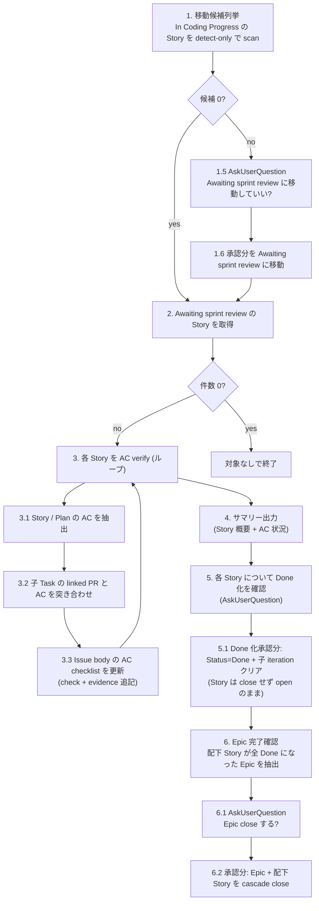

# Agile Sprint Review

> 🗣️ **ユーザーへの質問**: 不可逆操作 (Step 1 の Awaiting sprint review への移動, Step 5 の Done 化, Step 6 の Epic close) の前だけ `AskUserQuestion` を使う。AC verify とサマリー表示の途中で対話的判定は投げない。
> 📋 **進捗管理**: 対象 Story 件数が複数のときは `TaskCreate` で 1 件 1 task として進捗を可視化する。1-2 件なら省略可。
> 📐 **不可逆操作の承認**: Step 1 / Step 5 / Step 6 はそれぞれ `AskUserQuestion` で承認を取る (Status / close 変更は不可逆)。

子 Plan/Task が全 Done になった Story を `Awaiting sprint review` Status に移動し、AC を子 Task の linked PR と突き合わせて checklist に evidence 付きでチェックを入れる。Awaiting sprint review にある Story 群のサマリー (概要 + AC 状況) をチャットに表示し、ユーザーが「これを Done にしていいか」を Story 単位で判断する。AC に現れない追加確認 (デザイン的な好み、運用面の懸念など) の余地を残すため、Done への遷移は必ず人間判断を経由する。

**Story Done でも Backlog View に残る設計**: Story を Done に進めても issue は close しない (Backlog の `is:open` filter に残る)。Epic 配下の全 Story が完了したタイミングで Epic 自体を close するかどうかをユーザーに確認し、承認されたら Epic + 配下 Story を cascade close することで Backlog から一気に外す。これにより「Story Done = まだ open、Epic close = 完全に履歴送り」の 2 段運用ができる。

## When to Use

- 「そろそろ受け入れ確認しよう」と思ったタイミング。iteration 終わり目でも、Awaiting が溜まってきたタイミングでも都度回せる
- 子 Plan/Task が全 Done になっているのに親 Story の Status が `In Coding Progress` のまま放置されている (lazy scan で拾える)
- 過去 iteration から取り残された `Awaiting sprint review` をまとめて捌きたいとき
- Epic 配下の全 Story が Done になり、Epic を完了させたいとき

## When NOT to Use

- 個別の Story の AC を編集したい — `/agile-refine-story` で
- まだ実装中の Story を進めたい — `/agile-implement-task` 等で実装を続ける
- 受け入れ確認のために対話的に 1 件ずつ細かく判定したい — 本 skill は対話を投げない設計。判断はチャット表示の結果を見てユーザーが行う

---

## Workflow



---

## Step 1: Awaiting sprint review に移動する候補を列挙 (lazy scan, detect-only)

Plan/Task の Status を Done に変える経路が複数あり、特に PR merge による issue close → `Item closed` Workflow で Status=Done のルートは skill から検知できない。本 skill 起動時に **In Coding Progress の Story を全件 scan** して、子が全 Done のものを Awaiting sprint review に移動する候補として列挙する。Status 変更は **ユーザー承認後** に行う。

### 手順

1. `.claude/skills/references/github-projects.json` (複数アプリ運用なら `github-projects.<app>.json`) を `Read` し、Project の owner / number を取得

2. Project items から Status = `In Coding Progress` かつ type = Story の Issue 番号を抽出:

```bash
gh api graphql -f query='
{
  organization(login: "<OWNER>") {
    projectV2(number: <NUMBER>) {
      items(first: 100) {
        nodes {
          content { ... on Issue { number issueType { name } } }
          fieldValueByName(name: "Status") { ... on ProjectV2ItemFieldSingleSelectValue { name } }
        }
      }
    }
  }
}' | jq -r '.data.organization.projectV2.items.nodes[]
  | select(.content.issueType.name == "Story" and .fieldValueByName.name == "In Coding Progress")
  | .content.number'
```

3. 各 Story 番号に対して `--detect-only` で check-story-completion を呼ぶ:

```bash
bash ~/.claude/skills/agile-update-skills/scripts/check-story-completion.sh <story-number> --detect-only [app-name]
```

stdout に `READY_TO_PROMOTE #N <title>` が出れば候補。子未完 / 子なし / Status 不一致は silent exit 0。

4. 候補をユーザーに列挙して提示。**1 件もなければ Step 2 へスキップ** (ユーザー確認不要)。

```
以下の Story は子 Plan/Task が全部 Done になっています:

- #N1 [title 1]
- #N2 [title 2]

これらを Awaiting sprint review に移動しますか?
```

5. `AskUserQuestion` で 3 択:

| label | description |
|---|---|
| はい、Awaiting sprint review に移動する (Recommended) | 候補全件を Awaiting sprint review に遷移、Step 2 へ |
| 移動せず Step 2 に進む | 何もせず Step 2 (Awaiting の Story だけ処理) |
| キャンセル | skill を終了 |

6. 「はい」なら各候補 Story に対して `check-story-completion.sh <number> [app-name]` を `--detect-only` 無しで呼んで移動を実行:

```bash
for n in $candidates; do
  bash ~/.claude/skills/agile-update-skills/scripts/check-story-completion.sh "$n" [app-name]
done
```

何件移動したかをユーザーに報告。

---

## Step 2: Awaiting sprint review の Story を取得

Status = `Awaiting sprint review` の Story を全件取得 (current iteration の縛りは付けない — 過去 iteration から取り残されたものも拾えるように):

```bash
gh api graphql -f query='
{
  organization(login: "<OWNER>") {
    projectV2(number: <NUMBER>) {
      items(first: 100) {
        nodes {
          content {
            ... on Issue {
              number title
              repository { nameWithOwner }
              issueType { name }
              parent { number }
            }
          }
          fieldValueByName(name: "Status") { ... on ProjectV2ItemFieldSingleSelectValue { name } }
        }
      }
    }
  }
}' | jq -r '.data.organization.projectV2.items.nodes[]
  | select(.content.issueType.name == "Story" and .fieldValueByName.name == "Awaiting sprint review")
  | "\(.content.number)|\(.content.repository.nameWithOwner)|\(.content.parent.number // "-")|\(.content.title)"'
```

- 件数 0 → 「受け入れ確認対象の Story はありません」と案内して終了
- 件数 ≥ 1 → 全件をユーザーに一覧表示 (番号 + タイトル) してから Step 3 のループへ。`parent.number` (Epic 番号) を控えておく (Step 6 で使う)

3 件以上ある場合は `TaskCreate` で進捗を可視化する。

---

## Step 3: 各 Story の AC verify + checklist 自動更新 (ループ)

候補 Story を 1 件ずつ処理する。**AskUserQuestion は使わない**。Skill が機械的に AC と PR を突き合わせて checklist を更新する。

### Step 3.1: Story / 関連 Implementation Plan の AC を抽出

`gh issue view <story-number> --repo <owner/repo>` で Story body を取得。AC は以下のパターンで markdown checklist として記述されている前提:

```markdown
### 受入基準

- [ ] AC item 1
- [ ] AC item 2
```

セクション名は `受入基準` / `Acceptance Criteria` / `AC` のいずれか。本文中の最初に見つかったチェックリストを AC として扱う。

子の Implementation Plan があれば、その body も同様に取得し、Plan 側の AC も別途抽出する (Plan は Story の補足として独自の AC を持つことがある)。**Implementation Plan の AC は Story の AC と区別して扱う** (それぞれ別に更新する)。

### Step 3.2: 子 Task の linked PR と AC を突き合わせ

子 Plan/Task の番号と linked PR を取得:

```bash
gh issue view <story-number> --repo <owner/repo> --json subIssues --jq '.subIssues[].number'

# 各子 Issue について
gh issue view <child-number> --repo <owner/repo> --json title,closedByPullRequestsReferences
```

各 PR について `gh pr view <pr-number> --repo <owner/repo> --json title,body` で詳細を取得。PR title / body / 子 Issue title を見て、AC 項目との対応関係を判定する。

判定は LLM (skill 内の Claude) が行う:
- AC 項目 1 件ずつに対して「どの PR (or どの子 Issue) が満たしている可能性が高いか」を考える
- 明確に対応が取れた AC は evidence 付きで verified 扱い
- linked PR が無いが対応する子 Task が Done なら、Task 番号を evidence として使う fallback も可
- 対応が曖昧 / 不明 / 該当 PR / Task なし → unverified のまま残す

### Step 3.3: Issue body の AC checklist を更新

verified な AC は markdown を以下のように書き換える:

変更前:
```markdown
- [ ] AC item 1
```

変更後:
```markdown
- [x] AC item 1 (#1192で対応済み)
```

- チェック `[ ]` → `[x]` に変更
- 末尾に `(#<PR or Task 番号>で対応済み)` を追加 (複数 evidence なら `(#1192, #1195 で対応済み)`)

unverified な AC は変更しない (`- [ ]` のまま、evidence なし)。

更新は **`gh issue edit <issue-number> --repo <owner/repo> --body-file -`** で body を書き戻す:

```bash
# 1. 現在の body を取得
gh issue view <story-number> --repo <owner/repo> --json body --jq '.body' > /tmp/body.md

# 2. 編集 (LLM が markdown を直接 Edit する)

# 3. 書き戻し
gh issue edit <story-number> --repo <owner/repo> --body-file /tmp/body.md
```

Implementation Plan の AC も同様に Plan 本体の body を更新する。

ループは Step 3.3 まで。Step 3.4 で **Story 単位の Status 変更はしない** (= Done への自動遷移はしない)。

---

## Step 4: サマリー出力

ループ完了後、Awaiting sprint review にある全 Story について **Story 概要 + AC 状況** をチャットに出力する。1 件ずつ以下のフォーマット:

```
─────────────────────────────────────
Story #N: [title]
─────────────────────────────────────

[Story body の冒頭 (概要部分) を 1-3 行で抜粋]

【受入基準】
- [x] AC 1 (#1192で対応済み)
- [x] AC 2 (#1195で対応済み)
- [ ] AC 3 (evidence なし)

【Implementation Plan #M の受入基準】 ← Plan があり AC を持つとき
- [x] Plan AC 1 (#1200で対応済み)
- [ ] Plan AC 2 (evidence なし)
```

冗長な情報 (関連 PR 一覧、リンク等) は載せない — チェックリストの evidence (`#1192`) からたどれる。サマリーは「**この Story を Done に進めていいか**」を判断するための最小情報に絞る。

全 Story を出力したら Step 5 へ。

---

## Step 5: 各 Story について Done 化を確認 (AskUserQuestion)

サマリーを見せた後、Story 1 件ずつ `AskUserQuestion` で Done 化可否を聞く。**AC 全 verified でも自動 Done にはしない** — AC に現れない追加確認 (デザイン的な好み、運用面の懸念) があるかもしれないため。

```
Story #N をどうしますか?
```

| label | description |
|---|---|
| Done に進める (Recommended for 全 AC verified) | Story Status=Done に遷移、配下 Plan/Task の iteration をクリア (Sprint Board から外れる)。**Story 自身は close しない** (Backlog View に残る、Epic close 時に cascade close される予定) |
| Awaiting のままにする | Status は変えない。追加対応が必要、または後で再判定する場合 |
| In Coding Progress に戻す | 差し戻し。追加 Task 起票が必要なケース。`/agile-decompose-task-from-implementation-plan` を案内 |

Recommended ラベルは AC 状況に応じて切り替える:
- 全 AC verified の Story → "Done に進める" に `(Recommended)` を付ける
- 一部 unverified の Story → "Awaiting のままにする" に `(Recommended)` を付ける

### Step 5.1: Done 化処理 (ユーザーが選択した分のみ)

```bash
bash ~/.claude/skills/agile-update-skills/scripts/update-issue-status.sh <story-number> "Done" [app-name]
# Story の Status を Done に。Auto-close issue Workflow は OFF にしておく前提なので、issue 自体は open のまま (Backlog に残る)

# Story の子全部から iteration field をクリア
CHILD_NUMS=$(gh issue view <story-number> --repo <owner/repo> --json subIssues --jq '.subIssues[].number')
for child in $CHILD_NUMS; do
  bash ~/.claude/skills/agile-update-skills/scripts/clear-issue-iteration.sh "$child" [app-name]
done
```

**前提**: 本 skill 群の運用では `Auto-close issue` Workflow を **OFF** にしておく (Story の Status=Done で issue が自動 close されないように)。`agile-setup-project` Step 6 でこの設定を案内する。Auto-close を ON のままだと Story Done で即 issue close → Backlog から消えて Epic 全 Story 完了の確認ができなくなる。

### Step 5.2: In Coding Progress 差し戻し処理

```bash
bash ~/.claude/skills/agile-update-skills/scripts/update-issue-status.sh <story-number> "In Coding Progress" [app-name]
```

子 Plan/Task の iteration はクリアしない (= 引き続き Sprint Board に残り、追加作業の動線が見える)。「追加 Task が必要なら `/agile-decompose-task-from-implementation-plan <story-number>` で起票してください」と案内。

### Step 5.3: Awaiting のまま

何もしない (Status は Awaiting sprint review のまま)。次回 sprint-review 起動時にまた候補に並ぶ。

---

## Step 6: Epic 完了確認 + Epic close (cascade close)

Step 5 で Done に進めた Story (or 既存の Done な Story を含む) について、**配下 Story が全 Done になった Epic** が無いかをチェックする。

### Step 6.1: 候補 Epic の抽出

Step 2 で控えた parent Epic 番号 (重複排除) について、それぞれの Epic 配下の Story の Status を確認する:

```bash
gh issue view <epic-number> --repo <owner/repo> --json subIssues
```

各 sub-issue (Story) について Project の Status を取得 (`gh api graphql ... ProjectV2ItemFieldSingleSelectValue`)。

判定:
- Epic が open かつ Type=Epic である
- 配下 Story (sub-issues) が **全部 Status=Done** である
- 1 件でも Status が Done でない / unset の Story があれば候補から外す

候補 Epic が 0 件なら Step 6 全体をスキップして完了サマリーへ。

### Step 6.2: Epic close 確認 (AskUserQuestion)

候補 Epic 1 件ずつに対して `AskUserQuestion` で確認:

```
Epic #E [title] の配下 Story (#X, #Y, #Z) はすべて Done になりました。
Epic を close しますか?
(close すると配下 Story も cascade で close され、Backlog View から外れます)
```

| label | description |
|---|---|
| はい、Epic を close する (Recommended) | Epic + 配下 Story を cascade で close。Backlog View から消える |
| いいえ、Epic は open のままにする | 何もしない (まだ追加 Story を起こす予定がある場合など) |

### Step 6.3: cascade close 処理

「はい」を選んだ Epic に対して:

```bash
# 1. 配下の Story を順に close
CHILD_STORIES=$(gh issue view <epic-number> --repo <owner/repo> --json subIssues --jq '.subIssues[].number')
for s in $CHILD_STORIES; do
  gh issue close "$s" --repo <owner/repo> --reason completed
done

# 2. Epic 本体を close
gh issue close <epic-number> --repo <owner/repo> --reason completed
```

完了後、ユーザーに何件 close したか報告。

---

## Step 7: 完了サマリー

全 Story / Epic 処理後、最終結果を提示:

```
─────────────────────────────────────
Sprint Review 完了
─────────────────────────────────────

📊 Step 1 (Awaiting sprint review に移動): 候補 N 件 / 承認 M 件 / 移動 M 件

✅ Done に進めた: A 件 (issue は open のまま、Backlog に残る)
  - #X, #Y, #Z

⏸️ Awaiting のまま保留: B 件
  - #P, #Q

⏪ In Coding Progress に差し戻し: C 件
  - #R

🏁 Epic close 実行: D 件 (配下 Story も cascade close)
  - #E1 (配下 Story 3 件と一緒に close)
```

---

## 決定境界

全体マップは `docs/agile-workflow/concepts/ai-decision-boundary.md` を参照。本スキル固有の人間承認ゲート:

- **Step 1 の Awaiting sprint review への移動** — `AskUserQuestion` で承認を取る (Status 変更は不可逆)
- **Step 3.3 の AC checklist 更新** — Story / Plan の body を書き換える操作。LLM 判定で機械的に行う (= 後で気付けば手動で revert 可能、また AC verify の結果を視覚化するのが目的なので permissive)
- **Step 5 の Done 化** — 全 Story について `AskUserQuestion` で 3 択を聞く。全 AC verified でも自動 Done にしない (AC に現れない追加確認の余地を残すため)
- **Step 6 の Epic close** — 配下 Story 全 Done の Epic 1 件ずつに対して `AskUserQuestion` で確認。cascade close は不可逆 (再 open は手動で全部やり直し) なので、AskUserQuestion を必ず通す

NEVER (次節) はこのゲートの違反を具体的に列挙している。

---

## エッジケース

| 状況 | 対応 |
|---|---|
| Story body に AC セクションが無い | AC verify をスキップ、サマリーで「AC セクションなし、手動判定してください」と表示。Status は変えない |
| AC の文言と PR の対応関係が判定不能 | unverified として残す (チェックを入れない)。ユーザーが結果を見て判断 |
| Implementation Plan が無い | Plan AC の処理はスキップ、Story AC だけ verify |
| 子 Task に linked PR が無い | linked PR が無くても子 Task が closed/Done なら Task 番号を evidence に使う fallback。それも無ければ unverified のまま |
| AC checklist の markdown 形式が崩れている | parse 不能の場合は warnings を出して当該 Story を skip、Status は触らない |
| Step 1 候補が 0 件 | AskUserQuestion を飛ばして Step 2 へ直行 |
| Step 2 候補が 0 件 | 「対象なし」を案内、ただし Step 6 (Epic close 確認) はそれでも回す (既存 Done な Story から Epic close 可能なケース) |
| Story の parent (Epic) が取得できない | Step 6 の候補から外す。Story が単独で存在するケース (Epic 無しで起票) で発生 |
| Auto-close issue Workflow が ON のままで Story Done で issue close されてしまった | 本来は OFF にしておくべき。Backlog から先に消えてしまうので Step 6 の Epic 候補抽出から漏れる可能性あり。setup-project で OFF を案内する |

---

## NEVER — アンチパターン

- **絶対に** AC 内容 (文言) を skill 起動中に書き換えない (= checklist のチェック / evidence 追記以外の本文編集はしない)。AC 文言の見直しは `/agile-refine-story` の責務
- **絶対に** Story を AskUserQuestion なしで Done に自動遷移させない (AC 全 verified であっても)。AC に現れない追加確認の余地をユーザーに残すため、Step 5 で必ず判定を仰ぐ
- **絶対に** Story を Done にしたタイミングで issue を close しない (= 本 skill は Status=Done のみ、close は Step 6 の Epic close から cascade で行う)
- **絶対に** Epic を AskUserQuestion なしで close しない (= cascade close は配下 Story にも波及する不可逆操作)
- **絶対に** PR との対応関係を雑に判定して evidence を間違って付けない (= 確証が無ければ unverified のまま残す)
- **絶対に** Step 1 の移動を AskUserQuestion なしで実行しない (= status 変更は要承認)
- **絶対に** Step 4 のサマリーに不要情報を入れない (= Story 概要 + AC 状況のみ。関連 PR 一覧やリンク等は省略する。チェックリストの evidence (`#1192`) からたどれる)
- **絶対に** 本スキルを「Scrum セレモニーとして強制」しない — 起動頻度は決め打ちせず、ユーザー裁量で都度実行

---

## References

このスキルが参考にしている書籍 / 概念:

- 📖 [アジャイルサムライ](https://www.amazon.co.jp/s?k=アジャイルサムライ) — Inception Deck / 受入確認の文化
- `docs/agile-workflow/concepts/outcome-done.md` — Outcome Done の概念 (AC verify と切り分け)
- `docs/agile-workflow/operations.md` — Status フロー / iteration の運用ルール
