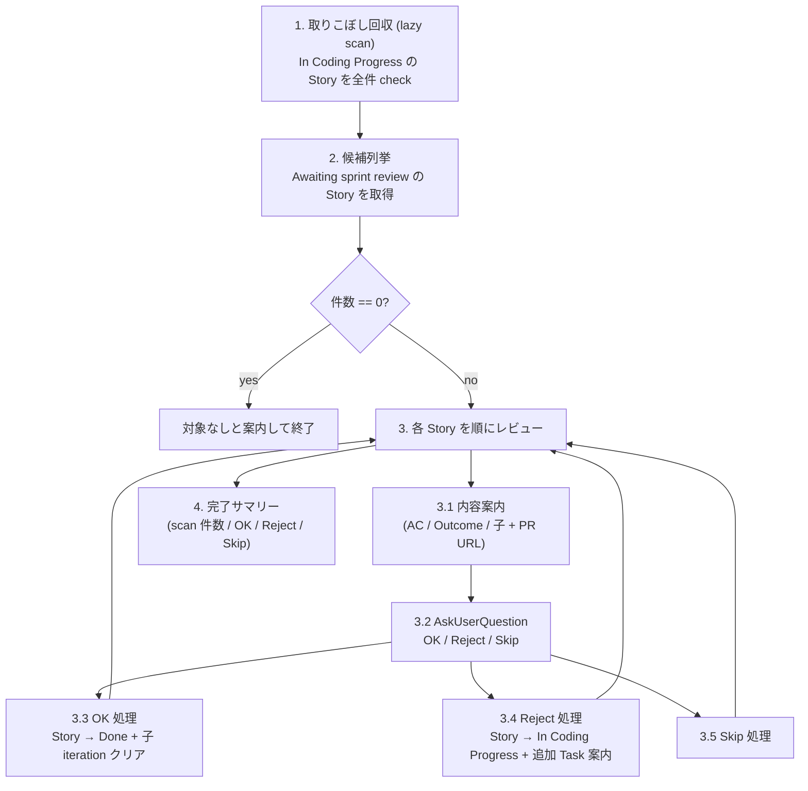

# Agile Sprint Review

> 🗣️ **ユーザーへの質問**: 各 Story の判定 (OK / Reject / Skip) は `AskUserQuestion` を使う。一括承認はしない (Story 個別の AC verify が目的)。
> 📋 **進捗管理**: 対象 Story 件数が複数のときは `TaskCreate` で 1 件 1 task として進捗を可視化する。1-2 件なら省略可。
> 📐 **不可逆操作の承認**: Story Status を Done に進める / In Coding Progress に戻す操作の直前は `ExitPlanMode` で承認ゲートを通す (1 Story ずつ確認)。

子 Plan/Task が全部 Done になった Story を `Awaiting sprint review` Status で集め、AC を 1 件ずつ verify して Done に進める (または差し戻す) スキル。

## When to Use

- 「そろそろ受け入れ確認しよう」と思ったタイミング。iteration の終わり目に走らせても、Awaiting が溜まってきたタイミングで都度回しても OK
- `Awaiting sprint review` がボードに 1 件以上見えるとき
- 過去 iteration から取り残された `Awaiting sprint review` をまとめて捌きたいとき

## When NOT to Use

- 個別の Story / PR の review が目的 — それは `/agile-review-pr` (PR レビュー) や Story refinement 系 skill の仕事
- AC 自体を変更したい — `/agile-refine-story` で Story body を編集
- まだ実装中の Story を進めたい — `/agile-implement-task` 等で実装を続ける

---

## Workflow



---

## Step 1: 取りこぼし回収 (lazy scan)

Story Status を Done に変える経路が複数あり、特に PR merge → Auto-close issue Workflow → Task Done のルートは skill から検知できない。なので本 skill 起動時に **In Coding Progress の Story を全件 scan** して、子が全 Done のものを `Awaiting sprint review` に拾い上げる。

### 手順

1. `.claude/skills/references/github-projects.json` を `Read` し、Project の owner / number を取得 (複数アプリ運用なら Step 0 でアプリ識別子を確認、対応する JSON を読む)

2. Project の items を GraphQL で取得して、Status = `In Coding Progress` かつ type = Story の Issue 番号を抽出:

```bash
gh api graphql -f query='
{
  organization(login: "<OWNER>") {
    projectV2(number: <NUMBER>) {
      items(first: 100) {
        nodes {
          content {
            ... on Issue {
              number
              issueType { name }
            }
          }
          fieldValueByName(name: "Status") {
            ... on ProjectV2ItemFieldSingleSelectValue { name }
          }
        }
      }
    }
  }
}' | jq -r '.data.organization.projectV2.items.nodes[]
  | select(.content.issueType.name == "Story" and .fieldValueByName.name == "In Coding Progress")
  | .content.number'
```

3. 各 Story 番号に対して `bash ~/.claude/skills/agile-update-skills/scripts/check-story-completion.sh <story-number> [app-name]` を呼ぶ
   - スクリプトが「子全 Done」と判定したら自動で `Awaiting sprint review` に遷移させ、`promoted: Story #N -> ...` を stdout に出す
   - 子未完了 / 子なし / Status が `In Coding Progress` でない → silent no-op (exit 0)

4. promoted した件数を集計してユーザーに表示:

```
取りこぼし回収 (lazy scan): N 件の Story を Awaiting sprint review に遷移しました
  - #X [Story title]
  - #Y [Story title]
```

scan で 0 件遷移した場合は「取りこぼしなし」とだけ案内して Step 2 へ。

---

## Step 2: 候補列挙

Project items から **Status = `Awaiting sprint review`** の Story を全部取得する (current iteration の縛りは付けない — 過去 iteration から取り残されたものも拾えるように):

```bash
gh api graphql -f query='
{
  organization(login: "<OWNER>") {
    projectV2(number: <NUMBER>) {
      items(first: 100) {
        nodes {
          content {
            ... on Issue {
              number
              title
              repository { nameWithOwner }
              issueType { name }
            }
          }
          fieldValueByName(name: "Status") {
            ... on ProjectV2ItemFieldSingleSelectValue { name }
          }
        }
      }
    }
  }
}' | jq -r '.data.organization.projectV2.items.nodes[]
  | select(.content.issueType.name == "Story" and .fieldValueByName.name == "Awaiting sprint review")
  | "\(.content.number)|\(.content.repository.nameWithOwner)|\(.content.title)"'
```

- 件数 0 → 「受け入れ確認対象の Story はありません」と案内して終了
- 件数 ≥ 1 → 全件をユーザーに一覧表示 (番号 + タイトル) してから Step 3 のループへ

---

## Step 3: 各 Story を順にレビュー (ループ)

候補 Story を 1 件ずつ処理する。3 件以上ある場合は `TaskCreate` で進捗を可視化する (例: "Story #X review", "Story #Y review", ...)。

### Step 3.1: 内容案内 (チャット出力のみ)

対象 Story の内容を `Read` ではなく `gh issue view <story-number> --repo <owner/repo>` で取得し、以下を抽出して表示:

- **AC (Acceptance Criteria / 受入基準)**: Story body の "受入基準" / "Acceptance Criteria" セクション
- **Outcome 仮説**: "Outcome" / "成功指標" セクション
- **DoR / DoD**: あれば
- **子 Plan/Task のリスト**: 各々の番号、タイトル、Status、linked PR URL
  - linked PR は `gh issue view <child-number> --json closedByPullRequestsReferences --jq '.closedByPullRequestsReferences[]?.url'` で取得

表示形式の例:

```
─────────────────────────────────────
Story #N: [title]
─────────────────────────────────────

【受入基準】
- [ ] AC 1
- [ ] AC 2
...

【Outcome 仮説】
...

【子 (Plan/Task)】
- #X [Implementation Plan: ...] Status: Done — PR: https://github.com/.../pull/N
- #Y [Task: ...] Status: Done — PR: https://github.com/.../pull/M
- #Z [Task: ...] Status: Done — PR: https://github.com/.../pull/L

【関連リンク】
Story URL: https://github.com/<owner>/<repo>/issues/N
```

「以下の AC / PR を確認のうえ判定してください」とユーザーに案内し、Step 3.2 の判定取得へ進む。

> **重要**: 本 skill は **AC を自動評価しない**。AC 内容を walkthrough して見せるだけ。実際の verify (AC 満たした? PR 適切?) はユーザーの責務。

### Step 3.2: 判定取得

`AskUserQuestion` で 3 択:

| label | description |
|---|---|
| OK (承認) | AC 満たした。Story を Done にして Sprint Board から外す |
| Reject (差し戻し) | AC 不足 / 不具合あり。Story を In Coding Progress に戻して追加作業 |
| Skip (このセッションでは判定保留) | 一旦保留。Status は Awaiting sprint review のまま、次の Story へ |

multiSelect は使わない (各 Story 個別に判定させるのが目的)。

### Step 3.3: OK 処理 (Story → Done)

1. Story の Status を Done に更新:

```bash
bash ~/.claude/skills/agile-update-skills/scripts/update-issue-status.sh <story-number> "Done" [app-name]
```

Auto-close issue Workflow が ON ならこれで Story issue が auto-close される (Status=Done が発火条件)。

2. Story の子全部から iteration field をクリア:

```bash
# 子 Issue 番号を取得
CHILD_NUMS=$(gh issue view <story-number> --repo <owner/repo> --json subIssues --jq '.subIssues[].number')

for child in $CHILD_NUMS; do
  bash ~/.claude/skills/agile-update-skills/scripts/clear-issue-iteration.sh "$child" [app-name]
done
```

iteration がクリアされた Plan/Task は Sprint Filter (`iteration:@current ...`) にマッチしなくなり、Sprint Board から消える。Overview には引き続き全件見える。

3. 案内出力:

```
✓ Story #N を Done にしました
  - 子 M 件の iteration をクリア (Sprint Board から除外)
  - Story issue が auto-close される (Auto-close issue Workflow)
```

### Step 3.4: Reject 処理 (Story → In Coding Progress)

1. Story Status を In Coding Progress に戻す:

```bash
bash ~/.claude/skills/agile-update-skills/scripts/update-issue-status.sh <story-number> "In Coding Progress" [app-name]
```

2. ユーザーに追加作業の案内:

```
✗ Story #N を In Coding Progress に戻しました
  追加作業が必要であれば以下を実行してください:
    /agile-decompose-task-from-implementation-plan <story-number>
    または
    /agile-create-issue で個別に Task / Implementation Plan を追加
```

子 Plan/Task の iteration はクリアしない (= 引き続き Sprint Board に残り、追加作業が見える)。

### Step 3.5: Skip 処理

何もせず次の Story へ。Status は `Awaiting sprint review` のまま、次回 sprint-review 起動時にまた候補に並ぶ。

---

## Step 4: 完了サマリー

全 Story を処理し終えたら、以下をユーザーに提示:

```
─────────────────────────────────────
Sprint Review 完了
─────────────────────────────────────

📊 取りこぼし回収 (Step 1 lazy scan): N 件
  - #A, #B (子が全 Done になっていた Story を Awaiting sprint review に促進)

✅ OK (Done に進めた): M 件
  - #X, #Y, #Z

⏪ Reject (In Coding Progress に戻した): L 件
  - #P

⏸️ Skip (保留): K 件
  - #Q, #R

次のステップ:
- Reject した Story の追加作業は /agile-decompose-task-from-implementation-plan or /agile-create-issue で
- Skip した Story は次回 /agile-sprint-review でまた候補に上がります
```

---

## 決定境界

全体マップは `docs/agile-workflow/concepts/ai-decision-boundary.md` を参照。本スキル固有の人間承認ゲート:

**Plan mode の活用**: 下記の人間承認ゲートのうち、Status 変更 (Story → Done / In Coding Progress) の直前は `ExitPlanMode` 経由でユーザー承認を取る (1 Story ずつ確認)。読み取り系・対話系のゲートは通常のテキスト確認で十分。

- **AC verify の判定** — Step 3.2 の OK / Reject / Skip は人間判断。AI は AC を walkthrough するだけ
- **Status 変更実行** — Step 3.3 / 3.4 の `update-issue-status.sh` 呼び出し前に最終確認
- **子 iteration クリア実行** — Step 3.3 で複数子をクリアする前に確認 (取り消しは可能だが手間)

NEVER (次節) はこのゲートの違反を具体的に列挙している。

---

## エッジケース

| 状況 | 対応 |
|---|---|
| `Awaiting sprint review` の Story が 0 件 (Step 1 scan 後も 0) | 「対象なし」を案内して終了 (エラー扱いしない) |
| Story の子に iteration が割り当てられていない | `clear-issue-iteration.sh` は no-op (元から未設定の場合は警告のみ)。OK 処理は続行 |
| `github-projects.json` の `iteration_field` が未設定 | `clear-issue-iteration.sh` が exit 3。Step 3.3 でエラー報告して Story Done だけ進める (子の iteration クリアはスキップ) |
| Reject 処理後に追加 Task 起票が即必要だが skill 内で `/agile-create-issue` を chain 呼び出ししたい | 本 skill はループ完了後に案内するだけ。chain は別 skill 起動でユーザーに任せる (skill 同士の暗黙連鎖を避ける) |
| Story の sub-issues に Story 以外 (Epic 等) が混ざっている | type で filter してから状態 check (check-story-completion.sh は Plan/Task のみ対象、Epic 子は想定外。エラーなら警告して続行) |

---

## NEVER — アンチパターン

- **絶対に** AC を AI が自動判定しない — 受け入れ確認は人間判断専用。AI は AC を読み上げ / 整形して見せるだけ
- **絶対に** `AskUserQuestion` の `multiSelect` で複数 Story を一括承認させない — 1 Story ずつ AC を verify する設計が崩れる
- **絶対に** Reject 時に子 Plan/Task の iteration をクリアしない — 引き続き Sprint Board で追加作業の動線が見える状態を保つ
- **絶対に** Story 本文 (AC / Outcome) を本 skill 内で書き換えない — Story の更新は `/agile-refine-story` の責務
- **絶対に** lazy scan 結果を黙って適用しない — Step 1 の promoted 件数はユーザーに見せて「これから review する候補が増えました」を明示する
- **絶対に** 本スキルを「Scrum セレモニーとして強制」しない — 起動頻度は決め打ちせず、ユーザー裁量で都度実行

---

## References

このスキルが参考にしている書籍 / 概念:

- 📖 [アジャイルサムライ](https://www.amazon.co.jp/s?k=アジャイルサムライ) — Inception Deck / 受入確認の文化
- 📦 [Scrum Guide Expansion Pack](https://scrumexpansion.org/) — Sprint Review の参考 (本 skill は厳格な Scrum セレモニーとしては運用しない)
- `docs/agile-workflow/concepts/outcome-done.md` — Outcome Done の概念 (AC verify と切り分け)
- `docs/agile-workflow/operations.md` — Status フロー / iteration の運用ルール
