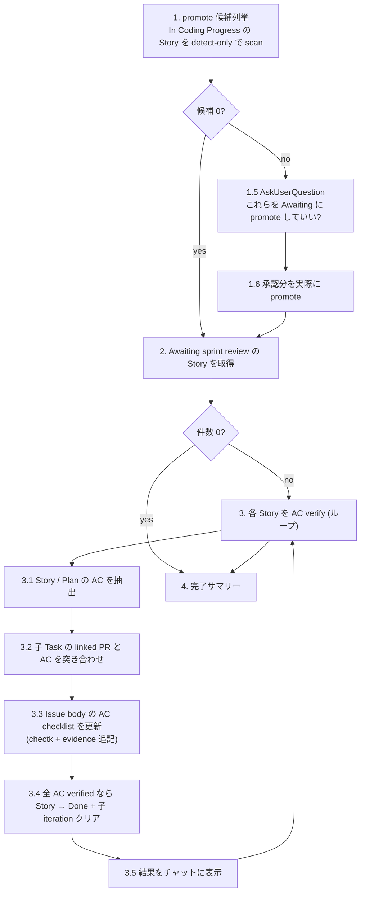

# Agile Sprint Review

> 🗣️ **ユーザーへの質問**: Step 1 の promote 承認だけ `AskUserQuestion` を使う (= status 変更は不可逆操作)。各 Story の受け入れ確認結果は **AskUserQuestion を投げず、ただチャットに表示するだけ**。判定はユーザーが視覚的に確認するに留める。
> 📋 **進捗管理**: 対象 Story 件数が複数のときは `TaskCreate` で 1 件 1 task として進捗を可視化する。1-2 件なら省略可。
> 📐 **不可逆操作の承認**: Step 1 の promote 実行前は `AskUserQuestion` で承認、Step 3 で全 AC verified の Story を Done に進める処理は AskUserQuestion 不要 (= AC verify そのものが承認の代わり)。

子 Plan/Task が全 Done になった Story を `Awaiting sprint review` Status に promote し、AC を子 Task の linked PR と突き合わせて checklist に evidence 付きでチェックを入れる。AC が全部 evidence で埋まった Story は Done に進めて子 Plan/Task の iteration をクリア、Sprint Board から落とす。AC verify が完全でなかった Story は Awaiting のまま残し、結果をチャットに表示するだけ。ユーザーは表示を見て手動で追加対応する。

## When to Use

- 「そろそろ受け入れ確認しよう」と思ったタイミング。iteration 終わり目でも、Awaiting が溜まってきたタイミングでも都度回せる
- 子 Plan/Task が全 Done になっているのに親 Story の Status が `In Coding Progress` のまま放置されている (lazy scan で拾える)
- 過去 iteration から取り残された `Awaiting sprint review` をまとめて捌きたいとき

## When NOT to Use

- 個別の Story の AC を編集したい — `/agile-refine-story` で
- まだ実装中の Story を進めたい — `/agile-implement-task` 等で実装を続ける
- 受け入れ確認のために対話的に 1 件ずつ細かく判定したい — 本 skill は対話を投げない設計。判断はチャット表示の結果を見てユーザーが行う

---

## Workflow



---

## Step 1: promote 候補列挙 (lazy scan, detect-only)

Story Status を Done に変える経路が複数あり、特に PR merge → Auto-close issue Workflow → Task Done のルートは skill から検知できない。本 skill 起動時に **In Coding Progress の Story を全件 scan** して、子が全 Done のものを Awaiting sprint review に promote 候補として列挙する。Status 変更は **ユーザー承認後** に行う。

### 手順

1. `.claude/skills/references/github-projects.json` (複数アプリ運用なら `github-projects.<app>.json`) を `Read` し、Project の owner / number を取得

2. Project items から Status = `In Coding Progress` かつ type = Story の Issue 番号を抽出:

```bash
gh api graphql -f query='
{
  organization(login: "<OWNER>") {
    projectV2(number: <NUMBER>) {
      items(first: 100) {
        nodes {
          content { ... on Issue { number issueType { name } } }
          fieldValueByName(name: "Status") { ... on ProjectV2ItemFieldSingleSelectValue { name } }
        }
      }
    }
  }
}' | jq -r '.data.organization.projectV2.items.nodes[]
  | select(.content.issueType.name == "Story" and .fieldValueByName.name == "In Coding Progress")
  | .content.number'
```

3. 各 Story 番号に対して `--detect-only` で check-story-completion を呼ぶ:

```bash
bash ~/.claude/skills/agile-update-skills/scripts/check-story-completion.sh <story-number> --detect-only [app-name]
```

stdout に `READY_TO_PROMOTE #N <title>` が出れば候補。子未完 / 子なし / Status 不一致は silent exit 0。

4. 候補をユーザーに列挙して提示。**1 件もなければ Step 2 へスキップ** (ユーザー確認不要)。

```
以下の Story は子 Plan/Task が全部 Done なので Awaiting sprint review に promote 可能です:

- #N1 [title 1]
- #N2 [title 2]

これらを Awaiting sprint review に promote していいですか?
```

5. `AskUserQuestion` で 3 択:

| label | description |
|---|---|
| はい、全部 promote する (Recommended) | 候補全件を Awaiting sprint review に遷移、Step 2 へ |
| いや、promote せずに skip | 何もせず Step 2 (Awaiting の Story だけ処理) |
| キャンセル | skill を終了 |

6. 「はい」なら各候補 Story に対して `check-story-completion.sh <number> [app-name]` を `--detect-only` 無しで呼んで実 promote:

```bash
for n in $candidates; do
  bash ~/.claude/skills/agile-update-skills/scripts/check-story-completion.sh "$n" [app-name]
done
```

何件 promote したかをユーザーに報告。

---

## Step 2: Awaiting sprint review の Story を取得

Status = `Awaiting sprint review` の Story を全件取得 (current iteration の縛りは付けない — 過去 iteration から取り残されたものも拾えるように):

```bash
gh api graphql -f query='
{
  organization(login: "<OWNER>") {
    projectV2(number: <NUMBER>) {
      items(first: 100) {
        nodes {
          content {
            ... on Issue {
              number title
              repository { nameWithOwner }
              issueType { name }
            }
          }
          fieldValueByName(name: "Status") { ... on ProjectV2ItemFieldSingleSelectValue { name } }
        }
      }
    }
  }
}' | jq -r '.data.organization.projectV2.items.nodes[]
  | select(.content.issueType.name == "Story" and .fieldValueByName.name == "Awaiting sprint review")
  | "\(.content.number)|\(.content.repository.nameWithOwner)|\(.content.title)"'
```

- 件数 0 → 「受け入れ確認対象の Story はありません」と案内して終了
- 件数 ≥ 1 → 全件をユーザーに一覧表示 (番号 + タイトル) してから Step 3 のループへ

3 件以上ある場合は `TaskCreate` で進捗を可視化する。

---

## Step 3: 各 Story の AC verify + checklist 自動更新 (ループ)

候補 Story を 1 件ずつ処理する。**AskUserQuestion は使わない**。Skill が機械的に AC と PR を突き合わせて checklist を更新し、結果をチャットに表示する。

### Step 3.1: Story / 関連 Implementation Plan の AC を抽出

`gh issue view <story-number> --repo <owner/repo>` で Story body を取得。AC は以下のパターンで markdown checklist として記述されている前提:

```markdown
### 受入基準

- [ ] AC item 1
- [ ] AC item 2
```

セクション名は `受入基準` / `Acceptance Criteria` / `AC` のいずれか。本文中の最初に見つかったチェックリストを AC として扱う。

子の Implementation Plan があれば、その body も同様に取得し、Plan 側の AC も別途抽出する (Plan は Story の補足として独自の AC を持つことがある)。**Implementation Plan の AC は Story の AC と区別して扱う** (それぞれ別に更新する)。

### Step 3.2: 子 Task の linked PR と AC を突き合わせ

子 Plan/Task の番号と linked PR を取得:

```bash
gh issue view <story-number> --repo <owner/repo> --json subIssues --jq '.subIssues[].number'

# 各子 Issue について
gh issue view <child-number> --repo <owner/repo> --json title,closedByPullRequestsReferences
```

各 PR について `gh pr view <pr-number> --repo <owner/repo> --json title,body` で詳細を取得。PR title / body / 子 Issue title を見て、AC 項目との対応関係を判定する。

判定は LLM (skill 内の Claude) が行う:
- AC 項目 1 件ずつに対して「どの PR (or どの子 Issue) が満たしている可能性が高いか」を考える
- 明確に対応が取れた AC は evidence 付きで verified 扱い
- 対応が曖昧 / 不明 / 該当 PR なし → unverified のまま残す

### Step 3.3: Issue body の AC checklist を更新

verified な AC は markdown を以下のように書き換える:

変更前:
```markdown
- [ ] AC item 1
```

変更後:
```markdown
- [x] AC item 1 (#1192で対応済み)
```

- チェック `[ ]` → `[x]` に変更
- 末尾に `(#<PR番号>で対応済み)` を追加 (複数 PR が evidence なら `(#1192, #1195 で対応済み)`)

unverified な AC は変更しない (`- [ ]` のまま、evidence なし)。

更新は **`gh issue edit <issue-number> --repo <owner/repo> --body-file -`** で body を書き戻す:

```bash
# 1. 現在の body を取得
gh issue view <story-number> --repo <owner/repo> --json body --jq '.body' > /tmp/body.md

# 2. 編集 (LLM が markdown を直接 Edit する)

# 3. 書き戻し
gh issue edit <story-number> --repo <owner/repo> --body-file /tmp/body.md
```

Implementation Plan の AC も同様に Plan 本体の body を更新する (`gh issue edit <plan-number> ...`)。

### Step 3.4: 全 AC verified なら Story → Done + 子 iteration クリア

Story の全 AC が verified (全 `- [x]` になった) なら、自動で Done に進める。**AskUserQuestion は投げない**:

```bash
bash ~/.claude/skills/agile-update-skills/scripts/update-issue-status.sh <story-number> "Done" [app-name]
# → Auto-close issue Workflow で Story が closed に

# Story の子全部から iteration field をクリア
CHILD_NUMS=$(gh issue view <story-number> --repo <owner/repo> --json subIssues --jq '.subIssues[].number')
for child in $CHILD_NUMS; do
  bash ~/.claude/skills/agile-update-skills/scripts/clear-issue-iteration.sh "$child" [app-name]
done
```

一部の AC が unverified で残った場合は **Status を変えない** (Awaiting のまま)。ユーザーが結果を見て:
- 追加 Task を起こして実装するか
- 手動で Story を Done にするか
- AC 自体を書き換えるか (`/agile-refine-story`)

を判断する。

### Step 3.5: 結果表示 (チャットのみ、AskUserQuestion なし)

各 Story の処理結果を以下のフォーマットでチャットに表示する:

```
─────────────────────────────────────
Story #N: [title]
─────────────────────────────────────

【判定】 全 AC verified → Done (自動遷移、子 iteration クリア)
   または
【判定】 部分 verified → Awaiting sprint review のまま (ユーザー判断要)

【受入基準 (更新後)】
- [x] AC 1 (#1192で対応済み)
- [x] AC 2 (#1195で対応済み)
- [ ] AC 3 (evidence なし、要手動対応)

【Implementation Plan #M の AC (更新後)】 ← Plan があるとき
- [x] Plan AC 1 (#1200で対応済み)
- [ ] Plan AC 2 (evidence なし)

【関連 PR】
- #1192 [title] — 対応 AC: Story AC 1
- #1195 [title] — 対応 AC: Story AC 2
- #1200 [title] — 対応 AC: Plan AC 1

【リンク】
Story URL: https://github.com/<owner>/<repo>/issues/N
```

ループ中はこれを次々表示するだけ。判定の Q&A は無し。ユーザーは表示を読んで、自分で次のアクションを取る (or 取らない)。

---

## Step 4: 完了サマリー

全 Story の処理を終えたら、ユーザーに統計を提示:

```
─────────────────────────────────────
Sprint Review 完了
─────────────────────────────────────

📊 Step 1 (promote): 候補 N 件 / 承認 M 件 / promote 実行 M 件

✅ 全 AC verified で Done に進めた: A 件
  - #X, #Y, #Z

⏸️ AC 一部 unverified で Awaiting のまま: B 件
  - #P (Story AC 3 件中 1 件未対応, Plan AC 2 件中 1 件未対応)
  - #Q (Story AC 2 件中 1 件未対応)

次のステップ:
- Awaiting のまま残った Story は未対応の AC があります。チャット出力の各 Story の checklist を確認してください
- 追加 Task が必要なら `/agile-decompose-task-from-implementation-plan <story-number>` で起票
- AC 自体の見直しが必要なら `/agile-refine-story <story-number>`
- AC は満たしてるが evidence が曖昧 → 手動で `update-issue-status.sh <story-number> "Done"` を叩いて Done に進める
```

---

## 決定境界

全体マップは `docs/agile-workflow/concepts/ai-decision-boundary.md` を参照。本スキル固有の人間承認ゲート:

- **Step 1 の promote 実行** — `AskUserQuestion` で「これらを Awaiting に promote していい?」を必ず聞く (Status 変更は不可逆)
- **Step 3.3 の AC checklist 更新** — Story / Plan の body を書き換える操作。LLM 判定で機械的に行う (= 後で気付けば手動で revert 可能、また AC verify の結果を視覚化するのが目的なので permissive)
- **Step 3.4 の Done 自動遷移** — 全 AC verified の場合のみ。`AskUserQuestion` は使わない。AC verify そのものが「OK 判定」の代わり。一部 verified の場合は Status を触らない (Awaiting のまま)

NEVER (次節) はこのゲートの違反を具体的に列挙している。

---

## エッジケース

| 状況 | 対応 |
|---|---|
| Story body に AC セクションが無い | AC verify をスキップ、Step 3.5 で「AC セクションなし、手動判定してください」と表示。Status は変えない |
| AC の文言と PR の対応関係が判定不能 | unverified として残す (チェックを入れない)。ユーザーが結果を見て判断 |
| Implementation Plan が無い | Plan AC の処理はスキップ、Story AC だけ verify |
| 子 Task に linked PR が無い | evidence が引けないので、その AC は unverified のまま |
| AC checklist の markdown 形式が崩れている | parse 不能の場合は warnings を出して当該 Story を skip、Status は触らない |
| Step 1 候補が 0 件 | AskUserQuestion を飛ばして Step 2 へ直行 |
| Step 2 候補が 0 件 | 「対象なし」を案内して終了 (エラー扱いしない) |

---

## NEVER — アンチパターン

- **絶対に** AC 内容を skill 起動中に書き換えない (= checklist にチェックを入れる以外の本文編集はしない)。AC 文言の見直しは `/agile-refine-story` の責務
- **絶対に** 各 Story の判定で `AskUserQuestion` を投げない (= AC verify と表示で完結する設計)。判断はユーザーがチャット出力を見て自分で行う
- **絶対に** 一部 AC が unverified なまま Story を Done に進めない (= 必ず全 verified が条件)
- **絶対に** PR との対応関係を雑に判定して evidence を間違って付けない (= 確証が無ければ unverified のまま残す)
- **絶対に** Step 1 の promote を AskUserQuestion なしで実行しない (= status 変更は要承認)
- **絶対に** 本スキルを「Scrum セレモニーとして強制」しない — 起動頻度は決め打ちせず、ユーザー裁量で都度実行

---

## References

このスキルが参考にしている書籍 / 概念:

- 📖 [アジャイルサムライ](https://www.amazon.co.jp/s?k=アジャイルサムライ) — Inception Deck / 受入確認の文化
- `docs/agile-workflow/concepts/outcome-done.md` — Outcome Done の概念 (AC verify と切り分け)
- `docs/agile-workflow/operations.md` — Status フロー / iteration の運用ルール
