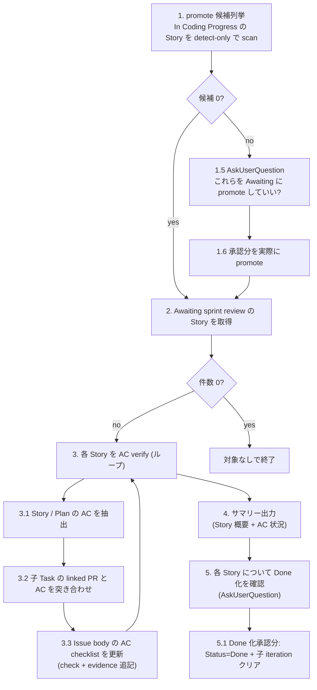

# Agile Sprint Review

> 🗣️ **ユーザーへの質問**: 不可逆操作 (Step 1 の promote, Step 5 の Done 化) の前だけ `AskUserQuestion` を使う。AC verify とサマリー表示の途中で対話的判定 (OK/Reject ループ) は投げない。
> 📋 **進捗管理**: 対象 Story 件数が複数のときは `TaskCreate` で 1 件 1 task として進捗を可視化する。1-2 件なら省略可。
> 📐 **不可逆操作の承認**: Step 1 の promote / Step 5 の Done 化はそれぞれ `AskUserQuestion` で承認を取る (Status 変更は不可逆)。

子 Plan/Task が全 Done になった Story を `Awaiting sprint review` Status に promote し、AC を子 Task の linked PR と突き合わせて checklist に evidence 付きでチェックを入れる。Awaiting sprint review にある Story 群のサマリー (概要 + AC 状況) をチャットに表示し、ユーザーが「これを Done にしていいか」を Story 単位で判断する。AC に現れない追加確認 (デザイン的な好み、運用面の懸念など) の余地を残すため、Done への遷移は必ず人間判断を経由する。

## When to Use

- 「そろそろ受け入れ確認しよう」と思ったタイミング。iteration 終わり目でも、Awaiting が溜まってきたタイミングでも都度回せる
- 子 Plan/Task が全 Done になっているのに親 Story の Status が `In Coding Progress` のまま放置されている (lazy scan で拾える)
- 過去 iteration から取り残された `Awaiting sprint review` をまとめて捌きたいとき

## When NOT to Use

- 個別の Story の AC を編集したい — `/agile-refine-story` で
- まだ実装中の Story を進めたい — `/agile-implement-task` 等で実装を続ける
- 受け入れ確認のために対話的に 1 件ずつ細かく判定したい — 本 skill は対話を投げない設計。判断はチャット表示の結果を見てユーザーが行う

---

## Workflow



---

## Step 1: promote 候補列挙 (lazy scan, detect-only)

Story Status を Done に変える経路が複数あり、特に PR merge → Auto-close issue Workflow → Task Done のルートは skill から検知できない。本 skill 起動時に **In Coding Progress の Story を全件 scan** して、子が全 Done のものを Awaiting sprint review に promote 候補として列挙する。Status 変更は **ユーザー承認後** に行う。

### 手順

1. `.claude/skills/references/github-projects.json` (複数アプリ運用なら `github-projects.<app>.json`) を `Read` し、Project の owner / number を取得

2. Project items から Status = `In Coding Progress` かつ type = Story の Issue 番号を抽出:

```bash
gh api graphql -f query='
{
  organization(login: "<OWNER>") {
    projectV2(number: <NUMBER>) {
      items(first: 100) {
        nodes {
          content { ... on Issue { number issueType { name } } }
          fieldValueByName(name: "Status") { ... on ProjectV2ItemFieldSingleSelectValue { name } }
        }
      }
    }
  }
}' | jq -r '.data.organization.projectV2.items.nodes[]
  | select(.content.issueType.name == "Story" and .fieldValueByName.name == "In Coding Progress")
  | .content.number'
```

3. 各 Story 番号に対して `--detect-only` で check-story-completion を呼ぶ:

```bash
bash ~/.claude/skills/agile-update-skills/scripts/check-story-completion.sh <story-number> --detect-only [app-name]
```

stdout に `READY_TO_PROMOTE #N <title>` が出れば候補。子未完 / 子なし / Status 不一致は silent exit 0。

4. 候補をユーザーに列挙して提示。**1 件もなければ Step 2 へスキップ** (ユーザー確認不要)。

```
以下の Story は子 Plan/Task が全部 Done なので Awaiting sprint review に promote 可能です:

- #N1 [title 1]
- #N2 [title 2]

これらを Awaiting sprint review に promote していいですか?
```

5. `AskUserQuestion` で 3 択:

| label | description |
|---|---|
| はい、全部 promote する (Recommended) | 候補全件を Awaiting sprint review に遷移、Step 2 へ |
| いや、promote せずに skip | 何もせず Step 2 (Awaiting の Story だけ処理) |
| キャンセル | skill を終了 |

6. 「はい」なら各候補 Story に対して `check-story-completion.sh <number> [app-name]` を `--detect-only` 無しで呼んで実 promote:

```bash
for n in $candidates; do
  bash ~/.claude/skills/agile-update-skills/scripts/check-story-completion.sh "$n" [app-name]
done
```

何件 promote したかをユーザーに報告。

---

## Step 2: Awaiting sprint review の Story を取得

Status = `Awaiting sprint review` の Story を全件取得 (current iteration の縛りは付けない — 過去 iteration から取り残されたものも拾えるように):

```bash
gh api graphql -f query='
{
  organization(login: "<OWNER>") {
    projectV2(number: <NUMBER>) {
      items(first: 100) {
        nodes {
          content {
            ... on Issue {
              number title
              repository { nameWithOwner }
              issueType { name }
            }
          }
          fieldValueByName(name: "Status") { ... on ProjectV2ItemFieldSingleSelectValue { name } }
        }
      }
    }
  }
}' | jq -r '.data.organization.projectV2.items.nodes[]
  | select(.content.issueType.name == "Story" and .fieldValueByName.name == "Awaiting sprint review")
  | "\(.content.number)|\(.content.repository.nameWithOwner)|\(.content.title)"'
```

- 件数 0 → 「受け入れ確認対象の Story はありません」と案内して終了
- 件数 ≥ 1 → 全件をユーザーに一覧表示 (番号 + タイトル) してから Step 3 のループへ

3 件以上ある場合は `TaskCreate` で進捗を可視化する。

---

## Step 3: 各 Story の AC verify + checklist 自動更新 (ループ)

候補 Story を 1 件ずつ処理する。**AskUserQuestion は使わない**。Skill が機械的に AC と PR を突き合わせて checklist を更新し、結果をチャットに表示する。

### Step 3.1: Story / 関連 Implementation Plan の AC を抽出

`gh issue view <story-number> --repo <owner/repo>` で Story body を取得。AC は以下のパターンで markdown checklist として記述されている前提:

```markdown
### 受入基準

- [ ] AC item 1
- [ ] AC item 2
```

セクション名は `受入基準` / `Acceptance Criteria` / `AC` のいずれか。本文中の最初に見つかったチェックリストを AC として扱う。

子の Implementation Plan があれば、その body も同様に取得し、Plan 側の AC も別途抽出する (Plan は Story の補足として独自の AC を持つことがある)。**Implementation Plan の AC は Story の AC と区別して扱う** (それぞれ別に更新する)。

### Step 3.2: 子 Task の linked PR と AC を突き合わせ

子 Plan/Task の番号と linked PR を取得:

```bash
gh issue view <story-number> --repo <owner/repo> --json subIssues --jq '.subIssues[].number'

# 各子 Issue について
gh issue view <child-number> --repo <owner/repo> --json title,closedByPullRequestsReferences
```

各 PR について `gh pr view <pr-number> --repo <owner/repo> --json title,body` で詳細を取得。PR title / body / 子 Issue title を見て、AC 項目との対応関係を判定する。

判定は LLM (skill 内の Claude) が行う:
- AC 項目 1 件ずつに対して「どの PR (or どの子 Issue) が満たしている可能性が高いか」を考える
- 明確に対応が取れた AC は evidence 付きで verified 扱い
- 対応が曖昧 / 不明 / 該当 PR なし → unverified のまま残す

### Step 3.3: Issue body の AC checklist を更新

verified な AC は markdown を以下のように書き換える:

変更前:
```markdown
- [ ] AC item 1
```

変更後:
```markdown
- [x] AC item 1 (#1192で対応済み)
```

- チェック `[ ]` → `[x]` に変更
- 末尾に `(#<PR番号>で対応済み)` を追加 (複数 PR が evidence なら `(#1192, #1195 で対応済み)`)

unverified な AC は変更しない (`- [ ]` のまま、evidence なし)。

更新は **`gh issue edit <issue-number> --repo <owner/repo> --body-file -`** で body を書き戻す:

```bash
# 1. 現在の body を取得
gh issue view <story-number> --repo <owner/repo> --json body --jq '.body' > /tmp/body.md

# 2. 編集 (LLM が markdown を直接 Edit する)

# 3. 書き戻し
gh issue edit <story-number> --repo <owner/repo> --body-file /tmp/body.md
```

Implementation Plan の AC も同様に Plan 本体の body を更新する (`gh issue edit <plan-number> ...`)。

ループは Step 3.3 まで。Step 3.4 で **Story 単位の Status 変更はしない** (= Done への自動遷移はしない)。AC が全 verified だったとしても、AC に現れない追加確認 (UX 的な好み、運用面の懸念) があるかもしれないので、Done 化は Step 5 でユーザー確認を経由する。

---

## Step 4: サマリー出力

ループ完了後、Awaiting sprint review にある全 Story について **Story 概要 + AC 状況** をチャットに出力する。1 件ずつ以下のフォーマット:

```
─────────────────────────────────────
Story #N: [title]
─────────────────────────────────────

[Story body の冒頭 (概要部分) を 1-3 行で抜粋]

【受入基準】
- [x] AC 1 (#1192で対応済み)
- [x] AC 2 (#1195で対応済み)
- [ ] AC 3 (evidence なし)

【Implementation Plan #M の受入基準】 ← Plan があり AC を持つとき
- [x] Plan AC 1 (#1200で対応済み)
- [ ] Plan AC 2 (evidence なし)
```

冗長な情報 (関連 PR 一覧、リンク等) は載せない — チェックリストの evidence (`#1192`) からたどれる。サマリーは「**この Story を Done に進めていいか**」を判断するための最小情報に絞る。

全 Story を出力したら Step 5 へ。

---

## Step 5: 各 Story について Done 化を確認 (AskUserQuestion)

サマリーを見せた後、Story 1 件ずつ `AskUserQuestion` で Done 化可否を聞く。**AC 全 verified でも自動 Done にはしない** — AC に現れない追加確認 (デザイン的な好み、運用面の懸念) があるかもしれないため。

```
Story #N をどうしますか?
```

| label | description |
|---|---|
| Done に進める (Recommended for 全 AC verified) | Story Status=Done に遷移、配下 Plan/Task の iteration をクリア (Sprint Board から外れる) |
| Awaiting のままにする | Status は変えない。追加対応が必要、または後で再判定する場合 |
| In Coding Progress に戻す | 差し戻し。追加 Task 起票が必要なケース。`/agile-decompose-task-from-implementation-plan` を案内 |

Recommended ラベルは AC 状況に応じて切り替える:
- 全 AC verified の Story → "Done に進める" に `(Recommended)` を付ける
- 一部 unverified の Story → "Awaiting のままにする" に `(Recommended)` を付ける

### Step 5.1: Done 化処理 (ユーザーが選択した分のみ)

```bash
bash ~/.claude/skills/agile-update-skills/scripts/update-issue-status.sh <story-number> "Done" [app-name]
# → Auto-close issue Workflow で Story が closed に

# Story の子全部から iteration field をクリア
CHILD_NUMS=$(gh issue view <story-number> --repo <owner/repo> --json subIssues --jq '.subIssues[].number')
for child in $CHILD_NUMS; do
  bash ~/.claude/skills/agile-update-skills/scripts/clear-issue-iteration.sh "$child" [app-name]
done
```

### Step 5.2: In Coding Progress 差し戻し処理

```bash
bash ~/.claude/skills/agile-update-skills/scripts/update-issue-status.sh <story-number> "In Coding Progress" [app-name]
```

子 Plan/Task の iteration はクリアしない (= 引き続き Sprint Board に残り、追加作業の動線が見える)。「追加 Task が必要なら `/agile-decompose-task-from-implementation-plan <story-number>` で起票してください」と案内。

### Step 5.3: Awaiting のまま

何もしない (Status は Awaiting sprint review のまま)。次回 sprint-review 起動時にまた候補に並ぶ。

### 完了サマリー

全 Story 処理後、最終結果を提示:

```
─────────────────────────────────────
Sprint Review 完了
─────────────────────────────────────

📊 Step 1 (promote): 候補 N 件 / 承認 M 件 / promote 実行 M 件

✅ Done に進めた: A 件
  - #X, #Y, #Z

⏸️ Awaiting のまま保留: B 件
  - #P, #Q

⏪ In Coding Progress に差し戻し: C 件
  - #R
```

---

## 決定境界

全体マップは `docs/agile-workflow/concepts/ai-decision-boundary.md` を参照。本スキル固有の人間承認ゲート:

- **Step 1 の promote 実行** — `AskUserQuestion` で「これらを Awaiting に promote していい?」を必ず聞く (Status 変更は不可逆)
- **Step 3.3 の AC checklist 更新** — Story / Plan の body を書き換える操作。LLM 判定で機械的に行う (= 後で気付けば手動で revert 可能、また AC verify の結果を視覚化するのが目的なので permissive)
- **Step 5 の Done 化** — 全 Story について `AskUserQuestion` で 3 択を聞く。全 AC verified でも自動 Done にしない (AC に現れない追加確認の余地を残すため)

NEVER (次節) はこのゲートの違反を具体的に列挙している。

---

## エッジケース

| 状況 | 対応 |
|---|---|
| Story body に AC セクションが無い | AC verify をスキップ、Step 3.5 で「AC セクションなし、手動判定してください」と表示。Status は変えない |
| AC の文言と PR の対応関係が判定不能 | unverified として残す (チェックを入れない)。ユーザーが結果を見て判断 |
| Implementation Plan が無い | Plan AC の処理はスキップ、Story AC だけ verify |
| 子 Task に linked PR が無い | evidence が引けないので、その AC は unverified のまま |
| AC checklist の markdown 形式が崩れている | parse 不能の場合は warnings を出して当該 Story を skip、Status は触らない |
| Step 1 候補が 0 件 | AskUserQuestion を飛ばして Step 2 へ直行 |
| Step 2 候補が 0 件 | 「対象なし」を案内して終了 (エラー扱いしない) |

---

## NEVER — アンチパターン

- **絶対に** AC 内容 (文言) を skill 起動中に書き換えない (= checklist のチェック / evidence 追記以外の本文編集はしない)。AC 文言の見直しは `/agile-refine-story` の責務
- **絶対に** Story を AskUserQuestion なしで Done に自動遷移させない (AC 全 verified であっても)。AC に現れない追加確認の余地をユーザーに残すため、Step 5 で必ず判定を仰ぐ
- **絶対に** PR との対応関係を雑に判定して evidence を間違って付けない (= 確証が無ければ unverified のまま残す)
- **絶対に** Step 1 の promote を AskUserQuestion なしで実行しない (= status 変更は要承認)
- **絶対に** Step 4 のサマリーに不要情報を入れない (= Story 概要 + AC 状況のみ。関連 PR 一覧やリンク等は省略する。チェックリストの evidence (`#1192`) からたどれる)
- **絶対に** 本スキルを「Scrum セレモニーとして強制」しない — 起動頻度は決め打ちせず、ユーザー裁量で都度実行

---

## References

このスキルが参考にしている書籍 / 概念:

- 📖 [アジャイルサムライ](https://www.amazon.co.jp/s?k=アジャイルサムライ) — Inception Deck / 受入確認の文化
- `docs/agile-workflow/concepts/outcome-done.md` — Outcome Done の概念 (AC verify と切り分け)
- `docs/agile-workflow/operations.md` — Status フロー / iteration の運用ルール
