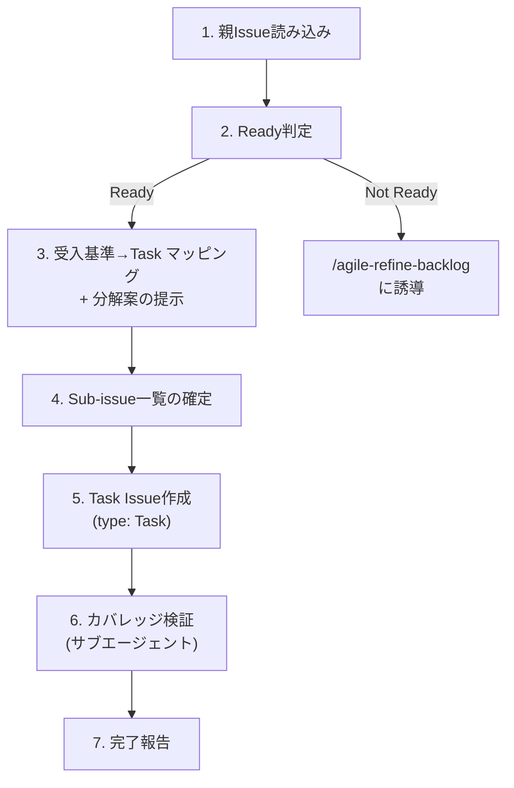

# Agile Story to Task

リファインメント済みの Story Issue を、CodingAgent が実行可能な Task Sub-issue に分解する。

## When to Use

- リファインメント完了（受入基準確定済み）の Story を実装タスクに分解するとき
- Sub-issue を作りたいとき
- PR 単位で作業を分割したいとき
- `/agile-story-to-task` で手動実行

## When NOT to Use

- Story の受入基準がまだ決まっていない（→ `/agile-refine-backlog`）
- Epic を Story に分解したい（→ `/agile-create-backlog`）
- 1 PR で完結する小さな Story → Sub-issue は不要、チェックリストで十分

## コーチングの原則

- **「何を成立させるか」で切れ** — 「frontend/backend/infra」を固定テンプレにしない。まず「何を成立させるタスクか」で切り、結果としてレイヤーに分かれるならOK
- **親の受入基準とのマッピングを先に考えろ** — 分解を始める前に、親 Story の受入基準を 1つずつ見て「この受入基準はどの Task でカバーされるか」をマッピングする。マッピングできない受入基準があれば分解軸が間違っている
- テンプレの質問で詰まったら **GROW モデル** （Goal → Reality → Options → Will）の順で問いを組み立て直す

## Workflow



---

## Step 1: 親Issue読み込み

GitHub MCP の `issue_read` で親 Story Issue を読み込む。

## Step 2: Ready判定

分解に進む前に、以下を確認する:

- 受入基準が具体的で、Yes/No で判定可能か
- パターン一覧と画面仕様が TBD ではなく埋まっているか
- 未解決の論点やブロッカーがないか

いずれかが未充足なら `/agile-refine-backlog` に誘導する。

## Step 3: 受入基準→Task マッピング + 分解案の提示

**まず親の受入基準を 1つずつ見て、どの Task でカバーするかをマッピングする。** これが分解の出発点。

| 分解の起点 | 切り方 |
|-----------|--------|
| スキーマ定義がある | Schema → BE/FE 並行 → Test |
| 小さい Story | コア実装 + エッジケース の 2分割 |
| インフラ変更が前提 | Infra → ロジック → UI → Test |

**Sub-issue にすべきかの判断:**
- ① 担当者・レビュー・blocked状態を持たせる価値があるか
- ② 独立して完了条件を書けるか
- ③ レビュー単位として意味があるか
- 3つとも Yes なら Sub-issue。そうでなければチェックリストで十分

**粒度:** 1 Task = 1 PR、半日〜2日。3〜6個が目安。10超えたら Story 自体を分割すべき。

分解軸が明確なら単案で提示。迷う場合は2-3パターンを提示する。

## Step 4: Sub-issue一覧の確定

以下の形式で一覧を提示して承認を得る。

| # | タイトル | 依存 | カバーする受入基準 |
|---|---|---|---|
| 1 | [Schema] APIスキーマ定義 | なし | — |
| 2 | [BE] エンドポイント実装 | #1 | AC1, AC3 |
| 3 | [FE] フォーム画面実装 | #1 | AC2, AC4 |
| 4 | [Test] E2Eテスト | #2, #3 | AC1〜AC4 |

**タイトル:** `[軸] 動詞 + 対象`。軸はレイヤーに限らない（`[Flow]`, `[Validation]`, `[Migration]` 等もOK）。親 Story のタイトルを繰り返さない。

## Step 5: Task Issue作成 + 品質スコアリング

**MANDATORY** : Task テンプレートを次の順で解決し、本文出力に使う:

1. リポジトリ側 `.github/ISSUE_TEMPLATE/task.md` を最優先
2. 無ければ本スキル同梱の `templates/task.md` をフォールバック

テンプレートの全セクションを保持し、独自セクションを追加しない。テンプレート解決・登録確認は `/agile-create-issue` 委譲時に処理されるため、本ステップでは構造把握として読み込むのみ。

**Do NOT Load**: Step 3 の分解検討フェーズではテンプレートを読むな。分解の思考がテンプレートの枠に引きずられることを防ぐ。

**Issue Type**: `type: "Task"` を指定。

**各 Task の本文を作成したら、Issue に書き込む前に以下の 7 点スコアリングで品質チェックする:**

| # | 観点 | 合格基準 |
|---|------|---------|
| 1 | **概要の具体性** | 何をするかが1〜2文で明確。スコープの境界がわかる |
| 2 | **振る舞い仕様の網羅性** | 親 Story の受入基準（正常系・異常系）から、この Task に関連する振る舞いが漏れなく抜粋・具体化されている |
| 3 | **完了条件の判定可能性** | 「振る舞い仕様の全行が実装されている」「CI green」を含み、Yes/No で判定可能 |
| 4 | **テストピラミッドの設計** | ユニットテストが大部分を占め、統合テストは外部依存がある場合のみ、E2E は最小限という構成になっている |
| 5 | **受入確認の明示** | PdO/QA が手動で確認するシナリオが書かれている（自動テストでカバーしにくい UI・文言・操作感等） |
| 6 | **親の受入基準との対応** | カバーする受入基準が明示され、この Task の存在理由が明確 |
| 7 | **着手可能性** | 対象モジュール・参考実装・ADR が明記され、CodingAgent が「どこから手をつけるか」迷わない |

**7 点中 6 点以上で合格。5 点以下は書き直し。** ユーザーに各 Task のスコアを提示して承認を得てから Issue を作成する。

**作成手順:**
`/agile-create-issue` スキルに委譲する。Issue Type: `"Task"`、親 Issue: 対象の Story Issue を指定。テンプレート解決・登録確認・親子リンクは `/agile-create-issue` が処理する。

## Step 6: カバレッジ検証（サブエージェント）

**サブエージェントを起動**し、親の受入基準カバレッジと各 Task の品質を検証する。

**サブエージェントへの指示:**
```
親 Story Issue と作成した Task Sub-issue 一覧を読み、検証してください。

検査観点:
1. 親 Story の全受入基準（正常系・異常系）が、いずれかの Task の振る舞い仕様でカバーされているか
2. どの受入基準もカバーしていない Task がないか（スコープ外の混入）
3. Task 間の依存関係に循環がないか
4. 各 Task の振る舞い仕様に、CodingAgent が TDD を開始できるだけの具体性があるか
5. テスト設計がテストピラミッドに沿っているか（ユニットテスト中心、E2E 最小限）
6. 手動の受入確認シナリオが書かれているか

未カバーの受入基準/ 情報不足の Task があれば報告。
```

**結果に基づく対応:**
- 未カバーの受入基準 → 追加 Task を提案
- Task の関連仕様が不足 → 親 Story から該当仕様を抜粋して補完
- 受入基準が曖昧で落とせない → `/agile-refine-backlog` に差し戻し提案
- 全受入基準カバー + 全 Task 品質合格 → Step 7 へ

## Step 7: 完了報告

| # | タイトル | Issue | 依存 |
|---|---|---|---|
| 1 | [Schema] APIスキーマ定義 | owner/repo#XX | なし |
| 2 | [BE] エンドポイント実装 | owner/repo#XX | #1 |

---

## 決定境界

全体マップは `docs/agile-workflow.md` の「AI 決定境界」章を参照。本スキル固有の人間承認ゲート:

- **分解粒度の確定** — Step 5 の 7 点品質スコアリング後、各 Task の採否は人間
- **テスト戦略選択** — ユニット / 統合 / E2E の配分は人間判断（テストピラミッドの解釈）
- **Task 起票実行** — `/agile-create-issue` への委譲前の最終確認

NEVER（次節）はこのゲートの違反を具体的に列挙している。

---

## エッジケース

| 状況 | 対応 |
|------|------|
| 親 Story の受入基準が TBD | `/agile-refine-backlog` に誘導 |
| Sub-issue が 10 個以上 | Story の分割を提案 |
| 1 PR で完結する小さな Story | Sub-issue 不要、チェックリストで十分と案内 |
| 1つの受入基準を複数 Task が部分カバー | 各 Task の完了条件に担当範囲を明示し、合算で受入基準を満たすことを検証 |
| MCP ツール利用不可 | 一覧と本文テンプレをユーザーに提示し作成を委ねる |

## NEVER — アンチパターン

- **NEVER: 技術レイヤーで固定的に切るな** — 「何を成立させるか」で切り、結果としてレイヤーに分かれるのは OK
- **NEVER: 親の受入基準をそのままコピーするな** — Task の完了条件は実装視点で書き直す。コピーすると「何をテストすれば閉じてよいか」が曖昧になる
- **NEVER: 単なる作業メモを Sub-issue にするな** — 独立してレビューできない作業はチェックリストで十分
- **NEVER: カバレッジ検証を省略するな** — 全 Task 完了しても親の受入基準が満たせない事態を防ぐ唯一の手段
