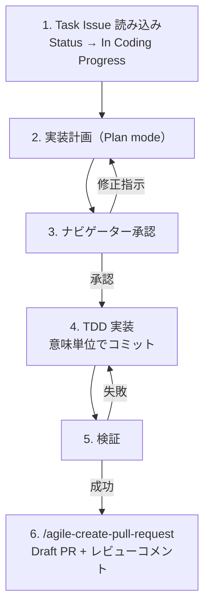

# Agile Task Implementation

Task Issue → Plan mode 計画 → TDD 実装 → Draft PR + レビューコメント。

**役割**: ユーザー = ナビゲーター（戦略判断）、Claude = ドライバー（コード記述）

**MANDATORY**: ステータス更新時は `.claude/skills/references/github-projects.md` を参照すること。

## When to Use

- Task Issue を実装するとき
- 「実装して」「このタスクやって」と指示されたとき

## When NOT to Use

- Story の詳細化（→ `/agile-refine-backlog`）
- Story → Task 分解（→ `/agile-story-to-task`）

## Workflow

---

## Step 1: Task Issue 読み込み

**Task Issue の特定**: ユーザーが Issue 番号や URL を指定していない場合、`.claude/skills/references/github-projects.md` のコマンドテンプレートで **Status "Ready"** のアイテムを抽出し一覧提示。0 件なら「Ready のチケットがありません。Issue 番号を直接指定してください」と案内。

GitHub MCP の `issue_read` で読み込み、以下を確認:

- **Issue Type が Task であること** — Task でなければ「`/agile-story-to-task` で Task 分解してください」と案内して中断
- **依存** — `blocked by #XX` が未解決なら警告し、ナビゲーターに判断を仰ぐ
- **振る舞い仕様・テスト設計・完了条件・技術メモ** を把握

**ステータス → "In Coding Progress"**: `.claude/skills/references/github-projects.md` のコマンドテンプレートに従い更新。fallback もそちらに記載。

---

## Step 2: 実装計画（Plan mode）

Plan mode に入り、Task Issue の内容をもとに計画を起草する。

1. **変更対象ファイル** — 技術メモの「対象モジュール」を起点にコードベースを探索
2. **実装順序** — 意味のある単位（機能単位・レイヤー単位）でコミットできるよう構成
3. **テスト戦略** — 振る舞い仕様の各行 → テストケースへのマッピング
4. **ADR 準拠** — 技術メモの「関連 ADR」を読み込み設計制約を確認

**技術メモが不足している場合**: コードベースを探索して補完し、発見した内容をナビゲーターに報告して確認を取る。

---

## Step 3: ナビゲーター承認

Plan mode を抜けてナビゲーターに計画のレビューを求める。修正指示 → Step 2 へ。承認 → Step 4 へ。

---

## Step 4: TDD 実装

計画承認後、ドライバーとして一気通貫で実装。TDD（テスト先行）、意味単位でコミット。思考を声に出しながら進める。

**フロント / バックエンドの実装委譲（任意）**: プロジェクトに領域特化のスキル（例: `frontend-implement-feature` のようなフロント実装ルータ）が用意されていて、変更がその領域に該当する場合は、そのスキルを Skill tool で呼んで実装を委ねる。該当スキルがない場合や領域横断的な変更の場合は本スキル内でそのまま進める。

### ナビゲーターへのエスカレーション判断

| エスカレーションする | そのまま進める |
|-------------------|--------------|
| Task Issue にない API エンドポイントが必要と判明 | テストのアサーション詳細・import 整理 |
| テストセットアップにインフラ変更が必要 | 既存パターンに従ったコード記述 |
| 実装が既存 ADR と矛盾する | リファクタリングの判断（計画の範囲内） |
| 残作業が計画の 2 倍以上に膨らむ見込み | 軽微なエッジケースの処理方法 |
| 振る舞い仕様の記述が曖昧で複数解釈できる | 構文エラー・型エラーの修正 |

---

## Step 5: 検証

プロジェクトの CLAUDE.md（モノレポなら `apps/*/CLAUDE.md` 等）に記載されたコマンドでテスト・lint・型チェックを実行。Task Issue の完了条件チェックリストを照合。失敗 → 修正して再実行。

---

## Step 6: PR 作成

`/agile-create-pull-request` スキルに委譲する。Draft PR 作成、テンプレート埋め、ステータス更新を実行。

---

## エッジケース

| 状況 | 対応 |
|------|------|
| Issue Type が Task でない | 「`/agile-story-to-task` で Task 分解してください」と案内 |
| 依存が未解決 | ナビゲーターに判断を仰ぐ（先に依存を実装 or 依存なし範囲で進行） |
| 技術メモが不足 | コードベース探索で補完 → ナビゲーターに確認 |
| 実装中に受入基準の曖昧さ発見 | 実装を止めてナビゲーターに確認。勝手に解釈しない |
| 既存テストが壊れる | 影響範囲を報告し、意図的な変更か確認 |
| ブランチ名が既存と衝突 | サフィックス付きで別名作成 |
| ステータス更新が失敗 | 手動更新を案内して実装は続行（ステータス更新で実装をブロックしない） |
| CI が PR 作成後に失敗 | 失敗原因を調査・修正し、PR を更新 |

## NEVER — アンチパターン

- **絶対に** 計画未承認のまま実装を始めない — ナビゲーターの設計意図を反映しないコードは手戻りが確定する。承認が実装開始の前提条件
- **絶対に** テストより先にプロダクションコードを書かない — このプロジェクトでは振る舞い仕様がテストの設計書。先にテストを書くことで仕様の曖昧さを早期に発見できる
- **絶対に** 受入基準の解釈をナビゲーターに確認せず決めない — 「たぶんこういう意味だろう」で実装すると、PR レビューで全面書き直しになる
- **絶対に** 振る舞い仕様にない機能を追加しない — スコープは Task Issue が定義する。「ついでに直す」はスコープクリープの入口
