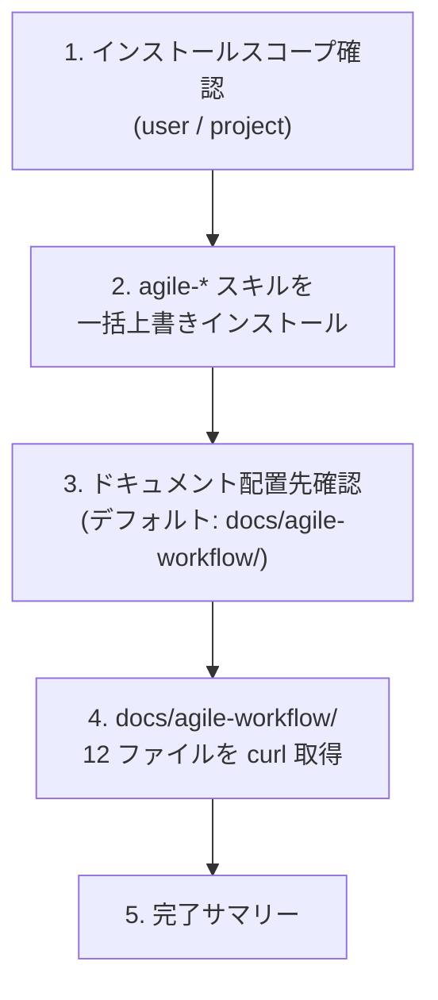

# Agile Update Skills

agile-* スキル群一式と関連ドキュメント (`docs/agile-workflow/`) を一括で最新化する。`gh skill install` の上書きインストールと `docs/agile-workflow/` 配下 12 ファイルの再フェッチを一気に実行する。

## When to Use

- `agile-project-setup` 後、各 agile-* スキルとドキュメントを一括で揃えるとき
- 既に運用中のプロジェクトで、agile-* の最新版に追従したいとき (定期実行想定: 月 1 回程度)
- `docs/agile-workflow/` を誤って削除したとき / git で取り込んだ後に最新化したいとき

## When NOT to Use

- agile-* スキルを単発でカスタマイズしたい場合 — このスキルは上書きインストールするので、ローカル編集分は失われる
- 初回セットアップで Project / Status / Workflow の構成も含めて整えたい場合 — `/agile-project-setup` を先に呼ぶ

## Workflow



---

## Step 1: インストールスコープ確認

`gh skill install` の `--scope` を user か project かユーザーに確認する:

| スコープ | 配置先 | 用途 |
|---|---|---|
| `user` | `~/.claude/skills/` | 全プロジェクトで共有 (default 推奨) |
| `project` | `<project>/.claude/skills/` | プロジェクト固有でバージョン固定したい場合 |

初回 `agile-project-setup` 実行時に選択したスコープと揃えるのが基本。不明なら `user` を案内する。

---

## Step 2: agile-* スキルを一括上書きインストール

以下 10 スキルすべてに対して `gh skill install` を実行 (既にインストール済みなら最新版で上書き):

```bash
SCOPE="user"  # または "project"

for skill in agile-product-vision agile-epic agile-create-stories \
             agile-refine-story agile-refine-implementation-plan \
             agile-implementation-plan-to-task agile-task-implementation \
             agile-create-issue agile-create-pull-request \
             agile-project-setup agile-update-skills; do
  gh skill install mrtry-lab/skills "$skill" --agent claude-code --scope "$SCOPE"
done
```

> 注: `agile-update-skills` 自身も対象に含める。自己更新で常に最新版が手元にある状態を維持。

各スキルの install ログを集約してユーザーに提示する。失敗したスキルがあれば手動で再実行するよう案内。

---

## Step 3: ドキュメント配置先確認

agile-* スキルは `docs/agile-workflow/concepts/*.md` (判定基準・概念定義) や `docs/agile-workflow/operations.md` (用語マッピング・Status フロー) を Read tool で参照する。

**ユーザーに配置先を聞く**:

> agile-* スキルが参照する関連ドキュメントを fetch しておきたいです。配置先はどこにしますか?
> （デフォルト: `docs/agile-workflow/` — プロジェクトルート直下）

ユーザー判断:
- **デフォルト (推奨)**: `docs/agile-workflow/` に配置。各 SKILL.md の参照パスと一致するため追加設定不要
- **カスタムパス**: 既存の docs 構成 (例 `docs/process/agile/`) に合わせる場合に指定。ただし SKILL.md の `docs/agile-workflow/...` 相対参照とずれるので、AI が Read できない問題が起きうる (要注意)

既に配置済みのドキュメントは **上書き** される。ローカル編集分があれば事前に確認。

---

## Step 4: docs/agile-workflow/ 12 ファイルを curl 取得

ユーザーが指定した `DOCS_DIR` に対して以下を実行:

```bash
DOCS_DIR="docs/agile-workflow"  # ユーザー指定 (デフォルト)

mkdir -p "$DOCS_DIR/concepts"

BASE="https://raw.githubusercontent.com/mrtry-lab/skills/main/docs/agile-workflow"

# トップレベル 3 ファイル
for f in README.md setup.md operations.md; do
  curl -fsSL "$BASE/$f" -o "$DOCS_DIR/$f"
done

# concepts/ 9 ファイル
for f in ai-decision-boundary.md cynefin.md example-mapping.md holistic-testing.md \
         implementation-plan.md outcome-done.md quality-scoring.md strategy.md three-amigos.md; do
  curl -fsSL "$BASE/concepts/$f" -o "$DOCS_DIR/concepts/$f"
done
```

取得完了後、ファイル数を確認:

```bash
ls "$DOCS_DIR" "$DOCS_DIR/concepts" | wc -l  # 12 + サブディレクトリ列挙
```

---

## Step 5: 完了サマリー

ユーザーに次の情報を提示して完了:

```
✓ スキル更新 (スコープ: user / project):
  - agile-product-vision
  - agile-epic
  - agile-create-stories
  - agile-refine-story
  - agile-refine-implementation-plan
  - agile-implementation-plan-to-task
  - agile-task-implementation
  - agile-create-issue
  - agile-create-pull-request
  - agile-project-setup
  - agile-update-skills (自己更新)

✓ ドキュメント取得: <DOCS_DIR>/ (12 ファイル)
  - README.md / setup.md / operations.md
  - concepts/ai-decision-boundary.md / cynefin.md / example-mapping.md
  - concepts/holistic-testing.md / implementation-plan.md / outcome-done.md
  - concepts/quality-scoring.md / strategy.md / three-amigos.md

次のステップ:
- 取得した docs/agile-workflow/ を git で管理する場合は `git add` してコミット
- agile-* スキルを使い始める: /agile-product-vision → /agile-epic → /agile-create-stories の順
- 不明点があれば取得した docs/agile-workflow/README.md を参照
```

---

## 決定境界

全体マップは `docs/agile-workflow/concepts/ai-decision-boundary.md`を参照。本スキル固有の人間承認ゲート:

- **インストールスコープ選択** — Step 1 の user / project 選択は人間判断
- **ドキュメント配置先選択** — Step 3 のデフォルト / カスタムパス選択は人間判断
- **既存ドキュメントの上書き許可** — Step 4 で `docs/agile-workflow/` 配下に既存ファイルがある場合、上書き前にユーザー確認

---

## エッジケース

| 状況 | 対応 |
|---|---|
| `gh skill install` が「既にインストール済み」エラーを出す | 上書きフラグ (`--force` 等) を試す。それでも失敗なら手動で `rm -rf ~/.claude/skills/<skill>` してから再 install |
| curl が 404 を返す (ファイル名変更があった) | 案内: リポジトリの最新の docs 構成を確認するよう促す。ファイル一覧は本スキルの Step 4 を参照 |
| `docs/agile-workflow/` 配下にローカル編集があった | 上書き前に diff を取って退避するか確認 |
| カスタムパスを選んだが SKILL の参照と合わない | SKILL.md の `docs/agile-workflow/...` を読みに行く設計なので、デフォルトに戻すか、カスタムパスに symlink を張る方法を提示 |

## NEVER — アンチパターン

- **絶対に** ユーザーのローカル編集分を確認なしに上書きしない — Step 4 の前に既存ファイルの diff を取る選択肢を提示する
- **絶対に** `agile-update-skills` 自身の上書きインストールを忘れない — Step 2 のリストに含める。自己更新できない設計にすると次回以降このスキル自体が古くなる
- **絶対に** docs 配置先のデフォルト (`docs/agile-workflow/`) を変える提案を勝手にしない — SKILL.md の参照パスと一致する設計上の制約があり、変えると AI が読めなくなる

---

## References

- 📦 GitHub CLI `gh skill` コマンド (2026-04 リリース) — `gh skill install <repo> <name> --agent claude-code --scope <user|project>`
- 📦 [mrtry-lab/skills](https://github.com/mrtry-lab/skills) — 本スキル群のリポジトリ
