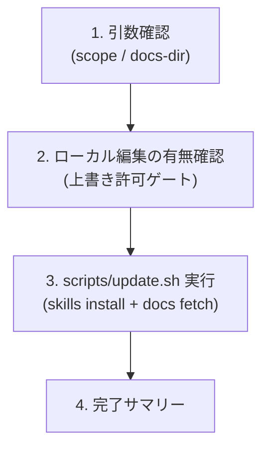

# Agile Update Skills

> 🗣️ **ユーザーへの質問**: 選択肢が有限なら `AskUserQuestion` ツールを優先 (2-4 個の選択肢、推奨は先頭に `(Recommended)` を付ける)。自由記述が要る箇所はテキスト対話のまま。

agile-* スキル群一式と関連ドキュメント (`docs/agile-workflow/`) を一括で最新化する。実体は同梱の `scripts/update.sh` で、`gh skill install` の上書きインストールと `docs/agile-workflow/` 配下 12 ファイルの curl フェッチを順次実行する。

## When to Use

- `agile-setup-project` 後、各 agile-* スキルとドキュメントを一括で揃えるとき
- 既に運用中のプロジェクトで、agile-* の最新版に追従したいとき (定期実行想定: 月 1 回程度)
- `docs/agile-workflow/` を誤って削除したとき / git で取り込んだ後に最新化したいとき

## When NOT to Use

- agile-* スキルを単発でカスタマイズしたい場合 — このスキルは上書きインストールするので、ローカル編集分は失われる
- 初回セットアップで Project / Status / Workflow の構成も含めて整えたい場合 — `/agile-setup-project` を先に呼ぶ

## Workflow



---

## Step 1: 引数確認

ユーザーに以下を確認 (デフォルト値で進めて良いか聞く):

| 引数 | デフォルト | 意味 |
|---|---|---|
| `--scope` | `user` | `gh skill install` の配置先。`user` = `~/.claude/skills/`、`project` = `<project>/.claude/skills/` |
| `--docs-dir` | `docs/agile-workflow` | `docs/agile-workflow/` の配置先 (プロジェクトルートからの相対パス) |
| `--skip-install` | (なし) | スキル install を飛ばして docs だけ取得 |
| `--skip-docs` | (なし) | docs 取得を飛ばしてスキルだけ更新 |

初回 `agile-setup-project` 実行時に選択したスコープと揃えるのが基本。配置先のデフォルト (`docs/agile-workflow/`) は各 SKILL.md の参照パスと一致するため、変更非推奨。

---

## Step 2: ローカル編集の有無確認 (上書き許可ゲート)

`docs/agile-workflow/` 配下にローカル編集があると上書きで失われる。実行前に確認:

```bash
# 既存ファイルがあるか、git で差分があるかをチェック
ls "$DOCS_DIR" 2>/dev/null && \
  git diff --quiet -- "$DOCS_DIR" 2>/dev/null || \
  echo "WARN: $DOCS_DIR に変更あり (上書きで失われる可能性)"
```

差分があればユーザーに「上書きしていいですか?」と確認。退避が必要なら一度中断して `git stash` 等を案内。

---

## Step 3: scripts/update.sh 実行

スクリプトを実行する。SKILL のディレクトリは `gh skill install` で `~/.claude/skills/agile-update-skills/` または `<project>/.claude/skills/agile-update-skills/` に配置されているので、そこから呼ぶ:

```bash
# user scope の場合
bash ~/.claude/skills/agile-update-skills/scripts/update.sh \
  --scope user --docs-dir docs/agile-workflow

# project scope の場合
bash .claude/skills/agile-update-skills/scripts/update.sh \
  --scope user --docs-dir docs/agile-workflow
```

スクリプトは:
1. 11 スキル (`agile-craft-vision` 〜 `agile-update-skills` 自身) を順次インストール
2. `docs/agile-workflow/` 配下 12 ファイル (3 ルート + 9 concepts) を curl 取得

失敗があれば標準出力に `FAIL: <skill>` が出るので、ユーザーに見せて手動再実行を案内する。

---

## Step 4: 完了サマリー

```
✓ スキル更新 (--scope <user|project>):
  - agile-craft-vision / agile-create-epic / agile-create-stories
  - agile-refine-story / agile-refine-implementation-plan
  - agile-decompose-task-from-implementation-plan / agile-implement-task
  - agile-create-issue / agile-create-pull-request
  - agile-setup-project / agile-update-skills (自己更新)

✓ ドキュメント取得: <DOCS_DIR>/ (12 ファイル)

次のステップ:
- 取得した <DOCS_DIR>/ を git で管理する場合は `git add` してコミット
- agile-* スキルを使い始める: /agile-craft-vision → /agile-create-epic → /agile-create-stories の順
- 不明点があれば <DOCS_DIR>/README.md を参照
```

---

## 決定境界

全体マップは `docs/agile-workflow/concepts/ai-decision-boundary.md`を参照。本スキル固有の人間承認ゲート:

- **インストールスコープ選択** — Step 1 の `--scope` 選択は人間判断 (user / project)
- **ドキュメント配置先選択** — Step 1 の `--docs-dir` 選択は人間判断 (デフォルト推奨)
- **ローカル編集の上書き許可** — Step 2 で `docs/agile-workflow/` 配下に未コミット変更がある場合、上書き前に人間承認

---

## エッジケース

| 状況 | 対応 |
|---|---|
| `gh skill install` が「既にインストール済み」エラーを出す | スクリプトは個別 install を `|| true` 相当で処理して継続。失敗が複数なら手動で `rm -rf ~/.claude/skills/<skill>` してから再実行 |
| curl が 404 を返す (ファイル名変更があった) | スクリプトは `set -e` で停止する。リポジトリの最新の docs 構成を確認するよう案内 |
| `docs/agile-workflow/` 配下にローカル編集があった | Step 2 で必ず確認。`git stash` 等で退避してから実行 |
| カスタムパスを選んだが SKILL の参照と合わない | SKILL.md の `docs/agile-workflow/...` を読みに行く設計なので、デフォルトに戻すか symlink を張る方法を提示 |

## NEVER — アンチパターン

- **絶対に** ユーザーのローカル編集分を確認なしに上書きしない — Step 2 のローカル編集確認は省略不可
- **絶対に** `agile-update-skills` 自身の上書きインストールを除外しない — スクリプト内 `SKILLS` 配列に含まれている。除外すると次回以降このスキル自体が古くなる
- **絶対に** スクリプトを書き換えてインライン bash を SKILL.md に貼り直さない — スクリプトの単一実行可能ファイル化が本スキル設計の核 (テスト・修正が容易)

---

## References

- 📦 GitHub CLI `gh skill` コマンド (2026-04 リリース) — `gh skill install <repo> <name> --agent claude-code --scope <user|project>`
- 📦 [mrtry-lab/skills](https://github.com/mrtry-lab/skills) — 本スキル群のリポジトリ
