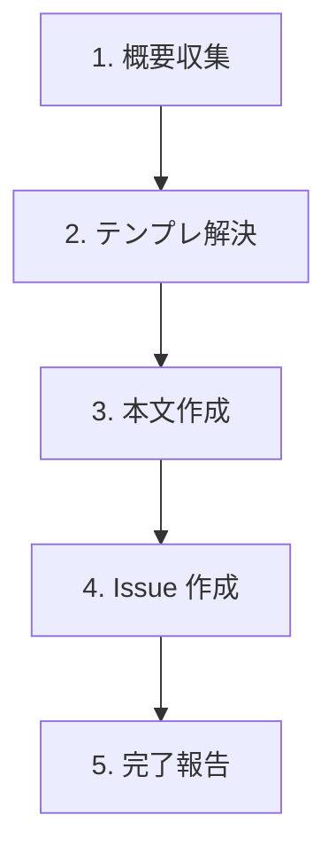

# Create Issue

GitHub Issue をシンプルに作成する軽量スキル。リポジトリに `.github/ISSUE_TEMPLATE/` があれば使い、無ければ汎用構造で本文を書く。

## When to Use

- 普通に GitHub Issue を起票したいとき
- 「issue作成して」「チケット作って」と指示されたとき

## When NOT to Use

- アジャイル運用で Epic / Story / Task を作る → `/agile-create-issue` を使う（Issue Type 強制、ステータス管理、親子リンクあり）
- Issue の更新・編集 → `gh issue edit` または GitHub MCP `issue_write` を直接使う

## Workflow



---

## Step 1: 概要収集

ユーザーから以下を聞き出す:

- **タイトル候補** — 何についての Issue か（一言で）
- **趣旨** — 何が起きていて、何を求めているか
- **関連情報** — 関連 PR / Issue / ログ等あれば

すでに文脈で十分明らかな場合は省略。確認が必要なときだけ聞く。

---

## Step 2: テンプレ解決

`.github/ISSUE_TEMPLATE/` を確認する:

```bash
ls .github/ISSUE_TEMPLATE/ 2>/dev/null
```

| 件数 | 振る舞い |
|------|---------|
| 0 件（ディレクトリなし含む） | 汎用構造で作成（Step 3） |
| 1 件 | そのテンプレを採用 |
| 2 件以上 | ファイル一覧をユーザーに提示し、どれを使うか選んでもらう |

ファイルが `.md`（traditional）か `.yml`（issue forms）かで処理が変わる:
- `.md`: yaml フロントマターを取り除いた本文部分を採用
- `.yml`: issue forms 形式。`gh issue create --template <name>` で対話的に進めるか、yml の `body:` セクションから markdown を組み立てる

---

## Step 3: 本文作成

### ブランチ名の取得（書き出しファイル名に使う）

```bash
BRANCH=$(git rev-parse --abbrev-ref HEAD 2>/dev/null | tr '/' '-')
[ -z "$BRANCH" ] && BRANCH="nogit-$(date +%s)"
BODY_FILE="/tmp/issue-body-${BRANCH}.md"
```

並列セッション・複数ブランチで本文ファイルが衝突しないよう、必ずブランチ名を含める。

### 本文の組み立て

**テンプレあり**:
- テンプレの全セクションを保持し、Step 1 で集めた内容を該当箇所に埋める
- 埋められないセクションは `> TBD` で残す（セクションごと削除しない）
- テンプレに無いセクションを勝手に追加しない

**テンプレなし**（汎用構造）:
```markdown
## 概要

{1〜2 文で何の Issue か}

## 詳細

{背景・再現手順・期待結果など必要に応じて}

## 関連情報

{関連 PR / Issue / ログ / リンク。なければ「なし」}
```

本文を `$BODY_FILE` に書き出す。CLI に markdown をインラインで渡すとエスケープが壊れるため、必ずファイル経由。

---

## Step 4: Issue 作成

```bash
gh issue create \
  --title "<title>" \
  --body-file "$BODY_FILE" \
  [--label "<label1>,<label2>"] \
  [--assignee "<user>"]
```

ラベル・アサインはユーザーが指定した場合のみ付ける。

---

## Step 5: 完了報告

作成した Issue の URL をユーザーに渡す。

---

## エッジケース

| 状況 | 対応 |
|------|------|
| `gh` 未インストール / 未認証 | エラーをそのまま伝えて中断（`gh auth login` を案内） |
| 同名タイトルの Issue が既存 | `gh issue list --search "<title>" --state all` で軽くチェックし、ヒットしたらユーザーに重複作成するか中断するか確認 |
| `.github/ISSUE_TEMPLATE/config.yml` のみで `.md` / `.yml` がない | テンプレなし扱い |
| Issue forms (`.yml`) のテンプレ | 単純な構造なら markdown に変換、複雑なら `gh issue create --template <name>` に委ねる |

## NEVER — アンチパターン

- **絶対に** `gh issue create --body "..."` でインライン渡ししない — 改行や引用符のエスケープが壊れる。必ず `--body-file`
- **絶対に** ブランチ名なしの固定ファイル名（`/tmp/issue-body.md`）を使わない — 並列セッション・複数ブランチで上書き事故が起きる
- **絶対に** GitHub Projects のステータス更新を試みない — 本スキルの責務外。アジャイル運用が必要なら `/agile-create-issue` を使う
