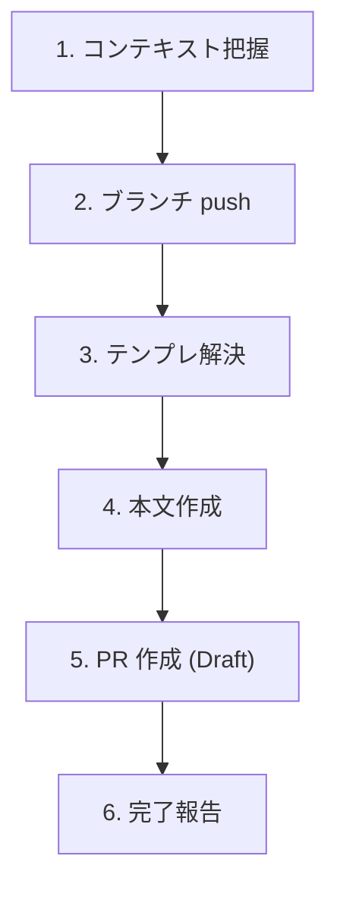

# Create Pull Request

実装済みの変更から Draft PR をシンプルに作成する軽量スキル。リポジトリに `.github/pull_request_template.md` があれば使い、無ければ汎用構造で本文を書く。

## When to Use

- 普通に Pull Request を作りたいとき
- 「PR作って」「プルリク出して」と指示されたとき

## When NOT to Use

- アジャイル運用での Task Issue 連携 PR（ステータス更新、テンプレ強制構造あり）→ `/agile-create-pull-request` を使う
- 既存 PR の更新 → `gh pr edit` を直接使う
- 実装が途中・テスト未確認の段階 → 先に実装と検証を完了させる

## Workflow



---

## Step 1: コンテキスト把握

```bash
# ベースブランチを判定（main / master 等）
BASE=$(gh repo view --json defaultBranchRef --jq '.defaultBranchRef.name')

# 変更内容を把握
git diff "${BASE}...HEAD" --stat
git log "${BASE}..HEAD" --oneline
```

差分が空なら PR を作る意味がない旨を伝えて中断する。

---

## Step 2: ブランチ push

未 push のコミットがあれば push する:

```bash
git push -u origin HEAD
```

---

## Step 3: テンプレ解決

```bash
[ -f .github/pull_request_template.md ] && echo "found"
```

| 結果 | 振る舞い |
|------|---------|
| あり | そのテンプレを採用 |
| なし | 汎用構造で作成（Step 4） |

`.github/PULL_REQUEST_TEMPLATE/` 配下に複数テンプレがある場合は、ファイル一覧をユーザーに提示して選んでもらう。

---

## Step 4: 本文作成

### ブランチ名の取得（書き出しファイル名に使う）

```bash
BRANCH=$(git rev-parse --abbrev-ref HEAD | tr '/' '-')
BODY_FILE="/tmp/pr-body-${BRANCH}.md"
```

並列セッション・複数ブランチで本文ファイルが衝突しないよう、必ずブランチ名を含める。

### 本文の基本方針

PR 本文は「変更内容のスナップショット / ショートドキュメント」。チームメンバーへの共有や、後から自分（あるいは別の誰か）が見返したときに「この変更は一体何のために行われたのか」を端的に把握するためのもの。

- 作業報告ではない。「これをやった、次にこれをやった」と作業ログを並べるのは目的に反する
- コード詳細を説明しすぎない。クラス名 / メソッド名 / 型変更 / ファイル統合などは diff を読めば分かる
- 読み手は **コードを読まない人**（PdM / QA / 他チームのエンジニア / 将来の自分）を想定する

#### 構造ルール: 説明は 前提 → 問題 → 解決策 の 3 段で書く

本スキルで作成するあらゆる説明（概要、変更内容の各重要変更点 等）は、**前提 → 問題 → 解決策** の 3 段構成で書く。順序の入れ替えや段の省略はしない（純粋な内部リファクタの例外は別途定義）。

- 前提 — どういう状況 / 文脈 / 既存仕様があったか
- 問題 — その前提の中で何が課題 / 不便 / リスクだったか
- 解決策 — 今回の PR で何を変えたか、結果としてどうなるか

#### 構造ルール: 見出しは 1 段深い proper ヘディングで書く

セクション内でさらに区切りが必要なときは、**親より 1 段深い proper ヘディング**を使う（親が `## X` なら `### Y`、親が `### X` なら `#### Y`）。

ボールドのインライン擬似見出し（`- **見出し**: 内容…` のように、ボールド + コロン + 内容が連続するパターン）は使わない — 読みにくいため。

#### 構造ルール: 「単一の事柄」と「複数の事柄」で形式を変える

セクションで言及する事柄が 1 つか複数かで、サブ構造の作り方を分ける:

| セクションが言及するのは | 形式 |
|---|---|
| 単一の事柄（例: 概要 — その PR 全体で 1 つの物語）| そのセクションの直下に、3 段（前提 → 問題 → 解決策）の段落をそのまま書く。サブ見出しや箇条書きは使わない |
| 複数の事柄（例: 変更内容 — 複数の重要変更点が並ぶ）| そのセクションの直下にまず全体要約を短い 1 段落で書く。続けて事柄ごとに `### 見出し` を立て、各見出しの下に 3 段（前提 → 問題 → 解決策）を 3 行程度の箇条書きで書く |

判断基準は「読み手が 1 つの物語として読むか、複数の独立した話題として読むか」。1 つの PR で重要変更点が 1 個しかない場合は、変更内容も「単一の事柄」として導入文だけで終わらせてよい。

### テンプレあり

- テンプレの全セクションを保持し、Step 1 で把握した変更内容を該当箇所に埋める
- 埋められないセクションは「なし」と明記（空欄で残さない）
- テンプレに無いセクションを勝手に追加しない
- ただし、テンプレに「概要」「変更内容」「テスト方法」相当のセクションがある場合は、下記の汎用構造で示す書き方ルール（前提/問題/解決策 の 3 段、ヘディング駆動、AC 形式チェックリスト）に従う

### テンプレ ↔ 本スキルのルール マッピング

| テンプレに現れがちな見出し | 本スキルのどのルールを適用するか |
|---|---|
| `## Summary` / `## 概要` / `## Overview` / `## Why` / `## Motivation` / `## 背景` | 「概要」の書き方ルール（前提 → 問題 → 解決策 の 3 段構成）|
| `## What changed` / `## 変更点` / `## Description` / `## Changes` | 「変更内容」の書き方ルール（導入文 + 重要変更点ごとに `### 見出し` + 前提/問題/解決策 の 3 段箇条書き）|
| `## How to test` / `## Test plan` / `## テスト` / `## 動作確認` / `## QA` | 「テスト方法」の書き方ルール（変更内容と一字一致する `### 見出し` でグルーピング、AC 形式『〜できる』、`[x]` / `[ ]` の責任境界）|
| `## Screenshots` / `## スクリーンショット` | 該当があれば添付、なければ「なし」 |
| `## Related issues` / `## 関連 Issue` | ユーザー明示分のみ記載（自動推測の `Closes` は書かない）|

テンプレに「概要 / Summary」系と「変更内容 / Changes」系の両方がある場合、前者は前提・問題・解決策の 3 段で大きな絵を、後者は重要変更点ごとに `### 見出し` + 3 段箇条書きで具体を、と役割分担して書く。テンプレに片方しか無ければ、その 1 セクションに概要ルール（前提/問題/解決策 の 3 段）を優先適用する。

テンプレに上記のような意味を持つ見出しがあれば、見出しの文言はテンプレに従いつつ中身は本スキルのルールで書く。逆に、テンプレに該当する見出しが無ければ、こちら側からセクションを追加しない（テンプレに従う）。

### テンプレなし — 汎用構造

```markdown
## 概要

{前提: どういう状況 / 文脈 / 既存仕様があったか（1〜3 文）}

{問題: その中での課題 / 不便 / リスク（1〜2 文）}

{解決策: 今回の PR で何を変えたか、結果としてどうなるか（1〜2 文）}

## 変更内容

{導入文: どういう大枠の機能変更を入れたのかを 1〜3 文で書く}

### {重要変更点 1 の見出し}
- {前提（1 行）}
- {問題（1 行）}
- {解決策（1〜2 行、実装詳細は書かない）}

### {重要変更点 2 の見出し}
- {前提}
- {問題}
- {解決策}

## テスト方法

### {変更内容の見出し 1 と一字一致}
- [x] {対応する AC を「〜できる」で書く}（{確認手段}）
- [x] {同上}

### {変更内容の見出し 2 と一字一致}
- [x] {LLM が動作確認できた AC}（{確認手段}）
- [ ] {LLM では確認できなかった AC（チェックは空のまま、AC 形式は維持）}
```

PR 本文には「人間が確認する項目」を別セクションで明示しない。空チェック (`- [ ]`) のままで意味は伝わる。LLM が確認できなかった項目は、**PR 作成完了報告のチャットで「以下の項目はあなたで動作確認してください」と一覧で伝える**（Step 6 参照）。

### 「概要」の書き方 — 前提 / 問題 / 解決策 の 3 段構成

概要は「この PR は何のために行われたのか」を端的に示すための、PR 全体の入り口。後から読んだ人が「ここだけ読めば PR の意義が分かる」ように書く。

`## 概要` の直下に、3 つの段落を順番に書く（基本は段落分けでよい。各段が長くなる場合は `### 前提` `### 問題` `### 解決策` のサブ見出しで分けても良い）:

1. 前提 — どういう状況 / 文脈 / 既存の仕組みがあったか（1〜3 文）
2. 問題 — その前提の中で、何が課題 / 不便 / リスクだったか（1〜2 文）
3. 解決策 — 今回の PR で何を変えたか、結果としてどうなるか（1〜2 文）

#### 注力する観点

「やったこと」をだらだら並べるのではなく、振る舞いとしてどのような意味を持つかを中心に据える:

- こういう変更をしました
- この変更によって、こういうことができるようになりました
- こういった工程が効率化されました / こういう問題が解消されました

純粋なリファクタ等の PR でも、なぜそれが価値を持つのか（保守性・セキュリティ等）に言及する。

#### Good vs Bad の対比

❌ Bad（作業報告 / コード解説）:

> `LoginForm.tsx` に try-catch を追加し、`useState` で error を管理し、JSX に表示要素を足した。

✅ Good（前提 → 問題 → 解決策 を 3 段で）:

> ログイン画面では、認証 API のレスポンスに応じて画面の状態を切り替える設計になっている。
>
> ところが失敗時のエラーハンドリングが行われておらず、ユーザーが状況を判別できない無反応な画面のままだった。
>
> 今回、失敗理由に応じたエラーメッセージを画面に表示するようにした。これによりユーザーは入力ミスと一時的な障害を即座に判別できる。

#### 書きすぎない

概要は「ここだけ読めば意義が分かる」短いドキュメント。3 段合計で 5〜8 文程度が目安。詳細は「変更内容」「テスト方法」セクションと、究極的には diff に委ねる。

### 「変更内容」の書き方 — 導入文 ＋ 重要変更点ごとに `### 見出し` + 3 段箇条書き

概要が「PR 全体の物語」だとすれば、変更内容はそこで起きた重要な機能変更をもう一段詳しく説明するセクション。ファイル単位の細々とした説明は書かない。

#### 構成

1. 導入文（1〜3 文）— 「こういう変更を入れました」というメインの大枠を 1 段落で述べる。続く小セクションを読む前の前置きになる
2. 重要変更点ごとの小セクション — 大枠の中で重要な変更点だけを `### {見出し}` で区切り、それぞれの中で前提 / 問題 / 解決策 を 3 つの箇条書きで書く

見出しのレベルは親セクションから 1 段深くする（親が `## 変更内容` なら `### {見出し}`、`### Changes` なら `#### {見出し}`）。

#### 各重要変更点のフォーマット

```markdown
### {重要変更点の見出し}
- {前提: どういう状況 / 制約 / 既存仕様があったか（1 行）}
- {問題: その中で何が課題 / 不便 / リスクだったか（1 行）}
- {解決策: 今回の変更で何をしたか、結果としてどうなるか（1〜2 行、実装詳細は書かない）}
```

合計 3 行程度、最大 5 行に収める。各重要変更点は `### 見出し` の proper ヘディングで区切り、ボールドのインライン擬似見出し（`- **見出し**: 内容…`）は使わない。

#### 書いてはいけないこと

- 各ファイルの差分解説（`UserService.ts` を修正、`LoginForm.tsx` を更新…）— ファイル別の細目は diff を読めば分かる
- クラス名 / メソッド名 / フック名 / 型名など、コード上の固有名詞だけで構成された記述
- 「リファクタした」「整理した」のような周辺修正をメイン項目として並べる（重要変更だけに絞る）
- ボールドのインライン擬似見出し（`- **見出し**: 内容…`）で項目を区切る書き方 — 各重要変更点は `### 見出し` で区切る
- 前提 / 問題 / 解決策 の 3 段構成を崩したり順序を入れ替えたりする

#### Good vs Bad の対比

❌ Bad（ファイル単位の細目羅列 / 擬似見出し）:

```markdown
## 変更内容

- `LoginForm.tsx` に try-catch を追加
- `useState` で error を管理
- JSX に error 表示要素を追加
- `auth.ts` のエラーコード判定を修正
- `messages.ts` に新しい文言を追加
- ユニットテストを 3 件追加
```

✅ Good（導入文 + 重要変更点ごとに `### 見出し` + 前提/問題/解決策 の 3 段箇条書き）:

```markdown
## 変更内容

ログイン失敗時のエラーフィードバックを全面的に整備しました。これまで失敗時に画面が無反応で、ユーザーが状況を判別できない状態でしたが、今回の変更で失敗理由ごとに適切な文言が画面に表示されます。

### 失敗理由ごとのエラー表示
- ログイン画面では、認証 API のレスポンスに応じて画面の状態を切り替える設計になっていた。
- 失敗時のハンドリングが行われておらず、ユーザーは状況を判別できないまま無反応な画面を見ることになっていた。
- 失敗理由（認証エラー / ネットワーク / サーバー側エラー）を判別し、対応する文言を画面に表示するようにした。

### 空欄送信のガード
- ログインフォームには未入力チェックが無く、空欄のままでも送信ボタンが押せる状態だった。
- 「何も入力していないのにエラーになる」体験が発生し、ユーザーが意味の無い失敗を踏むことがあった。
- 入力が空のとき送信ボタンを非活性にし、不要なエラー遷移自体を発生させないようにした。
```

#### 例外: ユーザー挙動に変化が無い PR

純粋な内部リファクタリング / 依存ライブラリ更新 / CI 設定変更などは、その旨を導入文で明記した上で、なぜこの変更が必要か（保守性 / セキュリティ / パフォーマンス）を 1〜2 文で書く。`### 見出し` で区切るほど重要な変更点が無ければ、導入文だけで終わらせてよい。

### 「テスト方法」の書き方 — 変更内容と一字一致する `### 見出し` ＋ AC チェックリスト

テスト方法は「概要・変更内容で『できるようになった』と書いたことが本当にできることを確認した記録」。受け入れ基準（AC）の体裁で、ユーザーストーリーとして書く。リント / 型チェックなどの機械的検証は書かない（CI で回る）。

#### 構成: 変更内容と一致する見出しで AC をグルーピング

`## テスト方法` の直下に、「変更内容」セクションの `### 見出し` と一字一句一致する `### 見出し` で AC をグルーピングする。これにより 1:1 対応が見出しレベルで自明になる。

各グループ内に LLM が動作確認できた AC（`- [x]`）と確認できなかった AC（`- [ ]`）を**混在させる**。**「人間が確認する項目」を別セクション（`### LLM 環境では確認できなかった項目` 等）に分離しない** — 空チェックのまま残せば意味は伝わるし、本文がグループの自然な単位に揃う。

LLM 側で確認できなかった項目は、**PR 作成完了をユーザーに報告するチャットで「以下の項目はあなた側で動作確認してください」と一覧化して伝える**（Step 6 参照）。PR 本文に「これは人間が確認してください」と書く必要はない。

#### フォーマットルール

1. 各 AC は「〜できる」「〜することができる」のユーザーストーリー / 受け入れ基準形式で書く
   - 「〜することができることを確認しました」という AC を書くつもりで、`- [x] {誰が} {どういう状況で} {何ができる}` の形に整える
   - 「〜してほしい」「〜してください」などの依頼文は使わない（人間に委ねるチェックでも、項目自体は「〜できる」と書く）
2. LLM が自分で動作確認できるものは PR 作成時点で `- [x]` を埋める
   - 対応するチェックリストをまずすべて洗い出し、そのうえで自分（LLM）で動作確認可能なものは実際に確認してから埋める
   - 確認手段（自動テスト / dev サーバで手動確認 / モックレスポンスで確認 等）を `（…）` で簡潔に併記する
3. LLM が確認できないものは、同じ `### 見出し` グループ内に `- [ ]` のまま残す（別セクションに分離しない）
   - 実機ブラウザでの視覚確認 / 本番ライクなデータでの再現 / 他システム連携 / 仕様上の判断が必要なもの
   - 項目自体は引き続き「〜できる」の AC 形式で書く（「〜してほしい」と書き換えない）
   - PR 作成完了報告のチャットで、これら `- [ ]` 項目を「以下はあなた側で動作確認してください」と一覧化して伝える

#### 書き方の例（変更内容と見出しが一字一致している点に注目）

```markdown
## テスト方法

### 失敗理由ごとのエラー表示
- [x] 正しいメール・パスワードでログインすると、ダッシュボード画面に遷移できる（dev サーバで手動確認）
- [x] パスワードが間違っているとき、「メールアドレスまたはパスワードが正しくありません」と表示される（ユニットテスト + dev サーバで確認）
- [x] サーバー側エラー（5xx）が返ったとき、「しばらくしてからお試しください」と表示される（モックレスポンスで確認）

### 空欄送信のガード
- [x] メール欄が空のままでは、ログインボタンが非活性で押せない（dev サーバで手動確認）
- [ ] iOS Safari の自動入力（パスワードマネージャ）からの入力でも正しくログインできる
- [ ] スクリーンリーダーで、エラーメッセージが内容として読み上げられる
- [ ] ネットワーク切断中に送信した場合、復帰後にリトライできる
```

各 `### 見出し` 配下に `- [x]` と `- [ ]` が混在しているのがポイント。「人間が確認する項目」を別グループに切り出していない。空チェックの項目は PR 作成完了報告のチャットで一覧化してユーザーに伝える。

#### 避ける書き方

| ❌ 避ける | ✅ 望ましい |
|---|---|
| `- [x] npm run lint でエラーなし` | （書かない。CI で回る） |
| `- [x] 型チェック通過` | （書かない。CI で回る） |
| `- [x] ユニットテスト追加` | `- [x] ログイン失敗時にエラー文言が表示される（ユニットテストで確認）` |
| `- [x] 動作確認した` | `- [x] 検索窓に「猫」と入力すると、タイトルに「猫」を含む記事だけ表示される（dev サーバで手動確認）` |
| `- [ ] iOS 実機で確認してほしい` | `- [ ] iOS 実機で長押しメニューが正しく表示される` |
| `- [ ] レビュアーがチェックしてください` | `- [ ] {確認すべき具体的な挙動を「〜できる」で書く}` |
| `# 「失敗理由ごとのエラー表示」に対応` のような hash コメントでグループ分け | `### 失敗理由ごとのエラー表示` のような proper サブ見出しで区切る |

#### チェック埋めの作業順序（PR 作成前に LLM が必ず回す手順）

1. 概要 / 変更内容で「できるようになった / 改善された」と書いた項目を全部リストアップする
2. 「変更内容」の `### 見出し` と一字一致する `### 見出し` で AC をグルーピングし、それぞれを「〜できる」のユーザーストーリー形式に変換する
3. 既存の自動テスト / 新規追加した自動テスト / dev サーバ起動 / 手元実行 など、自分で確認可能な手段を試す
4. 確認できたものは `- [x]` ＋ 確認手段を併記する
5. 確認できなかったもの（実機 / 視覚 / 仕様判断等）は、同じ `### 見出し` グループ内に `- [ ]` のまま残す（別セクションに分離しない、依頼文に書き換えない）
6. PR 作成後、これら `- [ ]` 項目をチャットで「以下はあなた側で動作確認してください」と一覧化してユーザーに伝える

### Issue 紐付け

`Closes #N` を本文に含めるのは、ユーザーが Issue 番号を明示した場合のみ。ブランチ名やコミットメッセージから自動推測して `Closes` を勝手に書かない（誤クローズ事故防止）。

本文を `$BODY_FILE` に書き出す。CLI エスケープ事故防止のため必ずファイル経由。

### タイトル

最新コミットのメッセージか、変更内容の要約から組み立てる。70 文字以内に収める。

---

## Step 5: PR 作成 (Draft)

```bash
gh pr create \
  --draft \
  --title "<title>" \
  --body-file "$BODY_FILE"
```

デフォルトは必ず Draft。ユーザーが「Ready で出して」「draft 外して」と明示した場合のみ `--draft` を外す。

base ブランチを明示したい場合は `--base <branch>` を追加（デフォルトは default branch）。

---

## Step 6: 完了報告 — 本文の品質ゲート

作成した PR の URL をユーザーに渡す。あわせて、以下のセルフチェックを通過したことを明示する（通過しない項目があれば `gh pr edit` で直してから報告する）:

### 「概要」セクションのセルフチェック

- [ ] 「この PR は何のために行われたのか」が、ここだけ読んで分かる
- [ ] 前提 → 問題 → 解決策 の 3 段構成になっている（順序も守る）
- [ ] **`## 概要` の直下に 3 段の段落をそのまま書いている**（単一の事柄なので、サブ見出しや箇条書きで分割していない）
- [ ] 作業報告（やったことの羅列）になっていない
- [ ] アウトカム（何ができるようになったか / 何が改善・効率化されたか）が「解決策」で示されている
- [ ] コードの詳細（クラス名 / メソッド名 / ファイル構成）を概要で語っていない
- [ ] 3 段合計で 5〜8 文程度に収まっており、書きすぎていない

### 「変更内容」セクションのセルフチェック

- [ ] **`## 変更内容` の直下にまず全体要約を 1 段落書き、その下に重要変更点ごとの `### 見出し` を並べている**（複数の事柄なので、いきなり `### 見出し` から始めていない）
- [ ] 導入文（1〜3 文）+ 重要変更点ごとの `### 見出し` + 3 段の箇条書き の構造になっている
- [ ] 各重要変更点が `### 見出し`（親が `## 変更内容` なら h3）で区切られており、ボールドのインライン擬似見出し（`- **見出し**: 内容…`）を使っていない
- [ ] 各 `### 見出し` 配下が 前提 / 問題 / 解決策 の 3 つの箇条書きになっており、順序も守られている
- [ ] 重要変更点だけに絞られており、ファイル単位の細目羅列になっていない
- [ ] 「ユーザー / 呼び出し側からどう見えるか」で書けている（実装詳細ではない）
- [ ] クラス名 / メソッド名 / フック名 / 型名 / ファイル名など、コード上の固有名詞だけで説明していない
- [ ] 内部リファクタリングなど挙動変化が無い場合は、その旨を導入文で明示し、なぜ必要かを書いている

### 「テスト方法」セクションのセルフチェック

- [ ] 「変更内容」セクションの `### 見出し` と一字一致する `### 見出し` で AC がグルーピングされている（1:1 対応）
- [ ] **「人間が確認する項目」を別セクション（`### LLM 環境では確認できなかった項目` 等）に分離していない** — 各 `### 見出し` グループ内に `- [x]` と `- [ ]` を混在させている
- [ ] 各 AC が「〜できる」「〜することができる」のユーザーストーリー / 受け入れ基準形式で書かれている
- [ ] 「〜してほしい」「〜してください」などの依頼文を使っていない（チェック空欄＝人間レビュアー対象、という規約で意味は伝わる）
- [ ] チェックリスト形式（`- [x]` / `- [ ]`）になっている
- [ ] LLM が自分で確認可能だった項目はすべて動作確認まで終わらせて `- [x]` が埋まっている（洗い出しと検証を完了させた）
- [ ] LLM が確認できなかった項目は `- [ ]` のまま残してある（AC 文体は維持）
- [ ] リント / 型チェック / 「テスト追加」だけ、のような機械的検証のみで終わっていない
- [ ] 各シナリオが「外から観察可能な挙動」として書かれている（「動作確認した」のような抽象表現になっていない)

### ユーザーへの完了報告（チャット）

PR URL を渡すと同時に、**LLM 側で確認できなかった `- [ ]` 項目を一覧化してチャットで伝える**:

```
PR を作成しました: <URL>

以下の項目は LLM 環境では動作確認できなかったので、あなた側で確認をお願いします:
- {変更内容の見出し}: {AC 文言}
- {変更内容の見出し}: {AC 文言}
...
```

`- [ ]` 項目が無ければこのパートは省略してよい。PR 本文には「これは人間が確認してください」と書く必要はない（チャットで伝えれば済むため）。

### 追加要望への対応

ユーザーから「コード変更を詳しく書いて」「リント結果も載せて」と明示的に要望があれば、その時点で `gh pr edit` での追記を提案する（デフォルトでは載せない）。

---

## エッジケース

| 状況 | 対応 |
|------|------|
| `gh` 未インストール / 未認証 | エラーをそのまま伝えて中断（`gh auth login` を案内） |
| 同じブランチに既存 PR | `gh pr edit` で更新するかユーザーに確認 |
| ベースに対する diff が空 | PR を作る意味がない旨を伝えて中断 |
| main / master 以外を base にしたい | ユーザーから明示指定を受ける（`--base <branch>` で対応） |
| push 時に upstream 設定が衝突 | エラー内容をユーザーに伝えて判断を仰ぐ |

## NEVER — アンチパターン

- 絶対に `gh pr create --body "..."` でインライン渡ししない — 改行・引用符のエスケープが壊れる。必ず `--body-file`
- 絶対に ブランチ名なしの固定ファイル名（`/tmp/pr-body.md`）を使わない — 並列セッション・複数ブランチで上書き事故が起きる
- 絶対に デフォルトを Ready で作らない — レビュー依頼前に意図せず通知が飛ぶ事故を防ぐため、明示指示なき限り Draft
- 絶対に `Closes #N` を自動推測で書かない — 関係ない Issue が PR マージ時に勝手に閉じられる事故を防ぐ
- 絶対に GitHub Projects のステータス更新を試みない — 本スキルの責務外。アジャイル運用が必要なら `/agile-create-pull-request` を使う
- 絶対に PR 本文の各セクション内でボールドのインライン擬似見出し（`- **見出し**: 内容…`）を使って sub-section を区切らない — 読みにくい。1 段深い proper ヘディング（親が `## X` なら `### Y`、親が `### X` なら `#### Y`）＋ 箇条書きまたは段落で書く
- 絶対に「説明」を 前提 / 問題 / 解決策 以外の構成で書かない — 概要および変更内容の各重要変更点は、前提 → 問題 → 解決策 の 3 段（または 3 箇条書き）で必ず書く。順序の入れ替えや段の省略はしない（純粋な内部リファクタの例外ルールが適用される場合を除く）
- 絶対に 単一の事柄を書くセクション（概要等）で、サブ見出しや箇条書きを使って 3 段を分割しない — `## 概要` の直下に前提・問題・解決策を **3 つの段落で直接書く**。読み手が 1 つの物語として読み下せるようにする
- 絶対に 複数の事柄に言及するセクション（変更内容等）の直下を、要約なしでいきなり `### 見出し` から始めない — まず全体要約を 1 段落書き、その下に事柄ごとの `### 見出し` を並べる
- 絶対に 「概要」セクションを作業報告（「A をやって、B をやって、C を修正した」式の羅列）にしない — 概要は「何のための PR か」を伝えるアウトカム志向のショートドキュメント。前提 → 問題 → 解決策 で書く
- 絶対に 「概要」セクションでコード詳細（クラス名 / メソッド名 / 内部構造）を解説しない — そこは diff と「変更内容」セクションに委ねる。概要は挙動・価値・意味のレイヤーに留める
- 絶対に 「変更内容」セクションに実装詳細（追加したクラス / メソッド / 修正したフック / 型変更 / ファイル統合等）を書かない — それは diff を見れば分かる。書くのはユーザー / 呼び出し側から見た挙動の変化
- 絶対に 「変更内容」セクションをファイル単位の細目羅列（「A.tsx を修正」「B.ts に追加」…）にしない — 書くのは重要な機能変更点を `### 見出し` で区切り、前提/問題/解決策 の 3 段箇条書きでまとめたもの
- 絶対に 「テスト方法」セクションにリント / 型チェック / 「テスト追加した」だけのような機械的検証や抽象的な記述を書かない — 書くのは外から観察可能なユーザーストーリーのチェックリスト
- 絶対に 「テスト方法」セクションで「〜してほしい」「〜してください」などの依頼文を使わない — チェックが空＝人間レビュアー対象、という規約で意味は伝わる。項目自体は「〜できる」の受け入れ基準形式で書く
- 絶対に 「テスト方法」を概要 / 変更内容と無関係な独自項目で埋めない — テスト項目は「変更内容」セクションの `### 見出し` と一字一致する `### 見出し` でグルーピングし、対応する内容と 1:1 で対応させる
- 絶対に 「テスト方法」セクションで「人間が確認する項目」を別セクション（`### LLM 環境では確認できなかった項目` 等）に分離しない — 各 `### 見出し` グループ内に `- [x]` と `- [ ]` を**混在させる**。空チェック (`- [ ]`) のままで「人間レビュアー対象」の意味は伝わる。人間に確認してほしい項目は、PR 作成完了報告のチャットで一覧化してユーザーに直接伝える
- 絶対に チェックリストを全部 `- [ ]` で出さない — LLM が確認できたものは事前にすべて洗い出して動作確認し、`- [x]` を埋める。人間が確認すべきものとの責任境界を明示する

---

## References

このスキルが参考にしている公式ドキュメント:

- 🌐 [Creating a pull request template for your repository](https://docs.github.com/en/communities/using-templates-to-encourage-useful-issues-and-pull-requests/creating-a-pull-request-template-for-your-repository) (GitHub Docs) — `.github/pull_request_template.md` および `PULL_REQUEST_TEMPLATE/` ディレクトリの規約
- 🌐 [gh pr create](https://cli.github.com/manual/gh_pr_create) (GitHub CLI Manual) — `--draft` / `--body-file` / `--base` オプション仕様
