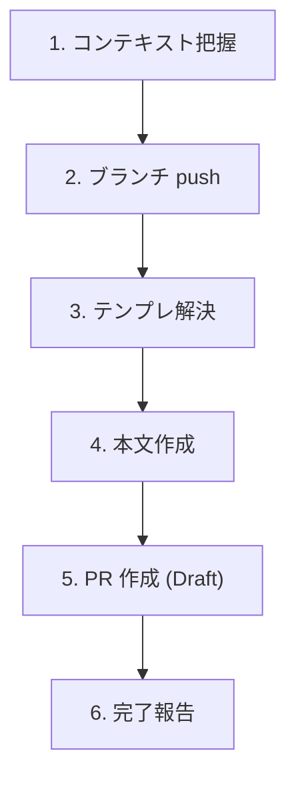

# Create Pull Request

実装済みの変更から Draft PR をシンプルに作成する軽量スキル。リポジトリに `.github/pull_request_template.md` があれば使い、無ければ汎用構造で本文を書く。

## When to Use

- 普通に Pull Request を作りたいとき
- 「PR作って」「プルリク出して」と指示されたとき

## When NOT to Use

- アジャイル運用での Task Issue 連携 PR（ステータス更新、テンプレ強制構造あり）→ `/agile-create-pull-request` を使う
- 既存 PR の更新 → `gh pr edit` を直接使う
- 実装が途中・テスト未確認の段階 → 先に実装と検証を完了させる

## Workflow



---

## Step 1: コンテキスト把握

```bash
# ベースブランチを判定（main / master 等）
BASE=$(gh repo view --json defaultBranchRef --jq '.defaultBranchRef.name')

# 変更内容を把握
git diff "${BASE}...HEAD" --stat
git log "${BASE}..HEAD" --oneline
```

差分が空なら PR を作る意味がない旨を伝えて中断する。

---

## Step 2: ブランチ push

未 push のコミットがあれば push する:

```bash
git push -u origin HEAD
```

---

## Step 3: テンプレ解決

```bash
[ -f .github/pull_request_template.md ] && echo "found"
```

| 結果 | 振る舞い |
|------|---------|
| あり | そのテンプレを採用 |
| なし | 汎用構造で作成（Step 4） |

`.github/PULL_REQUEST_TEMPLATE/` 配下に複数テンプレがある場合は、ファイル一覧をユーザーに提示して選んでもらう。

---

## Step 4: 本文作成

### ブランチ名の取得（書き出しファイル名に使う）

```bash
BRANCH=$(git rev-parse --abbrev-ref HEAD | tr '/' '-')
BODY_FILE="/tmp/pr-body-${BRANCH}.md"
```

並列セッション・複数ブランチで本文ファイルが衝突しないよう、必ずブランチ名を含める。

### 本文の組み立て

PR 本文は **「変更内容のスナップショット / ショートドキュメント」**。チームメンバーへの共有や、後から自分（あるいは別の誰か）が見返したときに **「この変更は一体何のために行われたのか」** を端的に把握するためのもの。

- **作業報告ではない**。「これをやった、次にこれをやった」と作業ログを並べるのは目的に反する
- **コード詳細を説明しすぎない**。クラス名 / メソッド名 / 型変更 / ファイル統合などは diff を読めば分かる
- 読み手は **コードを読まない人**（PdM / QA / 他チームのエンジニア / 将来の自分）を想定する

**テンプレあり**:
- テンプレの全セクションを保持し、Step 1 で把握した変更内容を該当箇所に埋める
- 埋められないセクションは「なし」と明記（空欄で残さない）
- テンプレに無いセクションを勝手に追加しない
- ただし、テンプレに「変更内容」「テスト方法」相当のセクションがある場合は、**下記の汎用構造で示す書き方ルールに従う**（コード詳細ではなく挙動変化、リント/型チェックではなくユーザー挙動テスト）

**テンプレ ↔ 本スキルのルール マッピング**:

| テンプレに現れがちな見出し | 本スキルのどのルールを適用するか |
|---|---|
| `## Summary` / `## 概要` / `## Overview` / `## Why` / `## Motivation` / `## 背景` | 「概要」の書き方ルール（IMRAD 風 3 段：問題・文脈 / 今回の変更 / 結果としてのアウトカム）|
| `## What changed` / `## 変更点` / `## Description` / `## Changes` | 「変更内容」の書き方ルール（ユーザー目線の挙動変化） |
| `## How to test` / `## Test plan` / `## テスト` / `## 動作確認` / `## QA` | 「テスト方法」の書き方ルール（チェックリスト形式、`[x]/[ ]` 区別）|
| `## Screenshots` / `## スクリーンショット` | 該当があれば添付、なければ「なし」 |
| `## Related issues` / `## 関連 Issue` | ユーザー明示分のみ記載（自動推測の `Closes` は書かない）|

テンプレに「概要 / Summary」系と「変更内容 / Changes」系の両方がある場合、**前者は IMRAD 形式で大きな絵を、後者はユーザー挙動の箇条書きで具体を**、と役割分担して書く。テンプレに片方しか無ければ、その 1 セクションに概要ルール（IMRAD）を優先適用する（読み手が最初に必要なのは「何のための PR か」）。

テンプレに上記のような意味を持つ見出しがあれば、見出しの文言はテンプレに従いつつ**中身は本スキルのルールで書く**。逆に、テンプレに該当する見出しが無ければ、こちら側からセクションを追加しない（テンプレに従う）。

**テンプレなし**（汎用構造）:
```markdown
## 概要

{背景・問題: どういう状況 / 課題 / 文脈があったのか（1〜3 文）}

{今回の変更: それに対して、ざっくり何を行ったのか（1〜2 文）}

{アウトカム: 結果として何ができるようになったか / 何が改善・効率化されたか / 何が直ったか（1〜2 文）}

## 変更内容

{導入文: どういう大枠の機能変更を入れたのかをまとめた 1〜3 文。続く箇条書きの前置きになる}

- **{重要変更点 1 の見出し}**: {前提（1 行）}
  {変更（1〜2 行、実装詳細は書かない）}
  {結果（1 行）}
- **{重要変更点 2 の見出し}**: {前提}
  {変更}
  {結果}

## テスト方法

### 確認したユーザーストーリー

- [x] {概要・変更内容で「できるようになった」と書いた項目に対応する AC を「〜できる」で書く}（{確認手段: 自動テスト / dev サーバで手動確認 等}）
- [ ] {LLM が確認できなかった項目も「〜できる」の AC 形式のまま残す（依頼文に書き換えない）}
```

### 「概要」の書き方 — IMRAD 風 3 段でアウトカムを示す

概要は **「この PR は何のために行われたのか」** を端的に示すための、PR 全体の入り口。後から読んだ人が「ここだけ読めば PR の意義が分かる」ように書く。

**注力する観点はアウトカム**。「やったこと」をだらだら並べるのではなく、

- (a) こういう変更をしました
- (b) この変更によって、こういうことができるようになりました
- (c) こういった工程が効率化されました / こういう問題が解消されました

など、**振る舞いとしてどのような意味を持つか**を中心に据える。(b)(c) が無い PR（純粋なリファクタ等）でも、なぜそれが価値を持つのか（保守性・セキュリティ等）に言及する。

**形式は IMRAD 風 3 段**:

1. **問題・文脈** — どういう課題 / ニーズ / 状況があったのか（1〜3 文）
2. **今回の変更（ざっくり）** — それに対してどんな手を打ったか、概念レベルで（1〜2 文、実装詳細は書かない）
3. **結果（アウトカム）** — 結果として何ができるようになったか / 何が改善・効率化されたか（1〜2 文）

**Good vs Bad の対比**:

| ❌ Bad（作業報告 / コード解説） | ✅ Good（IMRAD でアウトカム表現）|
|---|---|
| `LoginForm.tsx` に try-catch を追加し、`useState` で error を管理し、JSX に表示要素を足した | **問題**: ログイン失敗時に何も表示されず、ユーザーが状況を把握できなかった。**変更**: 失敗理由に応じたエラーメッセージを画面に表示するようにした。**結果**: ユーザーが入力ミスや一時的な障害を即座に判別できるようになった |
| API に limit パラメータを追加し、コントローラとサービス層を修正し、テストを追加した | **問題**: 一覧 API が常に全件返すため、大規模データのクライアントでパフォーマンス問題が発生していた。**変更**: 件数指定パラメータを追加した。**結果**: クライアント側でページング表示が可能になり、初期描画が体感で速くなった |
| useState を useReducer にリファクタした | **問題**: 状態遷移が散在し、新しい状態を追加するたびに複数箇所の修正が必要だった。**変更**: 状態管理を集約する形にリファクタした。**結果**: 今後の状態追加コストが下がる（挙動はユーザー目線では変化なし）|

**書きすぎない**: 概要は「ここだけ読めば意義が分かる」短いドキュメント。1 セクションで合計 5〜8 文程度が目安。詳細は「変更内容」「テスト方法」セクションと、究極的には diff に委ねる。

### 「変更内容」の書き方 — 導入文 ＋ 重要変更の箇条書き

概要が「PR 全体の物語」だとすれば、変更内容は **そこで起きた重要な機能変更を、もう一段詳しく** 説明するセクション。ただし**ファイル単位の細々とした説明は書かない**。

**構成は「導入文 ＋ 箇条書き」の 2 段**:

1. **導入文（1〜3 文）** — まず「こういう変更を入れました」というメインの大枠を 1 段落で述べる。続く箇条書きを読む前の前置きになる
2. **箇条書き（重要変更点のみ）** — 大枠の中で重要な変更点だけを項目化する。細部や周辺修正は省く

**各項目は「前提・変更・結果」を 3 行程度（最大 5 行）でまとめる**:

```markdown
- **{項目見出し}**: {前提 — どういう状況 / 制約があったか（1 行）}
  {変更 — それに対して何を行ったか（1〜2 行、実装詳細は書かない）}
  {結果 — それによって何ができるようになったか / 何が改善されたか（1 行）}
```

**書いてはいけないこと**:
- 各ファイルの差分解説（`UserService.ts` を修正、`LoginForm.tsx` を更新…）— ファイル別の細目は diff を読めば分かる
- クラス名 / メソッド名 / フック名 / 型名など、コード上の固有名詞だけで構成された記述
- 「リファクタした」「整理した」のような周辺修正をメイン項目として並べる（重要変更だけに絞る）

**Good vs Bad の対比**:

❌ **Bad**（ファイル単位の細目羅列）:
```markdown
## 変更内容

- `LoginForm.tsx` に try-catch を追加
- `useState` で error を管理
- JSX に error 表示要素を追加
- `auth.ts` のエラーコード判定を修正
- `messages.ts` に新しい文言を追加
- ユニットテストを 3 件追加
```

✅ **Good**（導入文 + 重要変更の箇条書き、各 3 行以内）:
```markdown
## 変更内容

ログイン失敗時のエラーフィードバックを全面的に整備しました。これまで失敗時に画面が無反応で、ユーザーが状況を判別できない状態でしたが、今回の変更で失敗理由ごとに適切な文言が画面に表示されます。

- **失敗理由ごとのエラー表示**: ログイン失敗時に画面が無反応だった。
  失敗理由（認証エラー / ネットワーク / サーバー側エラー）を判別して、対応する文言を画面に表示するようにした。
  ユーザーが入力ミスと一時的な障害を区別できるようになった。
- **空欄送信のガード**: メール / パスワードが空でも送信ボタンが押せていた。
  入力が空のとき送信ボタンを非活性にした。
  「何も入力していないのにエラーになる」という余計な失敗体験が無くなった。
```

**例外**: 純粋な内部リファクタリング / 依存ライブラリ更新 / CI 設定変更など「ユーザー挙動に変化が無い」PR は、その旨を導入文で明記した上で、**なぜこの変更が必要か**（保守性 / セキュリティ / パフォーマンス）を 1〜2 文で書く。箇条書き化する必要があるほど重要な変更点が無ければ、導入文だけで終わらせてよい。

### 「テスト方法」の書き方 — ユーザーストーリーのチェックリスト

テスト方法セクションは **概要・変更内容で「できるようになった」と書いたことが本当にできることを確認した記録**。受け入れ基準（AC）の体裁で、ユーザーストーリーとして書く。リント / 型チェックなどの機械的検証は書かない（CI で回る）。

**フォーマットルール**:

1. **概要 / 変更内容と 1:1 で対応させる**
   - 概要や変更内容で「〜できるようになった / 〜が改善された」と書いた項目は、必ず対応するチェック項目を作る
   - 逆に、対応する変更点が概要・変更内容に無いチェック項目はテスト方法側で新規に登場させない
2. **文体は「〜できる」「〜することができる」のユーザーストーリー / 受け入れ基準形式**
   - 「〜することができることを確認しました」という AC を書くつもりで、`- [x] {誰が} {どういう状況で} {何ができる}` の形に整える
   - **「〜してほしい」「〜してください」などの依頼文は使わない**。人間に委ねるチェックでも、項目自体は「〜できる」と書く（チェックが空なら自動的に「人間レビュアーが確認する対象」と読まれる）
3. **LLM が自分で動作確認できるものは PR 作成時点で `- [x]` を埋める**
   - **作業手順**: 対応するチェックリストをまず**すべて洗い出し**、そのうえで自分（LLM）で動作確認可能なものは実際に確認してから埋める
   - 自動テスト / dev サーバ / 手元実行で再現可能なものは、PR を出す前に確認まで終わらせる
   - 確認手段（自動テスト / dev サーバで手動確認 / モックレスポンスで確認 等）を `（…）` で簡潔に併記する
4. **LLM が確認できないものは `- [ ]` のまま残す**
   - 実機ブラウザでの視覚確認 / 本番ライクなデータでの再現 / 他システム連携 / 仕様上の判断が必要なもの
   - 項目自体は引き続き「〜できる」の AC 形式で書く（「〜してほしい」と書き換えない）

**書き方の例**（概要・変更内容と対応している点に注目）:

```markdown
## テスト方法

### 確認したユーザーストーリー

# 「失敗理由ごとのエラー表示」に対応
- [x] 正しいメール・パスワードでログインすると、ダッシュボード画面に遷移できる（dev サーバで手動確認）
- [x] パスワードが間違っているとき、「メールアドレスまたはパスワードが正しくありません」と表示される（ユニットテスト + dev サーバで確認）
- [x] サーバー側エラー（5xx）が返ったとき、「しばらくしてからお試しください」と表示される（モックレスポンスで確認）

# 「空欄送信のガード」に対応
- [x] メール欄が空のままでは、ログインボタンが非活性で押せない（dev サーバで手動確認）

# LLM 環境では確認できない項目（チェックは空のまま残す = 人間レビュアーが確認する対象）
- [ ] iOS Safari の自動入力（パスワードマネージャ）からの入力でも正しくログインできる
- [ ] スクリーンリーダーで、エラーメッセージが内容として読み上げられる
- [ ] ネットワーク切断中に送信した場合、復帰後にリトライできる
```

**避ける書き方**:

| ❌ 避ける | ✅ 望ましい |
|---|---|
| `- [x] npm run lint でエラーなし` | （書かない。CI で回る） |
| `- [x] 型チェック通過` | （書かない。CI で回る） |
| `- [x] ユニットテスト追加` | `- [x] ログイン失敗時にエラー文言が表示される（ユニットテストで確認）` |
| `- [x] 動作確認した` | `- [x] 検索窓に「猫」と入力すると、タイトルに「猫」を含む記事だけ表示される（dev サーバで手動確認）` |
| `- [ ] iOS 実機で確認してほしい` | `- [ ] iOS 実機で長押しメニューが正しく表示される` |
| `- [ ] レビュアーがチェックしてください` | `- [ ] {確認すべき具体的な挙動を「〜できる」で書く}` |

**チェック埋めの作業順序**（PR 作成前に LLM が必ず回す手順）:

1. 概要 / 変更内容で「できるようになった / 改善された」と書いた項目を全部リストアップする
2. それぞれを「〜できる」のユーザーストーリー形式のチェック項目に変換する
3. 既存の自動テスト / 新規に追加した自動テスト / dev サーバ起動 / 手元実行 など、自分で確認可能な手段を試す
4. 確認できたものは `- [x]` ＋ 確認手段を併記する
5. 確認できなかったもの（実機 / 視覚 / 仕様判断等）は `- [ ]` のまま残す（依頼文に書き換えない）

### Issue 紐付け

`Closes #N` を本文に含めるのは**ユーザーが Issue 番号を明示した場合のみ**。ブランチ名やコミットメッセージから自動推測して `Closes` を勝手に書かない（誤クローズ事故防止）。

本文を `$BODY_FILE` に書き出す。CLI エスケープ事故防止のため必ずファイル経由。

### タイトル

最新コミットのメッセージか、変更内容の要約から組み立てる。70 文字以内に収める。

---

## Step 5: PR 作成 (Draft)

```bash
gh pr create \
  --draft \
  --title "<title>" \
  --body-file "$BODY_FILE"
```

**デフォルトは必ず Draft**。ユーザーが「Ready で出して」「draft 外して」と明示した場合のみ `--draft` を外す。

base ブランチを明示したい場合は `--base <branch>` を追加（デフォルトは default branch）。

---

## Step 6: 完了報告 — 本文の品質ゲート

作成した PR の URL をユーザーに渡す。あわせて、**以下のセルフチェックを通過したことを明示**する（通過しない項目があれば `gh pr edit` で直してから報告する）:

### 「概要」セクションのセルフチェック

- [ ] 「この PR は何のために行われたのか」が、ここだけ読んで分かる
- [ ] IMRAD 風 3 段（問題・文脈 / 今回の変更 / 結果アウトカム）の要素が揃っている
- [ ] 作業報告（やったことの羅列）になっていない
- [ ] アウトカム（何ができるようになったか / 何が改善・効率化されたか）に言及している
- [ ] コードの詳細（クラス名 / メソッド名 / ファイル構成）を概要で語っていない
- [ ] 5〜8 文程度に収まっており、書きすぎていない

### 「変更内容」セクションのセルフチェック

- [ ] **導入文（1〜3 文）+ 重要変更の箇条書き** の 2 段構成になっている
- [ ] 各箇条書き項目が「前提・変更・結果」を 3〜5 行でまとめている
- [ ] 重要変更点だけに絞られており、ファイル単位の細目羅列になっていない
- [ ] 「ユーザー / 呼び出し側からどう見えるか」で書けている（実装詳細ではない）
- [ ] クラス名 / メソッド名 / フック名 / 型名 / ファイル名など**コード上の固有名詞だけ**で説明していない
- [ ] 内部リファクタリングなど挙動変化が無い場合はその旨を明示し、なぜ必要かを書いている

### 「テスト方法」セクションのセルフチェック

- [ ] **概要 / 変更内容で「できるようになった」と書いた項目すべてに、対応するチェック項目がある**（1:1 対応）
- [ ] 各項目が「〜できる」「〜することができる」のユーザーストーリー / 受け入れ基準形式で書かれている
- [ ] 「〜してほしい」「〜してください」などの**依頼文を使っていない**（人間レビュアー対象でも AC 形式を保つ）
- [ ] チェックリスト形式（`- [x]` / `- [ ]`）になっている
- [ ] **LLM が自分で確認可能だった項目はすべて動作確認まで終わらせて `- [x]` が埋まっている**（洗い出しと検証を完了させた）
- [ ] LLM が確認できなかった項目は `- [ ]` のまま残してある（AC 文体は維持）
- [ ] 人間レビュアーが確認すべきもの（実機 / 視覚 / 仕様判断等）は `- [ ]` で残してある
- [ ] リント / 型チェック / 「テスト追加」だけ、のような機械的検証のみで終わっていない
- [ ] 各シナリオが「外から観察可能な挙動」として書かれている（「動作確認した」のような抽象表現になっていない）

### 追加要望への対応

ユーザーから「コード変更を詳しく書いて」「リント結果も載せて」と明示的に要望があれば、その時点で `gh pr edit` での追記を提案する（デフォルトでは載せない）。

---

## エッジケース

| 状況 | 対応 |
|------|------|
| `gh` 未インストール / 未認証 | エラーをそのまま伝えて中断（`gh auth login` を案内） |
| 同じブランチに既存 PR | `gh pr edit` で更新するかユーザーに確認 |
| ベースに対する diff が空 | PR を作る意味がない旨を伝えて中断 |
| main / master 以外を base にしたい | ユーザーから明示指定を受ける（`--base <branch>` で対応） |
| push 時に upstream 設定が衝突 | エラー内容をユーザーに伝えて判断を仰ぐ |

## NEVER — アンチパターン

- **絶対に** `gh pr create --body "..."` でインライン渡ししない — 改行・引用符のエスケープが壊れる。必ず `--body-file`
- **絶対に** ブランチ名なしの固定ファイル名（`/tmp/pr-body.md`）を使わない — 並列セッション・複数ブランチで上書き事故が起きる
- **絶対に** デフォルトを Ready で作らない — レビュー依頼前に意図せず通知が飛ぶ事故を防ぐため、明示指示なき限り Draft
- **絶対に** `Closes #N` を自動推測で書かない — 関係ない Issue が PR マージ時に勝手に閉じられる事故を防ぐ
- **絶対に** GitHub Projects のステータス更新を試みない — 本スキルの責務外。アジャイル運用が必要なら `/agile-create-pull-request` を使う
- **絶対に**「概要」セクションを**作業報告**（「A をやって、B をやって、C を修正した」式の羅列）にしない — 概要は「**何のための PR か**」を伝えるアウトカム志向のショートドキュメント。IMRAD 風 3 段（問題・文脈 / 今回の変更 / 結果アウトカム）で書く
- **絶対に**「概要」セクションでコード詳細（クラス名 / メソッド名 / 内部構造）を解説しない — そこは diff と「変更内容」セクションに委ねる。概要は **挙動・価値・意味** のレイヤーに留める
- **絶対に**「変更内容」セクションに**実装詳細**（追加したクラス / メソッド / 修正したフック / 型変更 / ファイル統合等）を書かない — それは diff を見れば分かる。書くのは**ユーザー / 呼び出し側から見た挙動の変化**
- **絶対に**「変更内容」セクションを**ファイル単位の細目羅列**（「A.tsx を修正」「B.ts に追加」…）にしない — 書くのは**重要な機能変更点を「導入文＋3〜5 行の前提/変更/結果」**でまとめたもの
- **絶対に**「テスト方法」セクションにリント / 型チェック / 「テスト追加した」だけのような**機械的検証や抽象的な記述**を書かない — 書くのは**外から観察可能なユーザーストーリーのチェックリスト**
- **絶対に**「テスト方法」セクションで「**〜してほしい**」「**〜してください**」などの依頼文を使わない — チェックが空＝人間レビュアー対象、という規約で意味は伝わる。項目自体は「**〜できる**」の受け入れ基準形式で書く
- **絶対に**「テスト方法」を概要 / 変更内容と無関係な独自項目で埋めない — テスト項目は**概要・変更内容で「できるようになった」と書いた内容と 1:1 で対応**させる
- **絶対に** チェックリストを全部 `- [ ]` で出さない — LLM が確認できたものは事前にすべて洗い出して動作確認し、`- [x]` を埋める。人間が確認すべきものとの**責任境界を明示する**

---

## References

このスキルが参考にしている公式ドキュメント:

- 🌐 [Creating a pull request template for your repository](https://docs.github.com/en/communities/using-templates-to-encourage-useful-issues-and-pull-requests/creating-a-pull-request-template-for-your-repository) (GitHub Docs) — `.github/pull_request_template.md` および `PULL_REQUEST_TEMPLATE/` ディレクトリの規約
- 🌐 [gh pr create](https://cli.github.com/manual/gh_pr_create) (GitHub CLI Manual) — `--draft` / `--body-file` / `--base` オプション仕様
