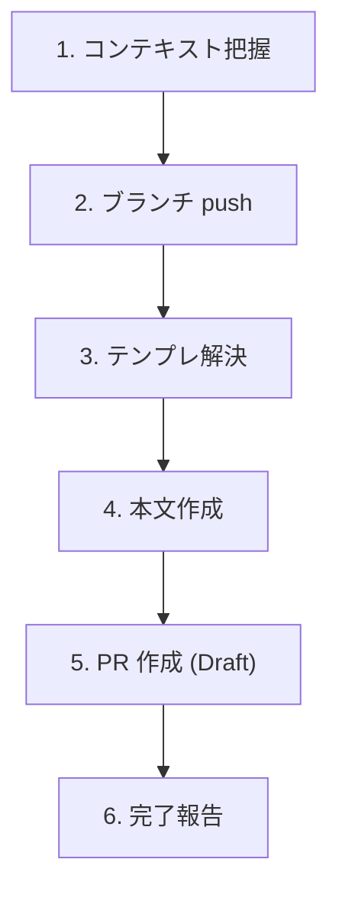

# Create Pull Request

実装済みの変更から Draft PR をシンプルに作成する軽量スキル。リポジトリに `.github/pull_request_template.md` があれば使い、無ければ汎用構造で本文を書く。

## When to Use

- 普通に Pull Request を作りたいとき
- 「PR作って」「プルリク出して」と指示されたとき

## When NOT to Use

- アジャイル運用での Task Issue 連携 PR（ステータス更新、テンプレ強制構造あり）→ `/agile-create-pull-request` を使う
- 既存 PR の更新 → `gh pr edit` を直接使う
- 実装が途中・テスト未確認の段階 → 先に実装と検証を完了させる

## Workflow



---

## Step 1: コンテキスト把握

```bash
# ベースブランチを判定（main / master 等）
BASE=$(gh repo view --json defaultBranchRef --jq '.defaultBranchRef.name')

# 変更内容を把握
git diff "${BASE}...HEAD" --stat
git log "${BASE}..HEAD" --oneline
```

差分が空なら PR を作る意味がない旨を伝えて中断する。

---

## Step 2: ブランチ push

未 push のコミットがあれば push する:

```bash
git push -u origin HEAD
```

---

## Step 3: テンプレ解決

```bash
[ -f .github/pull_request_template.md ] && echo "found"
```

| 結果 | 振る舞い |
|------|---------|
| あり | そのテンプレを採用 |
| なし | 汎用構造で作成（Step 4） |

`.github/PULL_REQUEST_TEMPLATE/` 配下に複数テンプレがある場合は、ファイル一覧をユーザーに提示して選んでもらう。

---

## Step 4: 本文作成

### ブランチ名の取得（書き出しファイル名に使う）

```bash
BRANCH=$(git rev-parse --abbrev-ref HEAD | tr '/' '-')
BODY_FILE="/tmp/pr-body-${BRANCH}.md"
```

並列セッション・複数ブランチで本文ファイルが衝突しないよう、必ずブランチ名を含める。

### 本文の組み立て

**テンプレあり**:
- テンプレの全セクションを保持し、Step 1 で把握した変更内容を該当箇所に埋める
- 埋められないセクションは「なし」と明記（空欄で残さない）
- テンプレに無いセクションを勝手に追加しない

**テンプレなし**（汎用構造）:
```markdown
## 概要

{何を変えたか 1〜2 文。技術的な「どう」ではなく「何が変わったか」}

## 変更内容

- {変更点 1}
- {変更点 2}

## テスト方法

- {手元で動かして確認した手順、または自動テストのコマンド}
```

### Issue 紐付け

`Closes #N` を本文に含めるのは**ユーザーが Issue 番号を明示した場合のみ**。ブランチ名やコミットメッセージから自動推測して `Closes` を勝手に書かない（誤クローズ事故防止）。

本文を `$BODY_FILE` に書き出す。CLI エスケープ事故防止のため必ずファイル経由。

### タイトル

最新コミットのメッセージか、変更内容の要約から組み立てる。70 文字以内に収める。

---

## Step 5: PR 作成 (Draft)

```bash
gh pr create \
  --draft \
  --title "<title>" \
  --body-file "$BODY_FILE"
```

**デフォルトは必ず Draft**。ユーザーが「Ready で出して」「draft 外して」と明示した場合のみ `--draft` を外す。

base ブランチを明示したい場合は `--base <branch>` を追加（デフォルトは default branch）。

---

## Step 6: 完了報告

作成した PR の URL をユーザーに渡す。

---

## エッジケース

| 状況 | 対応 |
|------|------|
| `gh` 未インストール / 未認証 | エラーをそのまま伝えて中断（`gh auth login` を案内） |
| 同じブランチに既存 PR | `gh pr edit` で更新するかユーザーに確認 |
| ベースに対する diff が空 | PR を作る意味がない旨を伝えて中断 |
| main / master 以外を base にしたい | ユーザーから明示指定を受ける（`--base <branch>` で対応） |
| push 時に upstream 設定が衝突 | エラー内容をユーザーに伝えて判断を仰ぐ |

## NEVER — アンチパターン

- **絶対に** `gh pr create --body "..."` でインライン渡ししない — 改行・引用符のエスケープが壊れる。必ず `--body-file`
- **絶対に** ブランチ名なしの固定ファイル名（`/tmp/pr-body.md`）を使わない — 並列セッション・複数ブランチで上書き事故が起きる
- **絶対に** デフォルトを Ready で作らない — レビュー依頼前に意図せず通知が飛ぶ事故を防ぐため、明示指示なき限り Draft
- **絶対に** `Closes #N` を自動推測で書かない — 関係ない Issue が PR マージ時に勝手に閉じられる事故を防ぐ
- **絶対に** GitHub Projects のステータス更新を試みない — 本スキルの責務外。アジャイル運用が必要なら `/agile-create-pull-request` を使う
