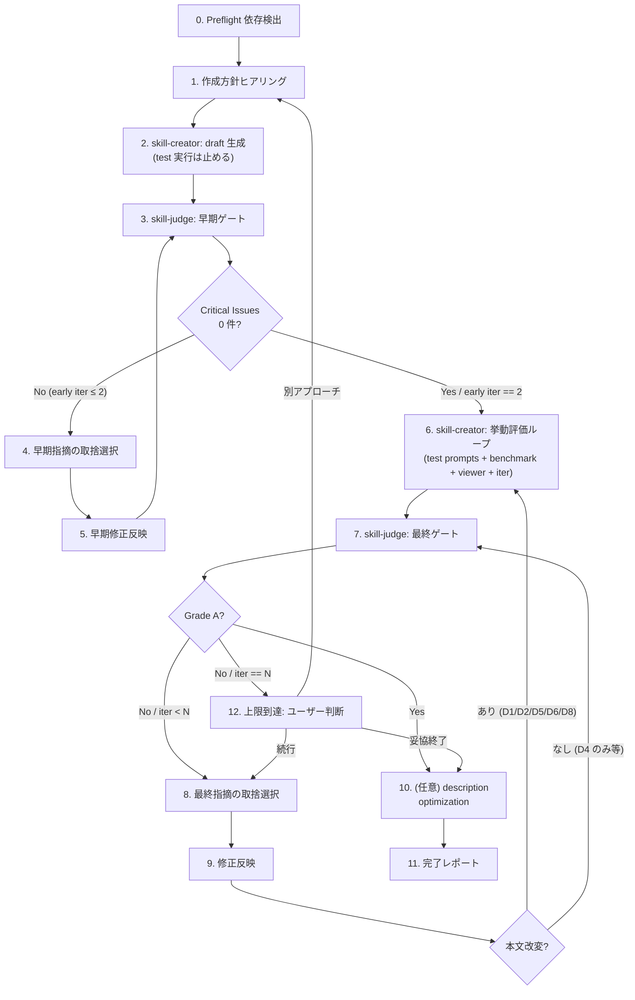

# Create Skill (skill-creator × skill-judge sandwich)

> 🗣️ **ユーザーへの質問**: 有限選択は `AskUserQuestion` (2-4 個、推奨は先頭に `(Recommended)`)。skill のミッション / description 本文など、自由記述で書いてもらう箇所はテキスト対話。
> 📋 **進捗管理**: ループ回数が動的なので、各 Step を `TaskCreate` で起こし、「早期ゲート iter #N」「挙動評価 iter #N」「最終ゲート iter #N」を別タスクで管理する。中断時の再開ポイントが見える。
> 📐 **不可逆操作の承認**: 初版 SKILL.md 生成前 / 章構成変更を伴う修正前は `ExitPlanMode` で計画提示。description だけ変えるような軽微な修正は Edit で直接反映してよい。

## 設計思想 (なぜ sandwich なのか)

`skill-creator` は **挙動評価** (with-skill subagent + benchmark + 人間 review) に強いが、設計品質を rubric で測らない。`skill-judge` は **設計評価** (D1-D8 / 120 点) に強いが、実行はしない。

そのままだと:
- skill-creator 単体: 動くが設計が雑な skill が完成する
- skill-judge 単体: 設計は綺麗だが実行確認なしの skill が完成する

sandwich 構造:

```
[skill-creator: draft]
       ↓
[skill-judge: 早期ゲート]  ← Critical Issues が消えるまで (致命傷潰し、Grade 未満でも OK)
       ↓
[skill-creator: 挙動評価ループ]  ← test prompts + benchmark + viewer + user review + iterate
       ↓
[skill-judge: 最終ゲート]  ← Grade A まで反復
       ↓
[skill-creator: description optimization (任意)]
```

これで skill-judge の本文改変要求 (D1/D2/D5/D6/D8 など、本文を書き換えろという指摘) を **早期ゲートで先に潰す** ことで、skill-creator の挙動評価結果を覆す手戻りを最小化する。

## 想定される失敗パターン (実体験ベース)

このワークフローを作る過程で実際に踏んだ / 想定された失敗:

1. **「skill-judge は description だけ見ている」と決めつけて後回し** — 実際は 120 点中 D4 (description) は 15 点しかなく、87.5% は本文 / 章構成 / scripts / references の書き換えを要求する。これに気付かず skill-creator の挙動評価を完走させると、skill-judge から「D5: scripts/ にこれを切り出せ」「D6: ここは AskUserQuestion ではなく自由記述」などの指摘が出て、benchmark.json の前提が崩れて再評価必須になる。**早期ゲートを置く根拠そのもの**

2. **skill-creator を「draft 用」と「挙動評価用」で 2 回呼ぶ必要に気付かない** — skill-creator の SKILL.md は一気通貫で test cases まで実行する設計なので、Step 2 で「draft だけほしい、test 実行は止めて」と明示しないと、まだ judge を通していない初版に対して挙動評価が始まってしまう

3. **Step 9 で本文改変を反映したのに Step 6 を巻き戻さず Step 7 直行** — 本文や同梱ファイルが変わると skill-creator が観測した挙動の前提が崩れる。Grade A が出ても「動くかわからない skill」が完成する

4. **skill-judge を 1 回しか通さず安心する** — 早期ゲートだけで Step 6 に進むと、挙動評価ループでの本文改変 (user feedback による improve) が judge 設計レビューを経ていない状態で固まる。最終ゲートが必須

## skill-creator と skill-judge の判定が矛盾したらどうするか

両者の評価軸は直交するため、稀に矛盾が起きる:

| ケース | 例 | 優先順位 |
|---|---|---|
| skill-creator: 挙動 OK / skill-judge: D8 低い | benchmark は pass するが workflow 節が薄い | **skill-judge 優先**。挙動は test prompts 3 件しか見てない一方、judge は再現性ある rubric。本文を補強 |
| skill-creator: 挙動 NG / skill-judge: Grade A | benchmark fail だが設計は綺麗 | **skill-creator 優先**。動かない skill は使えない。失敗した eval を詳細に見て指示を強化 |
| skill-creator: user feedback で「指示が硬すぎる」 / skill-judge: D6 で「もっと厳格に」 | freedom calibration の解釈差 | **ユーザーに聞く** (`AskUserQuestion`)。トレードオフなので判断を委ねる |

矛盾を観測したら **どちらかを黙って捨てない**。本スキル内のログに明示的に記録して、ユーザーが後で振り返れるようにする。

## When to Use

- 高品質な skill を計画的に作りたい (Grade A + 挙動評価両方通す)
- 後で他人に渡す前提で再現性ある品質を担保したい
- skill-judge を「最後に通せばいい」と思って後回しにした結果、本文を書き直す羽目になるのを避けたい

## When NOT to Use

- 雑に skill のドラフトだけほしい (→ `skill-creator:skill-creator` を直接呼ぶ)
- 既存 skill の小修正だけしたい (→ Edit で直接)
- 設計品質より速度優先で「動けばいい」(→ skill-creator 直叩き)

## Workflow



---

## Step 0: Preflight — 依存検出

skill-creator (Claude プラグイン) と skill-judge (softaworks 製 skill) の両方を確認。

```bash
bash skills/create-skill/scripts/check-deps.sh
```

- skill-judge: スクリプトが file 存在で自動判定
- skill-creator: シェルから検出不可なので、Skill tool 一覧 (system reminder) で `skill-creator:skill-creator` を目視確認 → OK なら `--no-creator` を渡して再実行

不足時は `AskUserQuestion` で「自動 install / 手元で install / 中断」を選ばせる。詳細手順:
- `references/install-skill-creator.md`
- `references/install-skill-judge.md`

「自分で対応した、続行」が選ばれたら `check-deps.sh` を **必ず再実行** して検証。検出失敗のまま黙って先に進まない。

---

## Step 1: 作成方針ヒアリング

skill の輪郭を自由記述で固める (AskUserQuestion は使わない、質が落ちるため)。

質問項目:
1. 何をする skill か (1-2 文)
2. 想定ユーザーと対象タスク (Persona と "Use when" の元)
3. トリガー発話例 (description の `Triggers:` に入る)
4. 既存スキルとの差別化点 (重複起動防止のため description に書く)
5. 同梱したい資料 (templates / references / scripts のラフ構成)

整理:
```
- 仮 name: <kebab-case>
- 仮 description (案): <Use when ... + Triggers: ...>
- 主要 use case / 反主要 use case
- 既存類似 skill とその差別化軸
```

---

## Step 2: skill-creator で draft 生成 (test は止める)

`Skill` ツールで `skill-creator:skill-creator` を呼ぶ。**重要: test cases / benchmark / iteration まで一気に走らせない**。

skill-creator に渡す指示の骨子:
```
Step 1 の情報をもとに、SKILL.md の draft (frontmatter + 本文 + 必要なら bundled resources の骨組み) まで作成してほしい。
test cases (evals/evals.json) の作成と with-skill subagent 実行は、こちらの判断で後から進めるので、今回は実施しないでほしい。
draft 完成後、SKILL.md の絶対パスだけ報告してほしい。
```

これは skill-creator の workflow の Step 1-3 (Capture Intent / Interview / Write SKILL.md) までに相当。draft が出来たら次の早期ゲートへ。

**承認ゲート**: 新規ファイル作成なので、skill-creator が `ExitPlanMode` で計画提示してきたらユーザー承認を取る。

---

## Step 3: skill-judge — 早期ゲート

`Skill` ツールで `skill-judge` を呼び、Step 2 の draft を評価。

このゲートの **目的は Grade A ではなく、Critical Issues を 0 にすること**。理由は、skill-judge の指摘の 87.5% (D4 除く全 dimension) が本文・章構成・scripts/references の書き換えを要求するため、これを後回しにすると skill-creator の挙動評価結果を覆してしまうから。

抽出する項目:
- `Critical Issues` (must-fix リスト) — **このゲートでの主役**
- `Top 3 Improvements` — 参考、必須ではない
- 各 Dimension の点数 — D1/D2/D5/D6/D8 が極端に低い (40% 未満) なら警告

詳細 rubric は `references/grade-rubric.md` 参照。

### 出口条件
- Critical Issues が 0 件 → Step 6 へ進む
- 残っている → Step 4 へ (ただし早期ゲートは最大 2 iteration まで、それで潰せなければ Step 6 に進んでユーザーに通知)

---

## Step 4: 早期指摘の取捨選択

`AskUserQuestion` (`multiSelect: true`) で Critical Issues を提示し、どれを反映するか選ばせる。

選択肢の組み立て方:
- Critical Issues を 1 件 = 1 選択肢として最大 4 件
- 5 件以上なら、本文改変が大きいもの順に上位 4 件を提示 (残りは「次 iteration の候補」としてテキストで列挙)
- 常に「全部スキップ (手動で対応する)」を選択肢に含める

選択結果を構造化:
```
- 指摘 ID: <judge レポート上の番号>
- 修正方針: <1-2 文>
- 影響範囲: <SKILL.md のセクション / 同梱ファイル>
```

---

## Step 5: 早期修正反映

選ばれた指摘を 1 件 = 1 Edit で反映する (一括置換禁止、副作用混入を防ぐため)。

判断:
- 軽微な書き換え (節の追加 / 表現修正) → そのまま Edit
- 章構成変更 / 新規同梱ファイル追加 → `ExitPlanMode` で計画提示 → 承認 → Edit

反映後、早期ゲート iteration をインクリメントして Step 3 へ戻る。

---

## Step 6: skill-creator — 挙動評価ループ

`Skill` ツールで `skill-creator:skill-creator` を **再度** 呼ぶ。今度は test 実行 + iteration を回してもらう。

skill-creator に渡す指示の骨子:
```
SKILL.md の draft は <絶対パス> に完成済み。skill-judge による早期設計レビューも反映済み。
ここから skill-creator 本来の挙動評価ループを回してほしい。具体的には:
  - evals/evals.json (2-3 個の realistic prompt) を作成
  - with-skill / baseline 両方の subagent を並列実行
  - assertion をドラフトし grader で採点
  - aggregate_benchmark.py で benchmark.json 生成
  - generate_review.py で viewer 起動
  - user feedback を読み込んで improve
  - 満足するまで iteration を回す
完了したら最終 SKILL.md のパスと workspace の場所を報告してほしい。
```

これは skill-creator の workflow の Step 4-6 (Test Cases / Run / Improve) に相当。description optimization はまだ実行しない (Step 10 で扱う)。

**注意**: skill-creator の挙動評価ループ自体は本スキルから干渉しない (skill-creator の judgment を尊重)。本スキルが介入するのは「完了報告を受けたら次の Step 7 に進む」だけ。

### コスト目安

skill-creator の挙動評価ループは時間がかかる。事前にユーザーに伝えてから着手すること:

| 内訳 | 目安 |
|---|---|
| evals/evals.json 作成 | 5-10 分 |
| with-skill + baseline subagent 並列実行 (3 prompts × 2) | 5-15 分 (tokens / complexity に依存) |
| assertion ドラフト + grader | 5-10 分 |
| viewer 起動 + user review | **ユーザー時間 10-30 分** (test cases を読む時間) |
| improve + 次 iteration | 5-15 分 |
| **1 iteration 計** | **30-60 分** |
| **典型完走 (3-5 iter)** | **1.5-5 時間** |

Step 9 で「本文改変あり → Step 6 巻き戻し」が必要になると、これがもう一度走る。**だから Step 3 の早期ゲートで Critical Issues を 0 にしてから Step 6 に入るのが重要**。

---

## Step 7: skill-judge — 最終ゲート

`Skill` ツールで `skill-judge` を呼び、skill-creator が完了報告した SKILL.md を評価。

抽出項目:
- Total Score (X/120)
- Grade (A-F)
- Dimension scores
- Critical Issues
- Top 3 Improvements
- Detailed Analysis (80% 未満の dim)

### 判定 (Step 7-D)

| 条件 | 次 |
|---|---|
| Grade A (108+/120) | Step 10 (description optimization) へ |
| Grade < A かつ 最終ゲート iter < 5 | Step 8 |
| Grade < A かつ iter == 5 | Step 12 (ユーザー判断) |

---

## Step 8: 最終指摘の取捨選択

Step 4 と同じ要領で `AskUserQuestion` (`multiSelect`)。ただし今回は **Critical Issues + Top 3 Improvements** の両方を候補に入れる (Grade A まで詰める段階なので)。

最大 4 件まで、`(Recommended)` を最も score 押し上げ効果が高いものに付ける。

---

## Step 9: 修正反映 — 本文改変判定が重要

選ばれた指摘を 1 件ずつ Edit。**反映後の遷移先は、本文改変が含まれるかで分岐する**:

| 指摘の種類 | 影響 dim | 反映後の遷移先 |
|---|---|---|
| frontmatter description のみ書き換え | D4 | Step 7 (judge 再評価のみ) |
| 章構成 / 本文の追記・書き換え | D1/D2/D3/D5/D6/D7/D8 | **Step 6 (skill-creator 挙動評価ループ巻き戻し)** |
| scripts/references の追加・改変 | D5 | **Step 6 (巻き戻し)** |

判定ロジック:
- 指摘 1 件でも本文改変系が含まれる → Step 6 に戻る
- すべて description だけの書き換え → Step 7 に直行

**理由**: 本文や同梱ファイルが変わると skill-creator の挙動評価の前提が崩れる。新しい benchmark.json を取らないと挙動を保証できない。

`AskUserQuestion` で「巻き戻す? それともユーザー判断で skip?」を必ず確認する (skill-creator の再実行はコストが高いため)。

### 巻き戻し前のチェックリスト

Step 6 への巻き戻しは 30-60 分/iter × 数 iter のコストがかかる。実行前に以下を確認:

- [ ] **本当に本文改変が必要か?** description だけの書き換えで指摘の意図を満たせないか再検討する (例: 「本文に NEVER 節追加」より「description に NOT to use を盛る」で済まないか)
- [ ] **修正が test prompts の出力を変えるか?** 変えないなら巻き戻し不要 (例: typo 修正、章タイトル変更のみ)
- [ ] **修正が同梱 scripts の挙動を変えるか?** 変えないなら巻き戻し不要 (例: scripts のコメント追記)
- [ ] **既存の evals/evals.json で本当に検証できる範囲か?** 変更が大きすぎて test cases そのものを増やす必要があるなら、Step 6 ではなく Step 1 まで戻して方針再検討

これらをチェックして「巻き戻し不要 / Step 7 直行で OK」と判断したら、その判断理由をユーザーに提示してから進む。

---

## Step 10: (任意) description optimization

Grade A 到達後、`skill-creator:skill-creator` の **description optimization パス** を呼び出す選択肢を `AskUserQuestion` で提示。

- (Recommended) 実行する — `scripts.run_loop` が 5 iter まで自動で description を最適化、trigger 精度が上がる
- skip する — 既に Grade A なので、現状の description でも実用上問題ない

実行を選んだ場合、skill-creator に以下を依頼:
```
description optimization パスを実行してほしい。
20 個の trigger eval (8-10 should-trigger / 8-10 should-not-trigger) を作成し、
user に HTML で review してもらい、scripts.run_loop で最大 5 iter 回し、
best_description を SKILL.md に反映してほしい。
```

---

## Step 11: 完了レポート

```markdown
# Skill 作成完了: <skill 名>

- 最終 Grade: A (X/120, Y%)
- 早期ゲート iteration: N1 回
- 挙動評価 iteration: N2 回 (skill-creator 内部)
- 最終ゲート iteration: N3 回
- description optimization: 実施 / skip

## 生成物
- SKILL.md (絶対パス)
- 同梱ファイル一覧
- evals/evals.json + workspace 配下の benchmark/feedback

## Dimension 推移 (初版 → 早期ゲート後 → 最終)
(D1-D8 の点数表)

## 主な改善履歴
1. 早期ゲートで反映: <要約>
2. 挙動評価で反映 (user feedback): <要約>
3. 最終ゲートで反映: <要約>

## 次のアクション
- git にコミット
- (該当すれば) 利用者リポジトリにインストール
```

---

## Step 12: 上限到達 — ユーザー判断

最終ゲート iter == 5 かつ Grade < A の場合。`AskUserQuestion`:

| 選択肢 | 帰着 |
|---|---|
| (Recommended) この grade で妥協終了 | Step 10 (description optimization) へ |
| もう 5 回試す | iter 上限を +5 して Step 8 へ |
| 別アプローチ (方針見直し) | Step 1 へ巻き戻し |
| 中断 | 現状の SKILL.md を残してセッション終了 |

「もう 5 回」を選ばれた場合、その前に「効いた / 効かなかった指摘パターン」を要約してから次のループに入る (同じ指摘の往復防止)。

### iter カウンタの管理規約

本スキル内で **3 種類の iter カウンタ** を区別して管理する。`TaskCreate` のタスク命名で識別:

| カウンタ | 上限 | 管理タスク名 | リセット契機 |
|---|---|---|---|
| 早期ゲート iter | 2 | `早期ゲート iter #N` | Step 6 進入時にリセット |
| 挙動評価 iter (skill-creator 内部) | skill-creator 任せ (通常 3-5) | `挙動評価 iter #N` (報告ベース) | Step 6 完了時に確定 |
| 最終ゲート iter | 5 (Step 12 で +5 可) | `最終ゲート iter #N` | Step 6 巻き戻し時もリセットしない (累積) |

Step 12 で「+5」を選ばれたら、TaskList 上に新たな `最終ゲート iter #6` 以降のタスクを生やし、内部カウンタの上限値だけを上書きする (既存タスクは残す、何が起きたか可視化のため)。

---

## 決定境界 (人間承認が必要なゲート)

| ゲート | 何を承認 | ツール |
|---|---|---|
| Step 0 | 不足依存の自動 install | `AskUserQuestion` |
| Step 2 | 新規ファイル作成計画 | skill-creator 内部の `ExitPlanMode` または本スキル側の確認 |
| Step 4 / 8 | 反映する指摘の選定 | `AskUserQuestion` (multiSelect) |
| Step 5 / 9 (大規模時) | 章構成変更 / 同梱ファイル追加 | `ExitPlanMode` |
| Step 9 | 本文改変系の指摘を反映する=Step 6 に巻き戻す決定 | `AskUserQuestion` (再実行コスト確認) |
| Step 10 | description optimization の実行可否 | `AskUserQuestion` |
| Step 12 | ループ上限到達後の方針 | `AskUserQuestion` |

---

## NEVER アンチパターン

- ❌ **Step 0 をスキップ** — 依存欠落のまま Step 2 以降に進むと黙って失敗する
- ❌ **Step 2 で skill-creator に test 実行まで一気に走らせる** — 早期ゲートを挟む意味が消え、judge 指摘で後から本文を書き換える羽目になる
- ❌ **Step 6 の skill-creator 挙動評価に介入** — subagent 実行 / benchmark.json / viewer 等を本スキル側から触らない。skill-creator の judgment を尊重
- ❌ **Step 9 で本文改変したのに Step 7 直行** — 挙動評価の前提が崩れる。「巻き戻し前チェックリスト」を必ず通る
- ❌ **「skill-judge の指摘は description 周りだけ」と決めつけ** — D4 (description) は 15/120 = 12.5% のみ。残り 87.5% は本文改変要求
- ❌ **一括 Edit** — `replace_all` 等で複数指摘をまとめて反映しない。1 指摘 = 1 Edit (副作用追跡のため)
- ❌ **Grade A 達成後の勝手なループ継続** — Step 10/11 へ進んで完了させる
- ❌ **skill-creator を迂回して自前で SKILL.md を書く** — 重複実装 + skill-creator の進化に乗れない

---

## References

- [skill-creator (Claude プラグイン) 公式](https://docs.claude.com/en/docs/claude-code/plugins) — 詳細は `references/install-skill-creator.md`
- [softaworks/agent-toolkit](https://github.com/softaworks/agent-toolkit) — skill-judge の本家。詳細は `references/install-skill-judge.md`
- [Agent Skills Specification](https://agentskills.io/specification) — skill-judge の rubric が依拠する仕様
- `references/grade-rubric.md` — skill-judge の 8 次元 / 120 点 / A-F の早見表 + 各 dim の本文改変要求度
- `scripts/check-deps.sh` — 依存検出スクリプト
